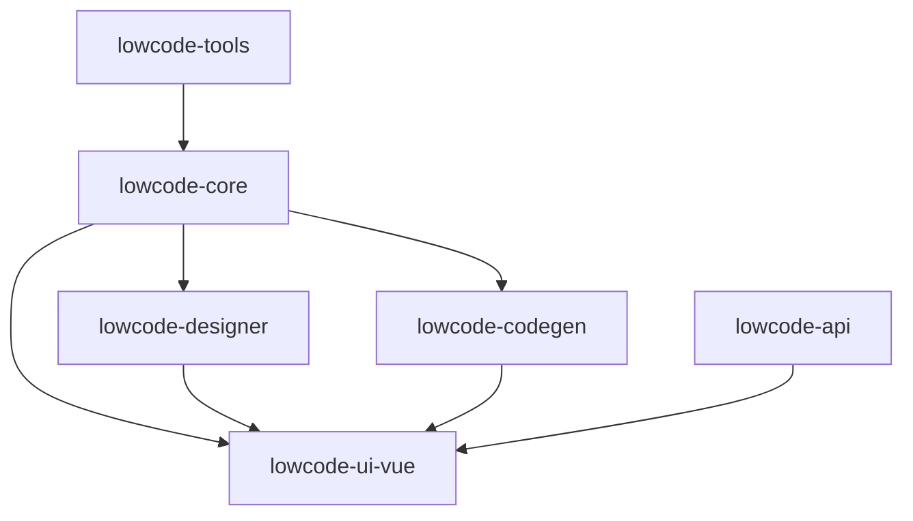
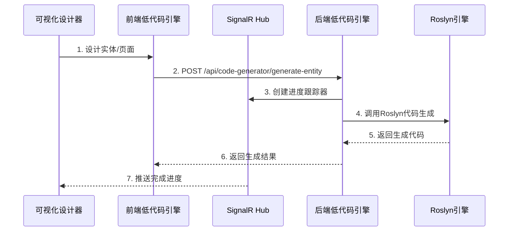

# SmartAbp 低代码引擎规则 (Low-Code Engine Rules)

## 🚀 全栈低代码引擎开发约束

### 微内核+插件架构 (强制)

#### 插件接口规范 (必须实现)
```typescript
interface LowCodePlugin {
  // 元数据 (必填)
  metadata: {
    name: string                    // 插件名称
    version: string                 // 版本号
    description: string             // 描述
    target: string                  // 目标平台
    capabilities: string[]          // 能力列表
    dependencies?: string[]         // 依赖插件
    peerDependencies?: string[]     // 对等依赖
  }
  
  // 核心方法 (必须实现)
  canHandle(schema: any): boolean
  validate(schema: any): ValidationResult
  generate(schema: any, config: any, context: any): GeneratedCode
  
  // 生命周期 (可选)
  onInit?(): void
  onDestroy?(): void
  onError?(error: Error): void
}
```

#### 插件开发规范
- **命名约定**: 插件类名以 `*Plugin` 结尾
- **文件命名**: kebab-case格式
- **幂等性**: canHandle方法必须保持幂等
- **错误处理**: validate方法不得空实现

### 前端低代码引擎 (Monorepo)

#### @smartabp/lowcode-core (引擎内核)
```typescript
// 微内核系统
export { LowCodeKernel } from "./kernel/core"
export { PluginManager, PluginValidator, DependencyResolver } from "./kernel/plugins"
export { EventBus } from "./kernel/events"
export { CacheManager, LRUStrategy, LFUStrategy } from "./kernel/cache"
export { PerformanceMonitor, Timer, MetricStorage } from "./kernel/monitor"
```

#### @smartabp/lowcode-designer (可视化设计器)
- **Canvas组件**: 拖拽画布，支持组件拖放和布局
- **Palette组件**: 组件选择面板，分类展示可用组件
- **Inspector组件**: 属性配置面板，动态表单生成
- **EntityDesigner**: 后端实体类拖拽开发组件 (944行核心组件)

#### @smartabp/lowcode-codegen (代码生成引擎)
- **Vue3生成器**: 生成Vue 3组件和页面
- **ABP生成器**: 生成ABP后端服务和实体
- **模板系统**: 基于模板的代码生成
- **Schema导出**: 从设计器导出到代码生成

#### 包依赖关系 (强制)


### 后端低代码引擎 (SmartAbp.CodeGenerator)

#### Roslyn代码生成引擎
```csharp
public class RoslynCodeEngine : IDisposable
{
    private readonly ObjectPool<CSharpSyntaxRewriter> _rewriterPool;
    private readonly ArrayPool<byte> _bytePool;
    private readonly MemoryPool<char> _charPool;
    
    [MethodImpl(MethodImplOptions.AggressiveOptimization)]
    public async Task<GeneratedCode> GenerateEntityAsync(EntityDefinition definition)
    {
        // 性能优化实现
    }
}
```

#### 企业架构模式生成器
- **DDD生成器**: 聚合根、值对象、领域服务、仓储接口
- **CQRS生成器**: Command/Query处理器、MediatR集成
- **Aspire生成器**: 微服务配置、服务发现、健康检查
- **基础设施生成器**: EF Core配置、缓存策略、消息队列

#### 代码生成API服务
```csharp
[Route("api/code-generator")]
public class CodeGenerationAppService : ApplicationService
{
    [HttpPost("generate-entity")]
    public async Task<GeneratedCodeDto> GenerateEntityAsync(EntityDefinitionDto input)
    
    [HttpPost("generate-ddd")]
    public async Task<GeneratedDddSolutionDto> GenerateDddDomainAsync(DddDefinitionDto input)
    
    [HttpPost("generate-cqrs")]
    public async Task<GeneratedCqrsSolutionDto> GenerateCqrsAsync(CqrsDefinitionDto input)
}
```

### 代码生成流程 (标准化)

#### 前后端协同流程


#### 可视化设计器双向工作流
1. **生成前工作流**: Designer装配 → 导出Schema → 调用生成链 → appshell生效
2. **生成后工作流**: 载入路由页面 → 解析Block标记 → 生成增量Schema → 增量再生成

### 安全策略 (强制执行)

#### 生产环境限制
- **禁止动态执行**: 严禁使用 `new Function`、`eval`
- **沙箱隔离**: 预览功能必须在受控沙箱中执行
- **CSP策略**: 严格的内容安全策略
- **依赖管理**: 第三方依赖必须在插件metadata中声明

#### 开发环境支持
- **受控预览**: iframe + Worker + 严格CSP
- **代码验证**: 生成代码必须通过安全检查
- **输入验证**: 严格验证输入schema
- **依赖检查**: 验证第三方依赖安全性

### 性能要求 (强制标准)

#### 并发控制
- **默认并发**: 批量生成默认并发不超过5
- **可配置优化**: 支持根据硬件配置调优
- **失败隔离**: 单个失败不影响整体流程
- **超时控制**: 代码生成/编译必须设置超时

#### 缓存策略
- **多级缓存**: 内存 → 本地存储 → 分布式缓存
- **缓存TTL**: 默认1小时，支持标签清理
- **命中率要求**: 缓存命中率 > 50%
- **失效策略**: 支持主动失效和版本控制

#### 性能监控 (必须埋点)
```typescript
const logger = createLowCodeLogger('plugin-name')
const monitor = usePerformanceMonitor()

// 必须埋点
monitor.startTimer('generation')
logger.info('Generation started', { schema, context })
// ... 代码生成逻辑
monitor.endTimer('generation')
logger.info('Generation completed', { result })
```

### 质量标准 (强制执行)

#### 代码质量
- 插件代码覆盖率 ≥ 80%
- 生成代码必须通过ESLint检查
- 必须有完整的单元测试
- 必须有使用示例和文档

#### 性能标准
- 单个插件生成时间 < 5秒
- 缓存命中率 > 50%
- 并发处理能力 ≥ 5个任务
- 内存使用合理，无内存泄漏

#### 安全标准
- 通过安全扫描检查
- 无已知安全漏洞依赖
- 输入验证覆盖率100%
- 沙箱隔离有效性验证

### 生成代码规范

#### 文件头标识 (必须包含)
```typescript
// AUTO-GENERATED FILE – DO NOT EDIT.
// Generated by SmartAbp Low-Code Engine
// Template: {template_name}
// Generated at: {timestamp}
// Generator: {generator_name}@{version}
```

#### 输出位置约束
- **前端生成代码**: 必须输出到 `appshell/*.generated.ts`
- **后端生成代码**: 输出到指定的Generated目录
- **禁止混合**: 生成文件与手写文件严格分离

### 违规检测与处理

#### 严重违规 (自动拒绝)
- ❌ 插件未实现必需接口方法
- ❌ 生产环境使用动态代码执行
- ❌ 生成代码不包含AUTO-GENERATED标识
- ❌ 绕过沙箱安全机制
- ❌ 不使用统一的日志和监控系统

#### 性能违规 (警告+优化建议)
- ⚠️ 单个插件生成时间超过5秒
- ⚠️ 缓存命中率低于50%
- ⚠️ 内存使用超出合理范围
- ⚠️ 并发处理能力不足

#### 质量违规 (需要修复)
- 🔧 代码覆盖率低于80%
- 🔧 生成代码不符合项目规范
- 🔧 缺少必要的单元测试
- 🔧 文档不完整或过时

### 插件生态规范

#### 第三方插件开发
- **接口兼容**: 必须实现标准LowCodePlugin接口
- **版本管理**: 遵循语义化版本控制
- **依赖声明**: 明确声明所有依赖关系
- **安全审计**: 通过安全扫描和代码审查

#### 插件市场标准
- **质量认证**: 通过官方质量认证
- **文档完整**: 提供完整的使用文档和示例
- **社区支持**: 提供社区支持和问题反馈渠道
- **持续维护**: 承诺持续维护和更新