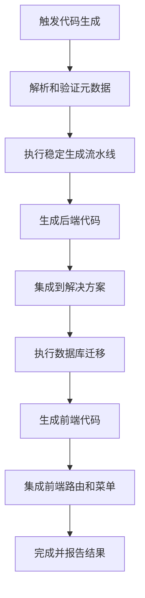
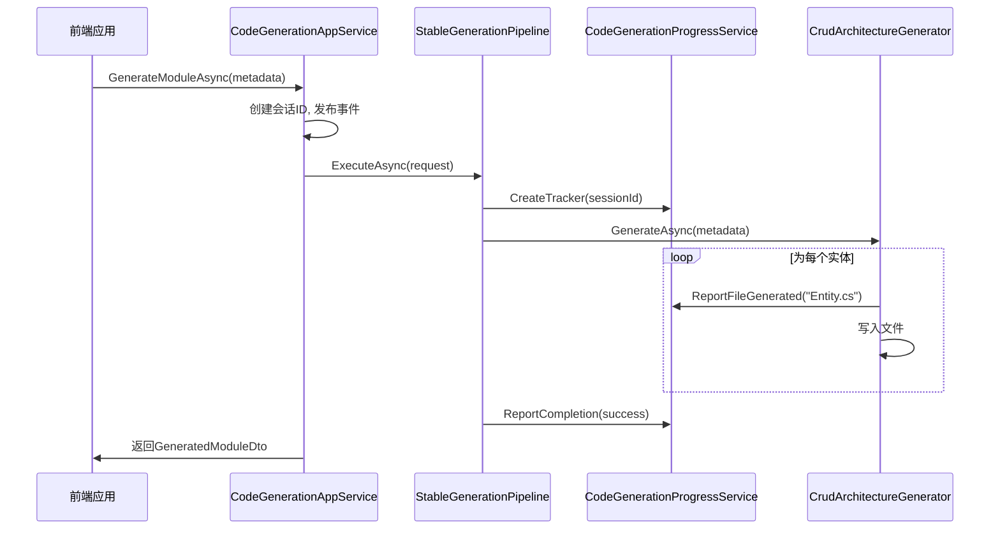

# 代码生成

<cite>
**本文档引用的文件**
- [CodeGenerationAppService.cs](file://src/SmartAbp.CodeGenerator/Services/CodeGenerationAppService.cs)
- [CodeGenerationProgressService.cs](file://src/SmartAbp.CodeGenerator/Services/CodeGenerationProgressService.cs)
- [SchemaVersioningService.cs](file://src/SmartAbp.CodeGenerator/Services/SchemaVersioningService.cs)
- [CodeGenerator.template.ts](file://templates/lowcode/generators/CodeGenerator.template.ts)
- [RuntimeComponent.template.vue](file://templates/lowcode/runtime/RuntimeComponent.template.vue)
- [index.json](file://templates/lowcode/index.json)
</cite>

## 目录
1. [代码生成引擎核心](#代码生成引擎核心)
2. [代码生成完整流程](#代码生成完整流程)
3. [生成进度跟踪](#生成进度跟踪)
4. [版本控制服务](#版本控制服务)
5. [模板系统](#模板系统)
6. [端到端示例](#端到端示例)

## 代码生成引擎核心

`CodeGenerationAppService` 是 hxlot 项目中代码生成功能的核心服务，负责协调和执行整个代码生成流程。该服务通过依赖注入获取多个关键组件，包括代码写入服务、解决方案集成服务、CRUD 架构生成器、前端生成器、模式版本化服务等。

该服务实现了 `ICodeGenerationAppService` 接口，并通过 `RemoteService` 属性暴露为远程服务，允许前端或其他服务调用。它使用 ABP 框架的权限系统，通过 `[Authorize(SmartAbpPermissions.CodeGeneration.Default)]` 确保只有授权用户才能触发代码生成。

服务的核心方法是 `GenerateModuleAsync`，它接收一个 `ModuleMetadataDto` 对象作为输入，该对象包含了要生成模块的元数据，如模块名称、实体、属性、关系等。该方法首先验证输入，然后创建一个会话 ID 用于跟踪生成状态。接着，它通过 ABP 的事件总线发布一个 `ModuleGenerationRequestedEvent` 事件，从而启动事件驱动的生成流程。

为了确保生成过程的稳定性和可靠性，`GenerateModuleAsync` 方法内部调用了 `GenerateModuleStableAsync` 方法，该方法使用 `StableGenerationPipeline` 执行实际的生成任务。这个稳定流水线集成了异常恢复、进度监控和质量检查等企业级特性。

**Section sources**
- [CodeGenerationAppService.cs](file://src/SmartAbp.CodeGenerator/Services/CodeGenerationAppService.cs#L38-L2620)

## 代码生成完整流程

代码生成的完整流程始于前端或 API 调用 `GenerateModuleAsync` 方法。该流程可以分为以下几个关键阶段：

1.  **元数据解析与验证**：服务首先接收并验证传入的 `ModuleMetadataDto`。在 `GenerateModuleDirectAsync` 方法中，可以看到它调用了 `EnhancedModelProcessor.ProcessModuleMetadataAsync` 来处理元数据，这包括类型映射和循环引用检测。
2.  **生成执行**：通过 `StableGenerationPipeline` 执行生成。该流水线接收一个 `StableGenerationRequest`，其中包含元数据、输出路径和生成选项（如是否生成后端、前端等）。
3.  **后端代码生成**：调用 `GenerateBackendForModuleAsync` 方法，根据元数据为每个实体生成 C# 实体类、应用服务、控制器、DTO 和数据库迁移等。
4.  **解决方案集成**：调用 `IntegrateModuleIntoSolutionAsync` 方法，将新生成的模块项目文件集成到主解决方案中，并更新项目间的依赖关系。
5.  **数据库迁移**：调用 `OrchestrateDatabaseMigrationAsync` 方法，执行 Entity Framework Core 的迁移命令，将数据库模式更新到最新状态。
6.  **前端代码生成**：调用 `GenerateFrontendAsync` 方法，使用 `FrontendGenerator` 或 `EnhancedFrontendGenerator` 为每个实体生成 Vue 组件、API 客户端、路由和菜单项。
7.  **前端集成**：调用 `FrontendIntegrationService.IntegrateAsync` 方法，将新生成的页面路由和菜单项集成到前端应用的导航结构中。

整个流程通过 `TaskCompletionSource` 和事件总线进行异步协调，确保了高响应性和可扩展性。

**Diagram sources**
- [CodeGenerationAppService.cs](file://src/SmartAbp.CodeGenerator/Services/CodeGenerationAppService.cs#L38-L2620)

## 生成进度跟踪

`CodeGenerationProgressService` 负责跟踪和报告代码生成的进度。它是一个单例服务，通过 SignalR 集线器 `CodeGenerationProgressHub` 将进度信息实时推送到前端。

该服务的核心是 `ICodeGenerationProgressTracker` 接口，它定义了报告进度、文件生成、错误和完成状态的方法。`CodeGenerationProgressTracker` 类实现了此接口，并在构造时接收一个 `sessionId`，用于将进度信息与特定的生成会话关联。

当代码生成过程中的某个步骤完成时，相关的生成器会调用 `ReportFileGenerated` 方法。该方法会更新已生成文件的数量，并计算当前的进度百分比，然后通过 `ReportProgress` 方法发送一个 `CodeGenerationProgressModel` 对象到 SignalR 客户端。

当整个生成过程成功或失败时，会调用 `ReportCompletion` 方法，发送一个 `CodeGenerationCompletionModel` 对象，通知前端生成已结束。

`CodeGenerationAppService` 在生成过程中会创建一个 `CodeGenerationProgressTracker` 实例，并在整个生成流程中调用其方法来更新状态。

**Section sources**
- [CodeGenerationProgressService.cs](file://src/SmartAbp.CodeGenerator/Services/CodeGenerationProgressService.cs#L12-L178)

## 版本控制服务

`SchemaVersioningService` 在代码生成的版本控制中扮演着关键角色。它的主要职责是确保传入的统一模式（`UnifiedModuleSchemaDto`）与当前系统期望的版本兼容，并在必要时执行迁移。

该服务定义了当前支持的模式版本（`CurrentVersion`），并维护一个迁移规则字典 `_rules`。当 `MigrateToCurrent` 方法被调用时，它会执行以下逻辑：
1.  解析传入模式的版本号。
2.  检查传入版本的主版本号是否与当前版本匹配。如果主版本号不同，则抛出异常，因为主版本号的变更通常意味着不兼容的破坏性更改。
3.  如果版本号不完全匹配但主版本号相同，则使用广度优先搜索（BFS）算法在注册的迁移规则中寻找一条从旧版本到当前版本的路径。
4.  如果找到路径，则按顺序应用这些迁移规则来更新模式。
5.  最后，将模式的版本号更新为当前版本并返回。

例如，代码中注册了 `NormalizeDisplayNameRule` 和 `EnsureFrontendDefaultsRule` 两个规则，它们分别负责在版本 1.0.0 到 1.0.1 和 1.0.1 到 1.1.0 之间迁移时，为实体设置默认显示名称和前端配置。

`CodeGenerationAppService` 在处理统一模式时，会先调用 `SchemaVersioningService.MigrateToCurrent` 来确保模式是最新的，然后再进行后续的生成操作。

**Section sources**
- [SchemaVersioningService.cs](file://src/SmartAbp.CodeGenerator/Services/SchemaVersioningService.cs#L15-L260)

## 模板系统

hxlot 项目的模板系统基于 `templates/lowcode/index.json` 文件进行注册和管理。该 JSON 文件定义了一个模板集合，其中包含了多个模板的元数据。

每个模板条目都包含以下关键信息：
- `name`: 模板的唯一名称。
- `path`: 模板文件的相对路径。
- `metaPath`: 模板元数据文件的路径。
- `type`: 模板类型（如 typescript, vue）。
- `parameters`: 模板参数列表，定义了在生成时需要替换的占位符。

例如，`CodeGenerator.template.ts` 模板用于生成低代码引擎的代码生成器。其模板文件中包含 `{{GeneratorName}}` 和 `{{generatorName}}` 等占位符。当使用该模板时，系统会根据 `index.json` 中定义的参数，将这些占位符替换为用户提供的实际值。

`RuntimeComponent.template.vue` 模板则用于生成低代码引擎的运行时 Vue 组件。它使用 `{{componentName}}` 占位符来动态生成 CSS 类名和组件逻辑。

模板的变量替换机制主要通过模板引擎（如代码中的 `TemplateEngine`）实现。在 `CodeGenerator.template.ts` 的示例中，`templateEngine.render` 方法接收一个模板名称和一个包含实际值的对象，然后返回替换后的代码字符串。

**Section sources**
- [index.json](file://templates/lowcode/index.json#L0-L198)
- [CodeGenerator.template.ts](file://templates/lowcode/generators/CodeGenerator.template.ts#L0-L373)
- [RuntimeComponent.template.vue](file://templates/lowcode/runtime/RuntimeComponent.template.vue#L0-L383)

## 端到端示例

一个完整的代码生成端到端流程如下：

1.  **触发**：用户在前端界面配置好模块和实体的元数据，并点击“生成”按钮。
2.  **调用 API**：前端调用 `GenerateModuleAsync` API，将元数据作为 `ModuleMetadataDto` 发送到后端。
3.  **版本迁移**：如果使用的是统一模式，`CodeGenerationAppService` 会先调用 `SchemaVersioningService` 将其迁移到当前版本。
4.  **启动生成**：`CodeGenerationAppService` 创建一个会话 ID，发布生成请求事件，并启动 `StableGenerationPipeline`。
5.  **进度报告**：在生成过程中，`CodeGenerationProgressTracker` 会不断调用 `ReportProgress` 和 `ReportFileGenerated` 方法，通过 SignalR 将进度实时推送到前端。
6.  **后端生成**：流水线调用 `CrudArchitectureGenerator` 为每个实体生成后端代码，包括实体类、应用服务、控制器等，并将文件写入磁盘。
7.  **前端生成**：流水线调用 `EnhancedFrontendGenerator`，根据模板（如 `RuntimeComponent.template.vue`）生成 Vue 组件、API 客户端等。
8.  **集成**：生成器将新模块集成到主解决方案和前端路由中。
9.  **完成**：所有文件生成并集成完毕后，`CodeGenerationProgressTracker` 调用 `ReportCompletion`，通知前端生成成功。
10. **查看结果**：用户可以在 `output` 目录下（如 `output/mes-uniapp`）查看生成的前后端代码结构，包括 `api`、`pages`、`stores` 等目录。

**Diagram sources**
- [CodeGenerationAppService.cs](file://src/SmartAbp.CodeGenerator/Services/CodeGenerationAppService.cs#L38-L2620)
- [CodeGenerationProgressService.cs](file://src/SmartAbp.CodeGenerator/Services/CodeGenerationProgressService.cs#L12-L178)