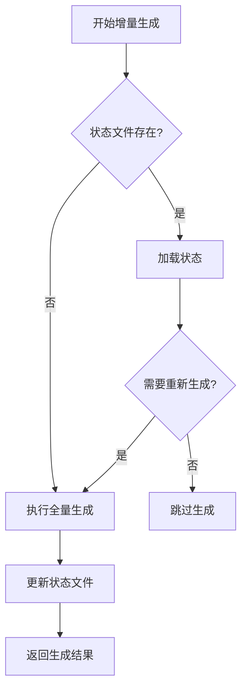
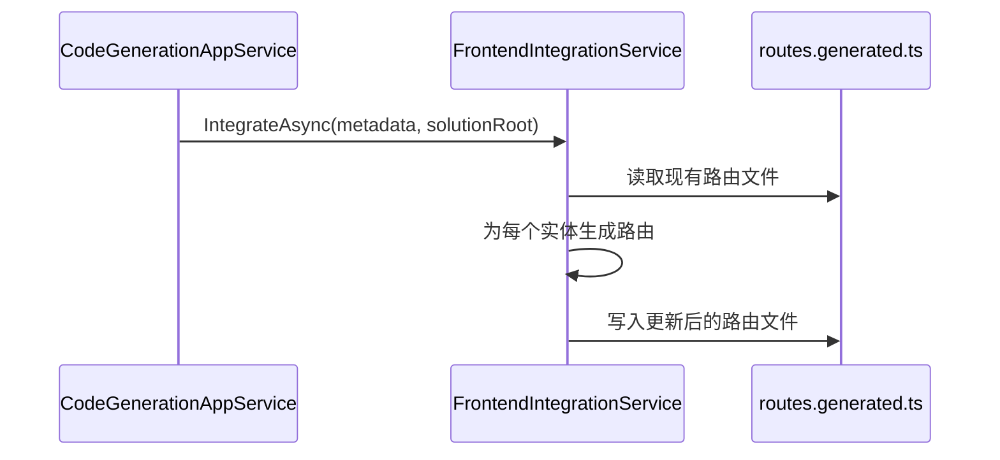
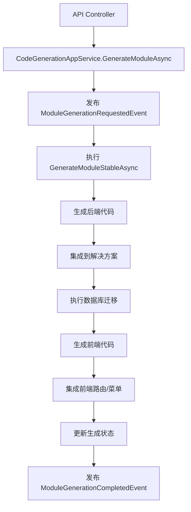

# 代码生成引擎

<cite>
**本文档引用文件**  
- [CodeGenerationAppService.cs](file://src/SmartAbp.CodeGenerator/Services/CodeGenerationAppService.cs)
- [IncrementalCodeGenerationService.cs](file://src/SmartAbp.CodeGenerator/Services/IncrementalCodeGenerationService.cs)
- [CodeGenerationStatusMethods.cs](file://src/SmartAbp.CodeGenerator/Services/CodeGenerationStatusMethods.cs)
- [FrontendIntegrationService.cs](file://src/SmartAbp.CodeGenerator/Services/FrontendIntegrationService.cs)
- [SolutionIntegrationService.cs](file://src/SmartAbp.CodeGenerator/Services/SolutionIntegrationService.cs)
</cite>

## 目录
1. [核心服务实现机制](#核心服务实现机制)
2. [增量代码生成原理与优势](#增量代码生成原理与优势)
3. [代码生成状态管理方法](#代码生成状态管理方法)
4. [前端与解决方案集成服务作用](#前端与解决方案集成服务作用)
5. [代码生成请求调用链路分析](#代码生成请求调用链路分析)

## 核心服务实现机制

`CodeGenerationAppService` 是 hxlot 项目中代码生成引擎的核心服务类，负责协调整个代码生成流程。该服务通过依赖注入机制整合了多个关键组件，包括代码写入服务、解决方案集成服务、CRUD 架构生成器、前端生成器、事件总线等，实现了模块化与高内聚的设计。

该服务实现了 `ICodeGenerationAppService` 接口，并通过 ABP 框架的 `[RemoteService]` 和 `[Authorize]` 特性暴露为远程 API 服务，同时集成权限控制，确保只有具备 `SmartAbpPermissions.CodeGeneration.Default` 权限的用户才能调用。

其构造函数通过依赖注入获取所有必需的服务实例，包括：
- `_codeWriterService`：负责将生成的代码写入文件系统
- `_solutionIntegrationService`：负责将新生成的项目集成到解决方案中
- `_crudGenerator`：负责生成后端 CRUD 代码
- `_frontendGenerator` 和 `_enhancedFrontendGenerator`：负责生成前端页面和组件
- `_eventBus`：ABP 本地事件总线，用于实现事件驱动架构
- `_stableGenerationPipeline`：稳定生成流水线，确保生成过程的可靠性

**Section sources**
- [CodeGenerationAppService.cs](file://src/SmartAbp.CodeGenerator/Services/CodeGenerationAppService.cs#L38-L95)

## 增量代码生成原理与优势

`IncrementalCodeGenerationService` 实现了增量代码生成功能，其核心原理是通过状态管理避免重复生成未更改的模块，从而显著提升生成效率。

该服务通过 `GenerationStateManager` 管理生成状态，记录每次生成的时间戳和元数据。在执行生成前，`IsRegenerationNeededAsync` 方法会检查输出路径的状态文件是否存在以及是否需要重新生成。如果状态文件不存在或元数据发生变化，则执行生成；否则跳过。

其主要优势包括：
1. **性能提升**：避免对未变更模块进行全量生成，减少 I/O 操作和 CPU 计算
2. **开发效率**：在大型项目中，仅重新生成修改部分，加快迭代速度
3. **资源节约**：减少磁盘写入和内存占用
4. **灵活性**：提供 `ForceRegenerateAsync` 方法支持强制全量生成

该服务通过 `StableGenerationPipeline` 执行实际生成逻辑，并将内部结果转换为对外暴露的 `IncrementalCodeGenerationResult`，包含生成 ID、文件列表、耗时等详细信息。

**Diagram sources**
- [IncrementalCodeGenerationService.cs](file://src/SmartAbp.CodeGenerator/Services/IncrementalCodeGenerationService.cs#L43-L212)

**Section sources**
- [IncrementalCodeGenerationService.cs](file://src/SmartAbp.CodeGenerator/Services/IncrementalCodeGenerationService.cs#L43-L212)

## 代码生成状态管理方法

代码生成任务的生命周期通过 `CodeGenerationExtensions` 静态类和会话机制进行跟踪。`CodeGenerationAppService` 使用 `TaskCompletionSource<GeneratedModuleDto>` 字典来追踪异步生成任务的状态。

当调用 `GenerateModuleAsync` 方法时，系统会：
1. 创建唯一的会话 ID 并通过 `CreateGenerationSession` 初始化会话
2. 发布 `ModuleGenerationRequestedEvent` 事件，触发事件驱动流程
3. 将 `TaskCompletionSource` 注册到静态字典中，等待任务完成
4. 在生成过程中，通过 `UpdateGenerationStatus` 更新进度
5. 生成成功后，调用 `CompleteGenerationSession` 完成会话，并添加生成的文件信息
6. 生成失败时，调用 `FailGenerationSession` 记录错误
7. 最终清理任务记录

`CodeGenerationStatusMethods.cs` 提供了 `GetGenerationStatusAsync` 和 `ExportGeneratedCodeAsync` 方法，允许外部查询生成状态和导出生成的代码包，实现了对生成任务全生命周期的监控与管理。

**Section sources**
- [CodeGenerationAppService.cs](file://src/SmartAbp.CodeGenerator/Services/CodeGenerationAppService.cs#L38-L640)
- [CodeGenerationStatusMethods.cs](file://src/SmartAbp.CodeGenerator/Services/CodeGenerationStatusMethods.cs#L10-L48)

## 前端与解决方案集成服务作用

### 前端集成服务

`FrontendIntegrationService` 负责将生成的前端模块集成到 Vue 项目中，主要完成以下任务：
- **路由集成**：向 `routes.generated.ts` 文件中添加新的路由记录，确保新模块可通过 URL 访问
- **菜单集成**：向 `menu.generated.ts` 文件中添加新的菜单项，确保新模块在导航菜单中可见

该服务通过字符串操作将新的路由和菜单项插入到生成文件的数组中，避免覆盖手动修改的内容。它使用 `InsertBeforeClosingBracket` 工具方法确保新内容插入在闭合括号 `]` 之前，并维护文件的 TypeScript 结构。

**Diagram sources**
- [FrontendIntegrationService.cs](file://src/SmartAbp.CodeGenerator/Services/FrontendIntegrationService.cs#L10-L168)

### 解决方案集成服务

`SolutionIntegrationService` 负责将生成的项目集成到 .NET 解决方案中，主要功能包括：
- **项目添加**：使用 `dotnet sln add` 命令将新生成的项目文件（.csproj）添加到解决方案文件（.sln）中
- **项目引用**：使用 MSBuild API 在目标项目中添加对新项目的引用

该服务通过调用系统命令 `dotnet` 来操作解决方案，并使用 `ProjectRootElement` 类来操作项目文件，确保生成的项目能够被正确编译和引用。

**Section sources**
- [FrontendIntegrationService.cs](file://src/SmartAbp.CodeGenerator/Services/FrontendIntegrationService.cs#L10-L168)
- [SolutionIntegrationService.cs](file://src/SmartAbp.CodeGenerator/Services/SolutionIntegrationService.cs#L12-L116)

## 代码生成请求调用链路分析

代码生成请求的完整调用链路从 API 控制器开始，经过服务层，最终执行生成逻辑。以下是关键业务逻辑的执行流程：

1. **API 请求接收**：HTTP 请求由 `SmartAbp.HttpApi` 层的控制器接收，路由至 `CodeGenerationAppService.GenerateModuleAsync`
2. **会话初始化**：创建生成会话，记录初始状态
3. **事件发布**：通过 `_eventBus.PublishAsync` 发布 `ModuleGenerationRequestedEvent`，实现流程解耦
4. **稳定流水线执行**：调用 `GenerateModuleStableAsync`，该方法使用 `_stableGenerationPipeline` 执行生成
5. **后端代码生成**：调用 `GenerateBackendForModuleAsync` 生成实体、服务、控制器等
6. **解决方案集成**：调用 `_solutionIntegrationService.AddProjectToSolutionAsync` 将项目加入解决方案
7. **数据库迁移**：调用 `OrchestrateDatabaseMigrationAsync` 生成并应用 EF Core 迁移
8. **前端代码生成**：调用 `_frontendGenerator` 生成 Vue 页面和组件
9. **前端集成**：调用 `_frontendIntegrationService.IntegrateAsync` 更新路由和菜单
10. **状态更新与完成**：更新会话状态，标记任务完成，发布完成事件

该流程通过事件驱动和流水线模式，实现了高内聚、低耦合的设计，确保了代码生成的可靠性和可扩展性。

**Diagram sources**
- [CodeGenerationAppService.cs](file://src/SmartAbp.CodeGenerator/Services/CodeGenerationAppService.cs#L38-L640)

**Section sources**
- [CodeGenerationAppService.cs](file://src/SmartAbp.CodeGenerator/Services/CodeGenerationAppService.cs#L38-L640)