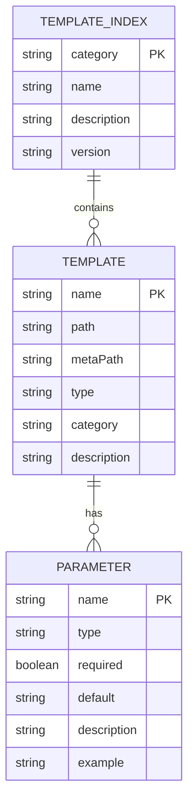
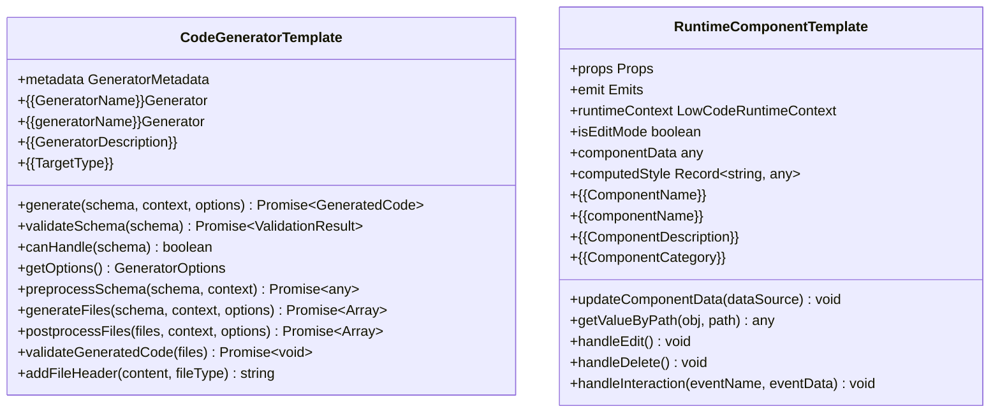
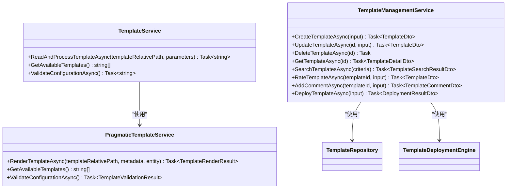
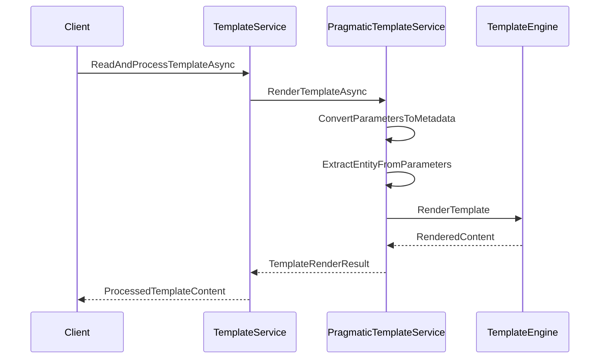
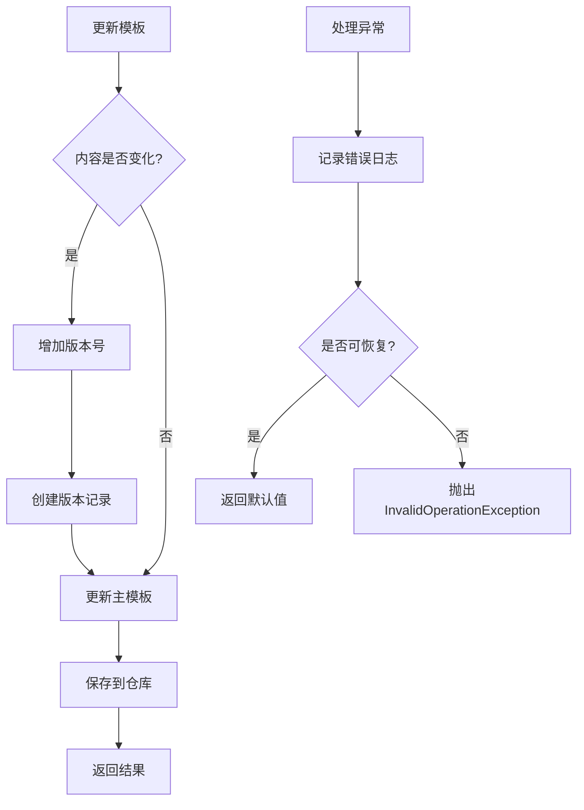

# 模板系统

<cite>
**本文档引用文件**  
- [index.json](file://templates/lowcode/index.json)
- [CodeGenerator.template.ts](file://templates/lowcode/generators/CodeGenerator.template.ts)
- [RuntimeComponent.template.vue](file://templates/lowcode/runtime/RuntimeComponent.template.vue)
- [TemplateService.cs](file://src/SmartAbp.CodeGenerator/Services/TemplateService.cs)
- [TemplateManagementService.cs](file://src/SmartAbp.CodeGenerator/Services/TemplateManagementService.cs)
</cite>

## 目录
1. [模板注册与管理机制](#模板注册与管理机制)
2. [模板定义与配置](#模板定义与配置)
3. [模板文件结构与占位符语法](#模板文件结构与占位符语法)
4. [模板服务职责分析](#模板服务职责分析)
5. [模板加载、缓存与渲染流程](#模板加载、缓存与渲染流程)
6. [模板热更新与错误处理](#模板热更新与错误处理)
7. [自定义模板开发指南](#自定义模板开发指南)

## 模板注册与管理机制

hxlot项目的模板系统通过`TemplateManagementService`实现完整的模板生命周期管理。该服务提供创建、更新、删除、搜索和部署模板的完整功能，支持版本控制、评分评论和一键部署。模板元数据存储在内存仓库中，并通过`TemplateRepository`进行持久化管理。系统支持模板的分类、标签、评分和下载统计，便于用户发现和使用高质量模板。

**Section sources**
- [TemplateManagementService.cs](file://src/SmartAbp.CodeGenerator/Services/TemplateManagementService.cs#L13-L539)

## 模板定义与配置

模板系统的核心配置文件位于`templates/lowcode/index.json`，该文件定义了低代码引擎开发的专业模板集合。配置包含模板分类、名称、描述、版本等基本信息，并通过`templates`数组注册具体模板。每个模板配置包含路径、元数据路径、类型、类别、描述、标签、AI触发词、适用场景、依赖项和参数定义。参数定义详细说明了模板所需的输入参数，包括名称、类型、是否必需、默认值和示例值。

**Diagram sources**
- [index.json](file://templates/lowcode/index.json#L1-L198)

**Section sources**
- [index.json](file://templates/lowcode/index.json#L1-L198)

## 模板文件结构与占位符语法

模板文件采用标准的前端技术栈，包括TypeScript和Vue组件。`CodeGenerator.template.ts`是代码生成器模板，实现了`ICodeGenerator`接口，包含生成器元数据、代码生成、模式验证、预处理、后处理和代码验证等核心方法。模板使用`{{VariableName}}`语法作为占位符，这些占位符在渲染时会被实际参数值替换。`RuntimeComponent.template.vue`是运行时组件模板，采用Vue 3的组合式API，包含模板、脚本和样式三个部分，支持数据绑定、事件处理和插槽内容。

**Diagram sources**
- [CodeGenerator.template.ts](file://templates/lowcode/generators/CodeGenerator.template.ts#L1-L373)
- [RuntimeComponent.template.vue](file://templates/lowcode/runtime/RuntimeComponent.template.vue#L1-L383)

**Section sources**
- [CodeGenerator.template.ts](file://templates/lowcode/generators/CodeGenerator.template.ts#L1-L373)
- [RuntimeComponent.template.vue](file://templates/lowcode/runtime/RuntimeComponent.template.vue#L1-L383)

## 模板服务职责分析

模板系统由`TemplateService`和`TemplateManagementService`两个核心服务组成。`TemplateService`负责模板的读取和处理，通过`PragmaticTemplateService`进行模板渲染，支持向后兼容的旧版本方法。`TemplateManagementService`则负责模板的全生命周期管理，包括CRUD操作、搜索浏览、评分评论、版本管理和一键部署。两个服务通过依赖注入协同工作，确保模板系统的稳定性和可扩展性。

**Diagram sources**
- [TemplateService.cs](file://src/SmartAbp.CodeGenerator/Services/TemplateService.cs#L21-L275)
- [TemplateManagementService.cs](file://src/SmartAbp.CodeGenerator/Services/TemplateManagementService.cs#L13-L539)

**Section sources**
- [TemplateService.cs](file://src/SmartAbp.CodeGenerator/Services/TemplateService.cs#L21-L275)
- [TemplateManagementService.cs](file://src/SmartAbp.CodeGenerator/Services/TemplateManagementService.cs#L13-L539)

## 模板加载、缓存与渲染流程

模板系统采用分层架构实现高效的模板加载、缓存和渲染。当请求处理模板时，`TemplateService`首先调用`PragmaticTemplateService`的`RenderTemplateAsync`方法。该方法根据模板相对路径查找模板文件，将参数对象转换为元数据格式，并提取实体数据。然后使用模板引擎渲染模板内容，处理占位符替换和逻辑计算。渲染结果经过验证后返回给调用方。系统通过内存缓存机制提高模板访问性能，避免重复读取和解析模板文件。

**Diagram sources**
- [TemplateService.cs](file://src/SmartAbp.CodeGenerator/Services/TemplateService.cs#L21-L275)

**Section sources**
- [TemplateService.cs](file://src/SmartAbp.CodeGenerator/Services/TemplateService.cs#L21-L275)

## 模板热更新与错误处理

模板系统支持热更新机制，当模板内容发生变化时，系统会自动增加版本号并创建版本记录。`TemplateManagementService`的`UpdateTemplateAsync`方法在检测到内容变化时调用`IncrementVersion`方法更新版本，并通过`CreateVersionAsync`创建新版本记录。错误处理策略采用分层异常处理机制，在`TemplateService`中捕获和记录模板处理异常，提供详细的错误信息和日志记录。对于无法恢复的错误，系统会抛出`InvalidOperationException`，确保调用方能够及时发现和处理问题。

**Diagram sources**
- [TemplateManagementService.cs](file://src/SmartAbp.CodeGenerator/Services/TemplateManagementService.cs#L13-L539)

**Section sources**
- [TemplateManagementService.cs](file://src/SmartAbp.CodeGenerator/Services/TemplateManagementService.cs#L13-L539)

## 自定义模板开发指南

要创建自定义模板，首先在`templates/lowcode`目录下创建相应的模板文件，如`MyGenerator.template.ts`或`MyComponent.template.vue`。然后在`index.json`的`templates`数组中注册新模板，提供必要的元数据和参数定义。模板文件应遵循标准的占位符语法`{{VariableName}}`，并在文件头部添加`AI_TEMPLATE_INFO`注释说明模板类型、适用场景和生成规则。开发完成后，通过`TemplateManagementService`的`CreateTemplateAsync`方法将模板注册到系统中，并进行测试验证。

**Section sources**
- [index.json](file://templates/lowcode/index.json#L1-L198)
- [CodeGenerator.template.ts](file://templates/lowcode/generators/CodeGenerator.template.ts#L1-L373)
- [RuntimeComponent.template.vue](file://templates/lowcode/runtime/RuntimeComponent.template.vue#L1-L383)
- [TemplateManagementService.cs](file://src/SmartAbp.CodeGenerator/Services/TemplateManagementService.cs#L13-L539)