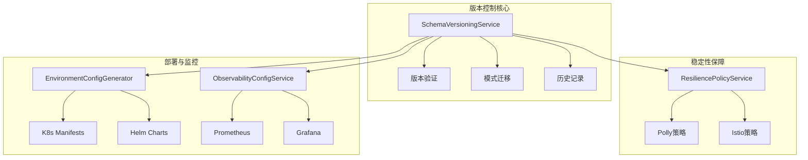
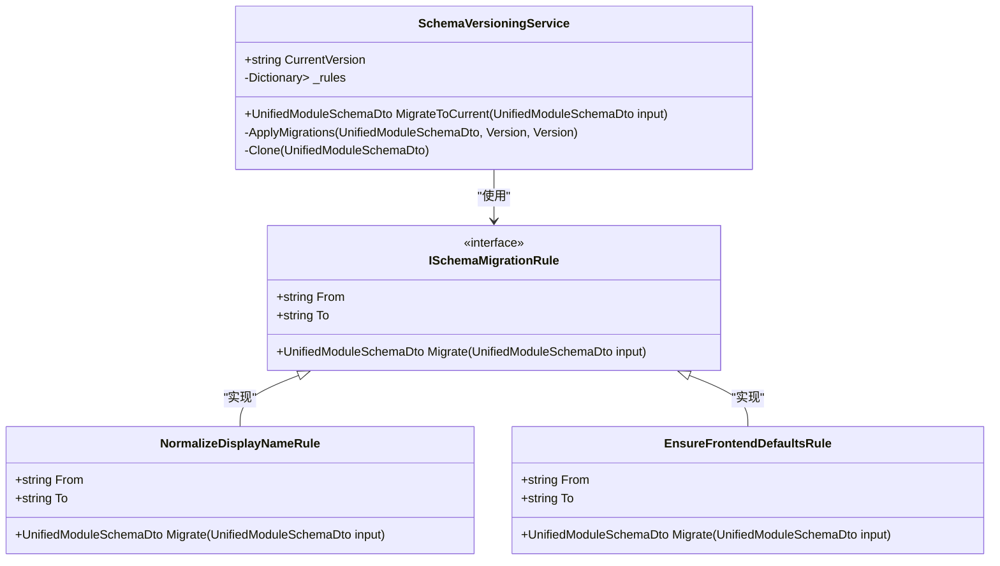
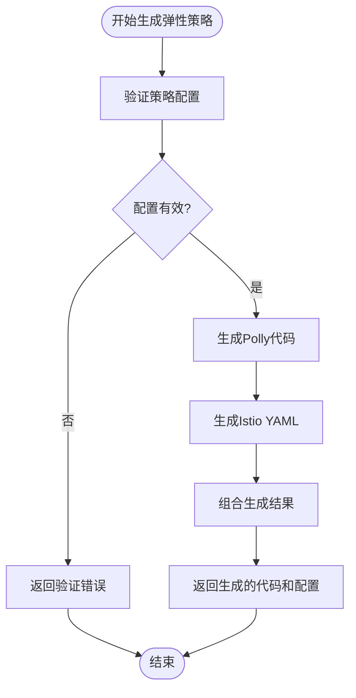
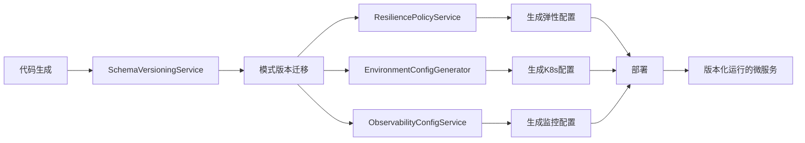
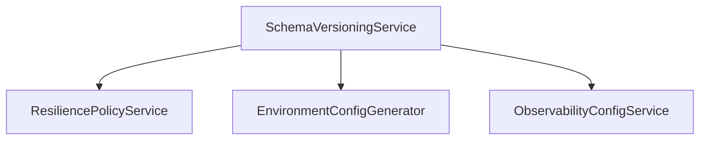

# 版本控制机制

<cite>
**本文档引用文件**   
- [SchemaVersioningService.cs](file://src\SmartAbp.CodeGenerator\Services\SchemaVersioningService.cs)
- [ResiliencePolicyService.cs](file://src\SmartAbp.CodeGenerator\Services\ResiliencePolicyService.cs)
- [EnvironmentConfigGenerator.cs](file://src\SmartAbp.CodeGenerator\Services\EnvironmentConfigGenerator.cs)
- [ObservabilityConfigService.cs](file://src\SmartAbp.CodeGenerator\Services\ObservabilityConfigService.cs)
- [Dtos.cs](file://src\SmartAbp.CodeGenerator\Services\Dtos.cs)
</cite>

## 目录
1. [引言](#引言)
2. [架构概览](#架构概览)
3. [核心组件分析](#核心组件分析)
4. [详细组件分析](#详细组件分析)
5. [依赖关系分析](#依赖关系分析)
6. [性能考量](#性能考量)
7. [故障排除指南](#故障排除指南)
8. [结论](#结论)

## 引言
hxlot项目通过一套精密的版本控制机制，确保代码生成过程的稳定性、可追溯性和向后兼容性。该机制由`SchemaVersioningService`作为核心，协同`ResiliencePolicyService`、`EnvironmentConfigGenerator`和`ObservabilityConfigService`等服务，共同构建了一个健壮的代码生成与部署体系。本文档将深入解析这些服务的协同工作原理，阐明其如何保障系统在迭代过程中的可靠性。

## 架构概览
hxlot项目的版本控制机制采用分层架构，核心是模式版本化服务，外围是弹性、环境和可观测性配置服务。`SchemaVersioningService`负责处理代码生成模式（`UnifiedModuleSchemaDto`）的版本迁移，确保不同版本间的兼容性。`ResiliencePolicyService`为生成的微服务提供Polly和Istio的弹性策略，保障系统稳定性。`EnvironmentConfigGenerator`和`ObservabilityConfigService`则分别负责生成Kubernetes环境配置和Prometheus/Grafana监控配置，实现版本化部署的完整闭环。

**图表来源**
- [SchemaVersioningService.cs](file://src\SmartAbp.CodeGenerator\Services\SchemaVersioningService.cs#L15-L220)
- [ResiliencePolicyService.cs](file://src\SmartAbp.CodeGenerator\Services\ResiliencePolicyService.cs#L12-L664)
- [EnvironmentConfigGenerator.cs](file://src\SmartAbp.CodeGenerator\Services\EnvironmentConfigGenerator.cs#L12-L359)
- [ObservabilityConfigService.cs](file://src\SmartAbp.CodeGenerator\Services\ObservabilityConfigService.cs#L15-L212)

## 核心组件分析
`SchemaVersioningService`是整个版本控制机制的基石，它通过语义化版本（SemVer）和迁移规则来管理`UnifiedModuleSchemaDto`的演进。该服务定义了当前版本（`CurrentVersion`），并内置了从`1.0.0`到`1.1.0`的安全迁移规则。当接收到旧版本的模式时，服务会首先验证其主版本号是否兼容，若不兼容则抛出异常，阻止破坏性变更。对于次版本和修订版本的变更，服务会通过广度优先搜索（BFS）算法在注册的迁移规则图中寻找一条路径，并按顺序应用这些规则，从而将旧模式安全地迁移到当前版本。

**组件来源**
- [SchemaVersioningService.cs](file://src\SmartAbp.CodeGenerator\Services\SchemaVersioningService.cs#L15-L220)

## 详细组件分析

### SchemaVersioningService 分析
`SchemaVersioningService`的设计遵循了最小化和可扩展性原则。其核心方法`MigrateToCurrent`接收一个`UnifiedModuleSchemaDto`输入，通过`ParseSemVerSafe`方法解析其版本号，并与当前版本进行比较。如果主版本号不同，则直接拒绝，确保了向后兼容性。对于兼容的版本，服务会调用`ApplyMigrations`方法，该方法利用BFS算法在`_rules`字典中存储的迁移规则图中寻找从输入版本到当前版本的路径。一旦找到路径，服务会创建一个输入模式的深拷贝（`Clone`方法）作为快照，然后按顺序应用路径上的每个迁移规则。如果在迁移过程中发生任何异常，服务会回滚到快照状态，保证了迁移过程的原子性和安全性。

#### 迁移规则类图

**图表来源**
- [SchemaVersioningService.cs](file://src\SmartAbp.CodeGenerator\Services\SchemaVersioningService.cs#L15-L220)
- [Dtos.cs](file://src\SmartAbp.CodeGenerator\Services\Dtos.cs#L1568-L1584)

### ResiliencePolicyService 分析
`ResiliencePolicyService`为生成的微服务提供了全面的弹性保障。它能够验证弹性策略配置，并生成Polly（.NET）和Istio（服务网格）两种技术栈的配置代码。该服务支持重试、断路器、超时、舱壁隔离、限流和回退等多种弹性模式。通过`ValidatePolicyAsync`方法，服务可以对策略进行完整性校验，并提供错误和警告信息。`GeneratePollyCodeAsync`和`GenerateIstioPolicyAsync`方法则分别生成C#代码和YAML配置，使得开发者可以轻松地将弹性策略集成到应用中。

#### 弹性策略生成流程图

**图表来源**
- [ResiliencePolicyService.cs](file://src\SmartAbp.CodeGenerator\Services\ResiliencePolicyService.cs#L12-L664)

### EnvironmentConfigGenerator 与 ObservabilityConfigService 分析
`EnvironmentConfigGenerator`和`ObservabilityConfigService`是实现版本化部署的关键。`EnvironmentConfigGenerator`根据`EnvironmentConfigDto`生成Kubernetes的Deployment、Service和HPA（Horizontal Pod Autoscaler）等资源清单，以及完整的Helm Chart。这使得不同环境（开发、测试、生产）的部署配置可以被版本化管理。`ObservabilityConfigService`则根据`ObservabilityConfigDto`生成Prometheus的抓取配置、告警规则和Grafana仪表板，为每个版本的微服务提供一致的监控能力。这两个服务确保了代码生成不仅限于业务逻辑，还涵盖了运维和监控层面，实现了真正的端到端自动化。

#### 版本化部署流程图

**图表来源**
- [EnvironmentConfigGenerator.cs](file://src\SmartAbp.CodeGenerator\Services\EnvironmentConfigGenerator.cs#L12-L359)
- [ObservabilityConfigService.cs](file://src\SmartAbp.CodeGenerator\Services\ObservabilityConfigService.cs#L15-L212)

## 依赖关系分析
`SchemaVersioningService`是整个机制的核心，它直接或间接地依赖于其他所有服务。`ResiliencePolicyService`、`EnvironmentConfigGenerator`和`ObservabilityConfigService`都接收由`SchemaVersioningService`处理后的最新版本的模块元数据作为输入。这些服务之间没有直接的依赖关系，它们通过`SchemaVersioningService`这个中心枢纽进行数据交换，形成了一个星型依赖结构。这种设计降低了组件间的耦合度，使得每个服务可以独立演进和测试。

**图表来源**
- [SchemaVersioningService.cs](file://src\SmartAbp.CodeGenerator\Services\SchemaVersioningService.cs#L15-L220)
- [ResiliencePolicyService.cs](file://src\SmartAbp.CodeGenerator\Services\ResiliencePolicyService.cs#L12-L664)
- [EnvironmentConfigGenerator.cs](file://src\SmartAbp.CodeGenerator\Services\EnvironmentConfigGenerator.cs#L12-L359)
- [ObservabilityConfigService.cs](file://src\SmartAbp.CodeGenerator\Services\ObservabilityConfigService.cs#L15-L212)

## 性能考量
`SchemaVersioningService`的性能主要体现在`ApplyMigrations`方法的BFS算法上。由于迁移规则图通常很小（只有几个版本的迁移路径），BFS的性能开销可以忽略不计。`Clone`方法对`UnifiedModuleSchemaDto`进行深拷贝，虽然会消耗一定的内存和CPU，但这是为了保证迁移过程的原子性所必需的。`ResiliencePolicyService`和`EnvironmentConfigGenerator`的代码生成过程主要涉及字符串拼接，性能良好。整体来看，该版本控制机制的性能开销很低，不会成为代码生成流程的瓶颈。

## 故障排除指南
当遇到版本控制相关的问题时，应首先检查`SchemaVersioningService`的日志。如果出现“主版本不兼容”的错误，说明输入的模式版本与当前版本不兼容，需要升级设计器或提供相应的迁移规则。如果迁移过程失败，服务会自动回滚，但应检查`ApplyMigrations`方法中是否有未处理的异常。对于`ResiliencePolicyService`，应使用`ValidatePolicyAsync`方法验证策略配置的正确性。对于`EnvironmentConfigGenerator`和`ObservabilityConfigService`，应检查输入的DTO对象是否完整，特别是环境变量、资源限制和监控指标等关键字段。

**组件来源**
- [SchemaVersioningService.cs](file://src\SmartAbp.CodeGenerator\Services\SchemaVersioningService.cs#L15-L220)
- [ResiliencePolicyService.cs](file://src\SmartAbp.CodeGenerator\Services\ResiliencePolicyService.cs#L12-L664)

## 结论
hxlot项目的版本控制机制通过`SchemaVersioningService`为核心，构建了一个安全、可靠、可追溯的代码生成体系。该机制通过严格的版本验证和安全的迁移路径，确保了向后兼容性。`ResiliencePolicyService`、`EnvironmentConfigGenerator`和`ObservabilityConfigService`等服务的协同工作，将代码生成的范围从单纯的业务逻辑扩展到了弹性、部署和监控等非功能性需求，实现了真正的全栈自动化。这种设计不仅提高了开发效率，也极大地增强了系统的稳定性和可维护性。