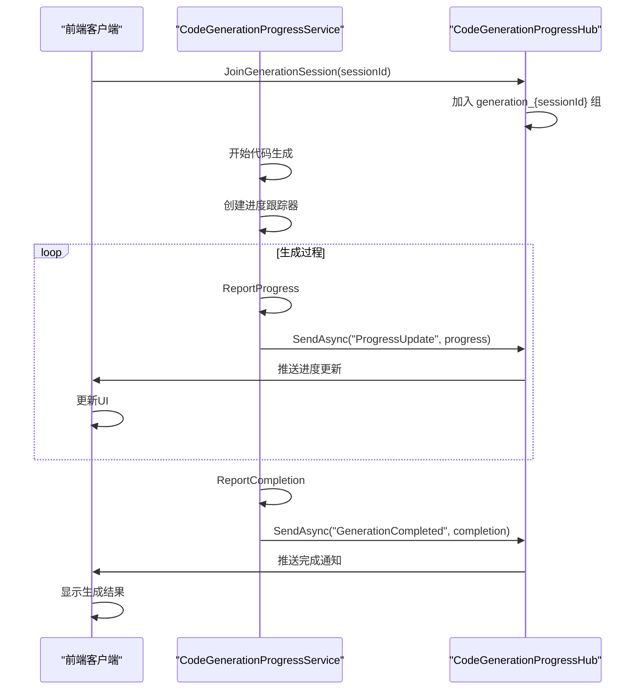
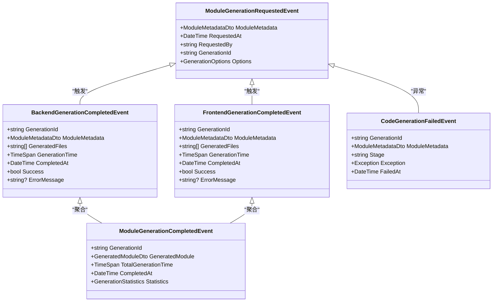
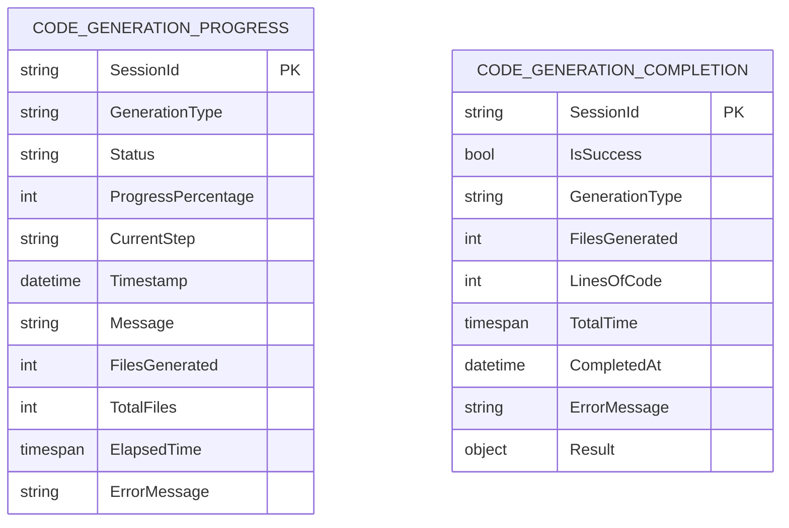

# 生成进度管理

<cite>
**Referenced Files in This Document**  
- [CodeGenerationProgressService.cs](file://src/SmartAbp.CodeGenerator/Services/CodeGenerationProgressService.cs)
- [CodeGenerationProgressHub.cs](file://src/SmartAbp.CodeGenerator/Hubs/CodeGenerationProgressHub.cs)
- [CodeGenerationEvents.cs](file://src/SmartAbp.CodeGenerator/Events/CodeGenerationEvents.cs)
- [DebugToolsService.cs](file://src/SmartAbp.CodeGenerator/Services/DebugToolsService.cs)
</cite>

## 目录
1. [核心进度服务](#核心进度服务)
2. [实时通信集线器](#实时通信集线器)
3. [事件通知系统](#事件通知系统)
4. [调试工具集成](#调试工具集成)
5. [进度数据结构](#进度数据结构)
6. [前端消费机制](#前端消费机制)

## 核心进度服务

`CodeGenerationProgressService` 是代码生成进度管理的核心服务，负责跟踪和广播生成任务的实时进度。该服务实现了单例依赖注入，确保在整个应用程序生命周期内只有一个实例。

服务通过依赖注入获取 `IHubContext<CodeGenerationProgressHub>` 和 `ILogger<CodeGenerationProgressService>`，前者用于与 SignalR 集线器通信，后者用于记录操作日志。服务提供了三个主要方法：`ReportProgressAsync` 用于报告进度更新，`ReportCompletionAsync` 用于报告生成完成状态，`CreateTracker` 用于创建特定会话的进度跟踪器。

进度跟踪器 `CodeGenerationProgressTracker` 是一个内部类，实现了 `ICodeGenerationProgressTracker` 接口。它封装了进度报告的细节，提供更简洁的 API 给调用者使用，包括报告通用进度、文件生成、错误和完成状态的方法。

**Section sources**
- [CodeGenerationProgressService.cs](file://src/SmartAbp.CodeGenerator/Services/CodeGenerationProgressService.cs#L12-L177)

## 实时通信集线器

`CodeGenerationProgressHub` 是基于 SignalR 技术实现的实时通信集线器，负责在客户端和服务器之间建立持久连接，推送进度更新。该集线器使用 `[Authorize]` 属性进行身份验证，确保只有授权用户才能访问。

集线器提供了 `JoinGenerationSession` 和 `LeaveGenerationSession` 方法，允许客户端加入或离开特定的生成会话组。每个会话都有一个唯一的组标识符 `generation_{sessionId}`，确保进度更新只发送给相关客户端。集线器还重写了 `OnConnectedAsync` 和 `OnDisconnectedAsync` 方法，用于记录连接状态变化。

当 `CodeGenerationProgressService` 调用 `SendAsync` 方法时，SignalR 会将消息推送到指定会话组的所有客户端，实现真正的实时通信。

**Diagram sources**
- [CodeGenerationProgressService.cs](file://src/SmartAbp.CodeGenerator/Services/CodeGenerationProgressService.cs#L12-L177)
- [CodeGenerationProgressHub.cs](file://src/SmartAbp.CodeGenerator/Hubs/CodeGenerationProgressHub.cs#L12-L96)

**Section sources**
- [CodeGenerationProgressHub.cs](file://src/SmartAbp.CodeGenerator/Hubs/CodeGenerationProgressHub.cs#L12-L96)

## 事件通知系统

`CodeGenerationEvents` 定义了代码生成过程中的各种事件，实现了事件驱动的架构模式。这些事件包括 `ModuleGenerationRequestedEvent`（模块生成请求）、`BackendGenerationCompletedEvent`（后端生成完成）、`FrontendGenerationCompletedEvent`（前端生成完成）、`ModuleGenerationCompletedEvent`（模块生成完成）和 `CodeGenerationFailedEvent`（代码生成失败）等。

事件系统与进度服务协同工作，当特定阶段完成时，会发布相应的事件。其他系统组件可以订阅这些事件，执行后续操作，如质量检查、部署或通知。这种解耦设计使得系统更加灵活和可扩展。

**Diagram sources**
- [CodeGenerationEvents.cs](file://src/SmartAbp.CodeGenerator/Events/CodeGenerationEvents.cs#L1-L188)

**Section sources**
- [CodeGenerationEvents.cs](file://src/SmartAbp.CodeGenerator/Events/CodeGenerationEvents.cs#L1-L188)

## 调试工具集成

`DebugToolsService` 提供了多种调试和测试工具，辅助进度追踪和问题诊断。该服务包含 API 测试、日志查询、性能监控和健康检查等功能。

API 测试功能允许用户执行 HTTP 请求并查看响应，帮助验证生成的 API 是否正常工作。日志查询功能可以检索系统日志，便于排查问题。性能监控功能收集服务的 CPU、内存、请求率等指标，帮助评估系统性能。健康检查功能定期检查数据库、Redis、RabbitMQ 等依赖服务的状态，确保系统整体健康。

这些工具与进度管理系统集成，可以在生成过程中或生成后使用，提供全面的诊断能力。

**Section sources**
- [DebugToolsService.cs](file://src/SmartAbp.CodeGenerator/Services/DebugToolsService.cs#L16-L447)

## 进度数据结构

进度数据结构定义了进度信息的格式和内容。`CodeGenerationProgressModel` 包含会话 ID、生成类型、状态、进度百分比、当前步骤、时间戳、消息、已生成文件数、总文件数、已用时间和错误消息等字段。

`CodeGenerationCompletionModel` 则包含会话 ID、是否成功、生成类型、已生成文件数、代码行数、总时间、完成时间、错误消息和结果等字段。这些数据结构确保了进度信息的完整性和一致性，便于前后端理解和处理。

**Diagram sources**
- [CodeGenerationProgressHub.cs](file://src/SmartAbp.CodeGenerator/Hubs/CodeGenerationProgressHub.cs#L66-L95)

## 前端消费机制

前端通过 SignalR 客户端库连接到 `CodeGenerationProgressHub`，加入特定的生成会话组。一旦连接成功，前端就可以接收来自服务器的实时进度更新。

前端通常会监听 "ProgressUpdate" 和 "GenerationCompleted" 两个事件。当收到 "ProgressUpdate" 事件时，更新进度条、状态文本和日志显示；当收到 "GenerationCompleted" 事件时，显示生成结果，包括成功或失败状态、生成的文件数和代码行数等信息。

这种机制确保了用户界面能够实时反映生成任务的进度，提供良好的用户体验。