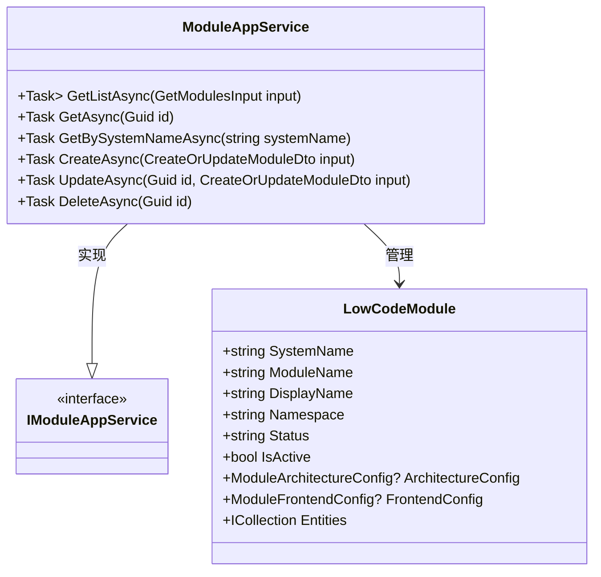
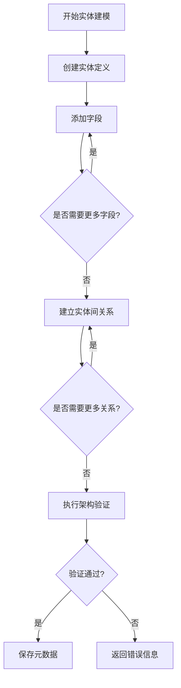
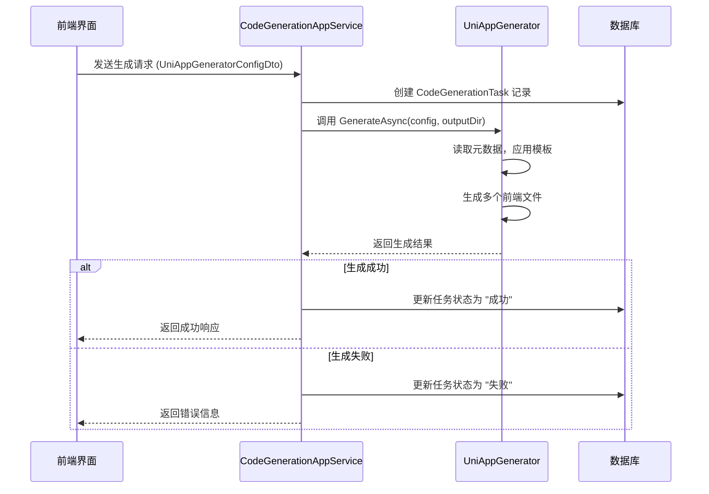
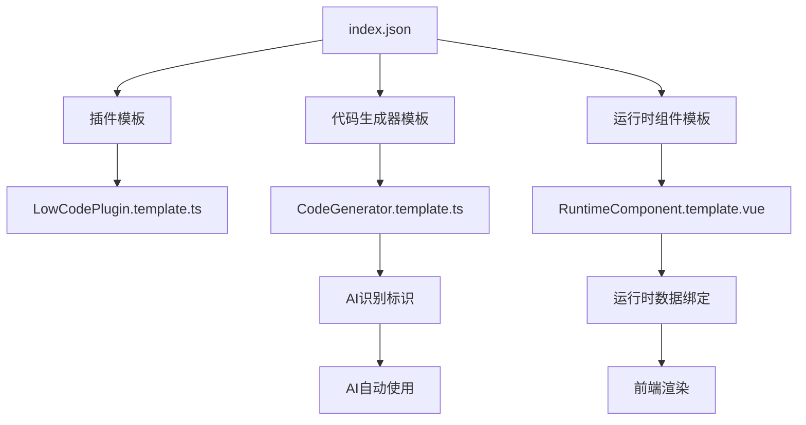
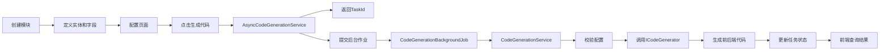

# 低代码功能

<cite>
**本文档引用的文件**   
- [ModuleAppService.cs](file://src/SmartAbp.Application/LowCode/ModuleAppService.cs)
- [EntityModelingAppService.cs](file://src/SmartAbp.Application/LowCode/EntityModelingAppService.cs)
- [CodeGenerationAppService.cs](file://src/SmartAbp.Application/CodeGeneration/CodeGenerationAppService.cs)
- [CodeGenerationService.cs](file://src/SmartAbp.Application/LowCode/CodeGenerationService.cs)
- [AsyncCodeGenerationService.cs](file://src/SmartAbp.Application/LowCode/AsyncCodeGenerationService.cs)
- [CodeGenerationBackgroundJob.cs](file://src/SmartAbp.Application/LowCode/CodeGenerationBackgroundJob.cs)
- [LowCodeModule.cs](file://src/SmartAbp.Domain/Entities/LowCode/LowCodeModule.cs)
- [EntityDefinition.cs](file://src/SmartAbp.Domain/Entities/LowCode/EntityDefinition.cs)
- [EntityField.cs](file://src/SmartAbp.Domain/Entities/LowCode/EntityField.cs)
- [index.json](file://templates/lowcode/index.json)
- [README.md](file://templates/lowcode/README.md)
- [CodeGenerator.template.ts](file://templates/lowcode/generators/CodeGenerator.template.ts)
- [RuntimeComponent.template.vue](file://templates/lowcode/runtime/RuntimeComponent.template.vue)
</cite>

## 目录
1. [引言](#引言)
2. [核心概念](#核心概念)
3. [模块管理](#模块管理)
4. [实体建模](#实体建模)
5. [代码生成引擎](#代码生成引擎)
6. [模板系统](#模板系统)
7. [端到端工作流示例](#端到端工作流示例)
8. [结论](#结论)

## 引言
hxlot项目提供了一套完整的低代码开发平台，旨在通过可视化配置和元数据驱动的方式，显著提升软件开发效率。该平台的核心功能围绕模块（Module）、实体（Entity）、字段（Field）和页面配置（PageConfig）等核心概念构建，通过`ModuleAppService`和`EntityModelingAppService`进行元数据的创建与管理，并由`CodeGenerationAppService`驱动代码生成引擎，将这些元数据模型转换为实际的前后端代码。本文档将全面介绍这一低代码平台的架构、流程和工作原理。

## 核心概念
低代码平台的核心是将软件开发的各个层面抽象为可配置的元数据模型。这些模型包括模块、实体、字段和页面配置。

### 模块 (Module)
模块是低代码应用的顶层组织单元，代表一个独立的功能域，如“项目管理”或“用户管理”。在代码层面，`LowCodeModule`实体定义了模块的所有属性，包括系统名称（SystemName）、显示名称（DisplayName）、命名空间（Namespace）和状态（Status）等。模块不仅是一个逻辑容器，还包含了架构配置、前端配置和代码生成选项等JSON格式的强类型配置，确保了后端单一事实源（SSOT）的完整性。

### 实体 (Entity)
实体是模块内部的数据模型，对应于数据库中的表。`EntityDefinition`类定义了实体的名称、表名、显示名称、描述以及实体类型（如聚合根、实体、值对象）。一个模块可以包含多个实体，它们之间通过关系（Relation）进行关联。实体的定义是代码生成的基础，决定了后端领域模型和数据库表结构。

### 字段 (Field)
字段是构成实体的基本单元，定义了数据的属性。`EntityField`类包含了字段的名称、类型（如string, int, DateTime）、是否必填、是否主键、是否唯一等约束条件。此外，字段还支持长度、默认值、注释和显示顺序等元数据，这些信息将被用于生成数据库列定义和前端表单验证。

### 页面配置 (PageConfig)
页面配置定义了实体在前端的用户界面表现形式。它包含了列表页面、详情页面和表单页面的布局、字段显示顺序、验证规则等信息。`PageConfigValidator`负责在代码生成前对页面配置进行校验，确保其合法性，从而保证生成的前端代码能够正确运行。

**Section sources**
- [LowCodeModule.cs](file://src/SmartAbp.Domain/Entities/LowCode/LowCodeModule.cs#L15-L162)
- [EntityDefinition.cs](file://src/SmartAbp.Domain/Entities/LowCode/EntityDefinition.cs#L12-L199)
- [EntityField.cs](file://src/SmartAbp.Domain/Entities/LowCode/EntityField.cs#L10-L144)

## 模块管理
模块的创建和管理是低代码平台的入口。`ModuleAppService`类实现了`IModuleAppService`接口，提供了对`LowCodeModule`实体的完整CRUD（创建、读取、更新、删除）操作。

### 创建与管理流程
`ModuleAppService`继承自ABP框架的`CrudAppService`，这使得它天然具备了标准的增删改查功能，无需开发者重复编写基础代码。当用户通过前端界面创建一个新模块时，`ModuleAppService`会接收`CreateOrUpdateModuleDto`数据传输对象，将其映射为`LowCodeModule`实体，并持久化到数据库中。

除了基础的CRUD，`ModuleAppService`还提供了丰富的查询方法，如`GetListAsync`支持根据过滤条件、状态和激活状态进行分页查询；`GetBySystemNameAsync`可以根据系统名称精确获取模块。这些方法确保了前端能够灵活地检索和展示模块信息。

**Diagram sources **
- [ModuleAppService.cs](file://src/SmartAbp.Application/LowCode/ModuleAppService.cs#L21-L213)
- [LowCodeModule.cs](file://src/SmartAbp.Domain/Entities/LowCode/LowCodeModule.cs#L15-L162)

**Section sources**
- [ModuleAppService.cs](file://src/SmartAbp.Application/LowCode/ModuleAppService.cs#L21-L213)

## 实体建模
实体建模是低代码平台的核心功能，它允许用户通过图形化界面定义数据结构。`EntityModelingAppService`类负责处理所有与实体建模相关的业务逻辑。

### 建模过程
`EntityModelingAppService`提供了对实体、字段和关系的全面管理。其主要流程如下：
1.  **创建实体**：调用`CreateEntityAsync`方法，传入`CreateOrUpdateEntityDefinitionDto`对象。该方法首先会检查实体名称的唯一性，然后创建`EntityDefinition`实体，并将其包含的字段列表（`Fields`）作为导航属性一并保存。
2.  **管理字段**：提供了`AddFieldAsync`、`UpdateFieldAsync`和`DeleteFieldAsync`等方法，用于动态地增删改实体的字段。每次操作都会直接作用于数据库，确保元数据的实时性。
3.  **建立关系**：通过`CreateRelationAsync`方法，可以在两个实体之间建立一对多、一对一或多对多的关系。关系信息被存储在`EntityRelation`实体中。
4.  **架构验证**：`ValidateSchemaAsync`方法用于对整个数据模型进行校验，例如检查实体名称是否重复、关系引用的实体是否存在等，以保证模型的完整性。

**Diagram sources **
- [EntityModelingAppService.cs](file://src/SmartAbp.Application/LowCode/EntityModelingAppService.cs#L18-L351)

**Section sources**
- [EntityModelingAppService.cs](file://src/SmartAbp.Application/LowCode/EntityModelingAppService.cs#L18-L351)

## 代码生成引擎
代码生成引擎是低代码平台的“编译器”，它将用户定义的元数据模型转换为可运行的前后端代码。`CodeGenerationAppService`是驱动这一引擎的核心服务。

### 架构与流程
`CodeGenerationAppService`的设计采用了模块化和可扩展的架构。它通过依赖注入的方式，集成了多个具体的代码生成器，如`MesDashboardGenerator`和`UniAppGenerator`。当接收到生成请求时，`CodeGenerationAppService`会根据请求类型，调用相应的生成器。

1.  **任务管理**：每个代码生成请求都会被记录为一个`CodeGenerationTask`，包含任务ID、系统名称、生成器类型和配置信息。这使得生成过程可追踪、可审计。
2.  **生成执行**：以`GenerateUniAppAsync`为例，该方法首先创建任务记录，然后调用`UniAppGenerator`的`GenerateAsync`方法。生成器会读取元数据，应用模板，并生成一系列前端文件（如Vue组件、API客户端、Store等）。
3.  **结果处理**：生成成功后，任务状态会被标记为成功，并记录生成的文件列表和耗时。如果失败，则会捕获异常并返回详细的错误信息。

**Diagram sources **
- [CodeGenerationAppService.cs](file://src/SmartAbp.Application/CodeGeneration/CodeGenerationAppService.cs#L20-L342)

**Section sources**
- [CodeGenerationAppService.cs](file://src/SmartAbp.Application/CodeGeneration/CodeGenerationAppService.cs#L20-L342)

## 模板系统
模板系统是代码生成器的基石，它定义了生成代码的结构和样式。`templates/lowcode`目录下的模板文件是整个低代码平台可扩展性的关键。

### 工作原理
模板系统基于YAML和TypeScript/Vue文件的组合。`index.json`文件是模板的注册中心，它定义了所有可用的模板，包括插件模板、代码生成器模板和运行时组件模板。每个模板条目都指定了模板文件路径、元数据路径、类型、描述和参数。

-   **模板参数**：模板通过参数（parameters）来接收动态数据。例如，`CodeGenerator.template.ts`需要`GeneratorName`和`TargetType`等参数。在代码生成时，`CodeGenerationAppService`会将元数据模型中的信息填充到这些参数中。
-   **AI识别**：模板文件中包含`AI_TEMPLATE_INFO`注释块，这使得AI系统能够自动识别和使用正确的模板。例如，当用户请求“创建一个Vue组件生成器”时，AI会自动匹配到`CodeGenerator.template.ts`。

### 自定义方法
要创建一个新的模板，开发者可以：
1.  在`templates/lowcode`目录下创建新的子目录（如`custom`）。
2.  复制现有的模板文件（如`CodeGenerator.template.ts`）并进行修改。
3.  在`index.json`中注册新模板，提供名称、路径、描述和参数。
4.  在`README.md`中添加新模板的使用说明。

**Diagram sources **
- [index.json](file://templates/lowcode/index.json#L0-L198)
- [README.md](file://templates/lowcode/README.md#L0-L206)

**Section sources**
- [index.json](file://templates/lowcode/index.json#L0-L198)
- [README.md](file://templates/lowcode/README.md#L0-L206)

## 端到端工作流示例
以下是一个从创建模块到生成代码的完整工作流示例：

1.  **创建模块**：用户在前端创建一个名为“产品管理”的模块，系统名称为`ProductManagement`。
2.  **定义实体**：在“产品管理”模块下，用户创建一个名为`Product`的实体，包含`Name`（字符串，必填）、`Price`（数字）和`IsActive`（布尔值）等字段。
3.  **配置页面**：用户为`Product`实体配置列表页面，选择`Name`和`Price`作为显示字段，并设置表单验证规则。
4.  **触发生成**：用户点击“生成代码”按钮。
5.  **异步处理**：`AsyncCodeGenerationService`接收到请求，立即返回一个`taskId`，并将生成任务提交给后台作业`CodeGenerationBackgroundJob`。
6.  **执行生成**：后台作业调用`CodeGenerationService`，该服务首先使用`PageConfigValidator`校验页面配置，然后调用`ICodeGenerator`接口执行生成。
7.  **结果输出**：代码生成完成后，生成的文件被写入指定目录，任务状态更新为“完成”，前端可以通过`taskId`查询最终结果。

**Diagram sources **
- [AsyncCodeGenerationService.cs](file://src/SmartAbp.Application/LowCode/AsyncCodeGenerationService.cs#L17-L147)
- [CodeGenerationBackgroundJob.cs](file://src/SmartAbp.Application/LowCode/CodeGenerationBackgroundJob.cs#L16-L182)
- [CodeGenerationService.cs](file://src/SmartAbp.Application/LowCode/CodeGenerationService.cs#L17-L78)

**Section sources**
- [AsyncCodeGenerationService.cs](file://src/SmartAbp.Application/LowCode/AsyncCodeGenerationService.cs#L17-L147)
- [CodeGenerationBackgroundJob.cs](file://src/SmartAbp.Application/LowCode/CodeGenerationBackgroundJob.cs#L16-L182)
- [CodeGenerationService.cs](file://src/SmartAbp.Application/LowCode/CodeGenerationService.cs#L17-L78)

## 结论
hxlot项目的低代码功能通过一套精心设计的架构，实现了从元数据建模到代码生成的自动化流程。`ModuleAppService`和`EntityModelingAppService`提供了强大的元数据管理能力，而`CodeGenerationAppService`则作为引擎核心，驱动着`UniAppGenerator`等具体生成器，将抽象的模型转化为具体的生产力。模板系统`templates/lowcode`赋予了平台极高的可扩展性，使得开发者可以轻松地定制和扩展代码生成能力。整个系统通过异步任务和后台作业确保了生成过程的稳定性和用户体验。这一低代码平台极大地降低了开发门槛，为快速构建企业级应用提供了坚实的基础。