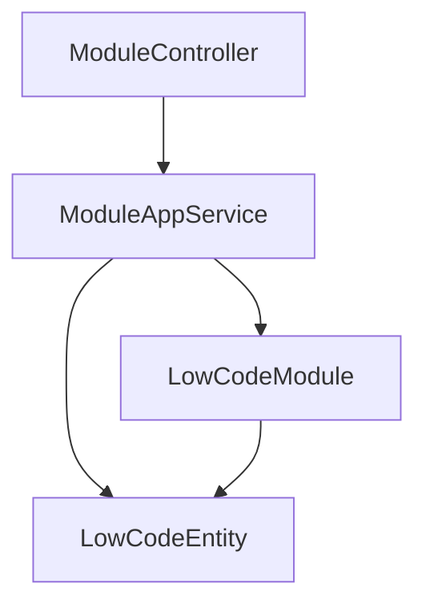
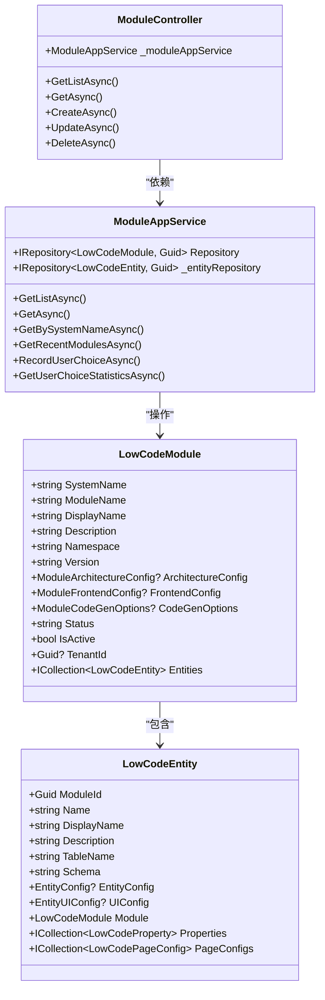
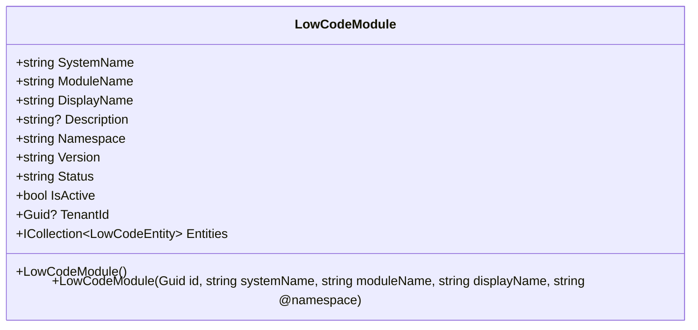
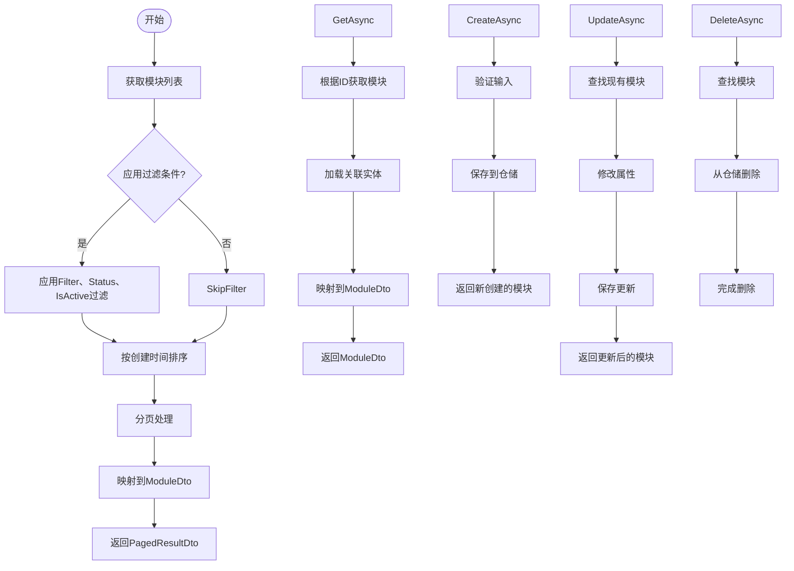
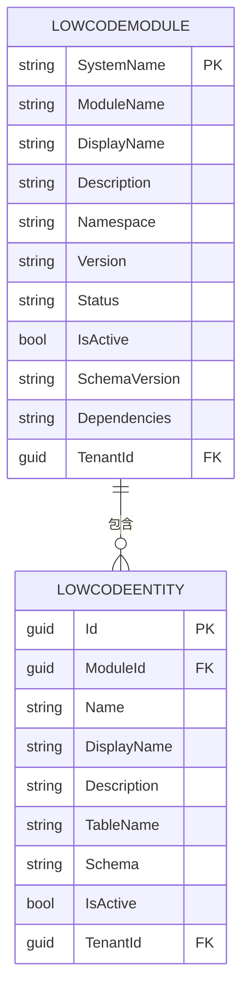
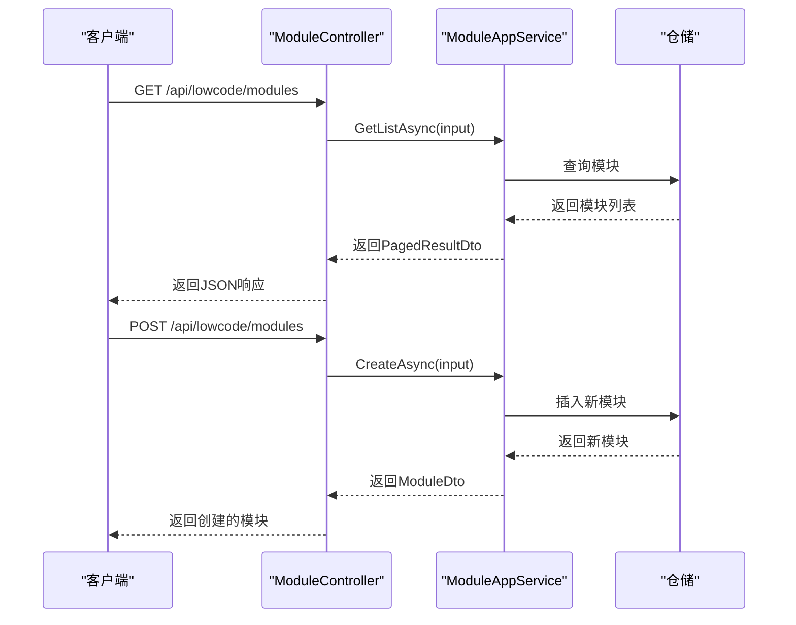
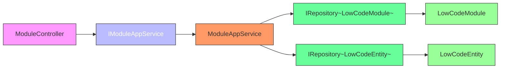

# 低代码模块管理

<cite>
**本文档引用的文件**  
- [LowCodeModule.cs](file://src/SmartAbp.Domain/Entities/LowCode/LowCodeModule.cs)
- [ModuleAppService.cs](file://src/SmartAbp.Application/LowCode/ModuleAppService.cs)
- [IModuleAppService.cs](file://src/SmartAbp.Application.Contracts/LowCode/IModuleAppService.cs)
- [ModuleController.cs](file://src/SmartAbp.HttpApi/Controllers/LowCode/ModuleController.cs)
- [ModuleDto.cs](file://src/SmartAbp.Application.Contracts/LowCode/Dtos/ModuleDto.cs)
- [LowCodeEntity.cs](file://src/SmartAbp.Domain/Entities/LowCode/LowCodeEntity.cs)
</cite>

## 目录
1. [简介](#简介)
2. [项目结构](#项目结构)
3. [核心组件](#核心组件)
4. [架构概述](#架构概述)
5. [详细组件分析](#详细组件分析)
6. [依赖分析](#依赖分析)
7. [性能考虑](#性能考虑)
8. [故障排除指南](#故障排除指南)
9. [结论](#结论)

## 简介
本文档详细阐述了hxlot项目中低代码模块管理系统的实现机制。重点介绍`LowCodeModule`实体的结构与字段含义，`ModuleAppService`中的业务逻辑，模块与实体、页面配置之间的关系，以及通过`IModuleAppService`接口进行模块管理的API调用方式。同时说明模块生命周期管理、状态转换和权限控制机制，并结合`ModuleController`解析RESTful API的设计与实现。

## 项目结构
低代码模块管理功能主要分布在以下目录中：
- `src/SmartAbp.Domain/Entities/LowCode/`：包含`LowCodeModule`、`LowCodeEntity`等核心实体定义
- `src/SmartAbp.Application/LowCode/`：包含`ModuleAppService`等应用服务实现
- `src/SmartAbp.Application.Contracts/LowCode/`：包含`IModuleAppService`接口契约和DTO定义
- `src/SmartAbp.HttpApi/Controllers/LowCode/`：包含`ModuleController`控制器，提供HTTP API端点

**图示来源**
- [ModuleController.cs](file://src/SmartAbp.HttpApi/Controllers/LowCode/ModuleController.cs)
- [ModuleAppService.cs](file://src/SmartAbp.Application/LowCode/ModuleAppService.cs)
- [LowCodeModule.cs](file://src/SmartAbp.Domain/Entities/LowCode/LowCodeModule.cs)
- [LowCodeEntity.cs](file://src/SmartAbp.Domain/Entities/LowCode/LowCodeEntity.cs)

**章节来源**
- [LowCodeModule.cs](file://src/SmartAbp.Domain/Entities/LowCode/LowCodeModule.cs)
- [ModuleAppService.cs](file://src/SmartAbp.Application/LowCode/ModuleAppService.cs)

## 核心组件
本系统的核心组件包括`LowCodeModule`实体、`ModuleAppService`服务类、`IModuleAppService`接口和`ModuleController`控制器。这些组件共同实现了低代码模块的全生命周期管理功能。

**章节来源**
- [LowCodeModule.cs](file://src/SmartAbp.Domain/Entities/LowCode/LowCodeModule.cs)
- [ModuleAppService.cs](file://src/SmartAbp.Application/LowCode/ModuleAppService.cs)

## 架构概述
系统采用典型的分层架构设计，从前端控制器到应用服务再到领域实体，形成清晰的调用链路。`ModuleController`接收HTTP请求，委托给`ModuleAppService`处理，后者操作`LowCodeModule`和`LowCodeEntity`等持久化实体。

**图示来源**
- [ModuleController.cs](file://src/SmartAbp.HttpApi/Controllers/LowCode/ModuleController.cs)
- [ModuleAppService.cs](file://src/SmartAbp.Application/LowCode/ModuleAppService.cs)
- [LowCodeModule.cs](file://src/SmartAbp.Domain/Entities/LowCode/LowCodeModule.cs)
- [LowCodeEntity.cs](file://src/SmartAbp.Domain/Entities/LowCode/LowCodeEntity.cs)

## 详细组件分析

### LowCodeModule 实体分析
`LowCodeModule`是低代码模块的核心领域实体，继承自`AuditedAggregateRoot<Guid>`并实现`IMultiTenant`接口，支持审计和多租户功能。

#### 实体结构与字段含义
`LowCodeModule`包含以下主要字段：

| 字段名 | 类型 | 说明 |
|-------|------|------|
| SystemName | string | 系统名称，唯一标识，如：ProjectManagement |
| ModuleName | string | 模块名称，用于代码生成，如：Project |
| DisplayName | string | 显示名称（中文），如：项目管理 |
| Description | string? | 模块描述 |
| Namespace | string | 命名空间，如：SmartAbp.ProjectManagement |
| Version | string | 版本号，如：1.0.0 |
| Status | string | 模块状态：Draft \| Published \| Archived |
| IsActive | bool | 是否激活 |
| SchemaVersion | string | Schema版本号 |
| Dependencies | string? | 模块依赖（JSON数组） |
| TenantId | Guid? | 租户ID（多租户支持） |

此外，还包含多个JSON配置字段：
- `ArchitectureConfig`：架构配置
- `FrontendConfig`：前端配置
- `CodeGenOptions`：代码生成选项
- `PermissionConfig`：权限配置
- `FeatureManagement`：特性管理配置

#### 构造函数
实体提供了两个构造函数：
- 无参保护构造函数，供EF Core使用
- 带参数的构造函数，用于创建新模块实例

**图示来源**
- [LowCodeModule.cs](file://src/SmartAbp.Domain/Entities/LowCode/LowCodeModule.cs)

**章节来源**
- [LowCodeModule.cs](file://src/SmartAbp.Domain/Entities/LowCode/LowCodeModule.cs)

### ModuleAppService 服务分析
`ModuleAppService`是模块管理的核心应用服务，继承自`CrudAppService`并实现`IModuleAppService`接口。

#### 业务逻辑分析
服务实现了创建、更新、删除和查询模块的完整业务逻辑：

**图示来源**
- [ModuleAppService.cs](file://src/SmartAbp.Application/LowCode/ModuleAppService.cs)

#### 扩展功能
除了标准CRUD操作，服务还提供了以下扩展功能：
- `GetBySystemNameAsync`：根据系统名称获取模块
- `GetRecentModulesAsync`：获取最近访问的模块
- `RecordUserChoiceAsync`：记录用户入口选择
- `GetUserChoiceStatisticsAsync`：获取用户选择统计

**章节来源**
- [ModuleAppService.cs](file://src/SmartAbp.Application/LowCode/ModuleAppService.cs)

### 模块与实体关系分析
模块与实体之间存在一对多的导航关系，一个模块可以包含多个实体。

**图示来源**
- [LowCodeModule.cs](file://src/SmartAbp.Domain/Entities/LowCode/LowCodeModule.cs)
- [LowCodeEntity.cs](file://src/SmartAbp.Domain/Entities/LowCode/LowCodeEntity.cs)

**章节来源**
- [LowCodeModule.cs](file://src/SmartAbp.Domain/Entities/LowCode/LowCodeModule.cs)
- [LowCodeEntity.cs](file://src/SmartAbp.Domain/Entities/LowCode/LowCodeEntity.cs)

### API调用示例
通过`IModuleAppService`接口可以进行模块管理操作：

**图示来源**
- [ModuleController.cs](file://src/SmartAbp.HttpApi/Controllers/LowCode/ModuleController.cs)
- [ModuleAppService.cs](file://src/SmartAbp.Application/LowCode/ModuleAppService.cs)

**章节来源**
- [IModuleAppService.cs](file://src/SmartAbp.Application.Contracts/LowCode/IModuleAppService.cs)
- [ModuleController.cs](file://src/SmartAbp.HttpApi/Controllers/LowCode/ModuleController.cs)

## 依赖分析
系统各组件之间的依赖关系清晰，遵循依赖倒置原则。

**图示来源**
- [ModuleController.cs](file://src/SmartAbp.HttpApi/Controllers/LowCode/ModuleController.cs)
- [IModuleAppService.cs](file://src/SmartAbp.Application.Contracts/LowCode/IModuleAppService.cs)
- [ModuleAppService.cs](file://src/SmartAbp.Application/LowCode/ModuleAppService.cs)
- [LowCodeModule.cs](file://src/SmartAbp.Domain/Entities/LowCode/LowCodeModule.cs)
- [LowCodeEntity.cs](file://src/SmartAbp.Domain/Entities/LowCode/LowCodeEntity.cs)

**章节来源**
- [ModuleController.cs](file://src/SmartAbp.HttpApi/Controllers/LowCode/ModuleController.cs)
- [IModuleAppService.cs](file://src/SmartAbp.Application.Contracts/LowCode/IModuleAppService.cs)

## 性能考虑
- 查询操作使用`AsyncExecuter`进行异步执行，避免阻塞
- 分页查询时先计算总数再获取数据，优化数据库查询
- 获取模块详情时批量加载关联实体，减少数据库往返次数
- 使用`ObjectMapper.Map`进行DTO转换，提高映射效率

## 故障排除指南
常见问题及解决方案：
- **模块创建失败**：检查必填字段是否完整，特别是`SystemName`、`ModuleName`、`DisplayName`和`Namespace`
- **无法获取模块**：确认模块ID或系统名称是否正确，检查模块状态是否为激活状态
- **实体加载失败**：确保模块与实体之间的外键关系正确建立
- **权限问题**：检查当前用户是否具有相应的模块管理权限

**章节来源**
- [ModuleAppService.cs](file://src/SmartAbp.Application/LowCode/ModuleAppService.cs)
- [ModuleController.cs](file://src/SmartAbp.HttpApi/Controllers/LowCode/ModuleController.cs)

## 结论
hxlot项目的低代码模块管理系统设计合理，实现了模块的全生命周期管理。通过清晰的分层架构和规范的接口定义，确保了系统的可维护性和可扩展性。`LowCodeModule`实体与`LowCodeEntity`实体之间的关系设计合理，支持复杂的低代码场景。`ModuleAppService`提供的丰富API满足了各种业务需求，而`ModuleController`则为前端提供了便捷的RESTful接口。