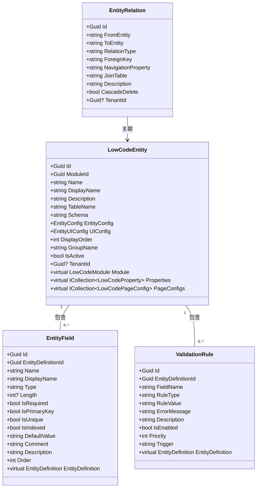

# 实体建模

<cite>
**本文档引用的文件**  
- [EntityModelingAppService.cs](file://src/SmartAbp.Application/LowCode/EntityModelingAppService.cs)
- [LowCodeEntity.cs](file://src/SmartAbp.Domain/Entities/LowCode/LowCodeEntity.cs)
- [EntityField.cs](file://src/SmartAbp.Domain/Entities/LowCode/EntityField.cs)
- [ValidationRule.cs](file://src/SmartAbp.Domain/Entities/LowCode/ValidationRule.cs)
- [EntityRelation.cs](file://src/SmartAbp.Domain/Entities/LowCode/EntityRelation.cs)
</cite>

## 目录
1. [简介](#简介)
2. [核心领域模型](#核心领域模型)
3. [实体属性定义](#实体属性定义)
4. [验证规则配置与执行](#验证规则配置与执行)
5. [实体间关系建模](#实体间关系建模)
6. [实体建模应用服务API](#实体建模应用服务api)
7. [实体建模工作流示例](#实体建模工作流示例)
8. [服务层操作实体模型](#服务层操作实体模型)
9. [总结](#总结)

## 简介
hxlot项目提供了一套完整的低代码实体建模功能，支持通过可视化界面或API方式定义业务实体、字段、验证规则和实体间关系。该功能由`EntityModelingAppService`驱动，基于ABP框架实现，具备高内聚、低耦合的架构设计。实体模型最终用于代码生成、数据库迁移和前端类型同步，是整个低代码平台的核心元数据。

## 核心领域模型
实体建模功能围绕四个核心领域模型展开：`LowCodeEntity`、`EntityField`、`ValidationRule`和`EntityRelation`。这些模型共同构成了业务实体的完整元数据定义。



**图示来源**  
- [LowCodeEntity.cs](file://src/SmartAbp.Domain/Entities/LowCode/LowCodeEntity.cs#L15-L158)
- [EntityField.cs](file://src/SmartAbp.Domain/Entities/LowCode/EntityField.cs#L10-L144)
- [ValidationRule.cs](file://src/SmartAbp.Domain/Entities/LowCode/ValidationRule.cs#L10-L93)
- [EntityRelation.cs](file://src/SmartAbp.Domain/Entities/LowCode/EntityRelation.cs#L11-L87)

**本节来源**  
- [LowCodeEntity.cs](file://src/SmartAbp.Domain/Entities/LowCode/LowCodeEntity.cs#L15-L158)
- [EntityField.cs](file://src/SmartAbp.Domain/Entities/LowCode/EntityField.cs#L10-L144)
- [ValidationRule.cs](file://src/SmartAbp.Domain/Entities/LowCode/ValidationRule.cs#L10-L93)
- [EntityRelation.cs](file://src/SmartAbp.Domain/Entities/LowCode/EntityRelation.cs#L11-L87)

## 实体属性定义
实体的属性通过`EntityField`类进行定义，支持丰富的配置选项，涵盖数据类型、约束、索引、默认值等。

### 字段类型与长度
字段类型支持常见的C#类型，如`string`、`int`、`Guid`、`DateTime`、`bool`等。对于`string`类型，可通过`Length`属性指定最大长度，该值将映射到数据库的`NVARCHAR`或`VARCHAR`字段长度。

### 必填性与唯一性
- `IsRequired`：标记字段是否为必填项，生成的代码中会添加`[Required]`数据注解。
- `IsUnique`：标记字段是否具有唯一约束，生成的数据库迁移脚本中会添加唯一索引。
- `IsIndexed`：标记字段是否创建索引，用于优化查询性能。

### 其他属性
- `DefaultValue`：字段的默认值，支持常量或数据库函数（如`GETDATE()`）。
- `Comment`：字段的数据库注释，用于生成数据库文档。
- `Order`：字段在表单和列表中的显示顺序。

**本节来源**  
- [EntityField.cs](file://src/SmartAbp.Domain/Entities/LowCode/EntityField.cs#L10-L144)

## 验证规则配置与执行
验证规则通过`ValidationRule`类进行配置，支持多种规则类型，并可在服务层执行验证。

### 验证规则配置
`ValidationRule`类包含以下关键属性：
- `RuleType`：规则类型，支持`length`（长度）、`range`（范围）、`regex`（正则表达式）、`unique`（唯一性）、`custom`（自定义脚本）等。
- `RuleValue`：规则的具体值，如长度范围`"1,100"`、正则表达式`"^[a-zA-Z0-9]+$"`。
- `ErrorMessage`：验证失败时返回的错误消息。
- `Priority`：规则的优先级，数字越小优先级越高。
- `Trigger`：触发时机，如`blur`、`change`，用于前端UI控制。

### 执行机制
验证规则的执行由`EntityModelingAppService`在创建或更新实体时隐式调用。当调用`CreateEntityAsync`或`UpdateEntityAsync`方法时，服务会先对输入数据进行验证，确保字段定义的合法性。对于`unique`类型的规则，服务会查询数据库检查是否存在重复值。自定义规则（`custom`）可通过脚本引擎执行复杂的业务逻辑验证。

**本节来源**  
- [ValidationRule.cs](file://src/SmartAbp.Domain/Entities/LowCode/ValidationRule.cs#L10-L93)
- [EntityModelingAppService.cs](file://src/SmartAbp.Application/LowCode/EntityModelingAppService.cs#L18-L351)

## 实体间关系建模
实体间关系通过`EntityRelation`类进行建模，支持一对一、一对多和多对多三种关系类型。

### 一对一 (one-to-one)
表示两个实体之间的一对一关联。例如，用户(User)与用户资料(Profile)的关系。建模时需指定`RelationType`为`one-to-one`，并设置`ForeignKey`（外键字段名）和`NavigationProperty`（导航属性名）。

### 一对多 (one-to-many)
表示一个实体与多个实体的关联。例如，部门(Department)与员工(Employee)的关系。建模时需指定`RelationType`为`one-to-many`，`FromEntity`为部门，`ToEntity`为员工，外键通常位于“多”的一方。

### 多对多 (many-to-many)
表示两个实体之间的多对多关联。例如，学生(Student)与课程(Course)的关系。建模时需指定`RelationType`为`many-to-many`，并设置`JoinTable`（中间表名）。中间表通常包含两个外键，分别指向两个实体的主键。

### 级联删除
`CascadeDelete`属性控制是否启用级联删除。当设置为`true`时，删除主实体时，其关联的从实体也会被自动删除。此功能在数据库层面通过外键约束实现。

**本节来源**  
- [EntityRelation.cs](file://src/SmartAbp.Domain/Entities/LowCode/EntityRelation.cs#L11-L87)

## 实体建模应用服务API
`EntityModelingAppService`提供了创建、修改和查询实体的完整API集合，实现了`IEntityModelingAppService`接口。

### 实体管理API
- `GetAllEntitiesAsync()`：获取所有实体定义列表。
- `GetEntityByIdAsync(Guid id)`：根据ID获取实体定义。
- `GetEntityByNameAsync(string name)`：根据名称获取实体定义。
- `CreateEntityAsync(CreateOrUpdateEntityDefinitionDto input)`：创建新实体。
- `UpdateEntityAsync(Guid id, CreateOrUpdateEntityDefinitionDto input)`：更新现有实体。
- `DeleteEntityAsync(Guid id)`：删除实体。

### 字段管理API
- `AddFieldAsync(CreateOrUpdateEntityFieldDto input)`：为实体添加新字段。
- `UpdateFieldAsync(Guid id, CreateOrUpdateEntityFieldDto input)`：更新字段定义。
- `DeleteFieldAsync(Guid id)`：删除字段。

### 关系管理API
- `GetAllRelationsAsync()`：获取所有实体关系。
- `CreateRelationAsync(CreateOrUpdateEntityRelationDto input)`：创建实体间关系。
- `UpdateRelationAsync(Guid id, CreateOrUpdateEntityRelationDto input)`：更新关系定义。
- `DeleteRelationAsync(Guid id)`：删除关系。

### 架构验证API
- `ValidateSchemaAsync()`：验证整个实体架构的完整性，包括实体名称唯一性、关系实体存在性等，并返回验证结果。

**本节来源**  
- [EntityModelingAppService.cs](file://src/SmartAbp.Application/LowCode/EntityModelingAppService.cs#L18-L351)

## 实体建模工作流示例
以下是一个完整的实体建模工作流示例，从创建实体到配置字段和关系。

### 步骤1：创建实体
调用`CreateEntityAsync`方法创建一个名为`Order`的订单实体：
```csharp
var orderDto = new CreateOrUpdateEntityDefinitionDto
{
    Name = "Order",
    DisplayName = "订单",
    TableName = "Orders",
    Description = "客户订单信息",
    Fields = new List<CreateOrUpdateEntityFieldDto>()
    {
        new CreateOrUpdateEntityFieldDto { Name = "OrderNumber", DisplayName = "订单编号", Type = "string", Length = 50, IsRequired = true, IsUnique = true },
        new CreateOrUpdateEntityFieldDto { Name = "TotalAmount", DisplayName = "总金额", Type = "decimal", IsRequired = true }
    }
};
await entityModelingAppService.CreateEntityAsync(orderDto);
```

### 步骤2：添加字段
为`Order`实体添加一个`OrderDate`字段：
```csharp
var fieldDto = new CreateOrUpdateEntityFieldDto
{
    EntityDefinitionId = orderId,
    Name = "OrderDate",
    DisplayName = "订单日期",
    Type = "DateTime",
    IsRequired = true,
    DefaultValue = "GETDATE()"
};
await entityModelingAppService.AddFieldAsync(fieldDto);
```

### 步骤3：建立关系
创建`Order`与`Customer`实体的一对多关系：
```csharp
var relationDto = new CreateOrUpdateEntityRelationDto
{
    FromEntity = "Customer",
    ToEntity = "Order",
    RelationType = "one-to-many",
    ForeignKey = "CustomerId",
    NavigationProperty = "Orders",
    CascadeDelete = true
};
await entityModelingAppService.CreateRelationAsync(relationDto);
```

### 步骤4：配置验证规则
为`OrderNumber`字段添加长度验证规则：
```csharp
var ruleDto = new CreateOrUpdateValidationRuleDto
{
    EntityDefinitionId = orderId,
    FieldName = "OrderNumber",
    RuleType = "length",
    RuleValue = "1,20",
    ErrorMessage = "订单编号长度不能超过20个字符",
    Priority = 1
};
await entityModelingAppService.AddValidationRuleAsync(ruleDto);
```

**本节来源**  
- [EntityModelingAppService.cs](file://src/SmartAbp.Application/LowCode/EntityModelingAppService.cs#L18-L351)

## 服务层操作实体模型
在服务层操作实体模型时，应通过依赖注入获取`IEntityModelingAppService`实例，并调用其提供的方法。

### 创建实体
```csharp
public class OrderManagementService : ApplicationService
{
    private readonly IEntityModelingAppService _entityModelingAppService;

    public OrderManagementService(IEntityModelingAppService entityModelingAppService)
    {
        _entityModelingAppService = entityModelingAppService;
    }

    public async Task CreateOrderEntityAsync()
    {
        var dto = new CreateOrUpdateEntityDefinitionDto
        {
            Name = "Order",
            DisplayName = "订单",
            TableName = "Orders",
            Fields = new List<CreateOrUpdateEntityFieldDto>
            {
                new CreateOrUpdateEntityFieldDto { Name = "OrderNumber", DisplayName = "订单编号", Type = "string", Length = 50, IsRequired = true }
            }
        };
        await _entityModelingAppService.CreateEntityAsync(dto);
    }
}
```

### 查询与验证
```csharp
public async Task ValidateSchemaAsync()
{
    var validationResult = await _entityModelingAppService.ValidateSchemaAsync();
    if (!validationResult.IsValid)
    {
        throw new UserFriendlyException($"架构验证失败: {string.Join("; ", validationResult.Errors)}");
    }
}
```

**本节来源**  
- [EntityModelingAppService.cs](file://src/SmartAbp.Application/LowCode/EntityModelingAppService.cs#L18-L351)

## 总结
hxlot项目的实体建模功能提供了一套强大而灵活的低代码解决方案。通过`LowCodeEntity`、`EntityField`、`ValidationRule`和`EntityRelation`四个核心模型，可以完整地定义业务实体的元数据。`EntityModelingAppService`提供了丰富的API，支持对实体模型的全生命周期管理。该功能不仅支持可视化配置，也支持通过服务层代码进行操作，为构建复杂的企业级应用提供了坚实的基础。