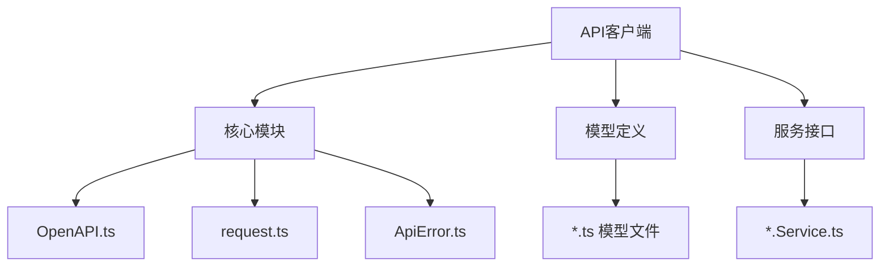
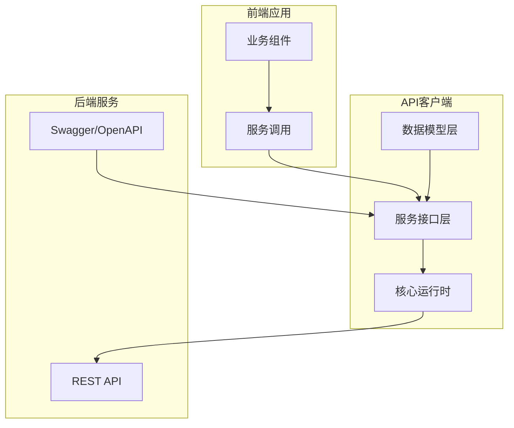
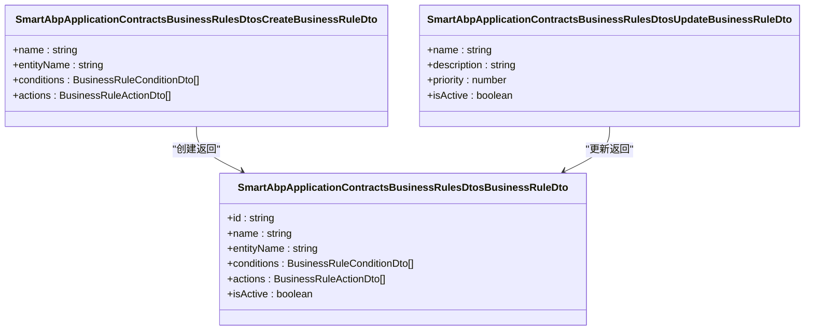
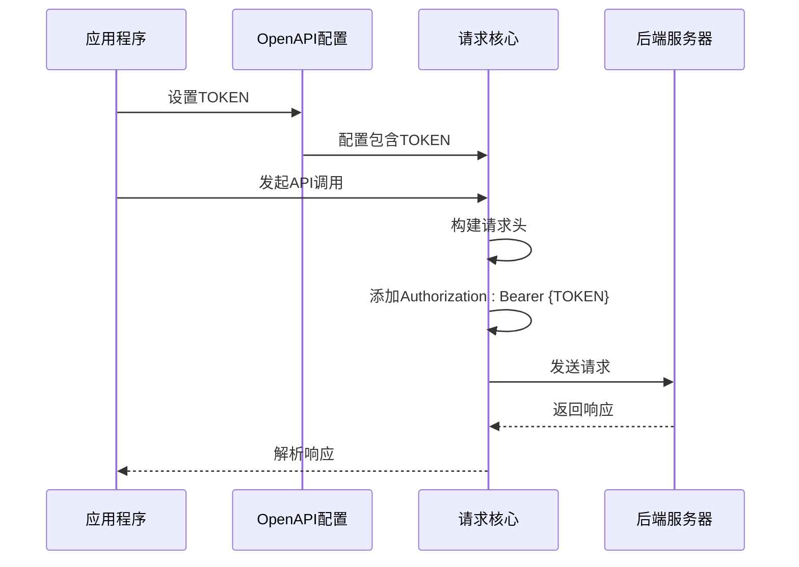
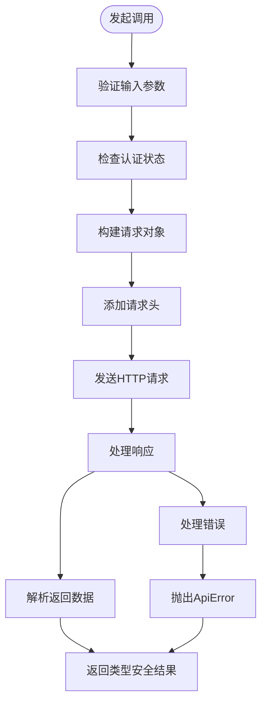
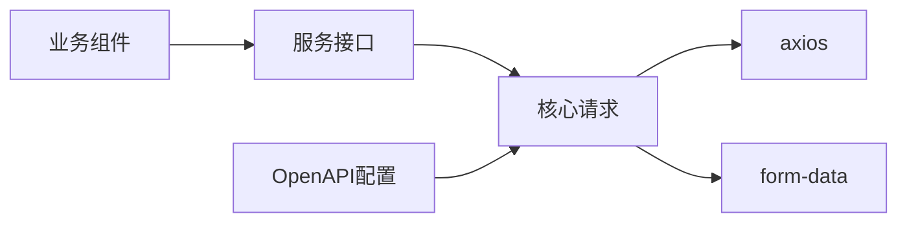

# API客户端

<cite>
**本文档中引用的文件**  
- [api-client.ts](file://src/SmartAbp.Vue/src/api/generated/api-client.ts)
- [OpenAPI.ts](file://src/SmartAbp.Vue/src/api/generated/core/OpenAPI.ts)
- [request.ts](file://src/SmartAbp.Vue/src/api/generated/core/request.ts)
- [BusinessRuleService.ts](file://src/SmartAbp.Vue/src/api/generated/services/BusinessRuleService.ts)
- [code-generation-api.ts](file://src/SmartAbp.Vue/src/api/code-generation-api.ts)
</cite>

## 目录
1. [简介](#简介)
2. [项目结构](#项目结构)
3. [核心组件](#核心组件)
4. [架构概述](#架构概述)
5. [详细组件分析](#详细组件分析)
6. [依赖分析](#依赖分析)
7. [性能考虑](#性能考虑)
8. [故障排除指南](#故障排除指南)
9. [结论](#结论)

## 简介
本文档深入分析hxlot项目中基于OpenAPI规范自动生成的API客户端实现。重点解析类型安全的请求封装机制、客户端初始化配置、认证机制以及服务类的模块化设计。通过分析`api-client.ts`及相关核心文件，展示如何高效、安全地与后端服务进行交互，并提供常见CRUD操作的调用示例。

## 项目结构
API客户端位于`src/SmartAbp.Vue/src/api/generated`目录下，采用分层结构组织，包含核心运行时、模型定义、服务接口等模块。该结构支持类型安全的前端调用，并通过自动化工具链与后端API保持同步。

**图示来源**  
- [api-client.ts](file://src/SmartAbp.Vue/src/api/generated/api-client.ts)
- [OpenAPI.ts](file://src/SmartAbp.Vue/src/api/generated/core/OpenAPI.ts)

**本节来源**  
- [api-client.ts](file://src/SmartAbp.Vue/src/api/generated/api-client.ts)
- [src/SmartAbp.Vue/src/api/generated](file://src/SmartAbp.Vue/src/api/generated)

## 核心组件
API客户端的核心组件包括类型安全的请求封装、响应/错误类型定义、服务类组织结构以及配置管理机制。这些组件共同确保前端能够以类型安全的方式调用后端API，减少运行时错误并提升开发效率。

**本节来源**  
- [api-client.ts](file://src/SmartAbp.Vue/src/api/generated/api-client.ts)
- [request.ts](file://src/SmartAbp.Vue/src/api/generated/core/request.ts)

## 架构概述
API客户端采用基于OpenAPI规范的代码生成架构，通过`swagger-typescript-api`工具自动生成类型定义和服务接口。整体架构分为三层：核心运行时、数据模型和服务接口层，确保类型安全和可维护性。

**图示来源**  
- [api-client.ts](file://src/SmartAbp.Vue/src/api/generated/api-client.ts)
- [request.ts](file://src/SmartAbp.Vue/src/api/generated/core/request.ts)

## 详细组件分析
本节深入分析API客户端的关键组件，包括类型安全机制、请求流程、认证注入和服务类组织方式。

### 类型安全的请求封装机制
API客户端通过TypeScript接口定义请求参数、响应类型和错误类型，确保编译时类型检查。所有服务方法返回`CancelablePromise<T>`，其中`T`为具体的响应数据类型。

#### 请求与响应类型定义

**图示来源**  
- [api-client.ts](file://src/SmartAbp.Vue/src/api/generated/api-client.ts#L50-L200)

### 客户端初始化与认证
API客户端通过`OpenAPI`对象进行全局配置，支持基础URL、版本号、认证令牌等设置。认证令牌可通过静态值或动态解析函数注入。

**图示来源**  
- [OpenAPI.ts](file://src/SmartAbp.Vue/src/api/generated/core/OpenAPI.ts)
- [request.ts](file://src/SmartAbp.Vue/src/api/generated/core/request.ts)

**本节来源**  
- [OpenAPI.ts](file://src/SmartAbp.Vue/src/api/generated/core/OpenAPI.ts#L1-L33)
- [request.ts](file://src/SmartAbp.Vue/src/api/generated/core/request.ts#L1-L324)

### 服务类组织结构
服务类按业务领域划分，每个服务类封装特定模块的API端点。例如`BusinessRuleService`提供业务规则相关的CRUD操作，支持分页、过滤和排序。

#### 服务类调用流程

**图示来源**  
- [BusinessRuleService.ts](file://src/SmartAbp.Vue/src/api/generated/services/BusinessRuleService.ts)
- [request.ts](file://src/SmartAbp.Vue/src/api/generated/core/request.ts)

**本节来源**  
- [BusinessRuleService.ts](file://src/SmartAbp.Vue/src/api/generated/services/BusinessRuleService.ts#L1-L323)
- [code-generation-api.ts](file://src/SmartAbp.Vue/src/api/code-generation-api.ts#L1-L50)

## 依赖分析
API客户端主要依赖axios进行HTTP通信，同时使用form-data处理文件上传。核心模块之间通过清晰的接口进行交互，降低了耦合度。

**图示来源**  
- [request.ts](file://src/SmartAbp.Vue/src/api/generated/core/request.ts)
- [package.json](file://package.json)

**本节来源**  
- [request.ts](file://src/SmartAbp.Vue/src/api/generated/core/request.ts#L1-L324)

## 性能考虑
API客户端通过以下方式优化性能：
- 使用CancelablePromise支持请求取消
- 自动处理请求序列化和反序列化
- 支持请求头缓存和复用
- 最小化运行时类型检查开销

## 故障排除指南
常见问题及解决方案：
- **401错误**：检查`OpenAPI.TOKEN`是否正确设置
- **类型不匹配**：确保后端API变更后重新生成客户端
- **请求超时**：检查网络连接或调整axios默认超时设置
- **CORS错误**：确认后端已正确配置跨域策略

**本节来源**  
- [request.ts](file://src/SmartAbp.Vue/src/api/generated/core/request.ts#L1-L324)
- [ApiError.ts](file://src/SmartAbp.Vue/src/api/generated/core/ApiError.ts)

## 结论
hxlot项目的API客户端通过OpenAPI规范实现了高度类型安全的前后端交互。其模块化设计、自动化代码生成和清晰的错误处理机制，显著提升了开发效率和系统可靠性。建议在项目中统一使用该客户端进行API调用，避免直接使用底层HTTP库。