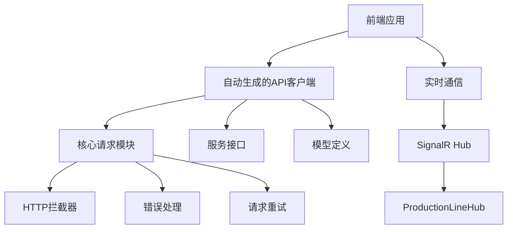
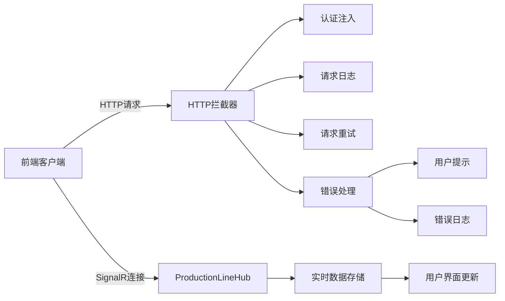
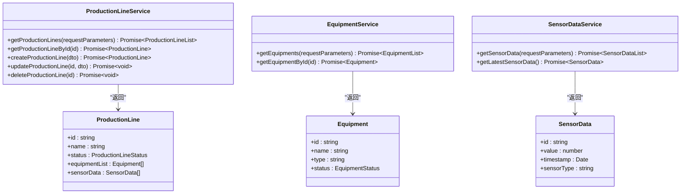
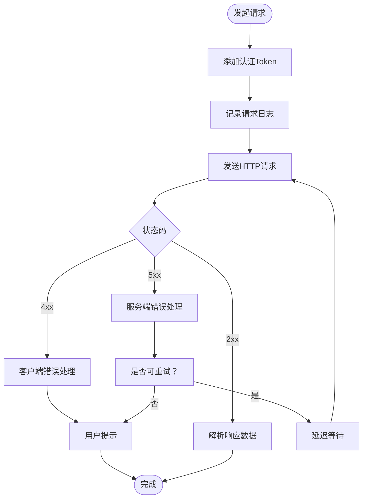
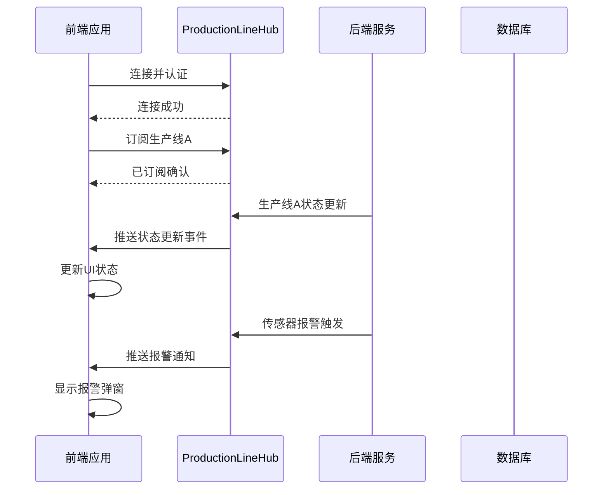
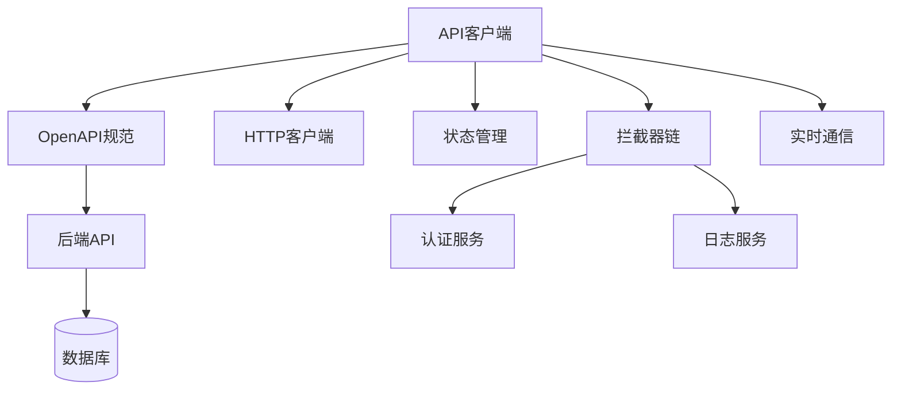

# API集成

<cite>
**本文档中引用的文件**  
- [api-client.ts](file://src/SmartAbp.Vue/src/api/generated/api-client.ts)
- [request.ts](file://src/SmartAbp.Vue/src/api/generated/core/request.ts)
- [OpenAPI.ts](file://src/SmartAbp.Vue/src/api/generated/core/OpenAPI.ts)
- [apiInterceptor.ts](file://output/mes-uniapp/utils/apiInterceptor.ts)
- [errorHandler.ts](file://output/mes-uniapp/utils/errorHandler.ts)
- [request.ts](file://output/mes-uniapp/utils/request.ts)
- [ProductionLineRealtimeStore.ts](file://src/SmartAbp.Vue/src/stores/productionLineRealtimeStore.ts)
- [useWebSocket.ts](file://src/SmartAbp.Vue/src/composables/useWebSocket.ts)
</cite>

## 目录
1. [简介](#简介)
2. [项目结构](#项目结构)
3. [核心组件](#核心组件)
4. [架构概述](#架构概述)
5. [详细组件分析](#详细组件分析)
6. [依赖分析](#依赖分析)
7. [性能考虑](#性能考虑)
8. [故障排除指南](#故障排除指南)
9. [结论](#结论)

## 简介
hxlot项目通过自动生成的API客户端实现了前后端之间的高效、类型安全的通信。本文件详细描述了基于OpenAPI规范的API集成机制，包括HTTP拦截器、错误处理、请求重试策略以及与SignalR实时通信的集成。重点分析了`api-client.ts`和`services`目录下的实现逻辑，并阐述了API客户端的配置选项和扩展点。

## 项目结构
hxlot项目的API集成主要集中在前端Vue应用中，特别是`src/SmartAbp.Vue/src/api/generated`目录下自动生成的客户端代码。该结构支持类型安全的API调用，同时通过拦截器和错误处理机制增强了健壮性。

**图示来源**  
- [api-client.ts](file://src/SmartAbp.Vue/src/api/generated/api-client.ts)
- [request.ts](file://src/SmartAbp.Vue/src/api/generated/core/request.ts)
- [useWebSocket.ts](file://src/SmartAbp.Vue/src/composables/useWebSocket.ts)

**本节来源**  
- [api-client.ts](file://src/SmartAbp.Vue/src/api/generated/api-client.ts)
- [config](file://config)

## 核心组件
核心组件包括自动生成的API客户端、HTTP请求核心模块、OpenAPI配置、拦截器和错误处理器。这些组件共同构成了类型安全、可维护的API通信体系。

**本节来源**  
- [api-client.ts](file://src/SmartAbp.Vue/src/api/generated/api-client.ts)
- [request.ts](file://src/SmartAbp.Vue/src/api/generated/core/request.ts)
- [OpenAPI.ts](file://src/SmartAbp.Vue/src/api/generated/core/OpenAPI.ts)

## 架构概述
hxlot的API集成采用分层架构，前端通过自动生成的TypeScript客户端调用后端REST API。所有请求经过统一的拦截器链处理，包含认证、日志、错误捕获等功能。对于实时数据更新，系统使用SignalR与`ProductionLineHub`建立长连接。

**图示来源**  
- [apiInterceptor.ts](file://output/mes-uniapp/utils/apiInterceptor.ts)
- [errorHandler.ts](file://output/mes-uniapp/utils/errorHandler.ts)
- [ProductionLineRealtimeStore.ts](file://src/SmartAbp.Vue/src/stores/productionLineRealtimeStore.ts)

## 详细组件分析

### API客户端生成机制
系统使用NSwag等工具根据后端OpenAPI规范自动生成TypeScript客户端代码。此过程确保前后端接口契约一致，提供完整的类型推断和编译时检查。

#### 服务接口与模型

**图示来源**  
- [api-client.ts](file://src/SmartAbp.Vue/src/api/generated/api-client.ts)
- [models](file://src/SmartAbp.Vue/src/api/generated/models)

**本节来源**  
- [api-client.ts](file://src/SmartAbp.Vue/src/api/generated/api-client.ts)
- [models](file://src/SmartAbp.Vue/src/api/generated/models)

### HTTP拦截器与错误处理
系统实现了完整的HTTP拦截机制，包含请求前处理、响应拦截和错误统一处理。

#### 请求处理流程

**图示来源**  
- [apiInterceptor.ts](file://output/mes-uniapp/utils/apiInterceptor.ts)
- [errorHandler.ts](file://output/mes-uniapp/utils/errorHandler.ts)
- [request.ts](file://output/mes-uniapp/utils/request.ts)

**本节来源**  
- [apiInterceptor.ts](file://output/mes-uniapp/utils/apiInterceptor.ts)
- [errorHandler.ts](file://output/mes-uniapp/utils/errorHandler.ts)

### 实时通信集成
系统通过SignalR与后端`ProductionLineHub`建立实时连接，实现生产线下发状态更新、报警通知等实时功能。

#### SignalR通信序列

**图示来源**  
- [useWebSocket.ts](file://src/SmartAbp.Vue/src/composables/useWebSocket.ts)
- [ProductionLineRealtimeStore.ts](file://src/SmartAbp.Vue/src/stores/productionLineRealtimeStore.ts)

**本节来源**  
- [useWebSocket.ts](file://src/SmartAbp.Vue/src/composables/useWebSocket.ts)
- [ProductionLineRealtimeStore.ts](file://src/SmartAbp.Vue/src/stores/productionLineRealtimeStore.ts)

## 依赖分析
API客户端依赖于OpenAPI规范生成，与后端`SmartAbp.HttpApi`模块紧密耦合。运行时依赖Axios进行HTTP通信，并通过Pinia进行状态管理。

**图示来源**  
- [go.mod](file://src/SmartAbp.Vue/package.json)
- [api-client.ts](file://src/SmartAbp.Vue/src/api/generated/api-client.ts)

**本节来源**  
- [package.json](file://src/SmartAbp.Vue/package.json)
- [api-client.ts](file://src/SmartAbp.Vue/src/api/generated/api-client.ts)

## 性能考虑
- 自动生成的客户端减少了手动编写接口的成本，提高开发效率
- 拦截器链采用轻量级设计，避免过度处理影响性能
- 请求重试机制采用指数退避算法，避免服务雪崩
- 实时通信采用消息压缩和批量推送优化网络开销

## 故障排除指南
常见问题包括：
- 认证失败：检查Token是否过期，拦截器是否正确注入
- 类型不匹配：确认前后端API版本一致，重新生成客户端
- 实时连接中断：检查SignalR配置和网络稳定性
- 请求超时：调整超时配置或检查后端性能

**本节来源**  
- [errorHandler.ts](file://output/mes-uniapp/utils/errorHandler.ts)
- [apiInterceptor.ts](file://output/mes-uniapp/utils/apiInterceptor.ts)

## 结论
hxlot项目通过自动生成的API客户端实现了高效、类型安全的前后端通信。结合HTTP拦截器、错误处理和SignalR实时通信，构建了健壮的API集成体系。该设计提高了开发效率，降低了维护成本，为系统的稳定运行提供了保障。