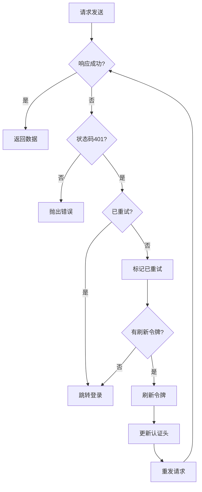
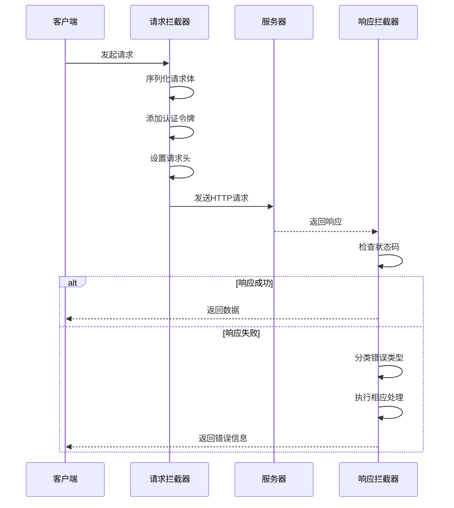

# HTTP拦截器

<cite>
**Referenced Files in This Document**   
- [http.ts](file://src/SmartAbp.Vue/src/utils/http.ts)
- [request.ts](file://output/mes-uniapp/utils/request.ts)
- [http-interceptor-example.ts](file://src/SmartAbp.Vue/src/examples/http-interceptor-example.ts)
</cite>

## Table of Contents
1. [HTTP拦截器](#http拦截器)
2. [请求拦截器实现机制](#请求拦截器实现机制)
3. [响应拦截器错误处理](#响应拦截器错误处理)
4. [请求重试机制](#请求重试机制)
5. [拦截器链执行流程](#拦截器链执行流程)
6. [自定义拦截器扩展](#自定义拦截器扩展)

## 请求拦截器实现机制

hxlot项目中的请求拦截器主要负责在请求发送前进行预处理，包括添加认证令牌、设置请求头和序列化请求体等关键功能。系统通过`http.ts`文件中的轻量级HTTP客户端封装实现这一机制。

请求拦截器的核心功能体现在对认证令牌的自动注入。当系统检测到用户已登录并持有有效令牌时，拦截器会自动将Bearer令牌添加到请求头中。同时，拦截器会确保所有请求都设置正确的`Content-Type`为`application/json`，并使用`JSON.stringify()`方法对请求体进行序列化处理。

在参数处理方面，拦截器通过`buildUrl`函数智能地构建查询参数。该函数能够遍历参数对象，过滤掉`undefined`和`null`值，并使用`URLSearchParams`生成标准的查询字符串。这种设计既保证了URL的规范性，又避免了无效参数的传递。

**Section sources**
- [http.ts](file://src/SmartAbp.Vue/src/utils/http.ts#L1-L82)

## 响应拦截器错误处理

响应拦截器在hxlot项目中承担着关键的错误处理职责，能够对不同类型的异常进行分类处理。系统实现了针对网络错误、认证失败和业务异常的多层次错误处理机制。

当遇到HTTP 401未授权状态时，响应拦截器会触发认证失败处理流程。系统首先尝试使用`refreshTokenMethod`刷新令牌，如果刷新成功则重新发送原请求；如果刷新失败或没有可用的刷新令牌，则清除本地存储的认证信息并跳转到登录页面。这种设计确保了用户会话的安全性，同时提供了流畅的重新认证体验。

对于网络连接错误，拦截器会捕获底层的网络异常，并向用户显示友好的错误提示。系统还实现了对业务异常的处理，能够解析服务器返回的错误消息并进行适当的展示。这种分层的错误处理策略使得应用程序能够优雅地应对各种异常情况，提升了用户体验和系统的健壮性。

**Section sources**
- [request.ts](file://output/mes-uniapp/utils/request.ts#L1-L108)
- [http-interceptor-example.ts](file://src/SmartAbp.Vue/src/examples/http-interceptor-example.ts#L43-L96)

## 请求重试机制

hxlot项目实现了智能的请求重试机制，特别针对临时性故障提供了有效的解决方案。该机制主要在认证失败场景下发挥作用，通过有限次数的重试来应对短暂的网络波动或令牌过期问题。

重试机制的核心是`_retry`标记的使用。当拦截器检测到401状态码且请求尚未重试时，会设置`_retry`标记为true，防止无限循环重试。系统会尝试使用刷新令牌获取新的访问令牌，然后使用更新后的认证信息重新发送原始请求。

这种设计巧妙地平衡了用户体验和系统效率。一方面，它避免了用户在短暂网络问题后需要手动重新操作；另一方面，通过限制重试次数和检查刷新令牌的可用性，防止了资源浪费和安全风险。重试机制与认证流程紧密结合，形成了一个完整的错误恢复闭环。

**Diagram sources**
- [http-interceptor-example.ts](file://src/SmartAbp.Vue/src/examples/http-interceptor-example.ts#L67-L92)

**Section sources**
- [http-interceptor-example.ts](file://src/SmartAbp.Vue/src/examples/http-interceptor-example.ts#L67-L92)

## 拦截器链执行流程

hxlot项目的拦截器链采用分层设计，确保了请求和响应处理的有序性和可扩展性。整个执行流程从请求发起开始，依次经过请求拦截器、网络传输、响应拦截器，最终返回处理结果。

在请求阶段，拦截器链首先执行参数序列化和URL构建，然后注入认证信息和必要的请求头。这些预处理步骤确保了每个请求都符合API的规范要求。一旦请求发送，系统会等待服务器响应。

响应阶段的处理更为复杂，拦截器链需要对返回的数据进行验证和错误分类。成功的响应会被解析并返回给调用方，而错误响应则会触发相应的错误处理流程。整个拦截器链的设计遵循单一职责原则，每个拦截器只负责特定的功能，这使得系统易于维护和扩展。

**Diagram sources**
- [http.ts](file://src/SmartAbp.Vue/src/utils/http.ts#L1-L82)
- [request.ts](file://output/mes-uniapp/utils/request.ts#L1-L108)

**Section sources**
- [http.ts](file://src/SmartAbp.Vue/src/utils/http.ts#L1-L82)
- [request.ts](file://output/mes-uniapp/utils/request.ts#L1-L108)

## 自定义拦截器扩展

hxlot项目提供了灵活的自定义拦截器扩展机制，允许开发者根据具体需求添加新的拦截功能。系统通过`setupHttpInterceptors`函数提供了标准化的拦截器配置接口。

开发者可以创建新的拦截器函数，并将其注册到HTTP客户端的拦截器链中。每个自定义拦截器都应该遵循统一的函数签名规范，接收请求或响应配置作为参数，并返回处理后的配置。这种设计模式使得拦截器的添加和管理变得简单而直观。

为了确保系统的稳定性，建议在添加自定义拦截器时遵循最佳实践：保持拦截器的轻量化，避免复杂的同步操作；正确处理异常，防止拦截器自身的错误影响整个请求流程；合理使用异步操作，确保不会阻塞主线程。通过这些原则，可以构建出高效且可靠的自定义拦截器。

**Section sources**
- [http-interceptor-example.ts](file://src/SmartAbp.Vue/src/examples/http-interceptor-example.ts#L4-L41)