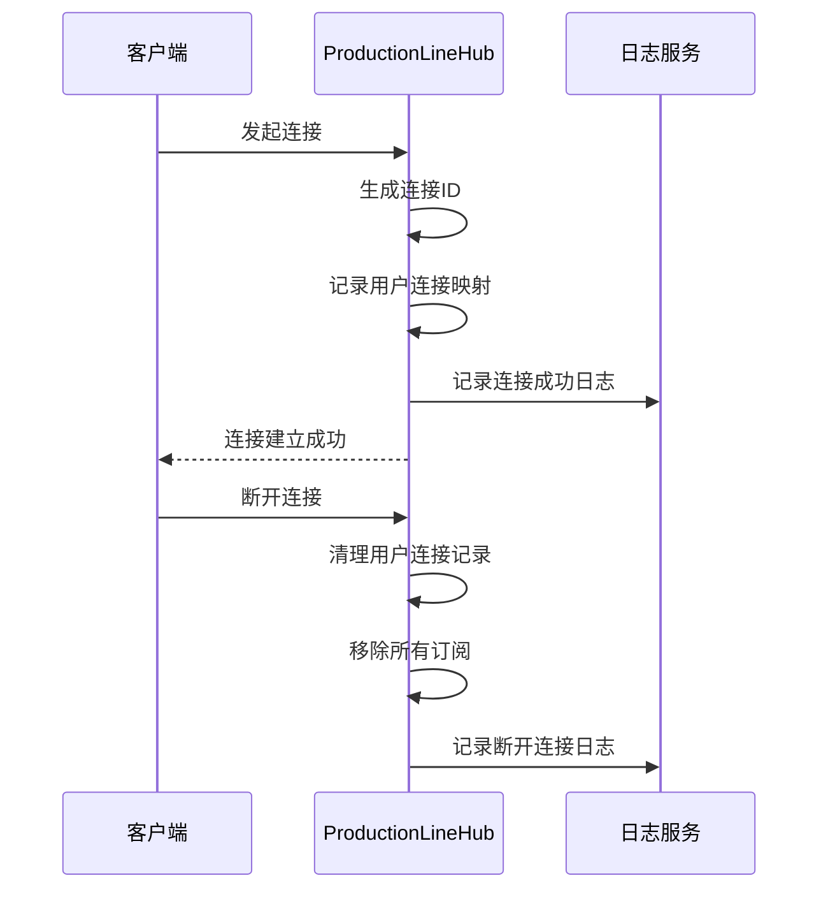
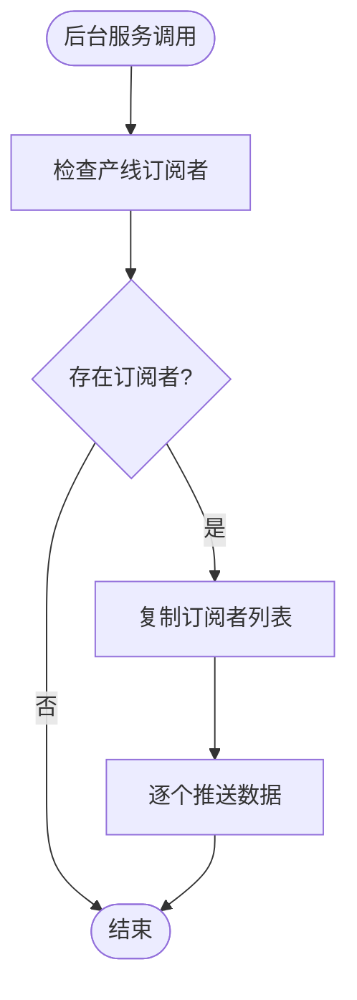
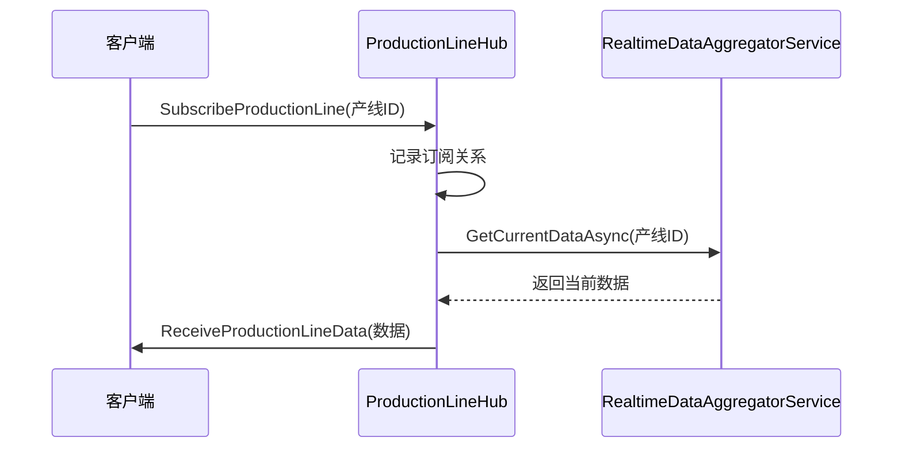
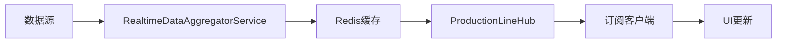
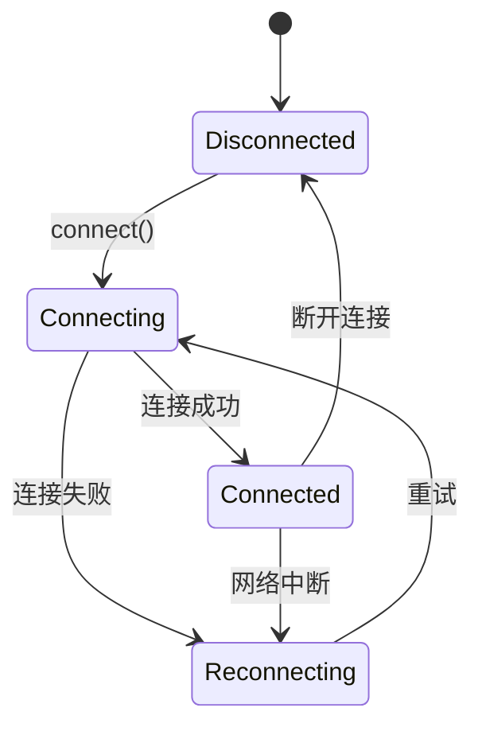

# 实时通信

<cite>
**本文档引用的文件**   
- [ProductionLineHub.cs](file://src/SmartAbp.Web/Hubs/ProductionLineHub.cs)
- [useWebSocket.ts](file://src/SmartAbp.Vue/src/composables/useWebSocket.ts)
- [IProductionLineClient.cs](file://src/SmartAbp.Web/Hubs/IProductionLineClient.cs)
- [RealtimeDataAggregatorService.cs](file://src/SmartAbp.Application/RealtimeData/RealtimeDataAggregatorService.cs)
- [ProductionLineRealtimeData.cs](file://src/SmartAbp.Application.Contracts/Realtime/ProductionLineRealtimeData.cs)
</cite>

## 目录
1. [引言](#引言)
2. [SignalR集线器配置与连接管理](#signalr集线器配置与连接管理)
3. [服务器端事件推送机制](#服务器端事件推送机制)
4. [客户端事件处理与订阅流程](#客户端事件处理与订阅流程)
5. [实时数据更新处理流程](#实时数据更新处理流程)
6. [连接状态管理与重连机制](#连接状态管理与重连机制)
7. [错误处理与诊断功能](#错误处理与诊断功能)
8. [实际使用场景示例](#实际使用场景示例)
9. [总结](#总结)

## 引言

hxlot项目通过SignalR技术实现了高效的实时通信机制，主要用于数字大屏的实时数据推送。系统采用`ProductionLineHub`作为核心SignalR集线器，结合`useWebSocket`客户端组合式函数，构建了完整的实时通信架构。该架构支持多产线订阅、线程安全的连接管理、实时数据推送和告警通知等功能，确保了生产线下实时数据的高效、可靠传输。

**Section sources**
- [ProductionLineHub.cs](file://src/SmartAbp.Web/Hubs/ProductionLineHub.cs#L1-L30)
- [useWebSocket.ts](file://src/SmartAbp.Vue/src/composables/useWebSocket.ts#L1-L20)

## SignalR集线器配置与连接管理

`ProductionLineHub`是基于SignalR的服务器端集线器，继承自`Hub<IProductionLineClient>`，通过强类型接口确保客户端方法调用的安全性。集线器在构造函数中注入了日志服务和实时数据聚合服务，用于记录连接状态和获取实时数据。

集线器通过`OnConnectedAsync`和`OnDisconnectedAsync`方法管理连接生命周期。当客户端连接时，系统会记录用户ID与连接ID的映射关系；断开连接时，自动清理相关订阅信息。连接管理采用`ConcurrentDictionary`和锁机制保证线程安全，避免并发操作导致的数据不一致。

**Diagram sources**
- [ProductionLineHub.cs](file://src/SmartAbp.Web/Hubs/ProductionLineHub.cs#L78-L119)

**Section sources**
- [ProductionLineHub.cs](file://src/SmartAbp.Web/Hubs/ProductionLineHub.cs#L25-L119)

## 服务器端事件推送机制

服务器端通过静态方法`PushDataToSubscribers`和`PushAlertToSubscribers`向订阅者推送数据和告警。这些方法由后台服务调用，接收`IHubContext`、产线ID和数据作为参数。系统首先检查产线订阅映射，获取该产线的所有订阅者连接ID，然后逐个推送数据。

推送过程采用线程安全的复制机制，避免在推送过程中订阅列表被修改。数据通过`ReceiveProductionLineData`和`ReceiveAlert`方法发送到客户端，确保消息的可靠传递。集线器还提供了诊断方法，如`GetOnlineUserCount`和`GetSubscriptionStats`，用于监控连接状态和订阅统计。

**Diagram sources**
- [ProductionLineHub.cs](file://src/SmartAbp.Web/Hubs/ProductionLineHub.cs#L252-L321)

**Section sources**
- [ProductionLineHub.cs](file://src/SmartAbp.Web/Hubs/ProductionLineHub.cs#L252-L361)

## 客户端事件处理与订阅流程

客户端通过`useWebSocket`组合式函数实现SignalR连接管理。该函数提供`connect`、`disconnect`、`on`、`off`和`invoke`等核心方法，封装了复杂的WebSocket通信逻辑。客户端在连接成功后，可调用`SubscribeProductionLine`方法订阅特定产线的实时数据。

订阅流程包括：客户端发送订阅请求，服务器端记录订阅关系，并立即通过`_aggregatorService.GetCurrentDataAsync`获取当前数据推送给客户端。客户端通过`on`方法注册事件处理程序，监听`ReceiveProductionLineData`和`ReceiveAlert`等事件，实现数据的实时更新和告警显示。

**Diagram sources**
- [ProductionLineHub.cs](file://src/SmartAbp.Web/Hubs/ProductionLineHub.cs#L154-L171)
- [useWebSocket.ts](file://src/SmartAbp.Vue/src/composables/useWebSocket.ts#L100-L120)

**Section sources**
- [ProductionLineHub.cs](file://src/SmartAbp.Web/Hubs/ProductionLineHub.cs#L154-L210)
- [useWebSocket.ts](file://src/SmartAbp.Vue/src/composables/useWebSocket.ts#L50-L80)

## 实时数据更新处理流程

实时数据更新流程始于后台服务调用`PushDataToSubscribers`方法。系统通过`RealtimeDataAggregatorService`从数据库聚合产线、设备和传感器等实时数据，并使用Redis缓存提高性能。数据聚合包括KPI指标计算、设备状态统计和趋势分析。

当新数据产生时，后台服务将数据推送到`ProductionLineHub`，集线器根据订阅关系将数据发送给所有订阅该产线的客户端。客户端接收到数据后，更新UI界面，实现数字大屏的实时刷新。整个流程确保了数据的实时性和一致性。

**Diagram sources**
- [RealtimeDataAggregatorService.cs](file://src/SmartAbp.Application/RealtimeData/RealtimeDataAggregatorService.cs#L63-L98)
- [ProductionLineHub.cs](file://src/SmartAbp.Web/Hubs/ProductionLineHub.cs#L252-L281)

**Section sources**
- [RealtimeDataAggregatorService.cs](file://src/SmartAbp.Application/RealtimeData/RealtimeDataAggregatorService.cs#L63-L143)
- [ProductionLineRealtimeData.cs](file://src/SmartAbp.Application.Contracts/Realtime/ProductionLineRealtimeData.cs#L1-L50)

## 连接状态管理与重连机制

`useWebSocket`组件实现了完善的连接状态管理和自动重连机制。连接状态通过`isConnected`响应式变量维护，组件提供`onConnected`、`onDisconnected`、`onReconnecting`和`onReconnected`回调函数，便于上层应用处理连接状态变化。

重连机制采用指数退避策略，重试间隔从1秒开始，每次加倍，最大不超过30秒。当连接断开时，系统自动尝试重新连接，并通过Element Plus的`ElMessage`组件向用户显示连接状态。组件卸载时自动断开连接，避免资源泄漏。

**Diagram sources**
- [useWebSocket.ts](file://src/SmartAbp.Vue/src/composables/useWebSocket.ts#L30-L60)

**Section sources**
- [useWebSocket.ts](file://src/SmartAbp.Vue/src/composables/useWebSocket.ts#L16-L171)

## 错误处理与诊断功能

系统实现了全面的错误处理机制。服务器端在数据推送失败时记录详细日志，客户端在连接失败或方法调用异常时显示错误消息。`IProductionLineClient`接口定义了`ReceiveError`方法，允许服务器向客户端推送错误信息。

集线器提供了`GetOnlineUserCount`、`GetActiveConnectionCount`和`GetSubscriptionStats`等诊断方法，可用于监控系统运行状态。这些方法通过静态变量访问连接和订阅信息，为系统维护和故障排查提供数据支持。

**Section sources**
- [ProductionLineHub.cs](file://src/SmartAbp.Web/Hubs/ProductionLineHub.cs#L323-L361)
- [IProductionLineClient.cs](file://src/SmartAbp.Web/Hubs/IProductionLineClient.cs#L35-L43)

## 实际使用场景示例

在生产线下实时监控大屏中，客户端首先连接到`ProductionLineHub`，然后订阅特定产线的数据。每当产线数据更新时，服务器自动推送最新数据到所有订阅客户端。客户端接收到数据后，更新KPI指标、设备状态和趋势图表。

例如，在`ProductionLineDashboard.vue`中，通过`useWebSocket`连接到`http://localhost:5000/hubs/production-line`，订阅`production-line-001`产线。连接成功和重连后自动重新订阅，确保数据的连续性。该模式适用于数字大屏、实时监控和告警通知等场景。

**Section sources**
- [useWebSocket.ts](file://src/SmartAbp.Vue/src/composables/useWebSocket.ts#L16-L171)
- [ProductionLineHub.cs](file://src/SmartAbp.Web/Hubs/ProductionLineHub.cs#L154-L171)

## 总结

hxlot项目的实时通信系统通过SignalR技术实现了高效、可靠的双向通信。`ProductionLineHub`集线器提供了完善的连接管理、订阅机制和数据推送功能，`useWebSocket`组件封装了客户端的复杂通信逻辑。系统采用缓存优化、线程安全设计和自动重连机制，确保了实时数据的稳定传输。该架构可扩展性强，适用于各种实时数据推送场景。