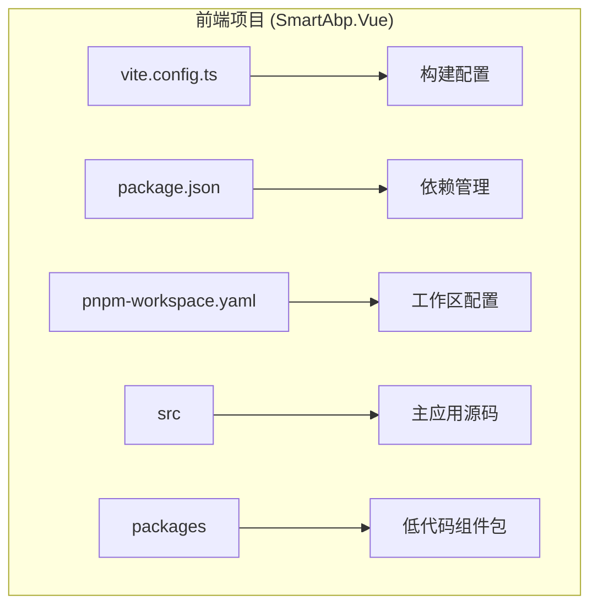
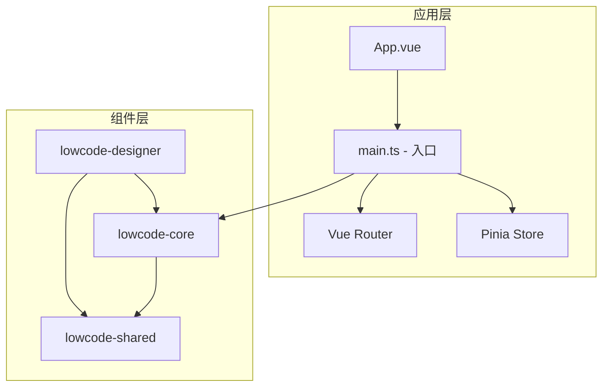
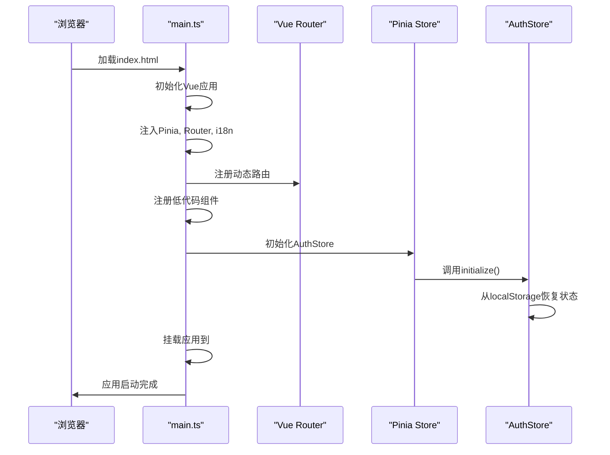
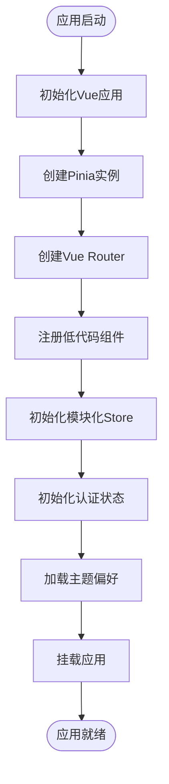
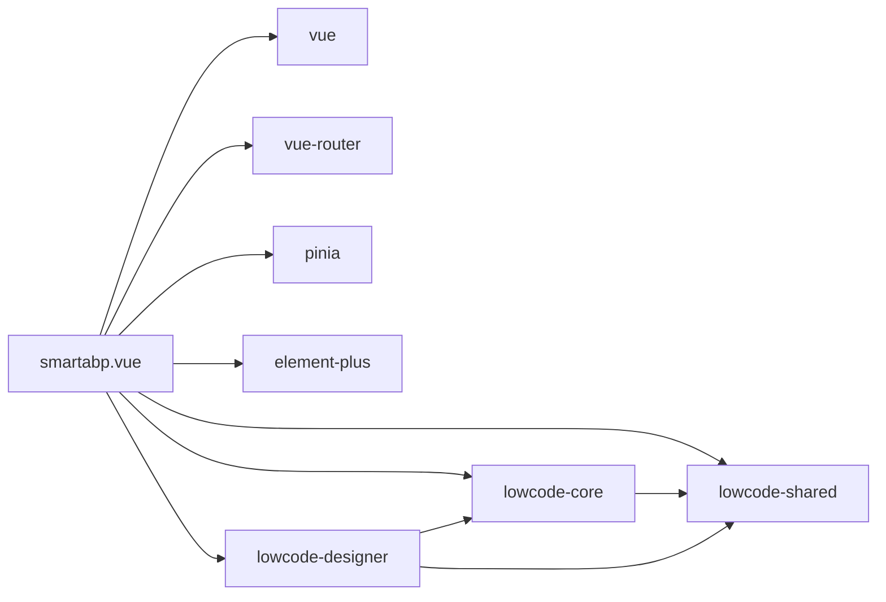

# 前端架构

<cite>
**本文档中引用的文件**  
- [vite.config.ts](file://src/SmartAbp.Vue/vite.config.ts)
- [vite.config.optimization.ts](file://src/SmartAbp.Vue/vite.config.optimization.ts)
- [package.json](file://src/SmartAbp.Vue/package.json)
- [pnpm-workspace.yaml](file://src/SmartAbp.Vue/pnpm-workspace.yaml)
- [main.ts](file://src/SmartAbp.Vue/src/main.ts)
- [index.ts](file://src/SmartAbp.Vue/src/router/index.ts)
- [index.ts](file://src/SmartAbp.Vue/src/stores/index.ts)
</cite>

## 目录
1. [简介](#简介)
2. [项目结构](#项目结构)
3. [核心组件](#核心组件)
4. [架构概述](#架构概述)
5. [详细组件分析](#详细组件分析)
6. [依赖分析](#依赖分析)
7. [性能考虑](#性能考虑)
8. [故障排除指南](#故障排除指南)
9. [结论](#结论)
10. [附录](#附录)（如有必要）

## 简介
本文档详细描述了hxlot项目基于Vue 3和TypeScript的单页应用（SPA）前端架构。文档涵盖了Vite构建工具的配置与优化策略、模块化路由系统的设计与动态加载机制、Pinia状态管理的模块化设计与持久化方案、组件化开发模式（特别是`packages`目录下的低代码组件包），以及API集成、国际化（i18n）和主题系统（theme）的实现机制。同时提供前端应用的启动流程图和组件依赖关系图。

## 项目结构
hxlot项目的前端部分位于`src/SmartAbp.Vue`目录下，采用基于Vue 3和TypeScript的单页应用架构。项目使用Vite作为构建工具，并通过pnpm工作区管理多个内部包（packages）。核心源码位于`src`目录，包含`api`、`router`、`stores`、`components`等标准模块。`packages`目录存放了可复用的低代码组件库，如`lowcode-core`、`lowcode-designer`等，实现了功能的模块化和解耦。

**Diagram sources**
- [vite.config.ts](file://src/SmartAbp.Vue/vite.config.ts)
- [package.json](file://src/SmartAbp.Vue/package.json)
- [pnpm-workspace.yaml](file://src/SmartAbp.Vue/pnpm-workspace.yaml)

**Section sources**
- [vite.config.ts](file://src/SmartAbp.Vue/vite.config.ts)
- [package.json](file://src/SmartAbp.Vue/package.json)

## 核心组件
项目的核心组件包括基于Vue 3的组件系统、使用Pinia的状态管理、基于Vue Router的路由系统，以及由`packages`目录提供的低代码能力。`main.ts`是应用的入口点，负责初始化Vue应用、Pinia、路由和i18n。`router/index.ts`定义了模块化的路由结构，支持动态加载。`stores/index.ts`统一导出所有模块化的Pinia store，实现了状态的模块化管理。

**Section sources**
- [main.ts](file://src/SmartAbp.Vue/src/main.ts)
- [index.ts](file://src/SmartAbp.Vue/src/router/index.ts)
- [index.ts](file://src/SmartAbp.Vue/src/stores/index.ts)

## 架构概述
hxlot前端采用分层架构，上层为主应用，下层为`packages`中的可复用组件库。构建工具Vite通过插件系统（如`unplugin-auto-import`、`unplugin-vue-components`）实现了自动导入和组件按需加载。应用启动时，通过`main.ts`进行全局配置和初始化，包括错误处理、日志系统注入、组件注册和状态初始化。路由系统采用嵌套路由设计，支持权限控制和动态加载。

**Diagram sources**
- [main.ts](file://src/SmartAbp.Vue/src/main.ts)
- [index.ts](file://src/SmartAbp.Vue/src/router/index.ts)

## 详细组件分析

### 组件A分析
本节分析前端应用的核心组件。

#### 对于API/服务组件：

**Diagram sources**
- [main.ts](file://src/SmartAbp.Vue/src/main.ts)

#### 对于复杂逻辑组件：

**Diagram sources**
- [main.ts](file://src/SmartAbp.Vue/src/main.ts)

**Section sources**
- [main.ts](file://src/SmartAbp.Vue/src/main.ts)

### 概念概述
Vite配置通过`vite.config.ts`和`vite.config.optimization.ts`实现。前者包含开发服务器、代理、插件等核心配置，后者提供分包策略、压缩和性能分析等优化配置。构建时，Vite根据`manualChunks`策略将代码分割为`vue-core`、`element-plus`、`lowcode-*`等独立的chunk，以优化加载性能。

## 依赖分析
项目依赖通过`package.json`和`pnpm-workspace.yaml`管理。主应用直接依赖Vue 3、Vue Router、Pinia、Element Plus等核心库，以及`@smartabp/lowcode-*`系列的本地包。`pnpm-workspace.yaml`将`packages/*`和`.`（主项目）定义为工作区，使得本地包可以作为文件依赖被引用，便于开发和调试。

**Diagram sources**
- [package.json](file://src/SmartAbp.Vue/package.json)
- [pnpm-workspace.yaml](file://src/SmartAbp.Vue/pnpm-workspace.yaml)

**Section sources**
- [package.json](file://src/SmartAbp.Vue/package.json)
- [pnpm-workspace.yaml](file://src/SmartAbp.Vue/pnpm-workspace.yaml)

## 性能考虑
Vite构建配置中包含了多项性能优化策略。在`build`配置中，启用了`cssCodeSplit`进行CSS代码分割，并通过`manualChunks`实现精细化的代码分包，将第三方库和低代码包分别打包，以提高缓存利用率。生产构建时，使用`terser`进行代码压缩，并移除`console`语句。此外，`vite.config.optimization.ts`引入了`rollup-plugin-visualizer`和`vite-plugin-compression`，分别用于生成构建分析报告和生成gzip/brotli压缩文件，进一步优化加载性能。

## 故障排除指南
- **组件未注册**：检查`main.ts`中的`registerCoreComponents`、`registerSharedComponents`、`registerDesignerComponents`调用顺序。
- **路由无法访问**：确认`router/index.ts`中的`requiresAuth`和`requiredRoles`元信息是否正确，以及`authStore`的状态。
- **API调用失败**：检查`vite.config.ts`中的代理配置，确保后端服务在`https://localhost:9002`运行。
- **构建失败**：运行`npm run type-check`检查类型错误，或`npm run lint`修复代码风格问题。

**Section sources**
- [main.ts](file://src/SmartAbp.Vue/src/main.ts)
- [index.ts](file://src/SmartAbp.Vue/src/router/index.ts)
- [vite.config.ts](file://src/SmartAbp.Vue/vite.config.ts)

## 结论
hxlot项目的前端架构设计良好，基于Vue 3和TypeScript构建，利用Vite实现了高效的开发和构建体验。通过模块化的路由、状态管理和组件设计，特别是`packages`中的低代码组件库，实现了高内聚、低耦合的代码结构。该架构支持国际化和主题定制，具备良好的可扩展性和维护性，为后续功能开发奠定了坚实基础。