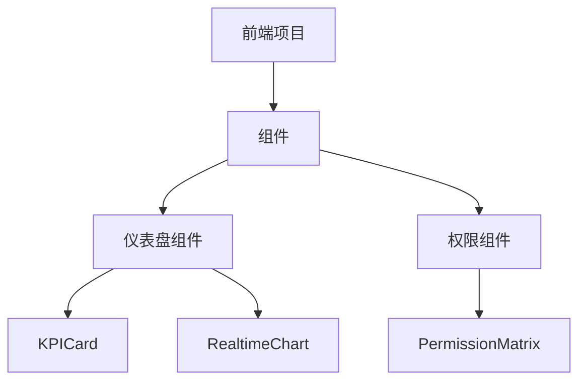
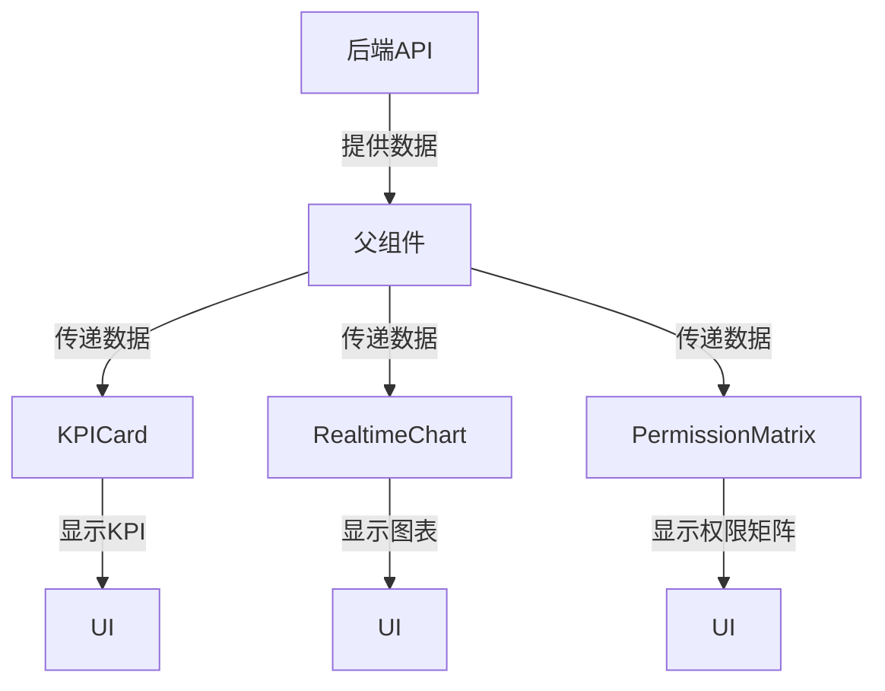
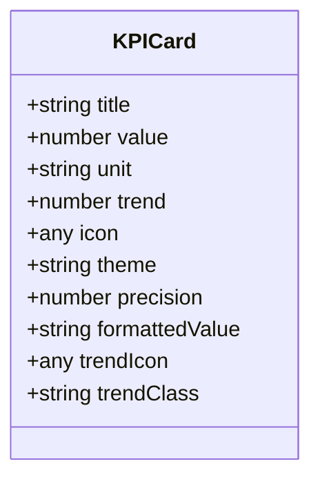
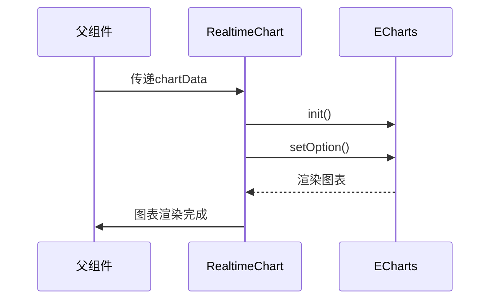
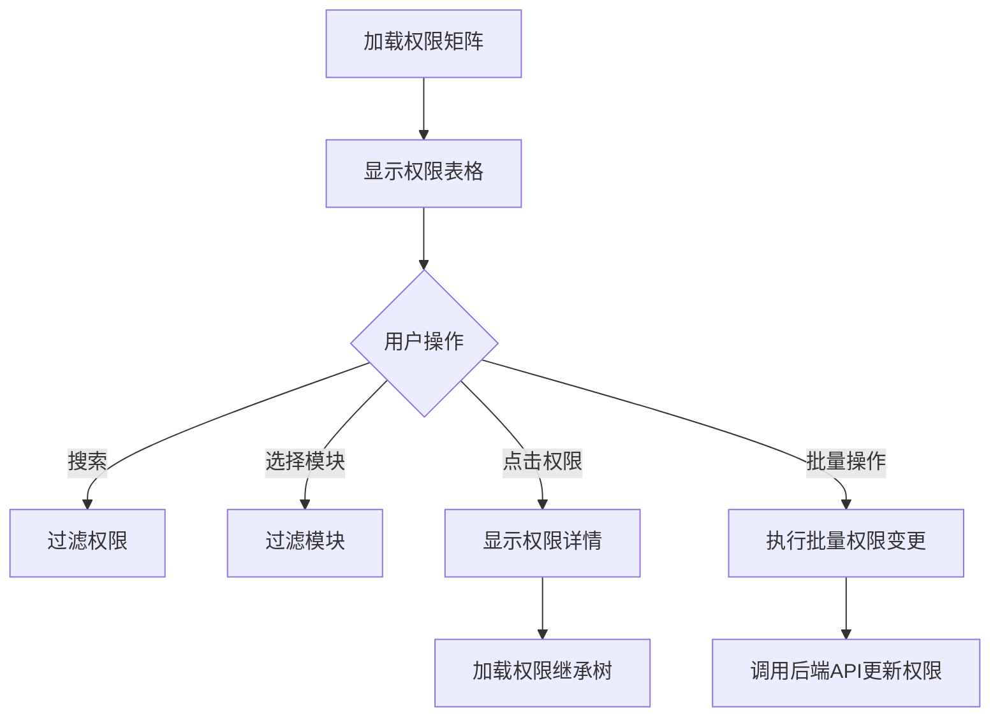
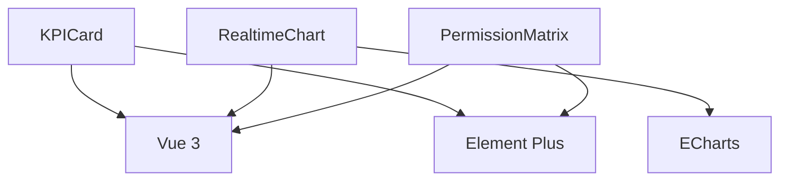

# 业务组件

<cite>
**本文档引用的文件**  
- [KPICard.vue](file://src/SmartAbp.Vue/src/components/dashboard/KPICard.vue)
- [RealtimeChart.vue](file://src/SmartAbp.Vue/src/components/dashboard/RealtimeChart.vue)
- [PermissionMatrix.vue](file://src/SmartAbp.Vue/src/components/permissions/PermissionMatrix.vue)
</cite>

## 目录
1. [引言](#引言)
2. [项目结构](#项目结构)
3. [核心组件](#核心组件)
4. [架构概述](#架构概述)
5. [详细组件分析](#详细组件分析)
6. [依赖分析](#依赖分析)
7. [性能考虑](#性能考虑)
8. [故障排除指南](#故障排除指南)
9. [结论](#结论)

## 引言
本文档深入描述了hxlot项目中的关键业务组件：KPICard、RealtimeChart和PermissionMatrix。这些组件封装了特定的业务逻辑，并与后端API集成，用于展示关键性能指标、实时数据图表和权限管理矩阵。文档详细说明了组件的数据流、状态管理和性能优化策略，并提供了使用示例和配置选项。

## 项目结构
hxlot项目采用模块化前端架构，主要业务组件位于`src/SmartAbp.Vue/src/components`目录下，按功能分类组织。核心业务组件分布在`dashboard`和`permissions`子目录中，遵循Vue 3的Composition API设计模式。

**图示来源**
- [KPICard.vue](file://src/SmartAbp.Vue/src/components/dashboard/KPICard.vue)
- [RealtimeChart.vue](file://src/SmartAbp.Vue/src/components/dashboard/RealtimeChart.vue)
- [PermissionMatrix.vue](file://src/SmartAbp.Vue/src/components/permissions/PermissionMatrix.vue)

**章节来源**
- [KPICard.vue](file://src/SmartAbp.Vue/src/components/dashboard/KPICard.vue)
- [RealtimeChart.vue](file://src/SmartAbp.Vue/src/components/dashboard/RealtimeChart.vue)
- [PermissionMatrix.vue](file://src/SmartAbp.Vue/src/components/permissions/PermissionMatrix.vue)

## 核心组件
KPICard、RealtimeChart和PermissionMatrix是hxlot项目的核心业务组件，分别用于展示关键性能指标、实时数据可视化和权限管理。这些组件通过封装复杂的业务逻辑和UI交互，为用户提供直观的数据展示和管理界面。

**章节来源**
- [KPICard.vue](file://src/SmartAbp.Vue/src/components/dashboard/KPICard.vue)
- [RealtimeChart.vue](file://src/SmartAbp.Vue/src/components/dashboard/RealtimeChart.vue)
- [PermissionMatrix.vue](file://src/SmartAbp.Vue/src/components/permissions/PermissionMatrix.vue)

## 架构概述
业务组件采用Vue 3的Composition API设计，结合Element Plus UI框架，实现了响应式数据绑定和组件化开发。组件通过props接收外部数据，使用computed属性进行数据格式化，并通过watch监听数据变化以触发UI更新。

**图示来源**
- [KPICard.vue](file://src/SmartAbp.Vue/src/components/dashboard/KPICard.vue)
- [RealtimeChart.vue](file://src/SmartAbp.Vue/src/components/dashboard/RealtimeChart.vue)
- [PermissionMatrix.vue](file://src/SmartAbp.Vue/src/components/permissions/PermissionMatrix.vue)

## 详细组件分析
对KPICard、RealtimeChart和PermissionMatrix三个核心业务组件进行深入分析，包括其设计模式、实现细节和使用方法。

### KPICard组件分析
KPICard组件用于展示关键性能指标，支持数值显示、趋势指示和主题定制。组件通过props接收标题、数值、单位、趋势和图标等配置，并使用computed属性动态计算显示值和趋势样式。

#### 对象导向组件

**图示来源**
- [KPICard.vue](file://src/SmartAbp.Vue/src/components/dashboard/KPICard.vue)

### RealtimeChart组件分析
RealtimeChart组件基于ECharts实现，用于展示实时数据图表。组件支持多种图表类型（折线图、柱状图、饼图），并提供丰富的配置选项，如颜色、平滑度和面积图显示。

#### API/服务组件

**图示来源**
- [RealtimeChart.vue](file://src/SmartAbp.Vue/src/components/dashboard/RealtimeChart.vue)

### PermissionMatrix组件分析
PermissionMatrix组件提供企业级权限矩阵管理功能，支持权限搜索、模块过滤、批量操作和继承关系查看。组件基于OptimizedPermissionInheritanceEngine实现，支持复杂的权限继承逻辑。

#### 复杂逻辑组件

**图示来源**
- [PermissionMatrix.vue](file://src/SmartAbp.Vue/src/components/permissions/PermissionMatrix.vue)

**章节来源**
- [PermissionMatrix.vue](file://src/SmartAbp.Vue/src/components/permissions/PermissionMatrix.vue)

## 依赖分析
业务组件依赖于Vue 3、Element Plus和ECharts等第三方库，通过组件注册机制实现模块化管理。组件间通过props和事件进行通信，避免了直接依赖。

**图示来源**
- [KPICard.vue](file://src/SmartAbp.Vue/src/components/dashboard/KPICard.vue)
- [RealtimeChart.vue](file://src/SmartAbp.Vue/src/components/dashboard/RealtimeChart.vue)
- [PermissionMatrix.vue](file://src/SmartAbp.Vue/src/components/permissions/PermissionMatrix.vue)

**章节来源**
- [KPICard.vue](file://src/SmartAbp.Vue/src/components/dashboard/KPICard.vue)
- [RealtimeChart.vue](file://src/SmartAbp.Vue/src/components/dashboard/RealtimeChart.vue)
- [PermissionMatrix.vue](file://src/SmartAbp.Vue/src/components/permissions/PermissionMatrix.vue)

## 性能考虑
业务组件在设计时充分考虑了性能优化，采用懒加载、缓存和虚拟滚动等技术，确保在大数据量下的流畅体验。KPICard和RealtimeChart组件通过computed属性和watch实现高效的响应式更新，PermissionMatrix组件使用分页和虚拟滚动避免一次性渲染大量数据。

## 故障排除指南
当业务组件出现显示异常或性能问题时，可参考以下步骤进行排查：
1. 检查props数据是否正确传递
2. 验证后端API返回数据格式
3. 查看浏览器控制台是否有错误信息
4. 检查组件依赖是否正确安装
5. 确认Vue版本兼容性

**章节来源**
- [KPICard.vue](file://src/SmartAbp.Vue/src/components/dashboard/KPICard.vue)
- [RealtimeChart.vue](file://src/SmartAbp.Vue/src/components/dashboard/RealtimeChart.vue)
- [PermissionMatrix.vue](file://src/SmartAbp.Vue/src/components/permissions/PermissionMatrix.vue)

## 结论
KPICard、RealtimeChart和PermissionMatrix组件通过封装复杂的业务逻辑和UI交互，为hxlot项目提供了强大的数据展示和管理能力。组件设计遵循模块化和可复用原则，支持灵活的配置和扩展，为用户提供直观、高效的使用体验。