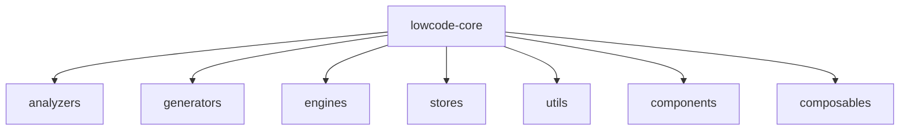
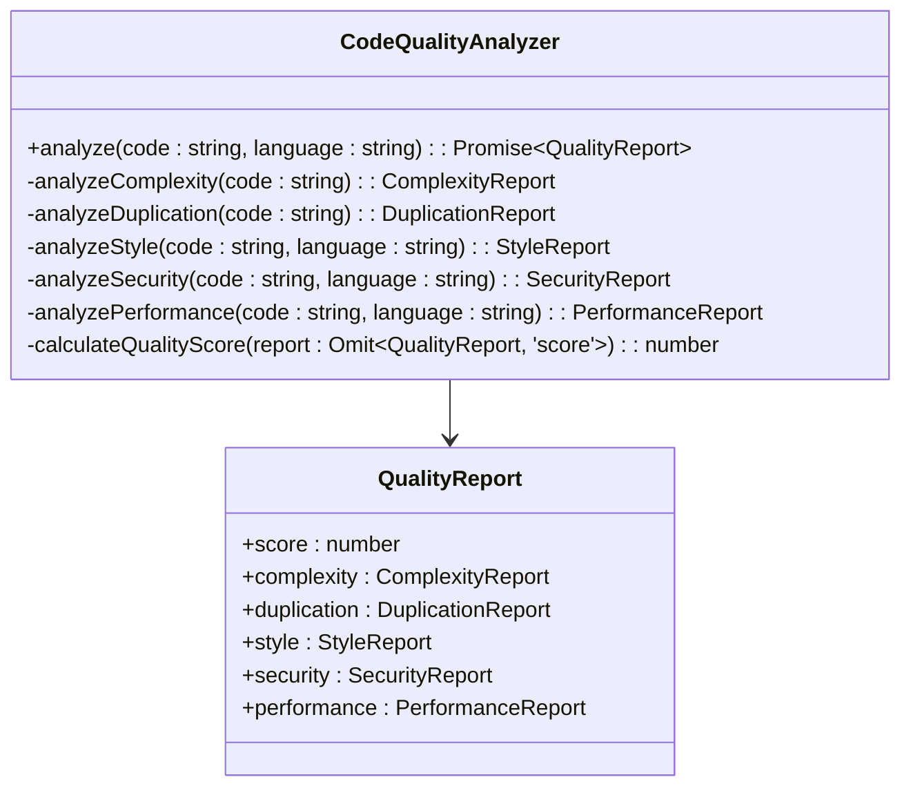
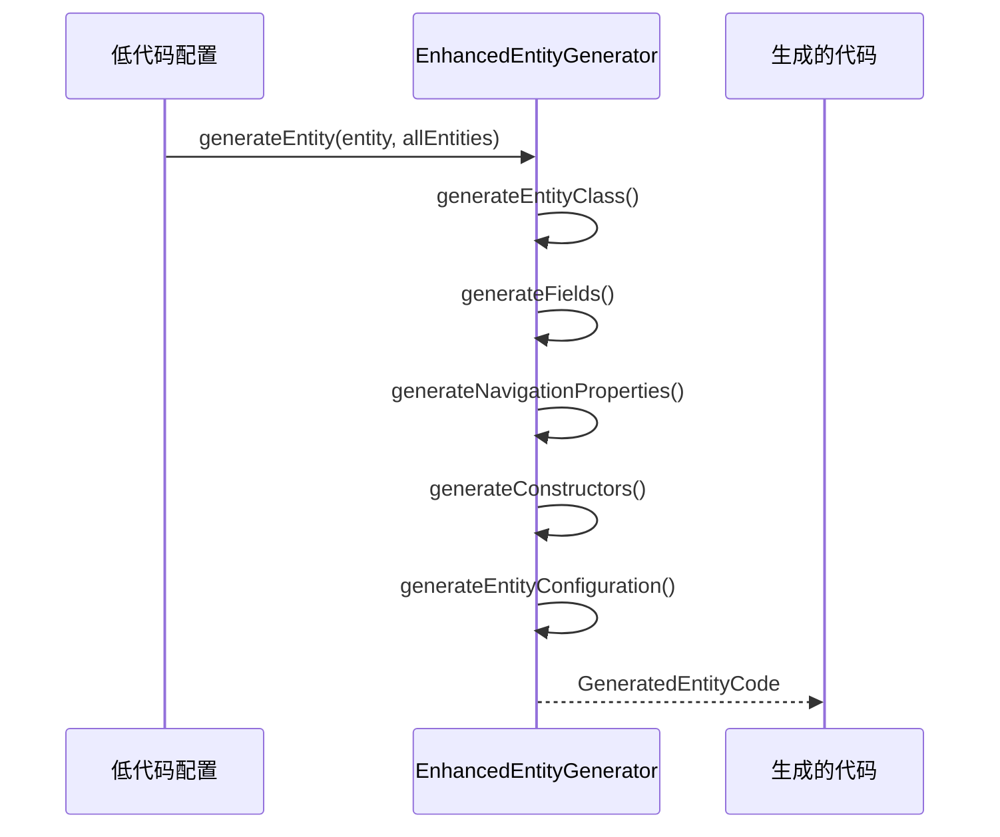
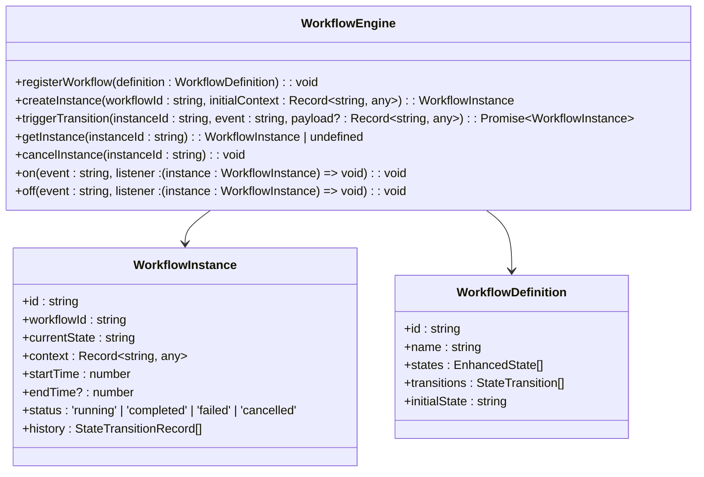
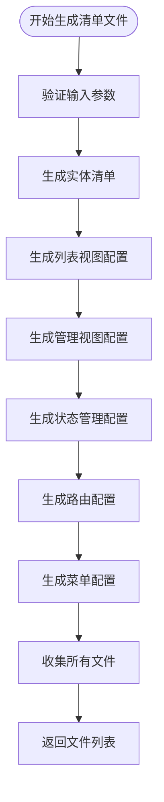
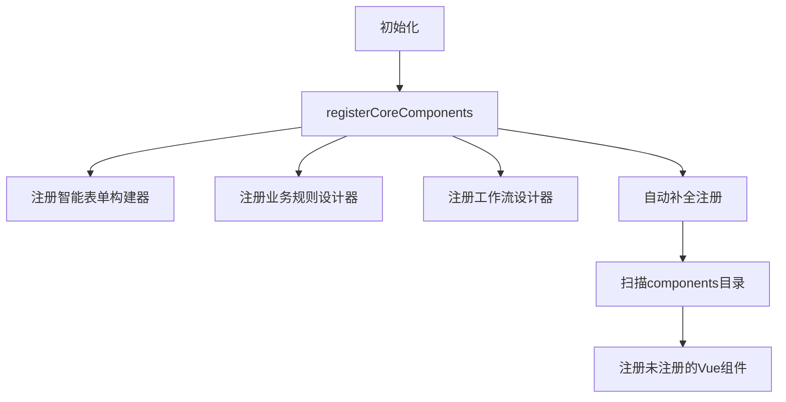
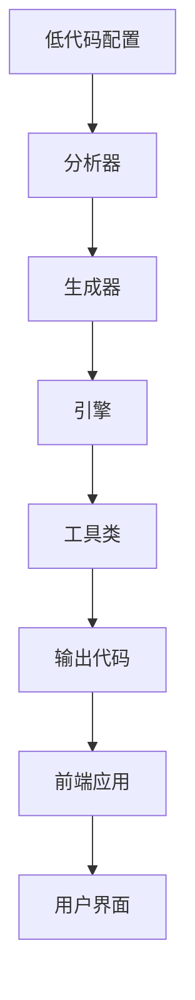

# 低代码核心引擎

<cite>
**本文档引用文件**  
- [CodeQualityAnalyzer.ts](file://src\SmartAbp.Vue\packages\lowcode-core\src\analyzers\CodeQualityAnalyzer.ts)
- [EnhancedEntityGenerator.ts](file://src\SmartAbp.Vue\packages\lowcode-core\src\generators\EnhancedEntityGenerator.ts)
- [WorkflowEngine.ts](file://src\SmartAbp.Vue\packages\lowcode-core\src\engines\WorkflowEngine.ts)
- [manifestWriter.ts](file://src\SmartAbp.Vue\packages\lowcode-core\src\utils\manifestWriter.ts)
- [index.ts](file://src\SmartAbp.Vue\packages\lowcode-core\src\index.ts)
- [package.json](file://src\SmartAbp.Vue\packages\lowcode-core\package.json)
</cite>

## 目录
1. [项目结构](#项目结构)
2. [核心组件](#核心组件)
3. [分析器（Analyzers）](#分析器analyzers)
4. [生成器（Generators）](#生成器generators)
5. [引擎（Engines）](#引擎engines)
6. [核心工具类（Utils）](#核心工具类utils)
7. [插件扩展机制](#插件扩展机制)
8. [架构与数据流](#架构与数据流)

## 项目结构

低代码核心引擎位于 `src/SmartAbp.Vue/packages/lowcode-core` 目录下，采用模块化设计，主要包含以下子目录：

**目录来源**  
- [lowcode-core](file://src\SmartAbp.Vue\packages\lowcode-core)

## 核心组件

`@smartabp/lowcode-core` 包是低代码平台的核心引擎，负责状态管理、核心逻辑和代码生成。它通过 `package.json` 定义了多个子模块导出，包括 `generators`、`engines`、`security` 和 `testing`，支持按需导入，减少打包体积。

**组件来源**  
- [package.json](file://src\SmartAbp.Vue\packages\lowcode-core\package.json#L1-L57)
- [index.ts](file://src\SmartAbp.Vue\packages\lowcode-core\src\index.ts#L0-L267)

## 分析器（Analyzers）

分析器负责对低代码配置和生成的代码进行质量分析，确保代码的可维护性和安全性。

### 代码质量分析器

`CodeQualityAnalyzer` 是核心分析器，提供全面的代码质量评估，包括：

- **复杂度分析**：计算圈复杂度和认知复杂度
- **重复检测**：识别代码重复块
- **风格检查**：验证代码规范
- **安全扫描**：检测SQL注入、XSS等漏洞
- **性能分析**：识别N+1查询等性能瓶颈

**分析器来源**  
- [CodeQualityAnalyzer.ts](file://src\SmartAbp.Vue\packages\lowcode-core\src\analyzers\CodeQualityAnalyzer.ts#L0-L328)

## 生成器（Generators）

生成器负责将低代码配置转换为实际的代码文件。

### 增强型实体生成器

`EnhancedEntityGenerator` 是核心生成器，能够根据实体定义生成完整的C#实体类和配置类。

**生成器来源**  
- [EnhancedEntityGenerator.ts](file://src\SmartAbp.Vue\packages\lowcode-core\src\generators\EnhancedEntityGenerator.ts#L0-L682)

## 引擎（Engines）

引擎负责执行复杂的业务逻辑和工作流。

### 工作流引擎

`WorkflowEngine` 管理工作流实例的生命周期，支持状态转换、事件监听和持久化。

**引擎来源**  
- [WorkflowEngine.ts](file://src\SmartAbp.Vue\packages\lowcode-core\src\engines\WorkflowEngine.ts#L0-L306)

## 核心工具类（Utils）

工具类提供通用功能，支持核心引擎的运行。

### 清单文件写入器

`SmartAbpManifestWriter` 负责生成模块的清单文件集合，包括实体清单、视图配置、路由和菜单等。

**工具类来源**  
- [manifestWriter.ts](file://src\SmartAbp.Vue\packages\lowcode-core\src\utils\manifestWriter.ts#L0-L799)

## 插件扩展机制

核心引擎通过注册机制支持插件扩展。`index.ts` 文件中的 `registerCoreComponents` 函数负责注册所有核心组件到全局组件注册表，支持按优先级和依赖关系加载。

**扩展机制来源**  
- [index.ts](file://src\SmartAbp.Vue\packages\lowcode-core\src\index.ts#L0-L267)

## 架构与数据流

低代码核心引擎采用分层架构，各组件协同工作。

**架构来源**  
- [lowcode-core](file://src\SmartAbp.Vue\packages\lowcode-core)
- [index.ts](file://src\SmartAbp.Vue\packages\lowcode-core\src\index.ts#L0-L267)