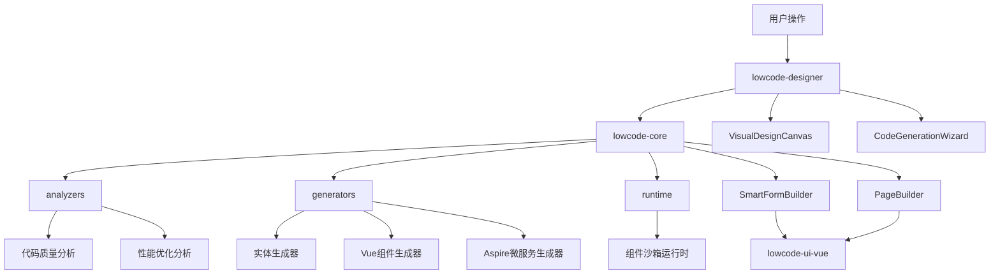
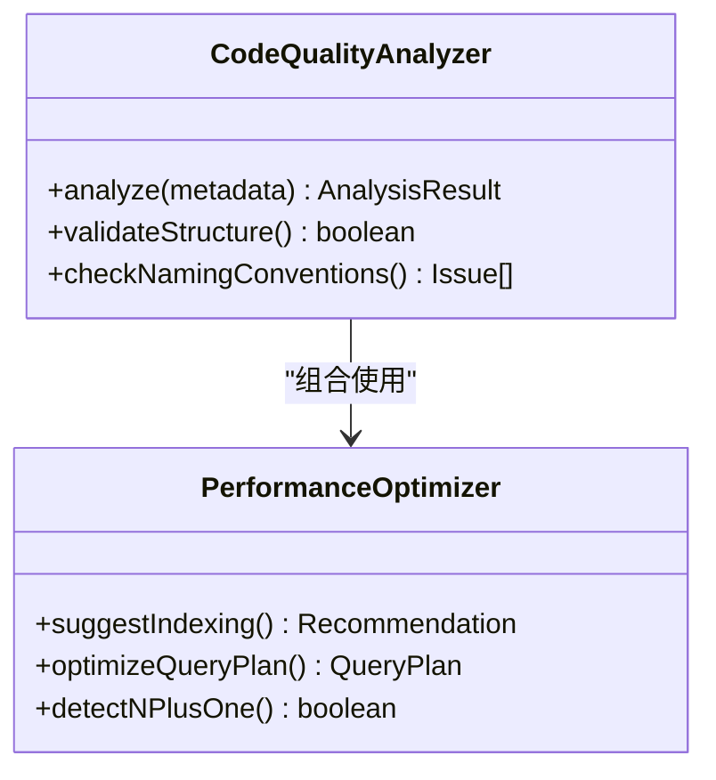
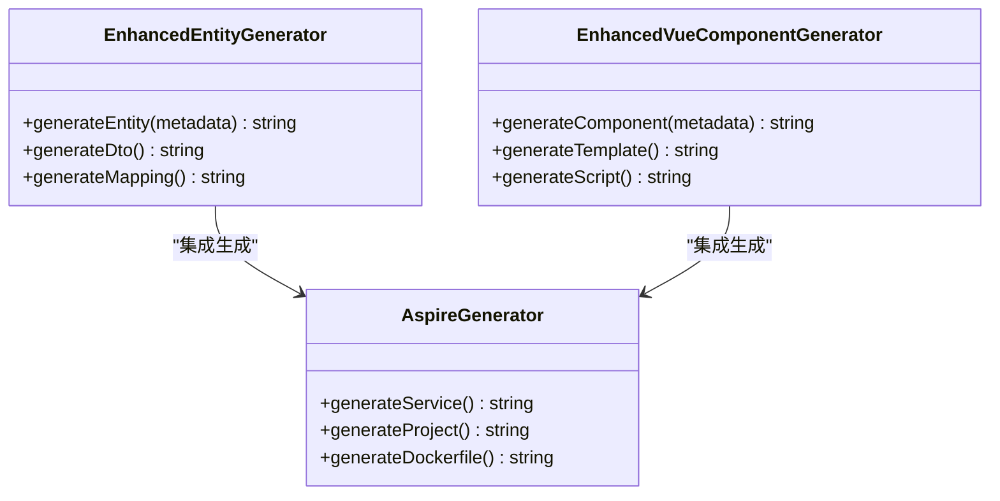
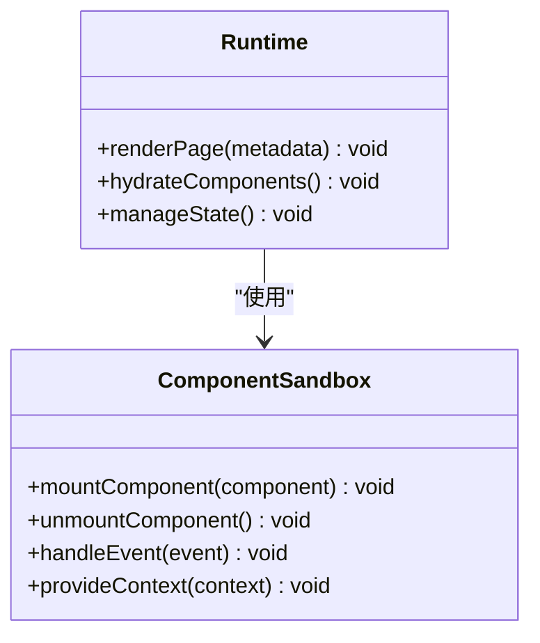
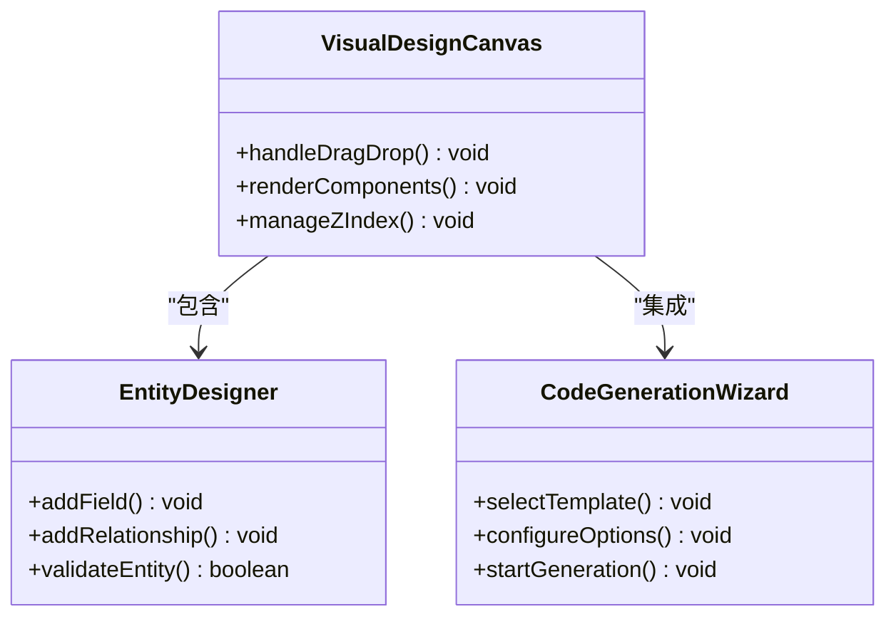
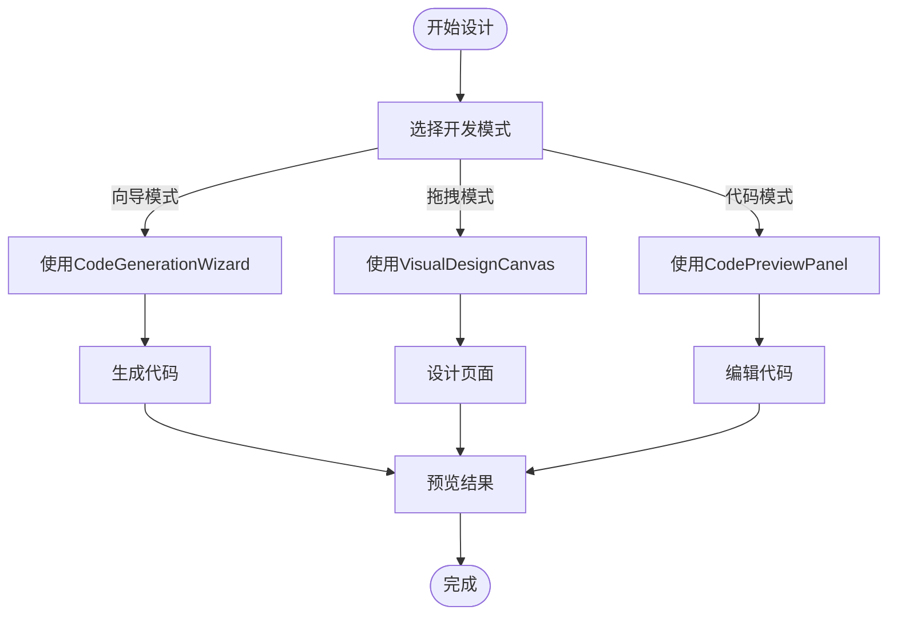
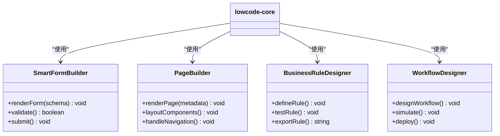
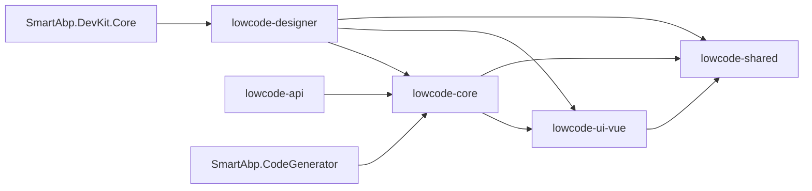

# 低代码核心组件

<cite>
**本文档中引用的文件**  
- [CodeQualityAnalyzer.ts](file://src/SmartAbp.Vue/packages/lowcode-core/src/analyzers/CodeQualityAnalyzer.ts)
- [PerformanceOptimizer.ts](file://src/SmartAbp.Vue/packages/lowcode-core/src/analyzers/PerformanceOptimizer.ts)
- [AspireGenerator.ts](file://src/SmartAbp.Vue/packages/lowcode-core/src/generators/AspireGenerator.ts)
- [EnhancedVueComponentGenerator.ts](file://src/SmartAbp.Vue/packages/lowcode-core/src/generators/EnhancedVueComponentGenerator.ts)
- [EnhancedEntityGenerator.ts](file://src/SmartAbp.Vue/packages/lowcode-core/src/generators/EnhancedEntityGenerator.ts)
- [ComponentSandbox.ts](file://src/SmartAbp.Vue/packages/lowcode-core/src/runtime/ComponentSandbox.ts)
- [index.ts](file://src/SmartAbp.Vue/packages/lowcode-core/src/runtime/index.ts)
- [SmartFormBuilder.vue](file://src/SmartAbp.Vue/packages/lowcode-core/src/components/SmartFormBuilder/SmartFormBuilder.vue)
- [PageBuilder.vue](file://src/SmartAbp.Vue/packages/lowcode-core/src/components/PageBuilder/PageBuilder.vue)
- [BusinessRuleDesigner.vue](file://src/SmartAbp.Vue/packages/lowcode-core/src/components/BusinessRuleDesigner/BusinessRuleDesigner.vue)
- [WorkflowDesigner.vue](file://src/SmartAbp.Vue/packages/lowcode-core/src/components/WorkflowDesigner/WorkflowDesigner.vue)
- [CodeGenerationWizard.vue](file://src/SmartAbp.Vue/packages/lowcode-designer/src/components/CodeGenerationWizard.vue)
- [VisualDesignCanvas.vue](file://src/SmartAbp.Vue/packages/lowcode-designer/src/components/VisualDesignCanvas.vue)
- [EntityDesigner.vue](file://src/SmartAbp.Vue/packages/lowcode-designer/src/components/EntityDesigner.vue)
- [index.ts](file://src/SmartAbp.Vue/packages/lowcode-designer/src/index.ts)
- [index.ts](file://src/SmartAbp.Vue/packages/lowcode-ui-vue/src/index.ts)
- [SmartAbp.DevKit.Core.csproj](file://src/SmartAbp.DevKit.Core/SmartAbp.DevKit.Core.csproj)
- [SmartAbp.CodeGenerator.csproj](file://src/SmartAbp.CodeGenerator/SmartAbp.CodeGenerator.csproj)
</cite>

## 目录
1. [简介](#简介)
2. [项目结构](#项目结构)
3. [核心组件](#核心组件)
4. [架构概述](#架构概述)
5. [详细组件分析](#详细组件分析)
6. [依赖分析](#依赖分析)
7. [性能考虑](#性能考虑)
8. [故障排除指南](#故障排除指南)
9. [结论](#结论)

## 简介
本文件详细描述了hxlot项目中低代码平台的核心组件，重点分析`lowcode-core`、`lowcode-designer`和`lowcode-ui-vue`三个核心包的设计与实现。文档涵盖分析器、生成器、运行时等模块的内部机制，设计器的开发模式，以及UI组件的集成方式。通过深入解析这些组件的协同工作机制，为开发者提供扩展和定制低代码能力的指导。

## 项目结构
hxlot项目的低代码功能主要集中在`src/SmartAbp.Vue/packages`目录下，采用模块化设计，各组件职责清晰，便于独立开发与维护。

```mermaid
graph TB
subgraph "低代码平台模块"
LC[lowcode-core]
LD[lowcode-designer]
LU[lowcode-ui-vue]
LS[lowcode-shared]
LA[lowcode-api]
end
LC --> LD : "提供核心能力"
LD --> LU : "使用UI组件"
LU --> LS : "共享类型定义"
LA --> LC : "提供API接口"
```

**图示来源**
- [lowcode-core](file://src/SmartAbp.Vue/packages/lowcode-core)
- [lowcode-designer](file://src/SmartAbp.Vue/packages/lowcode-designer)
- [lowcode-ui-vue](file://src/SmartAbp.Vue/packages/lowcode-ui-vue)

**本节来源**
- [src/SmartAbp.Vue/packages](file://src/SmartAbp.Vue/packages)

## 核心组件
低代码平台的核心由`lowcode-core`、`lowcode-designer`和`lowcode-ui-vue`三大包构成。`lowcode-core`提供分析、生成和运行时的核心逻辑；`lowcode-designer`实现可视化设计界面和开发工作流；`lowcode-ui-vue`封装可复用的UI组件，支持动态渲染。

**本节来源**
- [lowcode-core](file://src/SmartAbp.Vue/packages/lowcode-core)
- [lowcode-designer](file://src/SmartAbp.Vue/packages/lowcode-designer)
- [lowcode-ui-vue](file://src/SmartAbp.Vue/packages/lowcode-ui-vue)

## 架构概述
低代码平台采用分层架构，从底层的分析引擎到上层的可视化设计器，形成完整的开发闭环。



**图示来源**
- [analyzers](file://src/SmartAbp.Vue/packages/lowcode-core/src/analyzers)
- [generators](file://src/SmartAbp.Vue/packages/lowcode-core/src/generators)
- [runtime](file://src/SmartAbp.Vue/packages/lowcode-core/src/runtime)
- [components](file://src/SmartAbp.Vue/packages/lowcode-core/src/components)
- [lowcode-designer](file://src/SmartAbp.Vue/packages/lowcode-designer)

## 详细组件分析

### lowcode-core 分析

`lowcode-core`包是低代码平台的引擎，包含分析器、生成器和运行时三大模块。

#### 分析器模块
分析器负责对用户设计的元数据进行静态分析和优化建议。



**图示来源**
- [CodeQualityAnalyzer.ts](file://src/SmartAbp.Vue/packages/lowcode-core/src/analyzers/CodeQualityAnalyzer.ts)
- [PerformanceOptimizer.ts](file://src/SmartAbp.Vue/packages/lowcode-core/src/analyzers/PerformanceOptimizer.ts)

#### 生成器模块
生成器将设计元数据转换为实际的代码和配置。



**图示来源**
- [EnhancedEntityGenerator.ts](file://src/SmartAbp.Vue/packages/lowcode-core/src/generators/EnhancedEntityGenerator.ts)
- [EnhancedVueComponentGenerator.ts](file://src/SmartAbp.Vue/packages/lowcode-core/src/generators/EnhancedVueComponentGenerator.ts)
- [AspireGenerator.ts](file://src/SmartAbp.Vue/packages/lowcode-core/src/generators/AspireGenerator.ts)

#### 运行时模块
运行时模块提供组件沙箱和动态渲染能力。



**图示来源**
- [ComponentSandbox.ts](file://src/SmartAbp.Vue/packages/lowcode-core/src/runtime/ComponentSandbox.ts)
- [index.ts](file://src/SmartAbp.Vue/packages/lowcode-core/src/runtime/index.ts)

**本节来源**
- [src/SmartAbp.Vue/packages/lowcode-core](file://src/SmartAbp.Vue/packages/lowcode-core)

### lowcode-designer 分析

`lowcode-designer`包提供可视化设计界面，是开发者与低代码平台交互的主要入口。

#### 设计器核心组件
设计器由多个核心组件构成，支持实体建模、页面设计和代码生成。



**图示来源**
- [VisualDesignCanvas.vue](file://src/SmartAbp.Vue/packages/lowcode-designer/src/components/VisualDesignCanvas.vue)
- [EntityDesigner.vue](file://src/SmartAbp.Vue/packages/lowcode-designer/src/components/EntityDesigner.vue)
- [CodeGenerationWizard.vue](file://src/SmartAbp.Vue/packages/lowcode-designer/src/components/CodeGenerationWizard.vue)

#### 开发模式
设计器支持多种开发模式，包括向导式生成、拖拽式设计和代码预览。



**图示来源**
- [CodeGenerationWizard.vue](file://src/SmartAbp.Vue/packages/lowcode-designer/src/components/CodeGenerationWizard.vue)
- [VisualDesignCanvas.vue](file://src/SmartAbp.Vue/packages/lowcode-designer/src/components/VisualDesignCanvas.vue)
- [CodePreviewPanel.vue](file://src/SmartAbp.Vue/packages/lowcode-designer/src/components/CodePreview/CodePreviewPanel.vue)

**本节来源**
- [src/SmartAbp.Vue/packages/lowcode-designer](file://src/SmartAbp.Vue/packages/lowcode-designer)

### lowcode-ui-vue 分析

`lowcode-ui-vue`包提供可复用的UI组件，支持低代码平台的动态渲染需求。

#### UI组件集成机制
UI组件通过标准接口与核心平台集成，实现即插即用。



**图示来源**
- [SmartFormBuilder.vue](file://src/SmartAbp.Vue/packages/lowcode-core/src/components/SmartFormBuilder/SmartFormBuilder.vue)
- [PageBuilder.vue](file://src/SmartAbp.Vue/packages/lowcode-core/src/components/PageBuilder/PageBuilder.vue)
- [BusinessRuleDesigner.vue](file://src/SmartAbp.Vue/packages/lowcode-core/src/components/BusinessRuleDesigner/BusinessRuleDesigner.vue)
- [WorkflowDesigner.vue](file://src/SmartAbp.Vue/packages/lowcode-core/src/components/WorkflowDesigner/WorkflowDesigner.vue)

**本节来源**
- [src/SmartAbp.Vue/packages/lowcode-ui-vue](file://src/SmartAbp.Vue/packages/lowcode-ui-vue)

## 依赖分析
低代码平台各组件之间存在明确的依赖关系，确保功能的模块化和可维护性。



**图示来源**
- [package.json](file://src/SmartAbp.Vue/packages/lowcode-core/package.json)
- [package.json](file://src/SmartAbp.Vue/packages/lowcode-designer/package.json)
- [package.json](file://src/SmartAbp.Vue/packages/lowcode-ui-vue/package.json)
- [SmartAbp.DevKit.Core.csproj](file://src/SmartAbp.DevKit.Core/SmartAbp.DevKit.Core.csproj)
- [SmartAbp.CodeGenerator.csproj](file://src/SmartAbp.CodeGenerator/SmartAbp.CodeGenerator.csproj)

**本节来源**
- [src/SmartAbp.Vue/packages](file://src/SmartAbp.Vue/packages)

## 性能考虑
低代码平台在设计时充分考虑了性能因素，通过多种机制确保运行效率。

- **分析器优化**：采用增量分析策略，只对变更部分进行重新分析
- **生成器缓存**：对常用模板和生成结果进行缓存，提高生成速度
- **运行时沙箱**：使用轻量级沙箱环境，减少组件加载开销
- **设计器虚拟化**：对大型设计画布采用虚拟滚动技术，保持流畅交互

## 故障排除指南
当低代码平台出现异常时，可参考以下常见问题的排查方法。

**本节来源**
- [errorHandler.ts](file://src/SmartAbp.Vue/packages/lowcode-designer/src/utils/errorHandler.ts)
- [performance-optimizer.ts](file://src/SmartAbp.Vue/packages/lowcode-designer/src/utils/performance-optimizer.ts)

## 结论
hxlot项目的低代码核心组件通过`lowcode-core`、`lowcode-designer`和`lowcode-ui-vue`三个包的紧密协作，实现了完整的低代码开发能力。分析器提供智能建议，生成器实现代码自动化，运行时支持动态渲染，设计器提供可视化交互，形成了高效、可扩展的低代码开发平台。通过理解这些组件的设计与实现，开发者可以更好地利用和扩展平台功能。