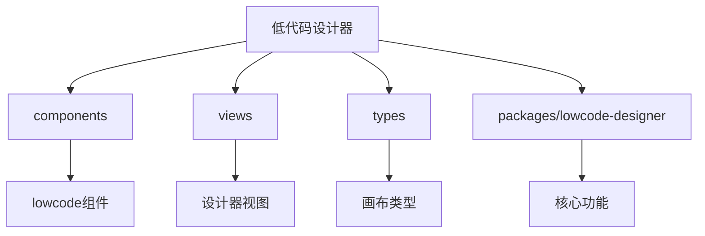
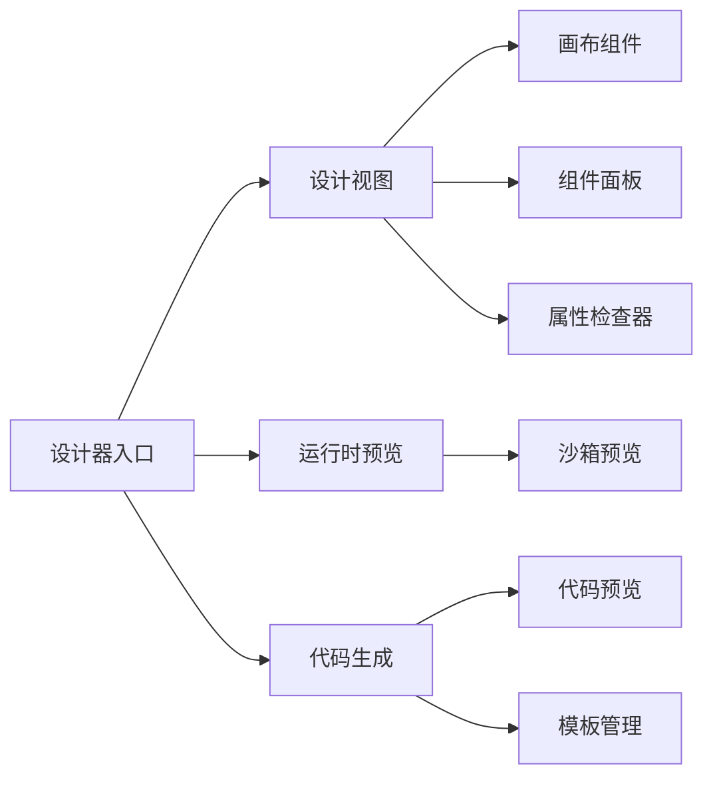
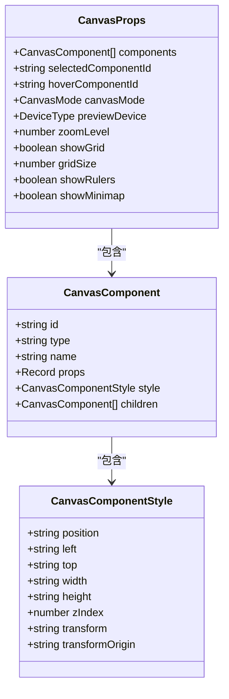
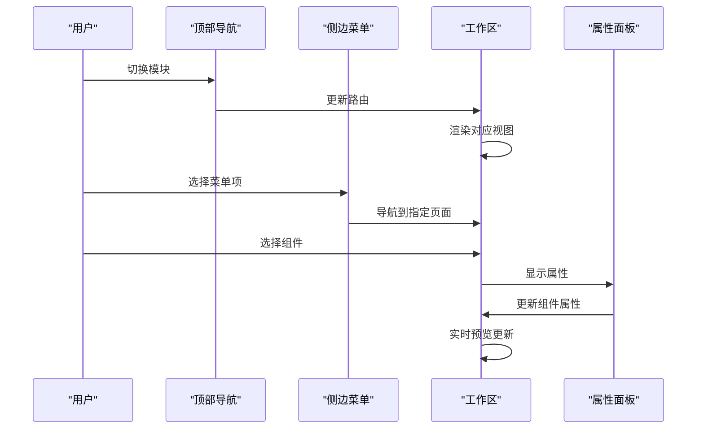
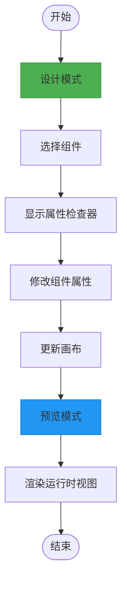
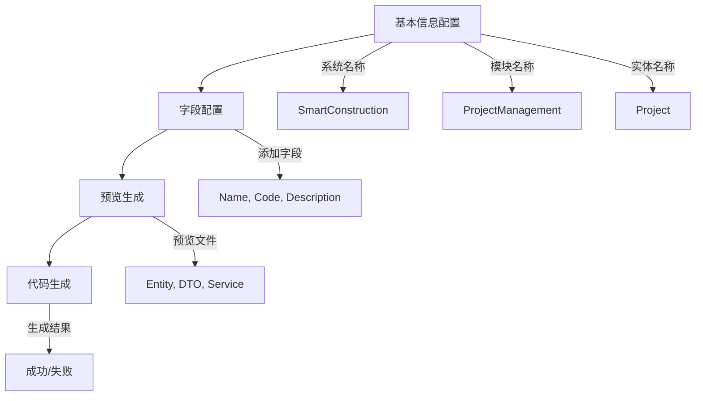
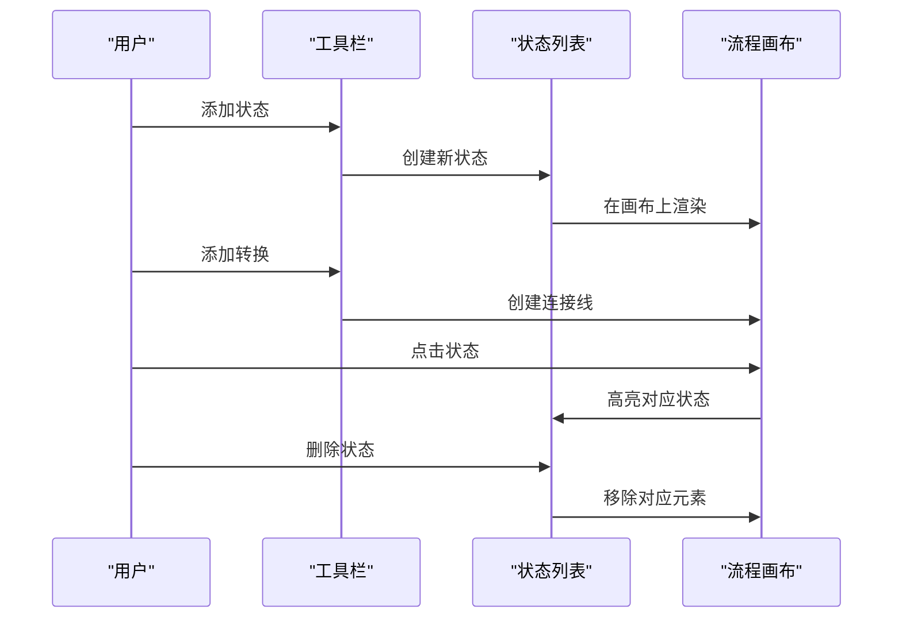
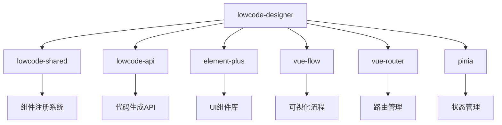

# 低代码设计器组件

<cite>
**本文档引用的文件**
- [index.ts](file://src/SmartAbp.Vue/packages/lowcode-designer/src/index.ts)
- [canvas.ts](file://src/SmartAbp.Vue/src/types/canvas.ts)
- [LowCodeStudioView.vue](file://src/SmartAbp.Vue/src/views/lowcode/LowCodeStudioView.vue)
- [SmartStudioLite.vue](file://src/SmartAbp.Vue/src/views/lowcode/SmartStudioLite.vue)
- [EnhancedStateMachine.vue](file://src/SmartAbp.Vue/src/components/lowcode/EnhancedStateMachine.vue)
</cite>

## 目录
1. [简介](#简介)
2. [项目结构](#项目结构)
3. [核心组件](#核心组件)
4. [架构概述](#架构概述)
5. [详细组件分析](#详细组件分析)
6. [依赖分析](#依赖分析)
7. [性能考虑](#性能考虑)
8. [故障排除指南](#故障排除指南)
9. [结论](#结论)

## 简介
hxlot项目中的低代码设计器组件提供了一套完整的可视化开发环境，支持通过拖拽方式快速构建企业级应用。设计器集成了实体建模、页面设计、代码生成等核心功能，实现了从设计到运行的完整闭环。

## 项目结构
低代码设计器主要由以下几个核心模块构成：
- **components**: 包含可视化组件库、设计器工具组件
- **views**: 设计器视图层，包含主界面和功能视图
- **types**: 类型定义，特别是画布相关类型
- **packages/lowcode-designer**: 设计器核心包

**图示来源**
- [index.ts](file://src/SmartAbp.Vue/packages/lowcode-designer/src/index.ts)
- [canvas.ts](file://src/SmartAbp.Vue/src/types/canvas.ts)

**本节来源**
- [index.ts](file://src/SmartAbp.Vue/packages/lowcode-designer/src/index.ts)
- [canvas.ts](file://src/SmartAbp.Vue/src/types/canvas.ts)

## 核心组件
低代码设计器的核心组件包括可视化设计画布、属性检查器、代码预览等。这些组件通过统一的组件注册系统进行管理，确保了组件的一致性和可维护性。

**本节来源**
- [index.ts](file://src/SmartAbp.Vue/packages/lowcode-designer/src/index.ts)

## 架构概述
低代码设计器采用模块化架构，将不同功能划分为独立的组件和模块。设计器通过Vue Flow实现可视化流程编辑，支持状态机、工作流等复杂业务场景的建模。

**图示来源**
- [index.ts](file://src/SmartAbp.Vue/packages/lowcode-designer/src/index.ts)
- [LowCodeStudioView.vue](file://src/SmartAbp.Vue/src/views/lowcode/LowCodeStudioView.vue)

## 详细组件分析
### 可视化设计画布分析
可视化设计画布是低代码设计器的核心，提供了拖拽式界面构建能力。

#### 画布组件类型

**图示来源**
- [canvas.ts](file://src/SmartAbp.Vue/src/types/canvas.ts)

**本节来源**
- [canvas.ts](file://src/SmartAbp.Vue/src/types/canvas.ts)

### 设计器视图分析
设计器视图提供了用户交互的主要界面，包含顶部导航、侧边菜单、工作区和属性面板。

#### 视图交互流程

**图示来源**
- [LowCodeStudioView.vue](file://src/SmartAbp.Vue/src/views/lowcode/LowCodeStudioView.vue)

**本节来源**
- [LowCodeStudioView.vue](file://src/SmartAbp.Vue/src/views/lowcode/LowCodeStudioView.vue)

### 运行时预览分析
运行时预览模块提供了设计模式和运行模式之间的切换能力。

#### 模式切换流程

**图示来源**
- [index.ts](file://src/SmartAbp.Vue/packages/lowcode-designer/src/index.ts)
- [canvas.ts](file://src/SmartAbp.Vue/src/types/canvas.ts)

**本节来源**
- [index.ts](file://src/SmartAbp.Vue/packages/lowcode-designer/src/index.ts)
- [canvas.ts](file://src/SmartAbp.Vue/src/types/canvas.ts)

### 智能配置向导分析
智能配置向导提供了一步式代码生成体验，通过向导式界面简化开发流程。

#### 向导流程

**图示来源**
- [SmartStudioLite.vue](file://src/SmartAbp.Vue/src/views/lowcode/SmartStudioLite.vue)

**本节来源**
- [SmartStudioLite.vue](file://src/SmartAbp.Vue/src/views/lowcode/SmartStudioLite.vue)

### 状态机设计器分析
状态机设计器提供了可视化的工作流建模能力。

#### 状态机交互

**图示来源**
- [EnhancedStateMachine.vue](file://src/SmartAbp.Vue/src/components/lowcode/EnhancedStateMachine.vue)

**本节来源**
- [EnhancedStateMachine.vue](file://src/SmartAbp.Vue/src/components/lowcode/EnhancedStateMachine.vue)

## 依赖分析
低代码设计器依赖于多个核心包和组件，形成了完整的生态系统。

**图示来源**
- [index.ts](file://src/SmartAbp.Vue/packages/lowcode-designer/src/index.ts)
- [package.json](file://src/SmartAbp.Vue/package.json)

**本节来源**
- [index.ts](file://src/SmartAbp.Vue/packages/lowcode-designer/src/index.ts)

## 性能考虑
设计器在性能方面进行了多项优化，包括组件懒加载、虚拟滚动、增量渲染等技术，确保在处理复杂页面时仍能保持流畅的用户体验。

## 故障排除指南
当设计器出现组件属性编辑错误时，需要检查属性绑定的类型安全性，确保在访问数组元素前进行空值检查。

**本节来源**
- [PropertyInspector.vue](file://docs/代码质量检查/错误修复汇总.md)

## 结论
hxlot项目的低代码设计器组件提供了一套完整的可视化开发解决方案，通过模块化设计和类型安全的架构，实现了高效、可靠的低代码开发体验。设计器的各个模块协同工作，为开发者提供了从设计到生成的完整工作流。