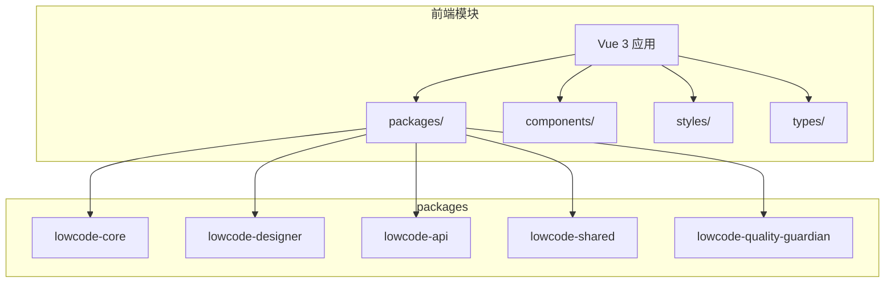
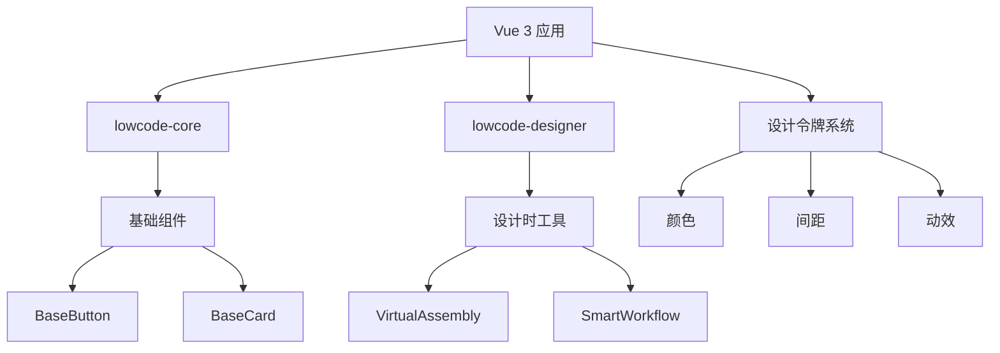
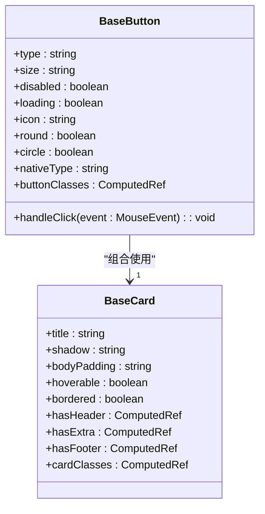
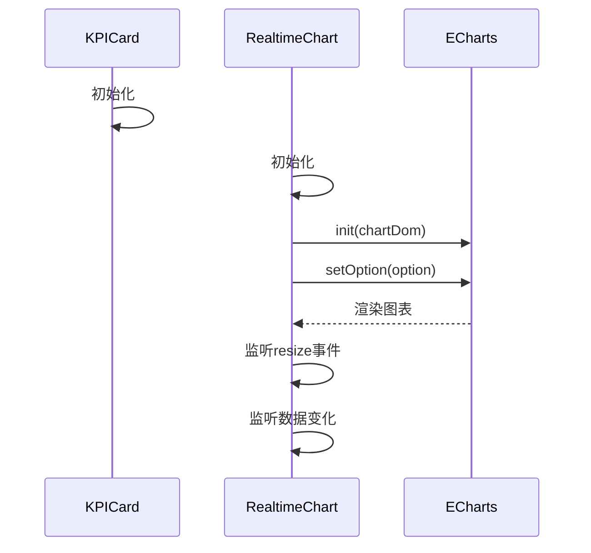
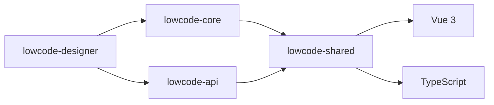

# 前端组件架构

<cite>
**本文档引用的文件**  
- [BaseButton.vue](file://src/SmartAbp.Vue/src/components/base/BaseButton.vue)
- [BaseCard.vue](file://src/SmartAbp.Vue/src/components/base/BaseCard.vue)
- [KPICard.vue](file://src/SmartAbp.Vue/src/components/dashboard/KPICard.vue)
- [RealtimeChart.vue](file://src/SmartAbp.Vue/src/components/dashboard/RealtimeChart.vue)
- [index.ts](file://src/SmartAbp.Vue/src/styles/design-tokens/index.ts)
- [auto-imports.d.ts](file://src/SmartAbp.Vue/auto-imports.d.ts)
- [components.d.ts](file://src/SmartAbp.Vue/components.d.ts)
- [lowcode-core](file://src/SmartAbp.Vue/packages/lowcode-core)
- [lowcode-designer](file://src/SmartAbp.Vue/packages/lowcode-designer)
</cite>

## 目录
1. [简介](#简介)
2. [项目结构](#项目结构)
3. [核心组件](#核心组件)
4. [架构概述](#架构概述)
5. [详细组件分析](#详细组件分析)
6. [依赖分析](#依赖分析)
7. [性能考虑](#性能考虑)
8. [故障排除指南](#故障排除指南)
9. [结论](#结论)

## 简介
本文档深入探讨hxlot项目中基于Vue 3的前端组件架构设计。重点分析`packages`目录下的低代码组件包（如lowcode-core、lowcode-designer）的设计理念与实现机制，阐述基础组件（BaseButton、BaseCard等）与业务组件（KPICard、RealtimeChart等）的分层架构，解析组件库的自动导入与路径识别技术，并说明虚拟装配（VirtualAssembly）和智能工作流（SmartWorkflow）组件的设计模式。同时，文档涵盖组件样式系统，包括设计令牌（design tokens）和主题变量管理，提供组件依赖关系图及通信模式说明。

## 项目结构
hxlot项目的前端部分位于`src/SmartAbp.Vue`目录下，采用模块化设计，核心组件集中于`packages`子目录。整体结构遵循功能分层原则，包含基础UI组件、业务组件、低代码引擎及共享工具库。

**图示来源**  
- [packages](file://src/SmartAbp.Vue/packages)

**本节来源**  
- [项目结构](file://src/SmartAbp.Vue)

## 核心组件
项目采用分层组件设计，分为基础组件与业务组件两大类。基础组件提供统一的UI样式与交互逻辑，业务组件则封装特定业务场景下的可视化需求。

**本节来源**  
- [BaseButton.vue](file://src/SmartAbp.Vue/src/components/base/BaseButton.vue)
- [BaseCard.vue](file://src/SmartAbp.Vue/src/components/base/BaseCard.vue)
- [KPICard.vue](file://src/SmartAbp.Vue/src/components/dashboard/KPICard.vue)
- [RealtimeChart.vue](file://src/SmartAbp.Vue/src/components/dashboard/RealtimeChart.vue)

## 架构概述
系统采用基于Vue 3的组合式API与TypeScript构建，通过`lowcode-core`提供核心渲染引擎，`lowcode-designer`实现可视化设计能力。组件库通过`components.d.ts`和`auto-imports.d.ts`实现自动导入，提升开发效率。

**图示来源**  
- [lowcode-core](file://src/SmartAbp.Vue/packages/lowcode-core)
- [lowcode-designer](file://src/SmartAbp.Vue/packages/lowcode-designer)
- [index.ts](file://src/SmartAbp.Vue/src/styles/design-tokens/index.ts)

## 详细组件分析
本节深入分析关键组件的设计与实现。

### 基础组件分析
基础组件为系统提供一致的UI语言与交互规范。

#### BaseButton 与 BaseCard
`BaseButton`和`BaseCard`作为最常用的UI元素，通过`defineProps`定义类型安全的属性接口，使用`computed`生成动态类名，实现样式与状态的响应式绑定。

**图示来源**  
- [BaseButton.vue](file://src/SmartAbp.Vue/src/components/base/BaseButton.vue)
- [BaseCard.vue](file://src/SmartAbp.Vue/src/components/base/BaseCard.vue)

### 业务组件分析
业务组件封装特定领域逻辑，提升复用性。

#### KPICard 与 RealtimeChart
`KPICard`用于展示关键绩效指标，支持趋势分析与主题切换；`RealtimeChart`基于ECharts实现动态数据可视化，支持多种图表类型与实时更新。

**图示来源**  
- [KPICard.vue](file://src/SmartAbp.Vue/src/components/dashboard/KPICard.vue)
- [RealtimeChart.vue](file://src/SmartAbp.Vue/src/components/dashboard/RealtimeChart.vue)

### 虚拟装配与智能工作流
`VirtualAssembly`和`SmartWorkflow`为低代码设计器中的核心组件，用于构建可拖拽的流程装配界面。其设计模式基于Vue的插槽（slot）与动态组件（component）机制，结合状态管理实现组件间的通信与数据流控制。

**本节来源**  
- [lowcode-designer](file://src/SmartAbp.Vue/packages/lowcode-designer)

## 依赖分析
组件库通过pnpm workspace实现多包管理，各`package`之间通过`package.json`声明依赖关系。`lowcode-core`为核心依赖，`lowcode-designer`依赖`lowcode-core`与`lowcode-api`。

**图示来源**  
- [package.json](file://src/SmartAbp.Vue/packages/lowcode-core/package.json)
- [package.json](file://src/SmartAbp.Vue/packages/lowcode-designer/package.json)

**本节来源**  
- [packages](file://src/SmartAbp.Vue/packages)

## 性能考虑
- 所有图表组件在`onUnmounted`时调用`dispose()`释放资源
- 使用`watch`的`deep: true`选项监听复杂数据变化
- 图表初始化使用`nextTick`确保DOM就绪
- 响应式设计适配移动端

## 故障排除指南
- 若组件未自动导入，检查`components.d.ts`与`auto-imports.d.ts`是否生成
- 图表不显示时，确认`chartId`唯一且DOM存在
- 样式异常时，检查设计令牌是否正确注入
- 主题切换失效时，验证`data-theme`属性是否正确设置

**本节来源**  
- [auto-imports.d.ts](file://src/SmartAbp.Vue/auto-imports.d.ts)
- [components.d.ts](file://src/SmartAbp.Vue/components.d.ts)
- [RealtimeChart.vue](file://src/SmartAbp.Vue/src/components/dashboard/RealtimeChart.vue)

## 结论
hxlot项目的前端组件架构采用现代化Vue 3技术栈，通过分层设计、低代码集成与自动化工具链，实现了高复用性与可维护性。设计令牌系统确保了视觉一致性，而组件自动导入机制显著提升了开发效率。整体架构具备良好的扩展性与性能表现，适用于复杂的企业级应用开发。