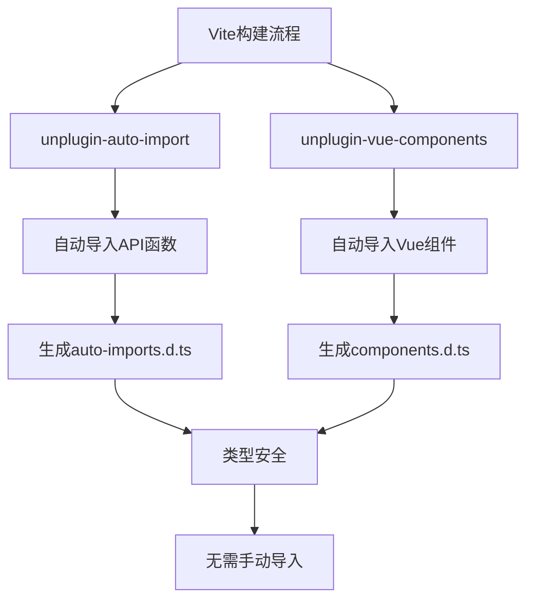
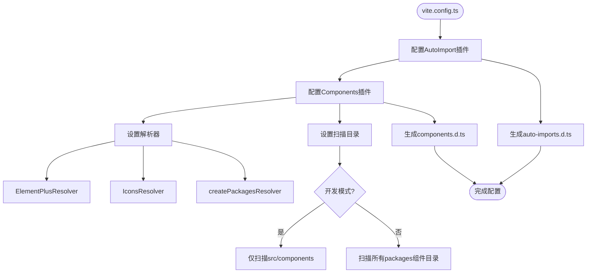
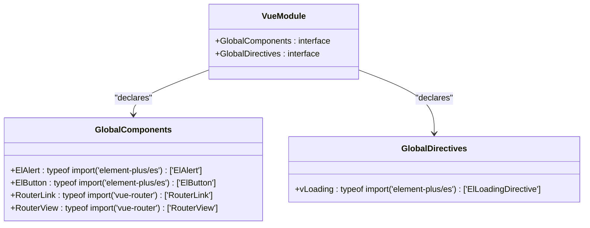
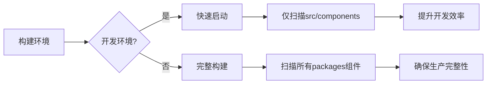
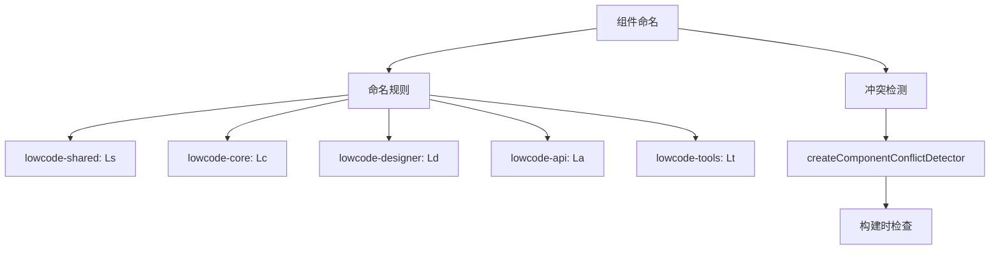
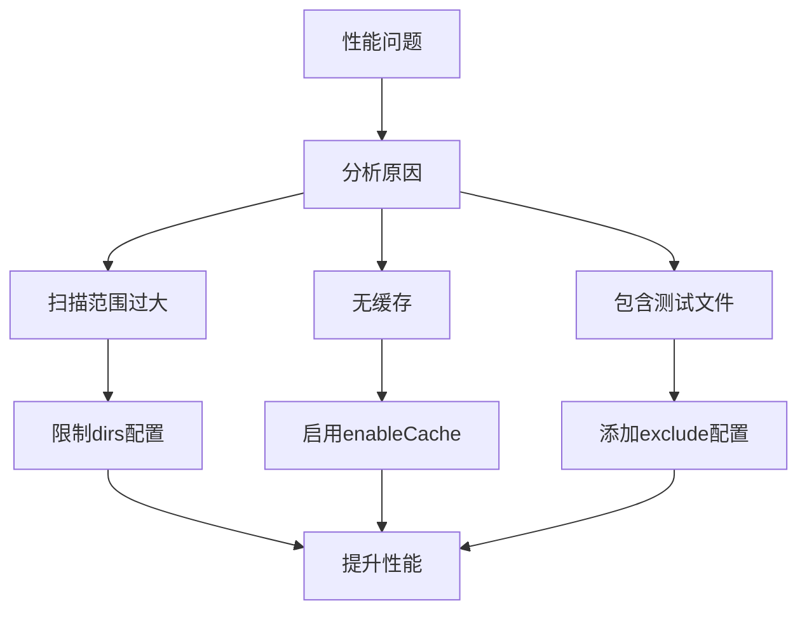

# 组件自动导入

<cite>
**Referenced Files in This Document**   
- [vite.config.ts](file://src/SmartAbp.Vue/vite.config.ts)
- [vite.config.optimization.ts](file://src/SmartAbp.Vue/vite.config.optimization.ts)
- [package.json](file://src/SmartAbp.Vue/package.json)
- [components.d.ts](file://src/SmartAbp.Vue/components.d.ts)
- [auto-imports.d.ts](file://src/SmartAbp.Vue/auto-imports.d.ts)
- [tsconfig.json](file://src/SmartAbp.Vue/tsconfig.json)
</cite>

## 目录
1. [简介](#简介)
2. [核心机制](#核心机制)
3. [配置详解](#配置详解)
4. [类型声明文件](#类型声明文件)
5. [最佳实践](#最佳实践)
6. [常见问题与解决方案](#常见问题与解决方案)

## 简介

hxlot项目通过`unplugin-vue-components`和`unplugin-auto-import`两个Vite插件实现了现代化的组件自动导入机制。该机制极大地提升了开发效率，开发者无需手动导入和注册组件，系统会自动完成这些繁琐的工作。本文档将深入解析这一自动导入系统的实现原理、配置方式和最佳实践。

## 核心机制

hxlot项目的自动导入机制基于两个核心插件：`unplugin-vue-components`用于自动导入Vue组件，`unplugin-auto-import`用于自动导入常用的API和工具函数。这两个插件在Vite构建过程中动态分析代码，自动插入必要的导入语句。



**Diagram sources**
- [vite.config.ts](file://src/SmartAbp.Vue/vite.config.ts#L1-L374)

**Section sources**
- [vite.config.ts](file://src/SmartAbp.Vue/vite.config.ts#L1-L374)
- [package.json](file://src/SmartAbp.Vue/package.json#L1-L229)

## 配置详解

### Vite配置

在`vite.config.ts`文件中，自动导入功能通过插件配置实现。配置根据开发和生产环境的不同进行了优化，确保开发时的快速启动和生产时的完整扫描。



**Diagram sources**
- [vite.config.ts](file://src/SmartAbp.Vue/vite.config.ts#L1-L374)

**Section sources**
- [vite.config.ts](file://src/SmartAbp.Vue/vite.config.ts#L1-L374)

### 插件配置细节

`unplugin-vue-components`插件配置了多个解析器，包括Element Plus组件解析器、图标解析器和自定义的packages解析器。这些解析器能够识别不同来源的组件并自动导入。

```typescript
Components({
  resolvers: [
    ElementPlusResolver({
      importStyle: false,
    }),
    IconsResolver({
      prefix: 'Icon',
      enabledCollections: ['ep', 'carbon', 'mdi', 'fa'],
    }),
    createPackagesResolver({
      packagesRoot: 'packages',
      enableCache: true,
      debug: isDevelopment
    }),
  ],
  dirs: isDevelopment ? [
    'src/components',
  ] : [
    'src/components',
    'packages/lowcode-shared/src/components',
    'packages/lowcode-core/src/components',
    'packages/lowcode-designer/src/components',
    'packages/lowcode-api/src/components',
    'packages/lowcode-tools/src/components',
  ],
  dts: 'components.d.ts',
})
```

**Section sources**
- [vite.config.ts](file://src/SmartAbp.Vue/vite.config.ts#L1-L374)

## 类型声明文件

### components.d.ts

`components.d.ts`文件由`unplugin-vue-components`插件自动生成，声明了所有可作为全局组件使用的Vue组件。该文件通过TypeScript的模块声明扩展了Vue的`GlobalComponents`接口。



**Diagram sources**
- [components.d.ts](file://src/SmartAbp.Vue/components.d.ts#L1-L70)

**Section sources**
- [components.d.ts](file://src/SmartAbp.Vue/components.d.ts#L1-L70)
- [tsconfig.json](file://src/SmartAbp.Vue/tsconfig.json#L1-L89)

### auto-imports.d.ts

`auto-imports.d.ts`文件由`unplugin-auto-import`插件生成，声明了自动导入的API函数。在hxlot项目中，主要包含了Element Plus的`ElMessage`等全局API。

```mermaid
classDiagram
class GlobalAPI {
+ElMessage : typeof import('element-plus/es')['ElMessage']
}
class Declaration {
+declare global
+export {}
}
Declaration --> GlobalAPI : "contains"
```

**Diagram sources**
- [auto-imports.d.ts](file://src/SmartAbp.Vue/auto-imports.d.ts#L1-L11)

**Section sources**
- [auto-imports.d.ts](file://src/SmartAbp.Vue/auto-imports.d.ts#L1-L11)

## 最佳实践

### 环境感知配置

hxlot项目采用了环境感知的配置策略，在开发和生产环境中使用不同的扫描策略。开发环境中仅扫描主应用组件以提升启动速度，生产环境中扫描所有组件目录以确保完整性。



**Section sources**
- [vite.config.ts](file://src/SmartAbp.Vue/vite.config.ts#L1-L374)

### 组件命名规范

为避免组件命名冲突，hxlot项目实施了严格的组件命名规范。不同packages的组件使用特定前缀，如`lowcode-shared`包的组件以`Ls`开头。



**Section sources**
- [vite.config.ts](file://src/SmartAbp.Vue/vite.config.ts#L1-L374)

## 常见问题与解决方案

### 类型声明不更新

当添加新组件后，`components.d.ts`文件可能不会立即更新。这通常是因为Vite的缓存机制导致的。

**解决方案：**
1. 清理Vite缓存：删除`node_modules/.vite`目录
2. 重启开发服务器
3. 手动触发类型重新生成

### 开发环境性能问题

在大型项目中，组件自动导入可能导致开发服务器启动缓慢。

**优化方案：**
1. 限制开发环境的扫描范围
2. 启用解析器缓存
3. 排除测试和示例目录



**Section sources**
- [vite.config.ts](file://src/SmartAbp.Vue/vite.config.ts#L1-L374)