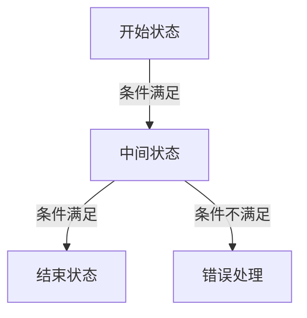
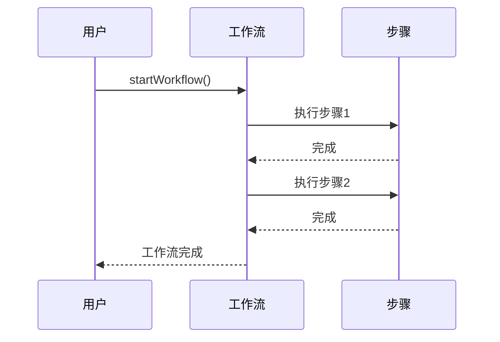
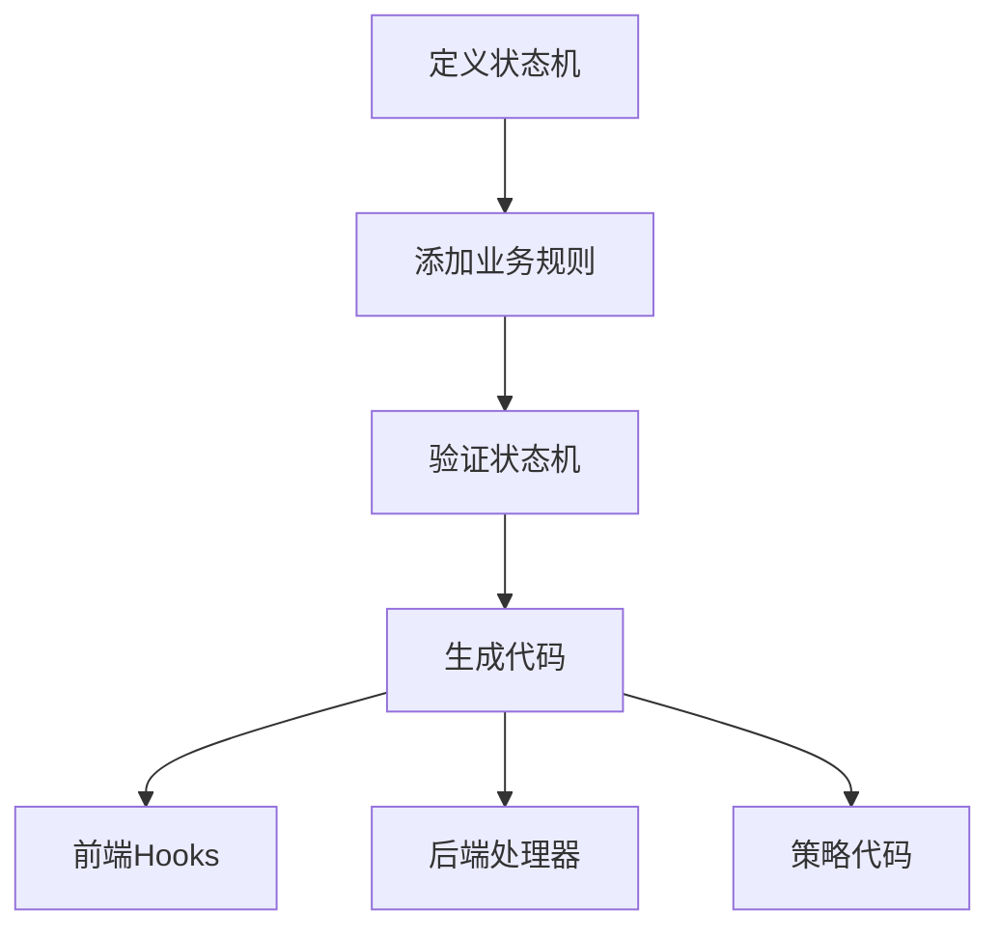

# 虚拟装配与智能工作流

<cite>
**本文档引用文件**   
- [EnhancedStateMachine.vue](file://src/SmartAbp.Vue/packages/lowcode-designer/src/components/EnhancedStateMachine.vue)
- [useSmartWorkflow.ts](file://src/SmartAbp.Vue/src/composables/useSmartWorkflow.ts)
- [enhancedStateMachine.ts](file://src/SmartAbp.Vue/packages/lowcode-core/src/stores/enhancedStateMachine.ts)
- [ruleExecutionEngine.ts](file://src/SmartAbp.Vue/packages/lowcode-core/src/engines/ruleExecutionEngine.ts)
- [actionExecutor.ts](file://src/SmartAbp.Vue/packages/lowcode-core/src/engines/actionExecutor.ts)
- [ruleExpressionParser.ts](file://src/SmartAbp.Vue/packages/lowcode-core/src/utils/ruleExpressionParser.ts)
</cite>

## 目录
1. [引言](#引言)
2. [EnhancedStateMachine组件设计与实现](#enhancedstatemachine组件设计与实现)
3. [状态管理机制与转换逻辑](#状态管理机制与转换逻辑)
4. [useSmartWorkflow组合式函数](#usesmartworkflow组合式函数)
5. [业务流程建模与执行](#业务流程建模与执行)
6. [使用示例与集成](#使用示例与集成)
7. [结论](#结论)

## 引言
hxlot项目中的虚拟装配和智能工作流组件为复杂业务流程的建模与执行提供了强大的支持。通过EnhancedStateMachine.vue组件和useSmartWorkflow组合式函数，开发者可以高效地构建和管理状态机驱动的工作流系统。本文档将深入探讨这些组件的设计与实现，详细说明其核心机制和使用方法。

## EnhancedStateMachine组件设计与实现

EnhancedStateMachine.vue组件是hxlot项目中虚拟装配和智能工作流的核心组件，它提供了一个直观的可视化界面，用于设计和管理状态机。该组件基于Vue 3和Pinia构建，利用Element Plus组件库实现用户界面。

组件的主要功能包括：
- **工作流元数据管理**：支持编辑工作流的名称、描述和实体信息。
- **状态管理**：允许添加、删除和编辑开始状态、中间状态和结束状态。
- **转换管理**：支持创建和管理状态之间的转换，包括条件和动作。
- **业务规则管理**：提供规则编辑功能，支持字段联动、权限约束、异步验证等规则类型。
- **代码生成**：能够生成前端、后端和策略代码，支持一键导出。

组件的UI设计遵循现代Web应用的最佳实践，采用响应式布局，确保在不同设备上都能提供良好的用户体验。通过侧边栏的标签页，用户可以方便地在状态、转换、规则和代码预览之间切换。

**组件来源**
- [EnhancedStateMachine.vue](file://src/SmartAbp.Vue/packages/lowcode-designer/src/components/EnhancedStateMachine.vue)

## 状态管理机制与转换逻辑

### 状态管理
EnhancedStateMachine组件的状态管理基于Pinia store实现，核心状态包括：
- `states`：存储所有状态的数组
- `transitions`：存储所有转换的数组
- `businessRules`：存储所有业务规则的数组
- `workflowMetadata`：存储工作流的元数据

状态管理方法包括：
- `addState`：添加新状态，验证状态ID唯一性和开始状态数量限制
- `removeState`：移除状态及其相关转换
- `updateState`：更新状态的属性

### 转换逻辑
转换管理是状态机的核心，组件提供了以下功能：
- **转换创建**：通过`addTransition`方法创建转换，验证源状态和目标状态的有效性
- **转换删除**：通过`removeTransition`方法删除转换
- **转换条件**：支持为转换添加条件表达式，只有满足条件时才能执行转换
- **转换动作**：支持为转换添加动作表达式，在转换执行时触发

转换的验证逻辑包括：
- 不能从结束状态创建转换
- 不能转换到开始状态
- 不能创建自循环转换
- 不能创建重复转换



**图示来源**
- [EnhancedStateMachine.vue](file://src/SmartAbp.Vue/packages/lowcode-designer/src/components/EnhancedStateMachine.vue)
- [enhancedStateMachine.ts](file://src/SmartAbp.Vue/packages/lowcode-core/src/stores/enhancedStateMachine.ts)

## useSmartWorkflow组合式函数

useSmartWorkflow组合式函数是hxlot项目中智能工作流的核心逻辑封装，它提供了一套完整的API来管理和执行工作流。

### 核心功能
- **工作流步骤管理**：定义工作流的步骤，包括ID、名称、描述、状态和进度
- **工作流执行**：支持启动和停止工作流，模拟执行每个步骤
- **进度计算**：实时计算工作流的总体进度
- **下一步建议**：根据当前执行状态提供下一步建议

### 实现细节
useSmartWorkflow函数使用Vue 3的Composition API，通过`ref`和`computed`创建响应式状态。核心逻辑包括：
- `startWorkflow`：启动工作流，遍历所有步骤并执行
- `stopWorkflow`：停止工作流执行
- `progress`：计算已完成步骤的百分比
- `nextStepSuggestion`：根据当前步骤提供下一步建议



**图示来源**
- [useSmartWorkflow.ts](file://src/SmartAbp.Vue/src/composables/useSmartWorkflow.ts)

## 业务流程建模与执行

### 业务规则引擎
EnhancedStateMachine组件集成了强大的业务规则引擎，支持以下功能：
- **规则类型**：字段联动、权限约束、异步验证、自定义规则
- **规则执行**：按优先级顺序执行规则，支持条件和动作
- **规则调试**：提供调试模式，记录规则执行日志

规则执行引擎的核心组件包括：
- `RuleExecutionEngine`：规则执行引擎主类
- `ExpressionParser`：表达式解析器，安全地解析和执行条件表达式
- `ActionExecutor`：动作执行器，执行规则的动作

### 代码生成
组件支持生成前端、后端和策略代码，提高开发效率。代码生成功能包括：
- **前端Hooks**：生成Vue组合式函数，用于在前端应用中使用状态机
- **后端处理器**：生成C#后端处理器，处理状态转换
- **策略代码**：生成授权策略代码，用于权限控制



**图示来源**
- [enhancedStateMachine.ts](file://src/SmartAbp.Vue/packages/lowcode-core/src/stores/enhancedStateMachine.ts)
- [ruleExecutionEngine.ts](file://src/SmartAbp.Vue/packages/lowcode-core/src/engines/ruleExecutionEngine.ts)
- [actionExecutor.ts](file://src/SmartAbp.Vue/packages/lowcode-core/src/engines/actionExecutor.ts)
- [ruleExpressionParser.ts](file://src/SmartAbp.Vue/packages/lowcode-core/src/utils/ruleExpressionParser.ts)

## 使用示例与集成

### 集成步骤
1. **安装依赖**：确保项目中已安装`@smartabp/lowcode-core`和`@smartabp/lowcode-tools`
2. **引入组件**：在Vue组件中引入EnhancedStateMachine.vue
3. **配置store**：在Pinia store中配置状态机
4. **使用组合式函数**：在组件中使用useSmartWorkflow组合式函数

### 示例代码
```vue
<template>
  <EnhancedStateMachine />
</template>

<script setup lang="ts">
import EnhancedStateMachine from '@smartabp/lowcode-designer/EnhancedStateMachine'
import { useSmartWorkflow } from '@smartabp/lowcode-composables'

const { startWorkflow, stopWorkflow } = useSmartWorkflow()

// 启动工作流
startWorkflow([
  { id: 'step1', name: '步骤1', status: 'pending', progress: 0 },
  { id: 'step2', name: '步骤2', status: 'pending', progress: 0 }
])
</script>
```

### 配置选项
- **前端代码生成**：启用或禁用前端Hooks生成
- **后端代码生成**：启用或禁用后端处理器生成
- **策略代码生成**：启用或禁用策略代码生成
- **测试代码生成**：启用或禁用测试代码生成

**组件来源**
- [EnhancedStateMachine.vue](file://src/SmartAbp.Vue/packages/lowcode-designer/src/components/EnhancedStateMachine.vue)
- [useSmartWorkflow.ts](file://src/SmartAbp.Vue/src/composables/useSmartWorkflow.ts)

## 结论
hxlot项目中的虚拟装配和智能工作流组件为复杂业务流程的建模与执行提供了全面的解决方案。通过EnhancedStateMachine.vue组件和useSmartWorkflow组合式函数，开发者可以高效地构建和管理状态机驱动的工作流系统。这些组件不仅提供了直观的可视化界面，还集成了强大的业务规则引擎和代码生成功能，显著提高了开发效率和系统可靠性。未来，可以进一步扩展组件功能，支持更多类型的业务规则和更复杂的转换逻辑，以满足不断变化的业务需求。