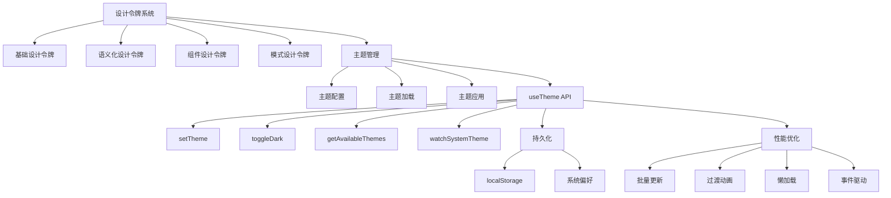

# 主题系统

<cite>
**本文档引用文件**  
- [useTheme.ts](file://src/SmartAbp.Vue/src/composables/useTheme.ts)
- [index.ts](file://src/SmartAbp.Vue/src/styles/design-tokens/index.ts)
- [index.css](file://src/SmartAbp.Vue/src/styles/design-system/index.css)
- [THEME_SYSTEM_README.md](file://src/SmartAbp.Vue/THEME_SYSTEM_README.md)
- [主题样式系统深度优化方案.md](file://src/SmartAbp.Vue/doc/主题样式/主题样式系统深度优化方案.md)
</cite>

## 目录
1. [简介](#简介)
2. [设计令牌与CSS变量机制](#设计令牌与css变量机制)
3. [useTheme组合式API详解](#usetheme组合式api详解)
4. [主题系统架构设计](#主题系统架构设计)
5. [主题系统架构图](#主题系统架构图)
6. [实际应用示例](#实际应用示例)
7. [总结](#总结)

## 简介

hxlot项目构建了一套完整的企业级多主题样式切换和一键暗黑系统，支持多种预设主题和响应式适配。该系统基于设计令牌（design tokens）和CSS变量实现动态主题切换，提供流畅的用户体验和强大的扩展能力。系统采用四层设计令牌架构，包含基础令牌、语义化令牌、组件令牌和模式令牌，确保主题系统的可维护性和一致性。

**文档来源**  
- [THEME_SYSTEM_README.md](file://src/SmartAbp.Vue/THEME_SYSTEM_README.md)

## 设计令牌与CSS变量机制

### 四层设计令牌架构

主题系统采用四层设计令牌架构，确保设计的一致性和可扩展性：

#### 第一层：基础设计令牌（Primitive Tokens）
基础令牌定义了系统中最基本的设计变量，包括色彩空间、间距系统和动效参数。色彩系统基于HSL模型，支持算法生成色板；间距系统采用8px网格；动效系统定义了标准的持续时间和缓动函数。

#### 第二层：语义化设计令牌（Semantic Tokens）
语义化令牌将基础令牌映射到具体的语义名称，如`--color-primary`、`--spacing-4`等。这些令牌不直接对应具体颜色值，而是引用基础令牌，实现设计系统的解耦。

#### 第三层：组件设计令牌（Component Tokens）
组件令牌为特定UI组件定义样式变量，如按钮、输入框和卡片等。每个组件都有独立的令牌集合，包含正常状态和交互状态（hover、active、focus等）的样式定义。

#### 第四层：模式设计令牌（Pattern Tokens）
模式令牌定义了布局和响应式相关的变量，包括侧边栏宽度、头部高度、移动端间距等。这些令牌支持断点驱动的响应式设计，确保在不同设备上的一致体验。

### CSS变量实现机制

系统通过CSS变量实现样式的动态变化。设计令牌被编译为CSS自定义属性，存储在`:root`选择器中。主题切换时，通过JavaScript动态修改这些变量值，实现即时的样式更新。系统还支持`data-theme`属性，允许基于属性选择器应用不同的主题变体。

```css
:root {
  --color-primary: #1e3a5f;
  --spacing-4: 1rem;
  --radius-md: 0.375rem;
}

[data-theme="dark"] {
  --color-primary: #4a90e2;
  --bg-primary: #1a1a1a;
}
```

**文档来源**  
- [主题样式系统深度优化方案.md](file://src/SmartAbp.Vue/doc/主题样式/主题样式系统深度优化方案.md)
- [index.css](file://src/SmartAbp.Vue/src/styles/design-system/index.css)

## useTheme组合式API详解

`useTheme`是一个Vue组合式API，提供主题切换、持久化和动态更新功能。该API封装了主题管理的复杂逻辑，为开发者提供简洁的接口。

### 核心功能

#### 主题切换
`setTheme`函数用于切换到指定主题。函数接收主题名称作为参数，验证后更新当前主题，并触发样式更新。系统预定义了五种主题：简洁亮色、优雅暗黑、科技蓝调、商务绿和创意紫。

```typescript
const { setTheme } = useTheme()
setTheme('dark') // 切换到暗黑主题
```

#### 主题持久化
主题选择通过`localStorage`进行持久化存储。`setTheme`函数在切换主题时自动将选择保存到本地存储，确保用户刷新页面后仍保持之前的主题设置。同时支持系统偏好跟随功能，当用户未手动选择主题时，自动匹配系统暗黑模式设置。

#### 动态主题更新
`applyTheme`函数负责应用主题样式。该函数采用性能优化策略，通过创建`<style>`标签批量注入CSS变量，避免逐个调用`setProperty`带来的性能损耗。更新过程分为四个阶段：生成色板、添加过渡类、批量更新变量和移除过渡类，确保主题切换的平滑动画效果。

### API接口

`useTheme`返回以下接口：

- `currentTheme`: 当前主题名称的响应式引用
- `theme`: 当前主题配置的计算属性
- `isDark`: 是否为暗黑主题的计算属性
- `setTheme(themeName)`: 切换到指定主题
- `toggleDark()`: 在亮色和暗色主题间切换
- `getAvailableThemes()`: 获取所有可用主题列表
- `watchSystemTheme()`: 监听系统主题变化

### 工具函数

`themeUtils`提供了一系列实用工具函数：

- `getThemeColor(colorKey, themeName)`: 获取指定主题的特定颜色
- `generateGradient(color1, color2, direction)`: 生成线性渐变
- `adjustOpacity(color, opacity)`: 调整颜色透明度

**文档来源**  
- [useTheme.ts](file://src/SmartAbp.Vue/src/composables/useTheme.ts)

## 主题系统架构设计

### 主题配置

主题配置采用中心化管理，所有主题定义在`themeConfig`对象中。每个主题包含名称、图标和颜色配置。颜色配置不仅包括基础颜色，还支持10级色板系统，通过`generateThemePalettes`函数基于主色自动生成完整的色板。

### 主题加载

主题加载采用懒加载策略。色板在首次应用主题时生成并缓存，避免重复计算。系统通过`requestAnimationFrame`优化渲染时机，确保主题更新与浏览器重绘同步，减少不必要的重排重绘。

### 主题应用

主题应用流程如下：
1. 生成或获取主题色板
2. 添加`theme-transitioning`类启用过渡动画
3. 通过`<style>`标签批量注入CSS变量
4. 更新HTML元素的类名以应用主题
5. 300ms后移除过渡类，完成切换

### 性能优化

系统采用多项性能优化技术：
- **批量更新**：通过`<style>`标签一次性注入所有CSS变量，比逐个`setProperty`快10倍
- **过渡动画**：使用CSS过渡类确保平滑的视觉效果
- **懒加载**：色板按需生成，减少初始加载时间
- **事件驱动**：触发`theme-changed`自定义事件，通知组件响应主题变化

**文档来源**  
- [useTheme.ts](file://src/SmartAbp.Vue/src/composables/useTheme.ts)
- [主题样式系统深度优化方案.md](file://src/SmartAbp.Vue/doc/主题样式/主题样式系统深度优化方案.md)

## 主题系统架构图



**图表来源**  
- [useTheme.ts](file://src/SmartAbp.Vue/src/composables/useTheme.ts)
- [主题样式系统深度优化方案.md](file://src/SmartAbp.Vue/doc/主题样式/主题样式系统深度优化方案.md)

## 实际应用示例

### 定义新主题

要定义新主题，需在`themeConfig`中添加新的主题配置：

```typescript
themeConfig['custom'] = {
  name: '自定义主题',
  icon: '🎨',
  colors: {
    primary: '#ff6b6b',
    secondary: '#f7f7f7',
    accent: '#4ecdc4',
    // ... 其他颜色
  }
}
```

### 在组件中使用主题

在Vue组件中使用`useTheme`：

```vue
<script setup>
import { useTheme } from '@/composables/useTheme'

const { theme, setTheme, toggleDark } = useTheme()
</script>

<template>
  <div class="theme-selector">
    <button 
      v-for="t in getAvailableThemes()" 
      :key="t.key"
      @click="setTheme(t.key)"
      :style="{ backgroundColor: theme.colors.primary }"
    >
      {{ t.icon }} {{ t.name }}
    </button>
    <button @click="toggleDark">切换明暗</button>
  </div>
</template>
```

### 在CSS中使用设计令牌

在样式中使用CSS变量：

```css
.my-component {
  background-color: var(--color-primary);
  color: var(--text-primary);
  padding: var(--spacing-4);
  border-radius: var(--radius-md);
  transition: all var(--duration-normal) var(--timing-ease);
}
```

**文档来源**  
- [useTheme.ts](file://src/SmartAbp.Vue/src/composables/useTheme.ts)
- [index.ts](file://src/SmartAbp.Vue/src/styles/design-tokens/index.ts)

## 总结

hxlot项目的主题系统通过四层设计令牌架构和CSS变量技术，实现了灵活、高性能的主题管理。`useTheme`组合式API提供了简洁的接口，支持主题切换、持久化和动态更新。系统采用多项性能优化策略，确保主题切换的流畅体验。该架构具有良好的扩展性，易于添加新主题和定制设计系统，为用户提供一致且美观的界面体验。

**文档来源**  
- [THEME_SYSTEM_README.md](file://src/SmartAbp.Vue/THEME_SYSTEM_README.md)
- [主题样式系统深度优化方案.md](file://src/SmartAbp.Vue/doc/主题样式/主题样式系统深度优化方案.md)