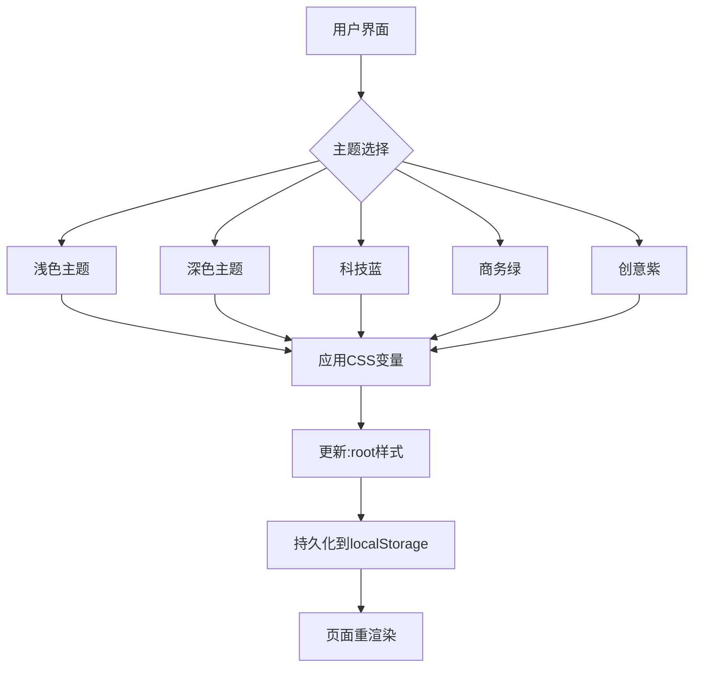
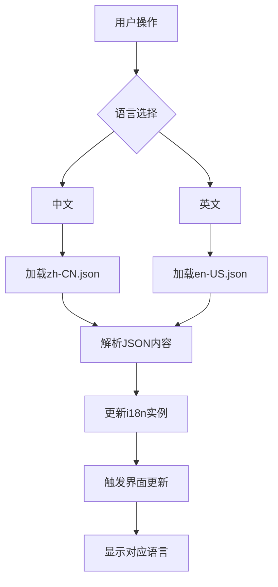

# 国际化与主题系统

<cite>
**本文档引用文件**  
- [zh-CN.json](file://src/SmartAbp.Vue/src/locales/zh-CN.json)
- [en-US.json](file://src/SmartAbp.Vue/src/locales/en-US.json)
- [useTheme.ts](file://src/SmartAbp.Vue/src/composables/useTheme.ts)
- [THEME_SYSTEM_README.md](file://src/SmartAbp.Vue/THEME_SYSTEM_README.md)
</cite>

## 目录
1. [国际化系统](#国际化系统)
2. [主题系统](#主题系统)
3. [Composables 使用方法](#composables-使用方法)
4. [主题切换与持久化](#主题切换与持久化)
5. [扩展与自定义](#扩展与自定义)
6. [架构图与流程图](#架构图与流程图)

## 国际化系统

hxlot项目采用基于JSON文件的多语言支持机制，通过`zh-CN.json`和`en-US.json`文件实现国际化。系统支持动态语言切换，用户界面文本可根据用户选择的语言实时更新。每个JSON文件包含多个命名空间（如common、wizard、designer等），组织相关文本内容。系统通过键值对方式管理翻译内容，支持嵌套结构和参数化消息。语言切换后，系统会触发相应事件通知组件更新界面。

**Section sources**
- [zh-CN.json](file://src/SmartAbp.Vue/src/locales/zh-CN.json)
- [en-US.json](file://src/SmartAbp.Vue/src/locales/en-US.json)

## 主题系统

主题系统基于设计令牌（design tokens）和CSS变量实现，提供多种预设主题（简洁亮色、优雅暗黑、科技蓝调、商务绿、创意紫）。系统使用`useTheme` Composable管理主题状态，通过CSS自定义属性（CSS variables）动态更新界面样式。主题配置包含完整的颜色体系，包括主色、辅助色、成功、警告、错误等语义化颜色。系统支持10级色板生成，确保色彩一致性。设计令牌涵盖颜色、间距、字体、圆角、阴影等多个维度，形成完整的设计系统。

**Section sources**
- [useTheme.ts](file://src/SmartAbp.Vue/src/composables/useTheme.ts)
- [THEME_SYSTEM_README.md](file://src/SmartAbp.Vue/THEME_SYSTEM_README.md)

## Composables 使用方法

`useI18n`和`useTheme`等Composables提供了一致的API接口。`useTheme`返回包含当前主题、主题切换、暗黑模式切换等功能的对象。开发者可通过`setTheme`方法设置特定主题，或使用`toggleDark`切换暗黑模式。`getAvailableThemes`方法返回可用主题列表，用于构建主题选择器。`useI18n`提供`t`函数用于文本翻译，支持嵌套键和参数化消息。这些Composables基于Vue的响应式系统，确保界面自动更新。

**Section sources**
- [useTheme.ts](file://src/SmartAbp.Vue/src/composables/useTheme.ts)

## 主题切换与持久化

主题切换通过修改`:root`元素的CSS变量实现，系统使用`requestAnimationFrame`优化性能，避免重排重绘。切换过程包含平滑过渡动画，提升用户体验。选中的主题通过`localStorage`持久化存储，确保用户下次访问时保持相同主题。系统支持"跟随系统"模式，通过`window.matchMedia("(prefers-color-scheme: dark)")`监听系统偏好设置。主题应用包含四个阶段：生成色板、添加过渡类、批量更新CSS变量、移除过渡类，确保切换流畅。

**Section sources**
- [useTheme.ts](file://src/SmartAbp.Vue/src/composables/useTheme.ts)

## 扩展与自定义

主题系统设计具有良好的扩展性，开发者可轻松添加新主题。通过在`themeConfig`对象中添加新的主题配置，定义名称、图标和颜色体系即可。系统支持动态生成色板，减少手动定义工作量。`themeUtils`工具集提供`getThemeColor`、`generateGradient`、`adjustOpacity`等实用方法，便于在代码中操作主题颜色。国际化系统支持新增语言，只需添加对应的JSON文件并注册即可。系统架构模块化，便于定制和扩展。

**Section sources**
- [useTheme.ts](file://src/SmartAbp.Vue/src/composables/useTheme.ts)
- [THEME_SYSTEM_README.md](file://src/SmartAbp.Vue/THEME_SYSTEM_README.md)

## 架构图与流程图

**Diagram sources**
- [useTheme.ts](file://src/SmartAbp.Vue/src/composables/useTheme.ts)

**Diagram sources**
- [zh-CN.json](file://src/SmartAbp.Vue/src/locales/zh-CN.json)
- [en-US.json](file://src/SmartAbp.Vue/src/locales/en-US.json)