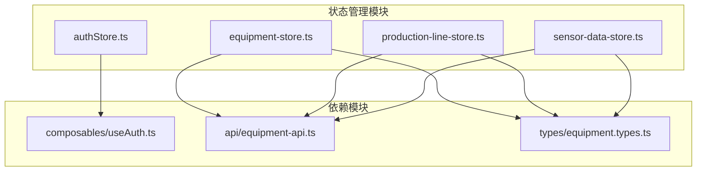
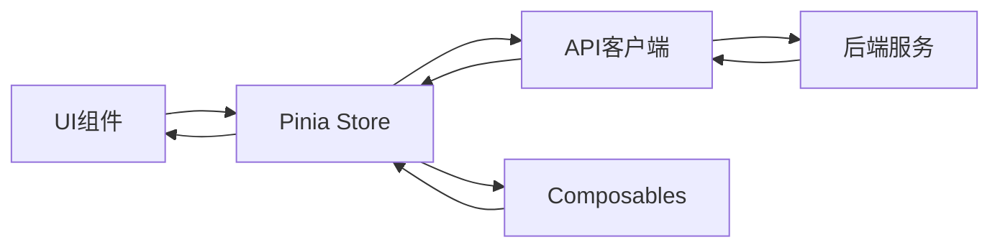
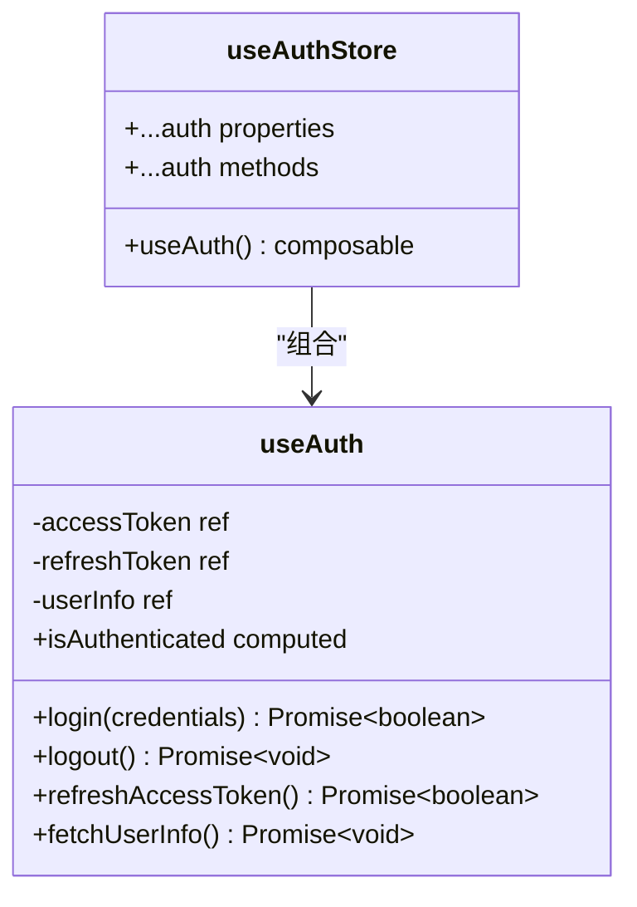
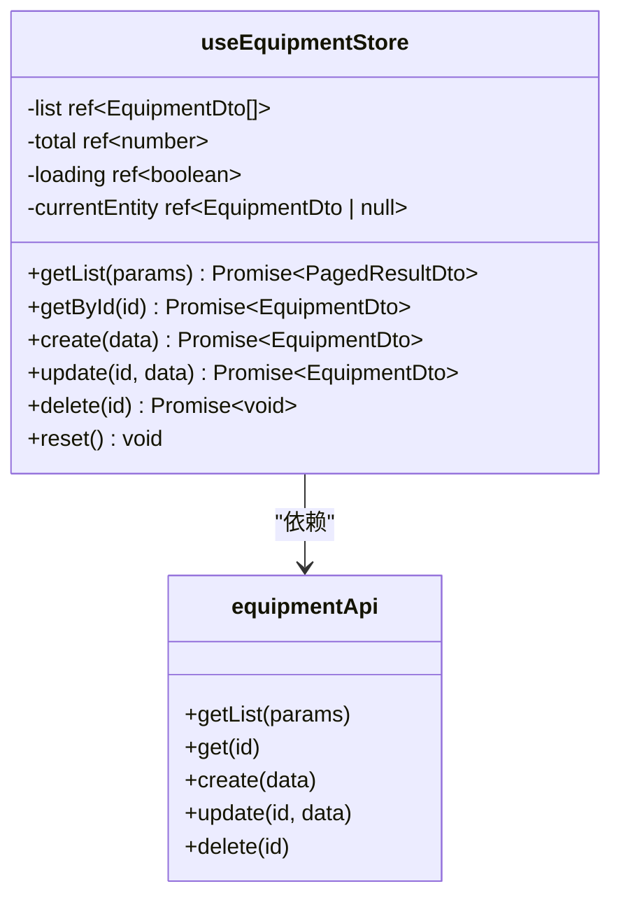
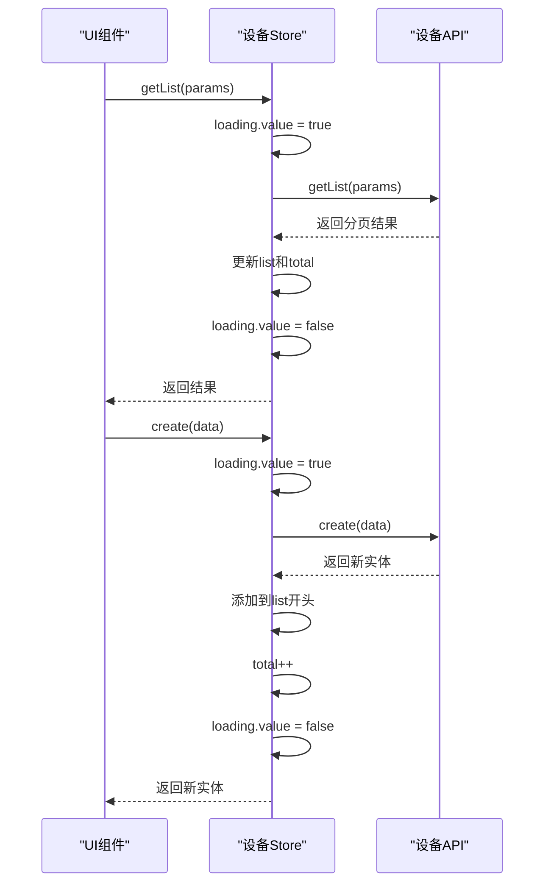
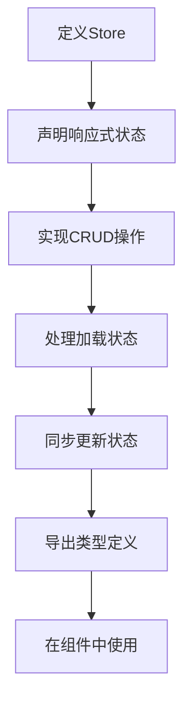
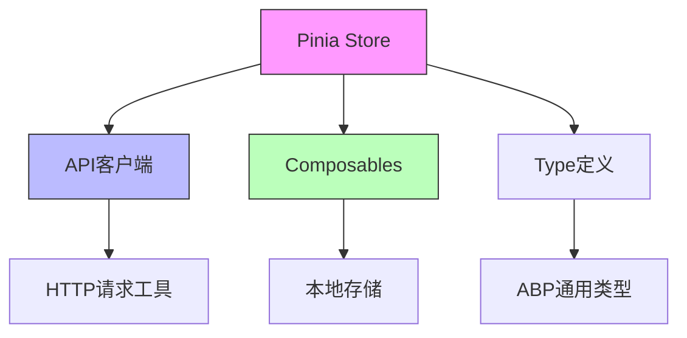

# Pinia架构

<cite>
**Referenced Files in This Document**   
- [authStore.ts](file://output/mes-uniapp/stores/authStore.ts)
- [equipment-store.ts](file://output/mes-uniapp/stores/equipment-store.ts)
- [production-line-store.ts](file://output/mes-uniapp/stores/production-line-store.ts)
- [sensor-data-store.ts](file://output/mes-uniapp/stores/sensor-data-store.ts)
- [useAuth.ts](file://output/mes-uniapp/composables/useAuth.ts)
- [equipment-api.ts](file://output/mes-uniapp/api/equipment-api.ts)
- [equipment.types.ts](file://output/mes-uniapp/types/equipment.types.ts)
</cite>

## 目录
1. [引言](#引言)
2. [项目结构](#项目结构)
3. [核心组件](#核心组件)
4. [架构概述](#架构概述)
5. [详细组件分析](#详细组件分析)
6. [依赖分析](#依赖分析)
7. [性能考虑](#性能考虑)
8. [故障排除指南](#故障排除指南)
9. [结论](#结论)

## 引言
本文件详细阐述了hxlot项目中Pinia状态管理架构的设计与实现。Pinia作为Vue 3官方推荐的状态管理库，在本项目中承担着核心数据流管理职责，为设备管理、生产线管理、传感器数据管理和用户认证等模块提供统一的状态管理解决方案。文档将深入解析Pinia在项目中的具体应用模式、类型安全实现以及模块化设计原则。

## 项目结构
hxlot项目采用模块化架构设计，Pinia状态管理模块集中存放于`output/mes-uniapp/stores`目录下，每个业务模块拥有独立的store文件，实现了关注点分离和高内聚低耦合的设计原则。

**Diagram sources**
- [authStore.ts](file://output/mes-uniapp/stores/authStore.ts)
- [equipment-store.ts](file://output/mes-uniapp/stores/equipment-store.ts)
- [production-line-store.ts](file://output/mes-uniapp/stores/production-line-store.ts)
- [sensor-data-store.ts](file://output/mes-uniapp/stores/sensor-data-store.ts)
- [useAuth.ts](file://output/mes-uniapp/composables/useAuth.ts)
- [equipment-api.ts](file://output/mes-uniapp/api/equipment-api.ts)
- [equipment.types.ts](file://output/mes-uniapp/types/equipment.types.ts)

**Section sources**
- [authStore.ts](file://output/mes-uniapp/stores/authStore.ts)
- [equipment-store.ts](file://output/mes-uniapp/stores/equipment-store.ts)
- [production-line-store.ts](file://output/mes-uniapp/stores/production-line-store.ts)
- [sensor-data-store.ts](file://output/mes-uniapp/stores/sensor-data-store.ts)

## 核心组件
hxlot项目的Pinia架构由多个核心组件构成，包括认证状态管理、设备状态管理、生产线状态管理和传感器数据状态管理。每个store都遵循统一的设计模式，包含状态定义、操作方法和类型导出，确保了代码的一致性和可维护性。

**Section sources**
- [authStore.ts](file://output/mes-uniapp/stores/authStore.ts#L1-L20)
- [equipment-store.ts](file://output/mes-uniapp/stores/equipment-store.ts#L1-L168)

## 架构概述
hxlot项目中的Pinia状态管理架构采用模块化设计，每个业务领域拥有独立的store实例。架构通过`defineStore`函数创建store，利用Composition API风格组织状态和逻辑，实现了逻辑复用和类型安全。状态管理与API服务层分离，store通过调用API客户端实现数据持久化，形成了清晰的分层架构。

**Diagram sources**
- [equipment-store.ts](file://output/mes-uniapp/stores/equipment-store.ts)
- [equipment-api.ts](file://output/mes-uniapp/api/equipment-api.ts)
- [useAuth.ts](file://output/mes-uniapp/composables/useAuth.ts)

## 详细组件分析
本节深入分析hxlot项目中Pinia状态管理的核心组件，包括其创建方式、状态定义、操作实现和类型安全机制。

### 认证状态管理分析
认证状态管理模块通过组合式API复用认证逻辑，实现了用户会话状态的集中管理。

#### 认证Store实现

**Diagram sources**
- [authStore.ts](file://output/mes-uniapp/stores/authStore.ts#L1-L20)
- [useAuth.ts](file://output/mes-uniapp/composables/useAuth.ts#L1-L130)

**Section sources**
- [authStore.ts](file://output/mes-uniapp/stores/authStore.ts#L1-L20)
- [useAuth.ts](file://output/mes-uniapp/composables/useAuth.ts#L1-L130)

### 设备状态管理分析
设备状态管理模块实现了对设备实体的完整CRUD操作，包含列表管理、详情获取、创建、更新和删除功能。

#### 设备Store实现

**Diagram sources**
- [equipment-store.ts](file://output/mes-uniapp/stores/equipment-store.ts#L1-L168)
- [equipment-api.ts](file://output/mes-uniapp/api/equipment-api.ts#L1-L58)

**Section sources**
- [equipment-store.ts](file://output/mes-uniapp/stores/equipment-store.ts#L1-L168)
- [equipment-api.ts](file://output/mes-uniapp/api/equipment-api.ts#L1-L58)

#### 设备Store操作流程

**Diagram sources**
- [equipment-store.ts](file://output/mes-uniapp/stores/equipment-store.ts#L1-L168)
- [equipment-api.ts](file://output/mes-uniapp/api/equipment-api.ts#L1-L58)

### 生产线与传感器数据状态管理
生产线和传感器数据状态管理模块与设备管理模块采用相同的设计模式，体现了代码的可复用性和一致性。

#### 通用状态管理模式

**Diagram sources**
- [equipment-store.ts](file://output/mes-uniapp/stores/equipment-store.ts#L1-L168)
- [production-line-store.ts](file://output/mes-uniapp/stores/production-line-store.ts#L1-L168)
- [sensor-data-store.ts](file://output/mes-uniapp/stores/sensor-data-store.ts#L1-L168)

**Section sources**
- [equipment-store.ts](file://output/mes-uniapp/stores/equipment-store.ts#L1-L168)
- [production-line-store.ts](file://output/mes-uniapp/stores/production-line-store.ts#L1-L168)
- [sensor-data-store.ts](file://output/mes-uniapp/stores/sensor-data-store.ts#L1-L168)

## 依赖分析
Pinia状态管理模块与其他系统组件存在明确的依赖关系，形成了清晰的架构边界。

**Diagram sources**
- [equipment-store.ts](file://output/mes-uniapp/stores/equipment-store.ts)
- [equipment-api.ts](file://output/mes-uniapp/api/equipment-api.ts)
- [useAuth.ts](file://output/mes-uniapp/composables/useAuth.ts)
- [equipment.types.ts](file://output/mes-uniapp/types/equipment.types.ts)

**Section sources**
- [equipment-store.ts](file://output/mes-uniapp/stores/equipment-store.ts#L1-L168)
- [equipment-api.ts](file://output/mes-uniapp/api/equipment-api.ts#L1-L58)
- [useAuth.ts](file://output/mes-uniapp/composables/useAuth.ts#L1-L130)
- [equipment.types.ts](file://output/mes-uniapp/types/equipment.types.ts#L1-L62)

## 性能考虑
hxlot项目的Pinia状态管理设计充分考虑了性能优化，通过合理的状态管理策略和错误处理机制确保应用的响应性和稳定性。

- **状态更新优化**：在更新操作中，store会精确更新列表中的特定项，避免了不必要的重新渲染。
- **加载状态管理**：每个store都维护`loading`状态，用于在UI层面显示加载指示器，提升用户体验。
- **错误处理**：所有异步操作都包含完整的try-catch错误处理，确保异常不会导致应用崩溃。
- **内存管理**：通过`reset`方法提供状态重置功能，有助于在适当场景下清理内存。

## 故障排除指南
当遇到Pinia状态管理相关问题时，可参考以下排查步骤：

**Section sources**
- [equipment-store.ts](file://output/mes-uniapp/stores/equipment-store.ts#L1-L168)
- [useAuth.ts](file://output/mes-uniapp/composables/useAuth.ts#L1-L130)

### 常见问题及解决方案
1. **状态未更新**：检查是否正确使用了ref包装状态，并确认在组件中正确引用了store实例。
2. **API调用失败**：查看控制台错误日志，确认API端点和网络连接正常。
3. **类型错误**：确保类型定义文件与API响应结构一致，检查TypeScript编译错误。
4. **内存泄漏**：确认在页面销毁时不需要手动清理store状态，Pinia会自动管理。

## 结论
hxlot项目中的Pinia状态管理架构设计合理，通过模块化store、类型安全和清晰的依赖关系，为应用提供了稳定可靠的状态管理解决方案。架构遵循了Vue 3的最佳实践，利用Composition API的优势实现了逻辑复用和代码组织。未来可进一步优化懒加载策略，按需加载store以减少初始包大小，提升应用性能。