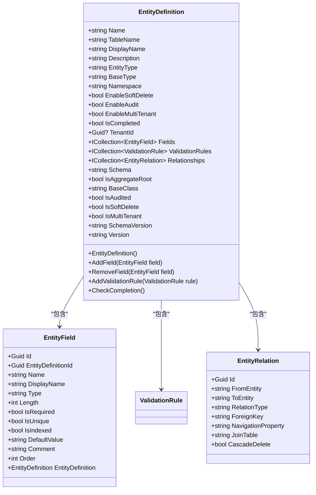
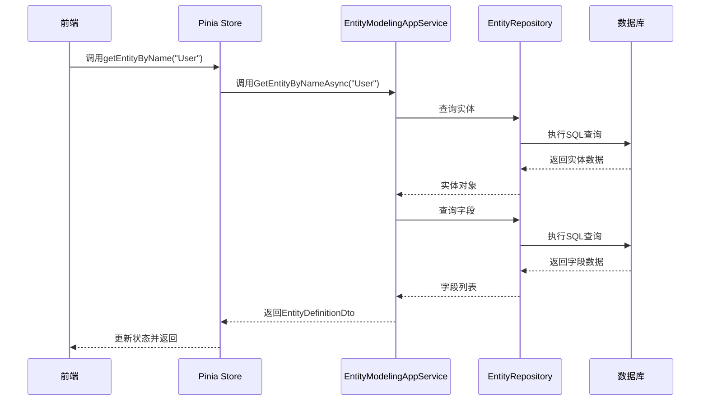
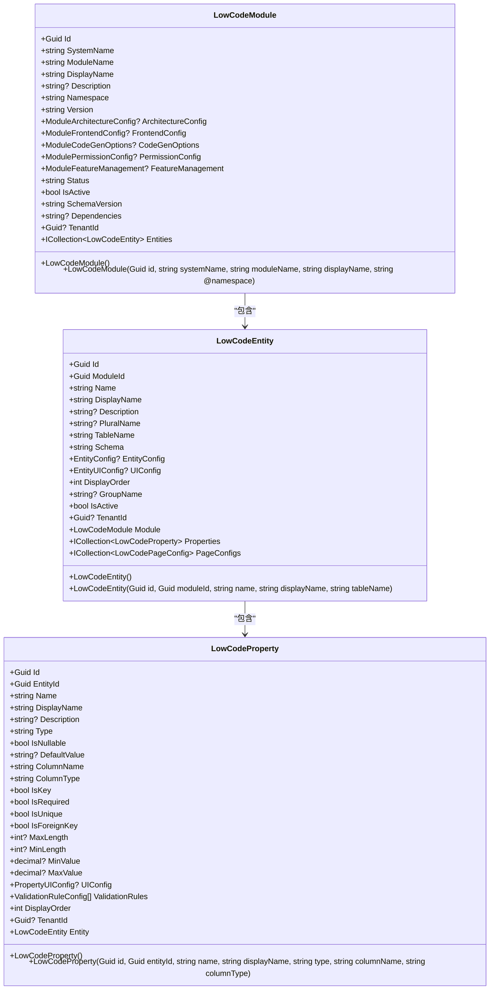
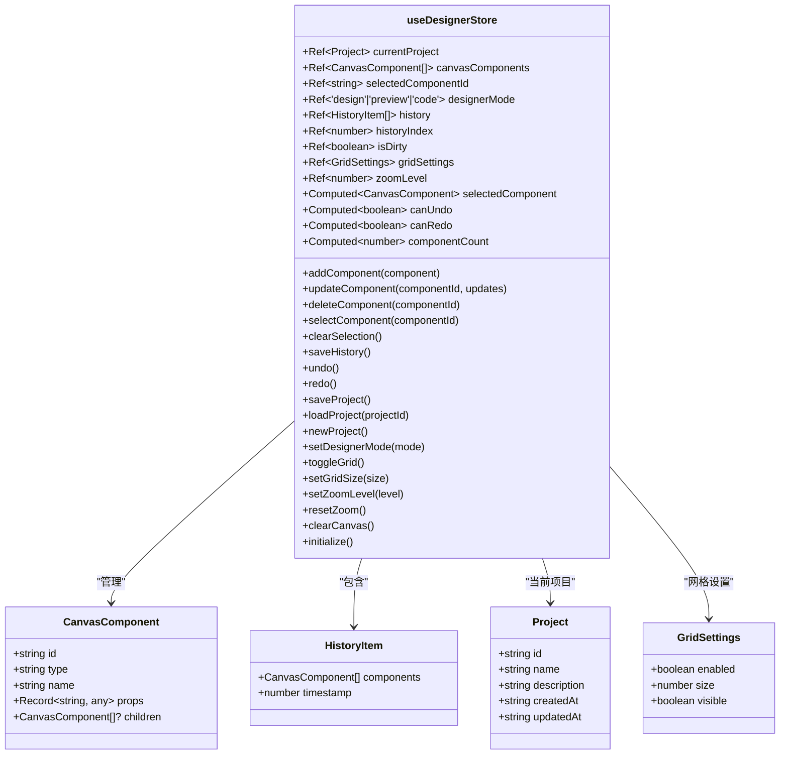
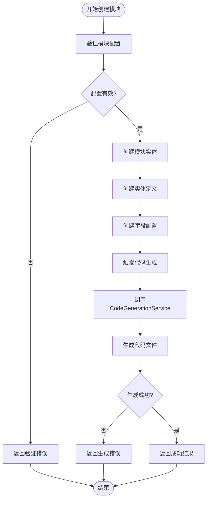
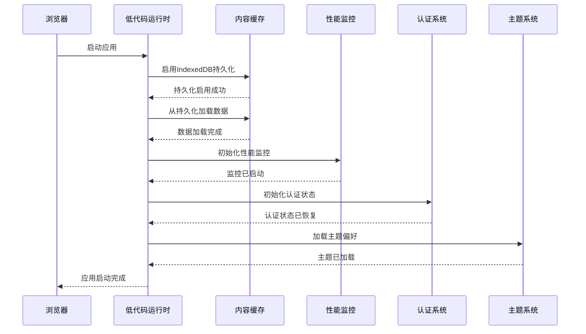

# 低代码功能状态管理

<cite>
**本文档引用文件**  
- [EntityModelingAppService.cs](file://src/SmartAbp.Application/LowCode/EntityModelingAppService.cs)
- [ModuleAppService.cs](file://src/SmartAbp.Application/LowCode/ModuleAppService.cs)
- [SmartStudioLiteAppService.cs](file://src/SmartAbp.Application/LowCode/SmartStudioLiteAppService.cs)
- [LowCodeModule.cs](file://src/SmartAbp.Domain/Entities/LowCode/LowCodeModule.cs)
- [LowCodeEntity.cs](file://src/SmartAbp.Domain/Entities/LowCode/LowCodeEntity.cs)
- [LowCodeProperty.cs](file://src/SmartAbp.Domain/Entities/LowCode/LowCodeProperty.cs)
- [权限管理系统低代码配置.json](file://config/权限管理系统低代码配置.json)
- [useDesignerStore.ts](file://src/SmartAbp.Vue/packages/lowcode-designer/src/stores/useDesignerStore.ts)
- [main.ts](file://src/SmartAbp.Vue/src/main.ts)
</cite>

## 目录
1. [引言](#引言)
2. [核心数据结构与实体建模](#核心数据结构与实体建模)
3. [状态管理实现机制](#状态管理实现机制)
4. [模块与实体关系管理](#模块与实体关系管理)
5. [低代码设计器状态管理](#低代码设计器状态管理)
6. [代码生成与配置管理](#代码生成与配置管理)
7. [交互模式与响应式设计](#交互模式与响应式设计)
8. [使用示例与最佳实践](#使用示例与最佳实践)
9. [性能优化建议](#性能优化建议)
10. [结论](#结论)

## 引言

hxlot项目中的低代码功能通过一套完整的状态管理系统实现了实体建模、代码生成和模块配置的高效管理。该系统采用分层架构设计，将前端响应式状态与后端持久化状态有机结合，支持从实体定义到代码生成的完整生命周期管理。系统核心包括实体定义、字段配置、关系映射等关键数据结构，通过标准化的接口和服务实现低代码设计器的动态响应能力。

**Section sources**
- [EntityModelingAppService.cs](file://src/SmartAbp.Application/LowCode/EntityModelingAppService.cs#L18-L351)
- [SmartStudioLiteAppService.cs](file://src/SmartAbp.Application/LowCode/SmartStudioLiteAppService.cs#L21-L410)

## 核心数据结构与实体建模

低代码系统的数据结构设计围绕实体建模展开，主要包括实体定义、字段配置和关系映射三个核心部分。实体定义类`EntityDefinition`继承自`FullAuditedAggregateRoot<Guid>`，包含名称、表名、显示名称、描述等基本信息，以及是否启用软删除、审计和多租户等配置属性。



**Diagram sources**
- [EntityDefinition.cs](file://src/SmartAbp.Domain/Entities/LowCode/EntityDefinition.cs#L12-L199)
- [EntityField.cs](file://src/SmartAbp.Domain/Entities/LowCode/EntityField.cs#L10-L107)
- [EntityRelation.cs](file://src/SmartAbp.Domain/Entities/LowCode/EntityRelation.cs#L10-L60)

## 状态管理实现机制

系统采用分层状态管理模式，将应用状态分为持久化状态和运行时状态。持久化状态存储在数据库中，包括实体定义、字段配置等元数据；运行时状态则通过前端Pinia store管理，实现响应式更新。

后端通过`EntityModelingAppService`提供实体建模的CRUD操作，该服务实现了`IEntityModelingAppService`接口，支持获取所有实体、根据ID或名称获取实体、创建和更新实体等操作。服务内部使用ABP框架的仓储模式，通过`IRepository<EntityDefinition, Guid>`进行数据访问。



**Diagram sources**
- [EntityModelingAppService.cs](file://src/SmartAbp.Application/LowCode/EntityModelingAppService.cs#L18-L351)
- [EntityDefinition.cs](file://src/SmartAbp.Domain/Entities/LowCode/EntityDefinition.cs#L12-L199)

## 模块与实体关系管理

模块管理通过`LowCodeModule`和`LowCodeEntity`两个核心实体实现。`LowCodeModule`代表一个功能模块，包含系统名称、模块名称、显示名称等基本信息，以及架构配置、前端配置、代码生成选项等JSON格式的配置信息。`LowCodeEntity`代表模块内的实体，与模块形成一对多关系。



**Diagram sources**
- [LowCodeModule.cs](file://src/SmartAbp.Domain/Entities/LowCode/LowCodeModule.cs#L15-L162)
- [LowCodeEntity.cs](file://src/SmartAbp.Domain/Entities/LowCode/LowCodeEntity.cs#L15-L158)
- [LowCodeProperty.cs](file://src/SmartAbp.Domain/Entities/LowCode/LowCodeProperty.cs#L16-L202)

## 低代码设计器状态管理

前端设计器采用Pinia作为状态管理工具，通过`useDesignerStore`实现全局状态管理。该store管理设计器的核心状态，包括当前项目信息、画布组件列表、选中组件、设计器模式、历史记录等。



**Diagram sources**
- [useDesignerStore.ts](file://src/SmartAbp.Vue/packages/lowcode-designer/src/stores/useDesignerStore.ts#L0-L272)

## 代码生成与配置管理

代码生成功能通过`SmartStudioLiteAppService`实现，该服务提供简化的模块创建接口，支持一次性提交基本信息和字段配置列表。服务内部通过`CodeGenerationService`触发代码生成流程，生成后端DDD架构代码、前端Vue组件、API接口等完整代码文件。

配置管理采用JSON格式存储复杂配置，如`EntityConfig`、`UIConfig`、`PropertyUIConfig`等。这些配置类包含丰富的属性，支持灵活的代码生成和界面渲染。例如，`PropertyUIConfig`包含控件类型、控件属性、列表可见性、详情可见性等UI相关配置。



**Diagram sources**
- [SmartStudioLiteAppService.cs](file://src/SmartAbp.Application/LowCode/SmartStudioLiteAppService.cs#L21-L410)
- [CodeGenerationService.cs](file://src/SmartAbp.Application/LowCode/CodeGenerationService.cs#L1-L100)

## 交互模式与响应式设计

系统通过前后端分离的架构实现低代码设计器的响应式特性。前端通过API调用获取和更新元数据，后端提供标准化的RESTful接口。前端状态管理采用Pinia，结合Vue 3的响应式系统，实现数据的自动更新和视图的实时渲染。

在应用启动时，系统会初始化低代码运行时环境，启用IndexedDB持久化存储，实现内容缓存的持久化和冷启动加载。同时，系统会初始化性能监控、认证状态、图标风格等全局状态。



**Diagram sources**
- [main.ts](file://src/SmartAbp.Vue/src/main.ts#L246-L280)

## 使用示例与最佳实践

以下是一个典型的权限管理系统低代码配置示例，展示了如何定义模块、实体和字段配置：

```json
{
    "systemName": "SmartAbp",
    "moduleName": "PermissionManagement",
    "displayName": "权限管理系统",
    "description": "企业级权限管理系统 - 通过低代码引擎生成",
    "databaseProvider": "SqlServer",
    "entities": [
        {
            "name": "Menu",
            "displayName": "菜单管理",
            "description": "系统菜单和路由管理",
            "tableName": "AppMenus",
            "primaryKey": "Id",
            "hasAuditFields": true,
            "hasMultiTenant": true,
            "hasSoftDelete": false,
            "fields": [
                {
                    "name": "Name",
                    "displayName": "菜单名称",
                    "type": "String",
                    "maxLength": 100,
                    "required": true,
                    "description": "菜单名称（英文，如：user-management）",
                    "uiComponent": "Input",
                    "validationRules": [
                        "Required",
                        "MaxLength:100"
                    ]
                },
                {
                    "name": "Code",
                    "displayName": "菜单编码",
                    "type": "String",
                    "maxLength": 50,
                    "required": true,
                    "description": "菜单编码（全局唯一，如：SYSTEM_USER_MGMT）",
                    "uiComponent": "Input",
                    "validationRules": [
                        "Required",
                        "MaxLength:50",
                        "Unique"
                    ]
                }
            ]
        }
    ]
}
```

最佳实践包括：
1. 使用统一的命名规范，确保系统名称、模块名称和实体名称的清晰性和一致性
2. 合理配置字段的验证规则，确保数据完整性
3. 利用JSON配置的灵活性，定制UI组件和代码生成选项
4. 通过模块依赖管理，实现模块间的解耦和复用

**Section sources**
- [权限管理系统低代码配置.json](file://config/权限管理系统低代码配置.json#L0-L799)

## 性能优化建议

1. **数据库查询优化**：在`EntityModelingAppService`中，获取实体时手动加载导航属性，避免N+1查询问题。建议在复杂查询场景下使用EF Core的Include方法进行预加载。

2. **缓存策略**：前端使用Pinia的持久化插件，结合IndexedDB实现数据的本地缓存。建议设置合理的缓存过期策略，平衡数据一致性和性能。

3. **代码生成优化**：`SmartStudioLiteAppService`在创建模块时触发代码生成，建议采用异步处理模式，避免阻塞主线程。可以考虑使用消息队列实现解耦。

4. **前端性能监控**：集成性能监控系统，跟踪关键指标如首屏加载时间、组件渲染性能等，及时发现性能瓶颈。

5. **历史记录管理**：设计器的撤销/重做功能使用内存存储历史记录，建议限制历史记录的最大数量，避免内存占用过高。

6. **批量操作优化**：对于批量删除实体等操作，建议在服务端实现批量处理逻辑，减少数据库交互次数。

**Section sources**
- [EntityModelingAppService.cs](file://src/SmartAbp.Application/LowCode/EntityModelingAppService.cs#L18-L351)
- [SmartStudioLiteAppService.cs](file://src/SmartAbp.Application/LowCode/SmartStudioLiteAppService.cs#L21-L410)
- [useDesignerStore.ts](file://src/SmartAbp.Vue/packages/lowcode-designer/src/stores/useDesignerStore.ts#L0-L272)

## 结论

hxlot项目的低代码功能状态管理系统通过精心设计的数据结构和分层架构，实现了高效的实体建模、代码生成和模块配置管理。系统采用前后端分离的设计模式，前端通过Pinia实现响应式状态管理，后端通过ABP框架提供稳定的API服务。通过JSON格式的灵活配置和标准化的接口设计，系统支持复杂的业务场景，同时保持了良好的可扩展性和维护性。未来可以进一步优化性能，增强代码生成的智能化程度，提升用户体验。