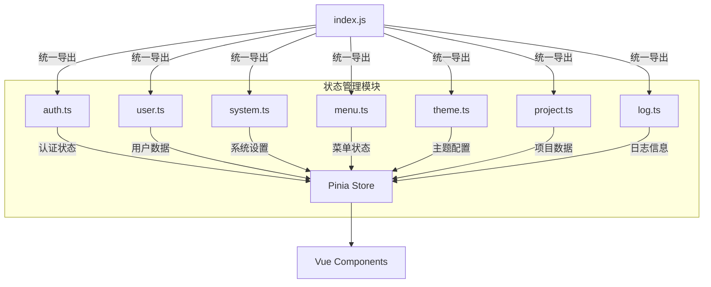
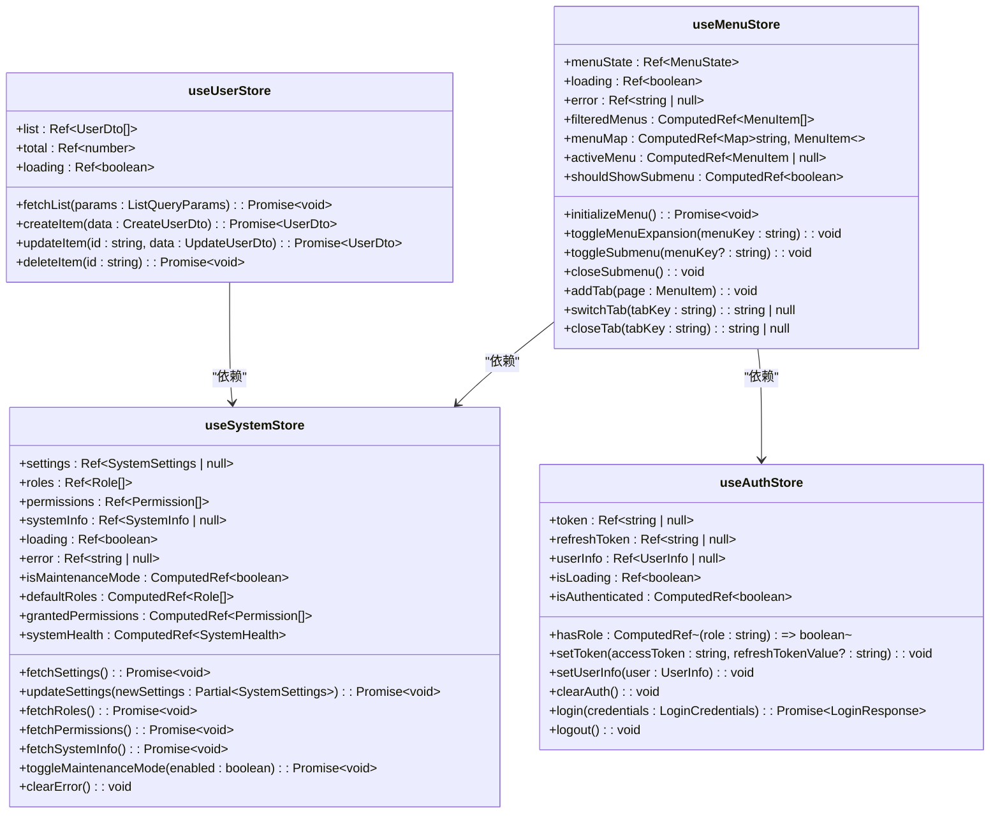
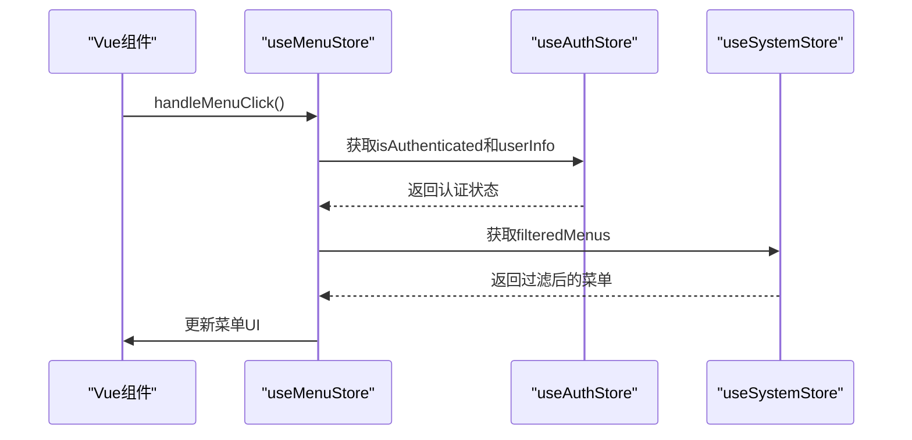

# 核心模块状态管理

<cite>
**本文档引用的文件**  
- [auth.ts](file://src/SmartAbp.Vue/src/stores/modules/auth.ts)
- [user.ts](file://src/SmartAbp.Vue/src/stores/modules/user.ts)
- [system.ts](file://src/SmartAbp.Vue/src/stores/modules/system.ts)
- [menu.ts](file://src/SmartAbp.Vue/src/stores/modules/menu.ts)
- [theme.ts](file://src/SmartAbp.Vue/src/stores/modules/theme.ts)
- [project.ts](file://src/SmartAbp.Vue/src/stores/modules/project.ts)
- [log.ts](file://src/SmartAbp.Vue/src/stores/modules/log.ts)
- [index.js](file://src/SmartAbp.Vue/src/stores/index.js)
- [useMenu.ts](file://src/SmartAbp.Vue/src/composables/useMenu.ts)
- [useDesignTokens.ts](file://src/SmartAbp.Vue/src/composables/useDesignTokens.ts)
</cite>

## 目录
1. [简介](#简介)
2. [项目结构与状态管理布局](#项目结构与状态管理布局)
3. 核心模块状态管理设计
   1. [用户管理模块 (user)](#用户管理模块-user)
   2. [权限与系统配置模块 (system)](#权限与系统配置模块-system)
   3. [菜单管理模块 (menu)](#菜单管理模块-menu)
   4. [认证模块 (auth)](#认证模块-auth)
   5. [主题管理模块 (theme)](#主题管理模块-theme)
   6. [项目管理模块 (project)](#项目管理模块-project)
   7. [日志管理模块 (log)](#日志管理模块-log)
4. [模块化设计与关注点分离](#模块化设计与关注点分离)
5. [模块间通信与依赖机制](#模块间通信与依赖机制)
6. [模块注册与使用方式](#模块注册与使用方式)
7. [状态共享与持久化策略](#状态共享与持久化策略)
8. [总结](#总结)

## 简介

本项目 `hxlot` 是一个基于 Vue 3 和 Pinia 的前端应用，采用模块化状态管理模式，通过 Pinia 实现核心功能模块的状态管理。文档旨在深入分析用户管理、权限控制、系统配置等核心模块的 store 设计，阐述模块命名空间的组织方式、模块间通信机制以及 state、getters、mutations 和 actions 的实现模式。通过模块化设计实现关注点分离，并提供实际代码示例展示模块的注册和使用方式。

## 项目结构与状态管理布局

项目状态管理主要集中在 `src/SmartAbp.Vue/src/stores` 目录下，采用模块化设计，每个核心功能模块拥有独立的 store 文件，统一通过 `index.js` 导出，便于全局注册和使用。



**图示来源**
- [index.js](file://src/SmartAbp.Vue/src/stores/index.js)
- [auth.ts](file://src/SmartAbp.Vue/src/stores/modules/auth.ts)
- [user.ts](file://src/SmartAbp.Vue/src/stores/modules/user.ts)
- [system.ts](file://src/SmartAbp.Vue/src/stores/modules/system.ts)
- [menu.ts](file://src/SmartAbp.Vue/src/stores/modules/menu.ts)
- [theme.ts](file://src/SmartAbp.Vue/src/stores/modules/theme.ts)
- [project.ts](file://src/SmartAbp.Vue/src/stores/modules/project.ts)
- [log.ts](file://src/SmartAbp.Vue/src/stores/modules/log.ts)

**本节来源**
- [index.js](file://src/SmartAbp.Vue/src/stores/index.js)

## 核心模块状态管理设计

### 用户管理模块 (user)

用户管理模块负责管理用户实体的 CRUD 操作和状态，通过 `useUserStore` 实现。

**状态 (state)**:
- `list`: 用户列表数据
- `total`: 用户总数
- `loading`: 加载状态

**计算属性 (getters)**:
- 无显式 getters，但通过 `ref` 和 `computed` 实现响应式数据。

**方法 (actions)**:
- `fetchList`: 获取用户列表
- `createItem`: 创建用户
- `updateItem`: 更新用户
- `deleteItem`: 删除用户

该模块采用模拟 API 服务进行数据交互，实际项目中应替换为真实 API 调用。

**本节来源**
- [user.ts](file://src/SmartAbp.Vue/src/stores/modules/user.ts)

### 权限与系统配置模块 (system)

系统模块负责管理系统设置、角色、权限和系统信息，通过 `useSystemStore` 实现。

**状态 (state)**:
- `settings`: 系统设置
- `roles`: 角色列表
- `permissions`: 权限列表
- `systemInfo`: 系统信息
- `loading`: 加载状态
- `error`: 错误信息

**计算属性 (getters)**:
- `isMaintenanceMode`: 是否处于维护模式
- `defaultRoles`: 默认角色列表
- `customRoles`: 自定义角色列表
- `grantedPermissions`: 已授权权限列表
- `systemHealth`: 系统健康状态

**方法 (actions)**:
- `fetchSettings`: 获取系统设置
- `updateSettings`: 更新系统设置
- `fetchRoles`: 获取角色列表
- `fetchPermissions`: 获取权限列表
- `fetchSystemInfo`: 获取系统信息
- `toggleMaintenanceMode`: 切换维护模式
- `clearError`: 清除错误信息

该模块通过计算属性实现了复杂的业务逻辑判断，如系统健康状态评估。

**本节来源**
- [system.ts](file://src/SmartAbp.Vue/src/stores/modules/system.ts)

### 菜单管理模块 (menu)

菜单模块负责管理菜单状态、权限过滤、标签页管理等，通过 `useMenuStore` 实现。

**状态 (state)**:
- `menuState`: 菜单状态（激活菜单、展开菜单、标签页等）
- `loading`: 加载状态
- `error`: 错误信息

**计算属性 (getters)**:
- `filteredMenus`: 基于用户权限过滤后的菜单列表
- `menuMap`: 扁平化的菜单映射，便于查找
- `activeMenu`: 当前激活菜单
- `activeSubMenu`: 当前激活子菜单
- `currentSubmenuItems`: 当前激活菜单的子菜单列表
- `shouldShowSubmenu`: 是否应显示副菜单
- `permissionSummary`: 权限摘要信息

**方法 (actions)**:
- `initializeMenu`: 初始化菜单系统
- `toggleMenuExpansion`: 切换菜单展开状态
- `toggleSubmenu`: 切换副菜单显示状态
- `closeSubmenu`: 关闭副菜单
- `setActiveMenu`: 设置激活的菜单
- `addTab`: 添加标签页
- `switchTab`: 切换标签页
- `closeTab`: 关闭标签页
- `updateMenuStateByPath`: 根据路径更新菜单状态
- `resetMenuState`: 重置菜单状态
- `toggleSingleTabMode`: 切换单标签模式

该模块与 `useAuthStore` 深度集成，根据用户认证状态和权限动态过滤菜单。

**本节来源**
- [menu.ts](file://src/SmartAbp.Vue/src/stores/modules/menu.ts)

### 认证模块 (auth)

认证模块负责管理用户认证状态、token 和用户信息，通过 `useAuthStore` 实现。

**状态 (state)**:
- `token`: 访问令牌
- `refreshToken`: 刷新令牌
- `userInfo`: 用户信息
- `isLoading`: 加载状态

**计算属性 (getters)**:
- `isAuthenticated`: 是否已认证
- `hasRole`: 检查用户是否拥有指定角色

**方法 (actions)**:
- `setToken`: 设置 Token
- `setUserInfo`: 设置用户信息
- `clearAuth`: 清除认证信息
- `getAuthHeader`: 获取认证请求头
- `login`: 登录
- `logout`: 登出
- `initialize`: 初始化认证状态
- `syncFromSmartAbp`: 从 SmartAbp 认证系统同步状态

该模块启用了持久化配置，确保页面刷新后认证状态不丢失。

**本节来源**
- [auth.ts](file://src/SmartAbp.Vue/src/stores/modules/auth.ts)

### 主题管理模块 (theme)

主题模块负责管理应用主题和暗黑模式，通过 `useThemeStore` 实现。

**状态 (state)**:
- `currentTheme`: 当前主题
- `isDarkMode`: 是否为暗黑模式
- `currentThemeConfig`: 当前主题配置

**方法 (actions)**:
- `setTheme`: 设置主题
- `toggleDarkMode`: 切换暗黑模式
- `init`: 初始化主题

该模块与 `useDesignSystem` 组合函数集成，实现主题切换时自动联动图标风格。

**本节来源**
- [theme.ts](file://src/SmartAbp.Vue/src/stores/modules/theme.ts)

### 项目管理模块 (project)

项目模块负责管理项目数据和状态，通过 `useProjectStore` 实现。

**状态 (state)**:
- `projects`: 项目列表
- `loading`: 加载状态
- `error`: 错误信息
- `currentProject`: 当前项目

**计算属性 (getters)**:
- `activeProjects`: 活跃项目列表
- `completedProjects`: 已完成项目列表
- `projectsByPriority`: 按优先级分组的项目
- `projectCount`: 项目总数
- `hasProjects`: 是否有项目

**方法 (actions)**:
- `fetchProjects`: 获取项目列表
- `createProject`: 创建项目
- `updateProject`: 更新项目
- `deleteProject`: 删除项目
- `getProjectById`: 根据 ID 获取项目
- `setCurrentProject`: 设置当前项目
- `clearError`: 清除错误信息

**本节来源**
- [project.ts](file://src/SmartAbp.Vue/src/stores/modules/project.ts)

### 日志管理模块 (log)

日志模块负责管理日志查看器和日志记录，通过 `useLogStore` 实现。

**状态 (state)**:
- `isLogViewerVisible`: 日志查看器是否可见
- `logFilters`: 日志过滤器

**计算属性 (getters)**:
- `logs`: 所有日志
- `filteredLogs`: 过滤后的日志
- `errorCount`: 错误数量
- `warningCount`: 警告数量
- `hasErrors`: 是否有错误
- `hasWarnings`: 是否有警告

**方法 (actions)**:
- `showLogViewer`: 显示日志查看器
- `hideLogViewer`: 隐藏日志查看器
- `toggleLogViewer`: 切换日志查看器
- `setLogFilter`: 设置日志过滤器
- `clearLogFilters`: 清除日志过滤器
- `clearAllLogs`: 清除所有日志
- `logDebug`, `logInfo`, `logWarn`, `logError`, `logSuccess`: 便捷的日志记录方法
- `logApiRequest`, `logApiResponse`, `logUserAction`, `logSystemEvent`, `logPerformance`: 专用日志记录方法

**本节来源**
- [log.ts](file://src/SmartAbp.Vue/src/stores/modules/log.ts)

## 模块化设计与关注点分离

项目采用模块化设计，每个核心功能模块拥有独立的 store 文件，实现了关注点分离。每个模块内部定义了清晰的状态、计算属性和方法，职责单一，便于维护和测试。通过 `index.js` 统一导出所有模块，便于全局注册和使用。



**图示来源**
- [user.ts](file://src/SmartAbp.Vue/src/stores/modules/user.ts)
- [system.ts](file://src/SmartAbp.Vue/src/stores/modules/system.ts)
- [menu.ts](file://src/SmartAbp.Vue/src/stores/modules/menu.ts)
- [auth.ts](file://src/SmartAbp.Vue/src/stores/modules/auth.ts)

**本节来源**
- [user.ts](file://src/SmartAbp.Vue/src/stores/modules/user.ts)
- [system.ts](file://src/SmartAbp.Vue/src/stores/modules/system.ts)
- [menu.ts](file://src/SmartAbp.Vue/src/stores/modules/menu.ts)
- [auth.ts](file://src/SmartAbp.Vue/src/stores/modules/auth.ts)

## 模块间通信与依赖机制

模块间通过直接导入和调用其他模块的 store 实例进行通信。例如，`useMenuStore` 依赖 `useAuthStore` 来获取用户认证状态和权限信息，从而动态过滤菜单。`useThemeStore` 依赖 `useDesignSystem` 组合函数来实现主题切换。



**图示来源**
- [menu.ts](file://src/SmartAbp.Vue/src/stores/modules/menu.ts)
- [auth.ts](file://src/SmartAbp.Vue/src/stores/modules/auth.ts)
- [system.ts](file://src/SmartAbp.Vue/src/stores/modules/system.ts)

**本节来源**
- [menu.ts](file://src/SmartAbp.Vue/src/stores/modules/menu.ts)
- [auth.ts](file://src/SmartAbp.Vue/src/stores/modules/auth.ts)
- [system.ts](file://src/SmartAbp.Vue/src/stores/modules/system.ts)

## 模块注册与使用方式

所有模块通过 `index.js` 统一导出，可在 Vue 组件中通过 `import` 导入并使用。

```javascript
// 导入模块
import { useUserStore } from '@/stores/modules/user'
import { useAuthStore } from '@/stores/modules/auth'

// 在组件中使用
export default {
  setup() {
    const userStore = useUserStore()
    const authStore = useAuthStore()

    // 使用store
    userStore.fetchList()
    if (authStore.isAuthenticated) {
      // 执行认证后的操作
    }

    return {
      userStore,
      authStore
    }
  }
}
```

**本节来源**
- [index.js](file://src/SmartAbp.Vue/src/stores/index.js)
- [user.ts](file://src/SmartAbp.Vue/src/stores/modules/user.ts)
- [auth.ts](file://src/SmartAbp.Vue/src/stores/modules/auth.ts)

## 状态共享与持久化策略

项目通过 Pinia 实现全局状态共享，所有模块的状态在应用范围内可访问。认证模块 (`useAuthStore`) 启用了持久化配置，将认证信息存储在 `localStorage` 中，确保页面刷新后状态不丢失。

```javascript
export const useAuthStore = defineStore('auth', () => {
  // ... state and actions
}, {
  persist: {
    key: 'smartabp-auth',
    storage: localStorage
  }
})
```

**本节来源**
- [auth.ts](file://src/SmartAbp.Vue/src/stores/modules/auth.ts)

## 总结

hxlot 项目通过 Pinia 实现了模块化的状态管理，每个核心功能模块拥有独立的 store，职责清晰，便于维护。模块间通过直接依赖进行通信，实现了复杂的业务逻辑。通过持久化配置，确保了关键状态在页面刷新后不丢失。整体设计遵循关注点分离原则，为大型前端应用的状态管理提供了良好的实践范例。