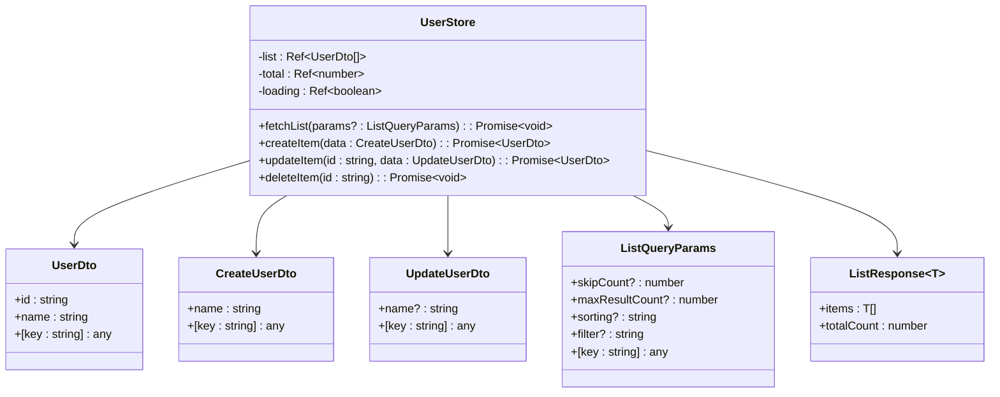
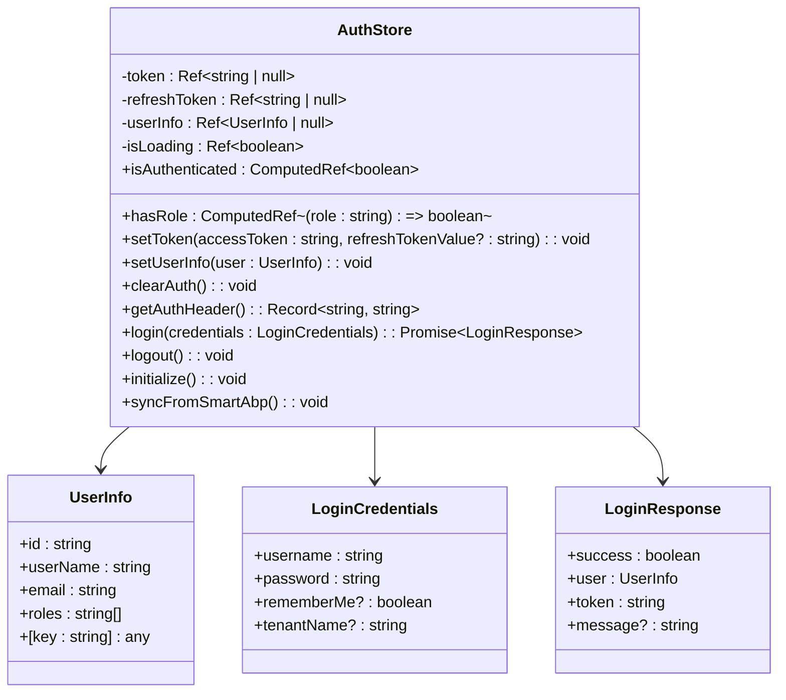
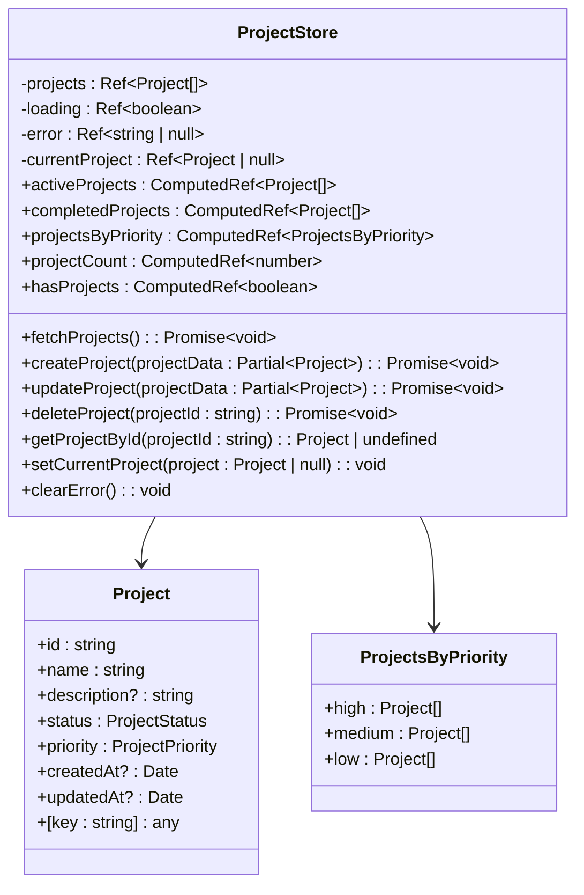
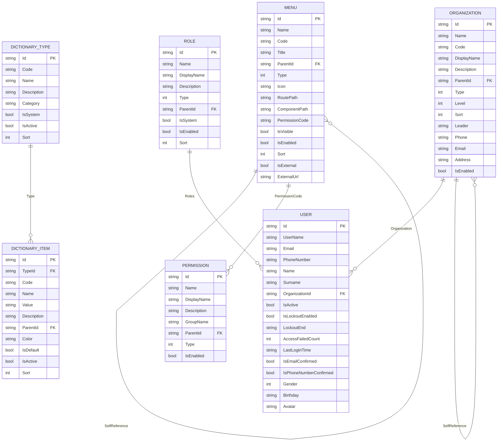
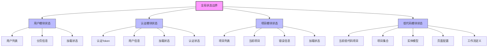
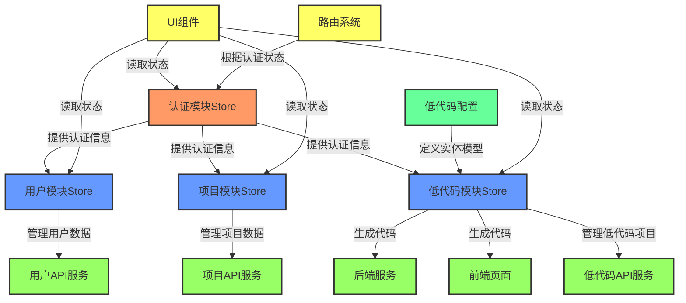
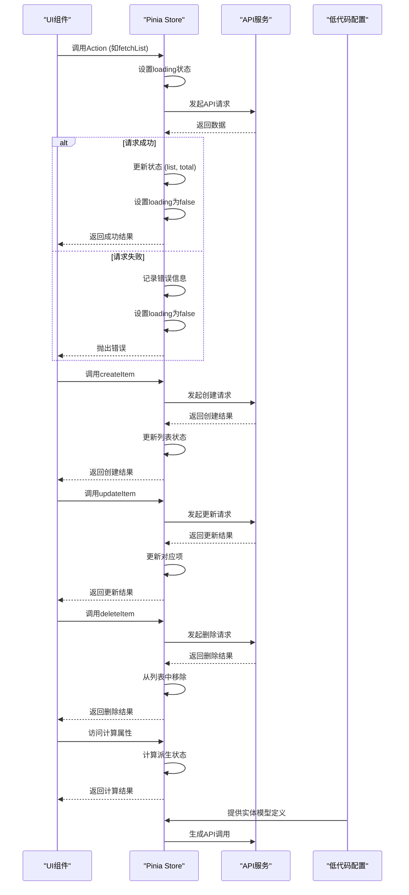

# 模块化Store设计

<cite>
**本文档引用文件**  
- [user.ts](file://src/SmartAbp.Vue/src/stores/modules/user.ts)
- [auth.ts](file://src/SmartAbp.Vue/src/stores/modules/auth.ts)
- [project.ts](file://src/SmartAbp.Vue/src/stores/modules/project.ts)
- [projectStore.ts](file://src/SmartAbp.Vue/src/stores/lowcode/projectStore.ts)
- [权限管理系统低代码配置.json](file://config/权限管理系统低代码配置.json)
</cite>

## 目录
1. [项目结构与模块化Store概述](#项目结构与模块化store概述)
2. [核心模块Store设计](#核心模块store设计)
3. [低代码模块Store实现](#低代码模块store实现)
4. [模块分割原则与状态边界](#模块分割原则与状态边界)
5. [模块依赖关系图](#模块依赖关系图)
6. [状态流示意图](#状态流示意图)

## 项目结构与模块化Store概述

本项目采用模块化状态管理架构，基于Pinia实现。状态管理模块主要分布在`src/SmartAbp.Vue/src/stores/modules`目录下，每个功能模块拥有独立的Store文件，通过命名空间进行隔离。模块化设计遵循单一职责原则，每个Store负责管理特定业务领域的状态和逻辑。

**模块化Store特点**：
- **命名空间隔离**：每个Store通过`defineStore`的name参数实现命名空间隔离
- **类型安全**：使用TypeScript定义完整的接口类型
- **持久化支持**：关键状态支持localStorage持久化
- **计算属性**：通过computed实现派生状态
- **异步操作**：使用async/await处理异步流程

**Section sources**
- [user.ts](file://src/SmartAbp.Vue/src/stores/modules/user.ts)
- [auth.ts](file://src/SmartAbp.Vue/src/stores/modules/auth.ts)
- [project.ts](file://src/SmartAbp.Vue/src/stores/modules/project.ts)

## 核心模块Store设计

### 用户模块Store

用户模块Store（`user.ts`）负责管理用户实体的CRUD操作和状态。采用标准的Pinia Store模式，包含状态定义、计算属性和Actions。



**Diagram sources**
- [user.ts](file://src/SmartAbp.Vue/src/stores/modules/user.ts#L30-L197)

### 认证模块Store

认证模块Store（`auth.ts`）负责管理用户认证状态、token和用户信息，支持持久化存储和多标签页同步。



**Diagram sources**
- [auth.ts](file://src/SmartAbp.Vue/src/stores/modules/auth.ts#L6-L311)

### 项目模块Store

项目模块Store（`project.ts`）管理项目数据和状态，包含丰富的计算属性和错误处理机制。



**Diagram sources**
- [project.ts](file://src/SmartAbp.Vue/src/stores/modules/project.ts#L40-L205)

**Section sources**
- [user.ts](file://src/SmartAbp.Vue/src/stores/modules/user.ts)
- [auth.ts](file://src/SmartAbp.Vue/src/stores/modules/auth.ts)
- [project.ts](file://src/SmartAbp.Vue/src/stores/modules/project.ts)

## 低代码模块Store实现

### 实体建模Store

低代码模块的实体建模Store基于`权限管理系统低代码配置.json`文件实现，该配置文件定义了权限管理系统的实体模型。



**Diagram sources**
- [权限管理系统低代码配置.json](file://config/权限管理系统低代码配置.json#L1-L1080)

### 代码生成Store

低代码项目Store（`projectStore.ts`）负责管理低代码项目的创建、保存、加载和关闭操作。

```mermaid
classDiagram
class LowCodeProject {
+id : string
+name : string
+description : string
+createdAt : number
+updatedAt : number
+entities : Entity[]
+pages : Page[]
+workflows : Workflow[]
}
class Entity {
+name : string
+fields : Field[]
+relations : Relation[]
}
class Page {
+name : string
+components : Component[]
+layout : Layout
}
class Workflow {
+name : string
+steps : Step[]
+triggers : Trigger[]
}
class ProjectStore {
-currentProject : Ref~LowCodeProject | null~
-projects : Ref~Record~string, LowCodeProject~~
+createProject(projectInfo : {name : string, description? : string}) : void
+saveProject() : void
+loadProject(id : string) : LowCodeProject | null
+closeProject() : void
}
ProjectStore --> LowCodeProject
LowCodeProject --> Entity
LowCodeProject --> Page
LowCodeProject --> Workflow
```

**Diagram sources**
- [projectStore.ts](file://src/SmartAbp.Vue/src/stores/lowcode/projectStore.ts#L23-L97)

**Section sources**
- [权限管理系统低代码配置.json](file://config/权限管理系统低代码配置.json)
- [projectStore.ts](file://src/SmartAbp.Vue/src/stores/lowcode/projectStore.ts)

## 模块分割原则与状态边界

### 模块分割原则

1. **功能单一性原则**：每个Store只负责一个业务领域的状态管理
2. **命名空间隔离原则**：通过唯一的命名空间避免状态冲突
3. **数据所有权原则**：每个数据实体只由一个Store管理
4. **依赖最小化原则**：Store之间通过接口交互，避免直接依赖
5. **可测试性原则**：Store设计便于单元测试和集成测试

### 状态边界定义



**Diagram sources**
- [user.ts](file://src/SmartAbp.Vue/src/stores/modules/user.ts)
- [auth.ts](file://src/SmartAbp.Vue/src/stores/modules/auth.ts)
- [project.ts](file://src/SmartAbp.Vue/src/stores/modules/project.ts)
- [projectStore.ts](file://src/SmartAbp.Vue/src/stores/lowcode/projectStore.ts)

**Section sources**
- [user.ts](file://src/SmartAbp.Vue/src/stores/modules/user.ts)
- [auth.ts](file://src/SmartAbp.Vue/src/stores/modules/auth.ts)
- [project.ts](file://src/SmartAbp.Vue/src/stores/modules/project.ts)
- [projectStore.ts](file://src/SmartAbp.Vue/src/stores/lowcode/projectStore.ts)

## 模块依赖关系图



**Diagram sources**
- [user.ts](file://src/SmartAbp.Vue/src/stores/modules/user.ts)
- [auth.ts](file://src/SmartAbp.Vue/src/stores/modules/auth.ts)
- [project.ts](file://src/SmartAbp.Vue/src/stores/modules/project.ts)
- [projectStore.ts](file://src/SmartAbp.Vue/src/stores/lowcode/projectStore.ts)
- [权限管理系统低代码配置.json](file://config/权限管理系统低代码配置.json)

## 状态流示意图



**Diagram sources**
- [user.ts](file://src/SmartAbp.Vue/src/stores/modules/user.ts)
- [auth.ts](file://src/SmartAbp.Vue/src/stores/modules/auth.ts)
- [project.ts](file://src/SmartAbp.Vue/src/stores/modules/project.ts)
- [权限管理系统低代码配置.json](file://config/权限管理系统低代码配置.json)