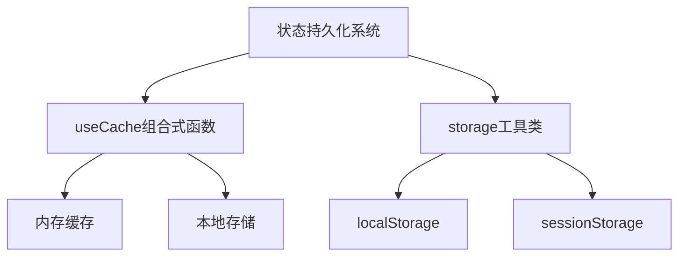
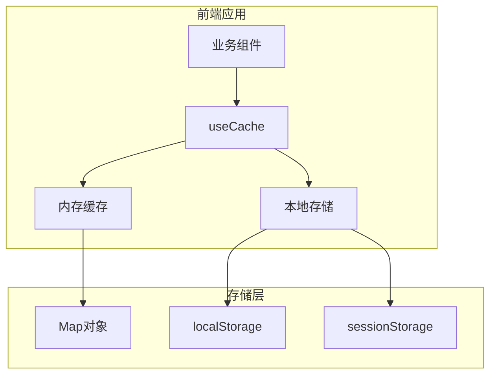
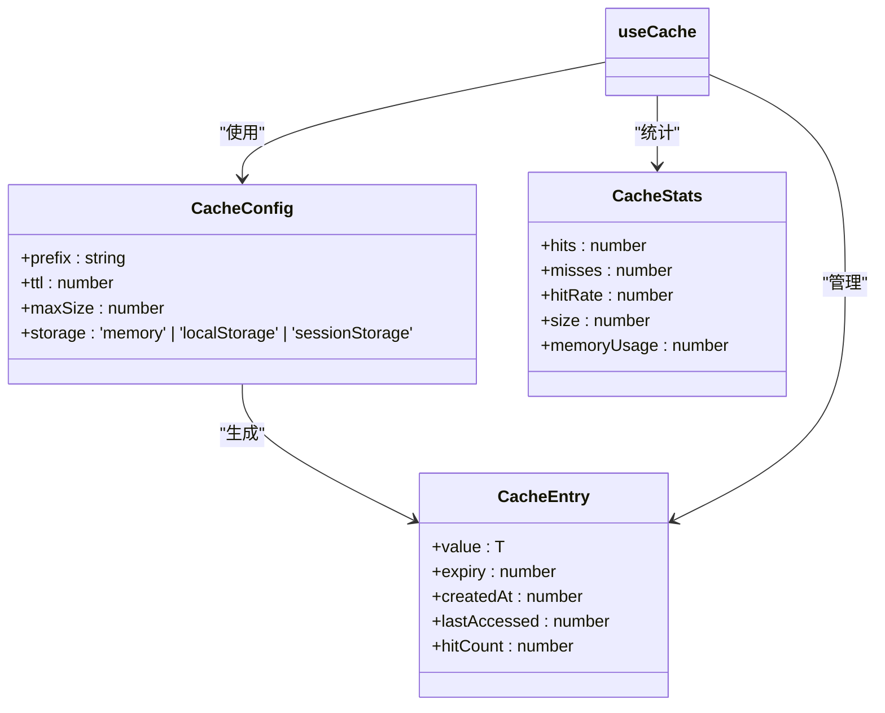
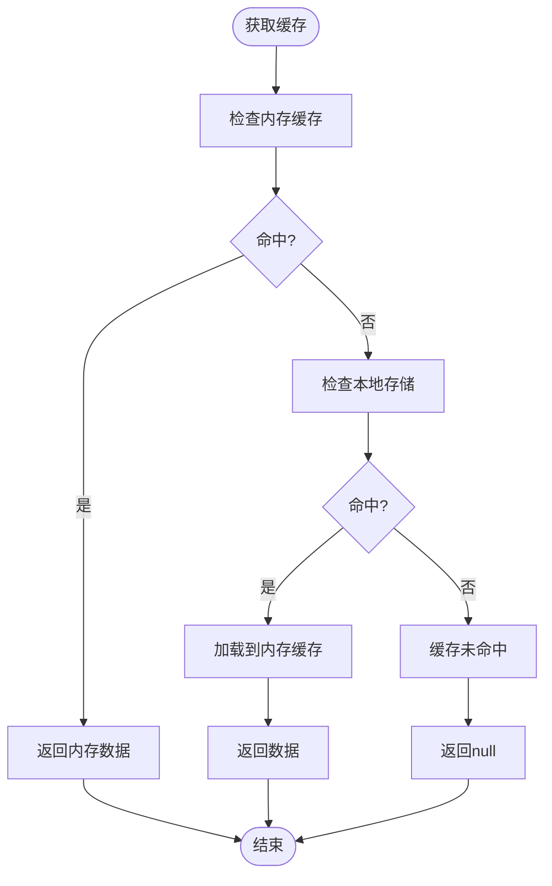
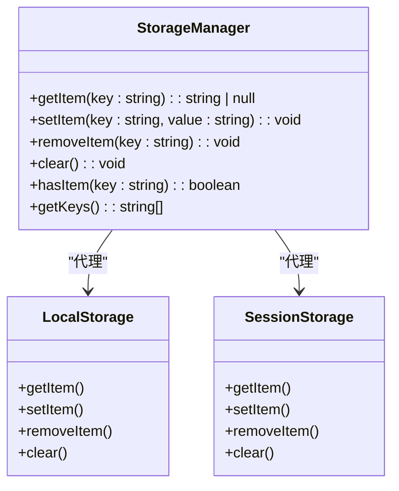
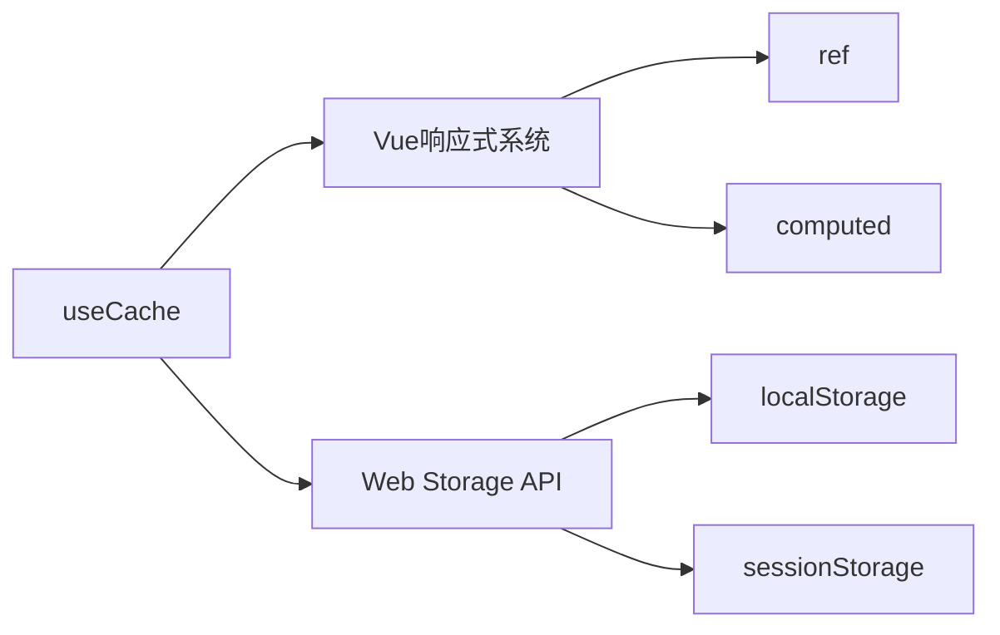

# 状态持久化方案

<cite>
**本文档引用的文件**   
- [useCache.ts](file://src/SmartAbp.Vue/src/composables/useCache.ts)
- [memoryOptimization.ts](file://src/SmartAbp.Vue/src/utils/performance/memoryOptimization.ts)
- [cache-manager.ts](file://src/SmartAbp.Vue/packages/lowcode-designer/src/utils/cache-manager.ts)
- [storage.ts](file://output/mes-uniapp/utils/storage.ts)
</cite>

## 目录
1. [简介](#简介)
2. [项目结构](#项目结构)
3. [核心组件](#核心组件)
4. [架构概述](#架构概述)
5. [详细组件分析](#详细组件分析)
6. [依赖分析](#依赖分析)
7. [性能考虑](#性能考虑)
8. [故障排除指南](#故障排除指南)
9. [结论](#结论)

## 简介
hxlot项目实现了基于组合式函数的状态持久化机制，通过`useCache`组合式函数提供内存缓存和本地存储的双重持久化能力。系统采用多级缓存策略，结合LRU淘汰算法和TTL过期机制，确保数据在页面刷新后能够有效恢复。同时，通过`storage.ts`工具类封装了localStorage和sessionStorage的访问，提供了统一的持久化接口。

## 项目结构
项目状态持久化相关文件主要分布在`src/SmartAbp.Vue/src/composables`和`src/SmartAbp.Vue/src/utils/performance`目录下。`useCache.ts`文件实现了核心的缓存逻辑，`memoryOptimization.ts`提供了内存优化和缓存管理功能，而`storage.ts`则封装了浏览器存储的访问。

**图示来源**
- [useCache.ts](file://src/SmartAbp.Vue/src/composables/useCache.ts)
- [storage.ts](file://output/mes-uniapp/utils/storage.ts)

## 核心组件
`useCache`组合式函数是状态持久化的核心，它提供了配置化的缓存管理能力，支持内存、localStorage和sessionStorage三种存储类型。函数通过Map对象实现内存缓存，通过浏览器Storage API实现持久化存储，并提供了LRU淘汰策略和TTL过期机制。

**组件来源**
- [useCache.ts](file://src/SmartAbp.Vue/src/composables/useCache.ts)

## 架构概述
系统采用分层缓存架构，优先使用内存缓存提高访问速度，同时通过本地存储实现持久化。当页面刷新时，系统会自动从本地存储恢复缓存状态。缓存键采用前缀命名空间隔离，避免不同模块间的缓存冲突。

**图示来源**
- [useCache.ts](file://src/SmartAbp.Vue/src/composables/useCache.ts)
- [storage.ts](file://output/mes-uniapp/utils/storage.ts)

## 详细组件分析

### useCache组合式函数分析
`useCache`函数提供了完整的缓存管理API，包括设置、获取、删除、清理等操作。它通过配置对象接收缓存参数，如前缀、过期时间、最大条目数和存储类型。

#### 缓存配置接口

**图示来源**
- [useCache.ts](file://src/SmartAbp.Vue/src/composables/useCache.ts#L18-L54)

#### 缓存操作流程

**图示来源**
- [useCache.ts](file://src/SmartAbp.Vue/src/composables/useCache.ts#L250-L300)

### storage工具类分析
`storage.ts`文件提供了对浏览器存储的封装，统一了localStorage和sessionStorage的访问接口，增强了错误处理和类型安全。

#### 存储工具类

**图示来源**
- [storage.ts](file://output/mes-uniapp/utils/storage.ts)

## 依赖分析
状态持久化系统依赖于Vue的响应式系统和浏览器的Web Storage API。`useCache`函数使用`ref`和`computed`来管理缓存状态，确保缓存统计信息的响应式更新。

**图示来源**
- [useCache.ts](file://src/SmartAbp.Vue/src/composables/useCache.ts)
- [storage.ts](file://output/mes-uniapp/utils/storage.ts)

## 性能考虑
系统通过多种机制优化缓存性能：
- 使用Map对象实现O(1)时间复杂度的缓存访问
- 采用LRU淘汰策略防止内存泄漏
- 提供批量操作接口减少重复计算
- 估算内存使用量并提供统计信息

缓存命中率通过`hitRate`计算，公式为：命中次数 / (命中次数 + 未命中次数)。系统建议保持80%以上的命中率以获得最佳性能。

## 故障排除指南
常见问题及解决方案：
- **存储配额超限**：清理过期缓存或减少缓存条目数
- **跨域存储访问**：确保同源策略，避免跨域问题
- **序列化错误**：避免存储无法序列化的对象（如函数、Symbol）
- **内存泄漏**：定期清理未使用的缓存条目

调试时可使用`getStats`方法获取缓存统计信息，监控缓存使用情况。

**组件来源**
- [useCache.ts](file://src/SmartAbp.Vue/src/composables/useCache.ts)
- [storage.ts](file://output/mes-uniapp/utils/storage.ts)

## 结论
hxlot项目的状态持久化方案通过`useCache`组合式函数和`storage`工具类实现了高效、可靠的缓存管理。系统支持多级存储、智能过期和LRU淘汰，能够有效提升应用性能并确保数据持久性。建议在实际使用中根据业务需求调整缓存配置，平衡性能和内存使用。