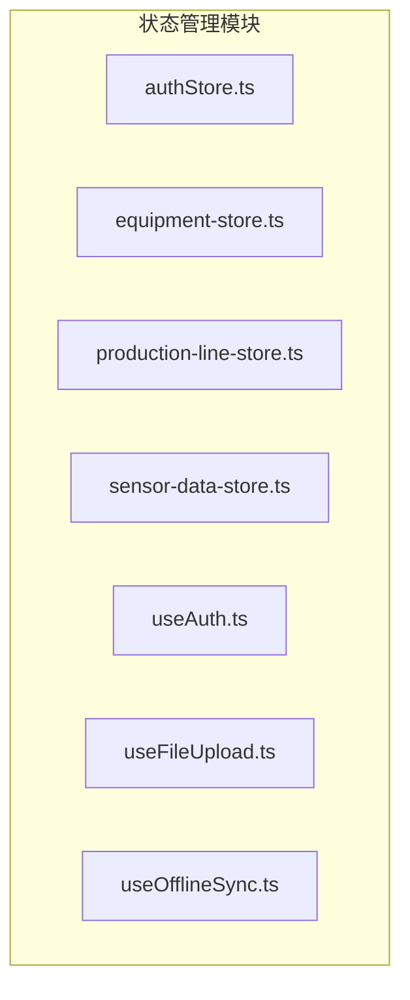
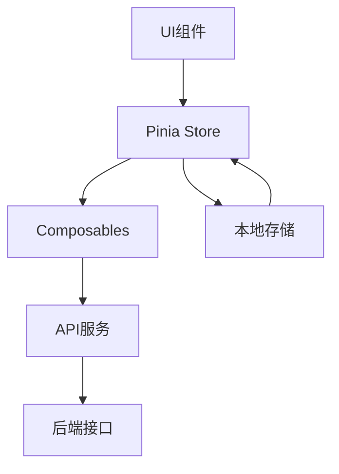
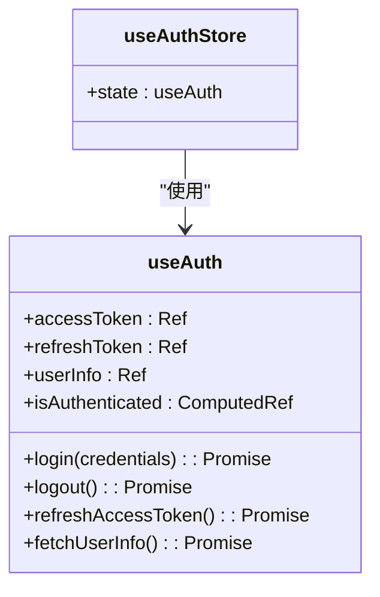
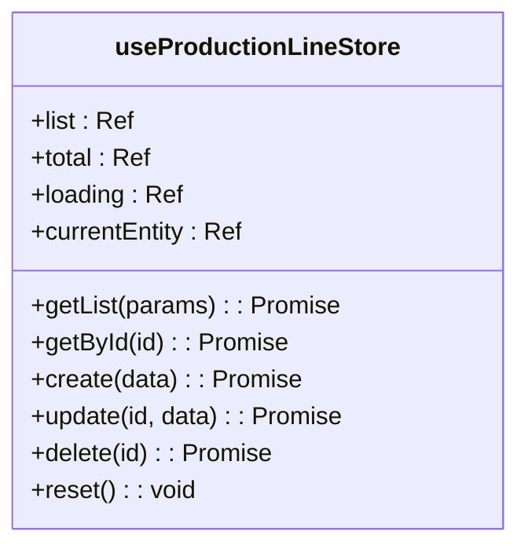
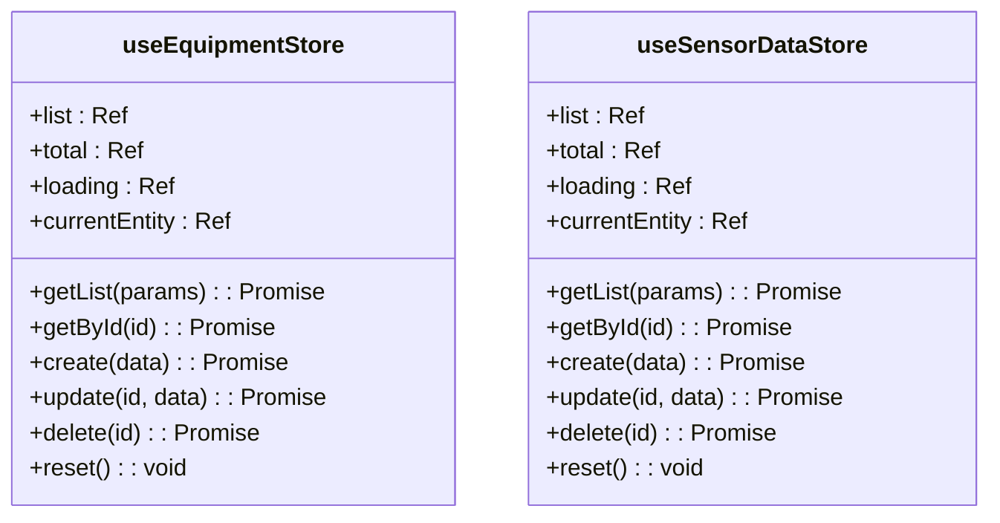
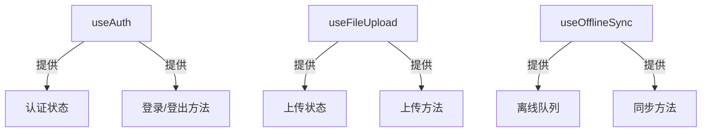
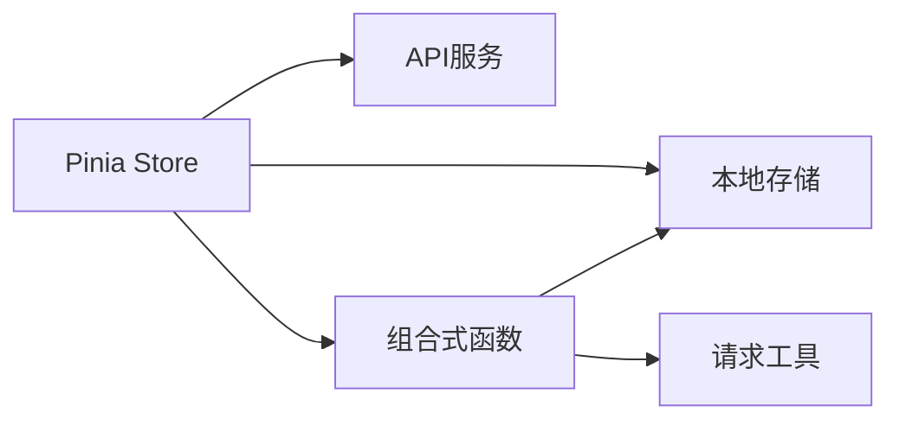

# 状态管理

<cite>
**本文档引用的文件**  
- [authStore.ts](file://output/mes-uniapp/stores/authStore.ts)
- [equipment-store.ts](file://output/mes-uniapp/stores/equipment-store.ts)
- [production-line-store.ts](file://output/mes-uniapp/stores/production-line-store.ts)
- [sensor-data-store.ts](file://output/mes-uniapp/stores/sensor-data-store.ts)
- [useAuth.ts](file://output/mes-uniapp/composables/useAuth.ts)
- [useFileUpload.ts](file://output/mes-uniapp/composables/useFileUpload.ts)
- [useOfflineSync.ts](file://output/mes-uniapp/composables/useOfflineSync.ts)
- [pinia-pattern-example.ts](file://src/SmartAbp.Vue/src/examples/pinia-pattern-example.ts)
- [enhancedStateMachine.js](file://src/SmartAbp.Vue/src/stores/lowcode/enhancedStateMachine.js)
- [statemachine.ts](file://src/SmartAbp.Vue/src/stores/lowcode/statemachine.ts)
</cite>

## 目录
1. [简介](#简介)
2. [项目结构](#项目结构)
3. [核心组件](#核心组件)
4. [架构概述](#架构概述)
5. [详细组件分析](#详细组件分析)
6. [依赖分析](#依赖分析)
7. [性能考虑](#性能考虑)
8. [故障排除指南](#故障排除指南)
9. [结论](#结论)

## 简介
hxlot项目采用基于Pinia的状态管理架构，实现模块化store设计与状态持久化机制。系统通过组合式函数（composables）复用状态逻辑，并结合低代码引擎自动生成store模块，确保状态管理的一致性与可维护性。本系统广泛应用于MES（制造执行系统）场景，涵盖设备、生产线、传感器数据等核心业务模块。

## 项目结构
状态管理相关代码主要分布在`output/mes-uniapp/stores`和`composables`目录中，采用模块化组织方式。每个业务实体拥有独立的store文件，通过Pinia进行状态定义与管理。组合式函数封装通用逻辑，供多个store复用。

**图示来源**  
- [authStore.ts](file://output/mes-uniapp/stores/authStore.ts)
- [equipment-store.ts](file://output/mes-uniapp/stores/equipment-store.ts)
- [production-line-store.ts](file://output/mes-uniapp/stores/production-line-store.ts)
- [sensor-data-store.ts](file://output/mes-uniapp/stores/sensor-data-store.ts)
- [useAuth.ts](file://output/mes-uniapp/composables/useAuth.ts)
- [useFileUpload.ts](file://output/mes-uniapp/composables/useFileUpload.ts)
- [useOfflineSync.ts](file://output/mes-uniapp/composables/useOfflineSync.ts)

## 核心组件
系统核心状态管理组件包括认证store（useAuthStore）、设备store（useEquipmentStore）、生产线store（useProductionLineStore）和传感器数据store（useSensorDataStore）。这些store均基于Pinia构建，遵循统一的设计模式，包含状态定义、异步操作处理和错误管理机制。

**组件来源**  
- [authStore.ts](file://output/mes-uniapp/stores/authStore.ts)
- [equipment-store.ts](file://output/mes-uniapp/stores/equipment-store.ts)
- [production-line-store.ts](file://output/mes-uniapp/stores/production-line-store.ts)
- [sensor-data-store.ts](file://output/mes-uniapp/stores/sensor-data-store.ts)

## 架构概述
hxlot项目采用分层状态管理架构，上层为业务store，底层为通用组合式函数。store之间通过API服务进行数据交互，避免直接依赖。状态持久化通过本地存储实现，关键状态如认证信息在页面刷新后可恢复。

**图示来源**  
- [pinia-pattern-example.ts](file://src/SmartAbp.Vue/src/examples/pinia-pattern-example.ts)
- [useAuth.ts](file://output/mes-uniapp/composables/useAuth.ts)

## 详细组件分析

### 认证状态管理分析
认证状态由`useAuthStore`管理，其核心逻辑封装在`useAuth`组合式函数中。该store代理所有认证相关状态和方法，包括登录、登出、Token刷新和用户信息获取。

**图示来源**  
- [authStore.ts](file://output/mes-uniapp/stores/authStore.ts)
- [useAuth.ts](file://output/mes-uniapp/composables/useAuth.ts)

### 生产线状态管理分析
`useProductionLineStore`负责管理生产线相关状态，包括列表数据、分页信息、加载状态和当前选中实体。该store提供完整的CRUD操作，并在操作成功后自动更新本地状态。

**图示来源**  
- [production-line-store.ts](file://output/mes-uniapp/stores/production-line-store.ts)

### 设备与传感器数据状态管理分析
设备和传感器数据store具有相似的结构和行为模式，体现了系统设计的规范性和可扩展性。两者均包含列表管理、详情获取、创建、更新、删除和状态重置功能。

**图示来源**  
- [equipment-store.ts](file://output/mes-uniapp/stores/equipment-store.ts)
- [sensor-data-store.ts](file://output/mes-uniapp/stores/sensor-data-store.ts)

### 组合式函数分析
组合式函数是状态逻辑复用的核心机制。`useAuth`、`useFileUpload`和`useOfflineSync`分别封装了认证、文件上传和离线同步的通用逻辑，可供多个store或组件直接使用。

**图示来源**  
- [useAuth.ts](file://output/mes-uniapp/composables/useAuth.ts)
- [useFileUpload.ts](file://output/mes-uniapp/composables/useFileUpload.ts)
- [useOfflineSync.ts](file://output/mes-uniapp/composables/useOfflineSync.ts)

## 依赖分析
状态管理模块依赖于API服务进行数据获取与提交，依赖本地存储实现状态持久化。store之间通过事件或直接调用进行通信，避免形成复杂的依赖网络。

**图示来源**  
- [production-line-store.ts](file://output/mes-uniapp/stores/production-line-store.ts)
- [useAuth.ts](file://output/mes-uniapp/composables/useAuth.ts)
- [useOfflineSync.ts](file://output/mes-uniapp/composables/useOfflineSync.ts)

## 性能考虑
状态管理设计充分考虑性能因素。所有异步操作均包含加载状态管理，避免界面卡顿。列表数据采用分页加载，减少单次请求数据量。状态更新采用响应式引用，确保视图高效更新。

## 故障排除指南
常见状态管理问题包括状态未更新、异步操作卡顿和本地存储失效。建议检查Pinia实例是否正确安装，异步操作是否正确处理Promise，以及本地存储是否被浏览器策略限制。

**问题来源**  
- [useAuth.ts](file://output/mes-uniapp/composables/useAuth.ts)
- [production-line-store.ts](file://output/mes-uniapp/stores/production-line-store.ts)

## 结论
hxlot项目的状态管理架构设计合理，基于Pinia实现模块化store，通过组合式函数实现逻辑复用，具备良好的可维护性和扩展性。建议在新功能开发中遵循现有模式，保持架构一致性。