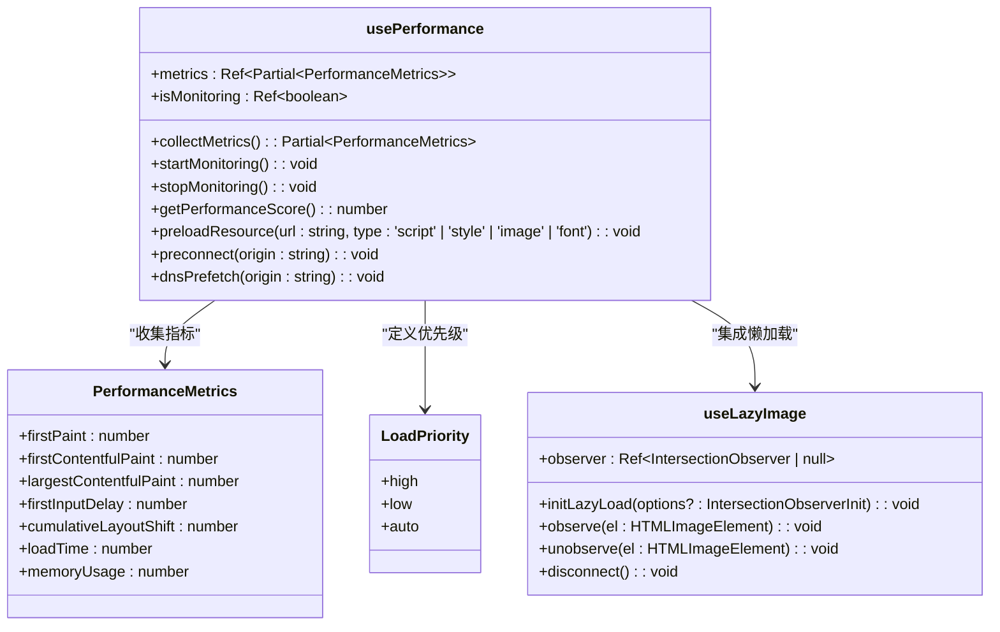
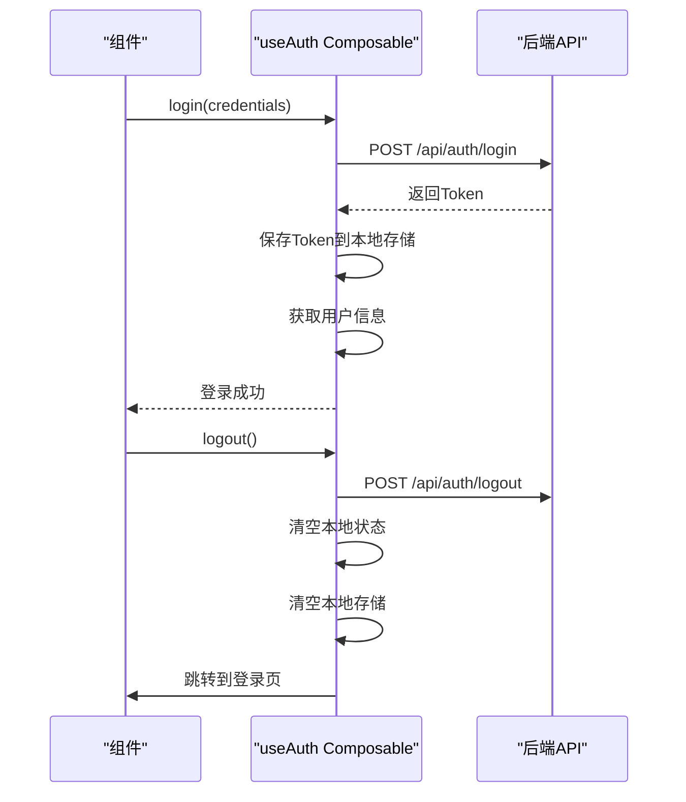
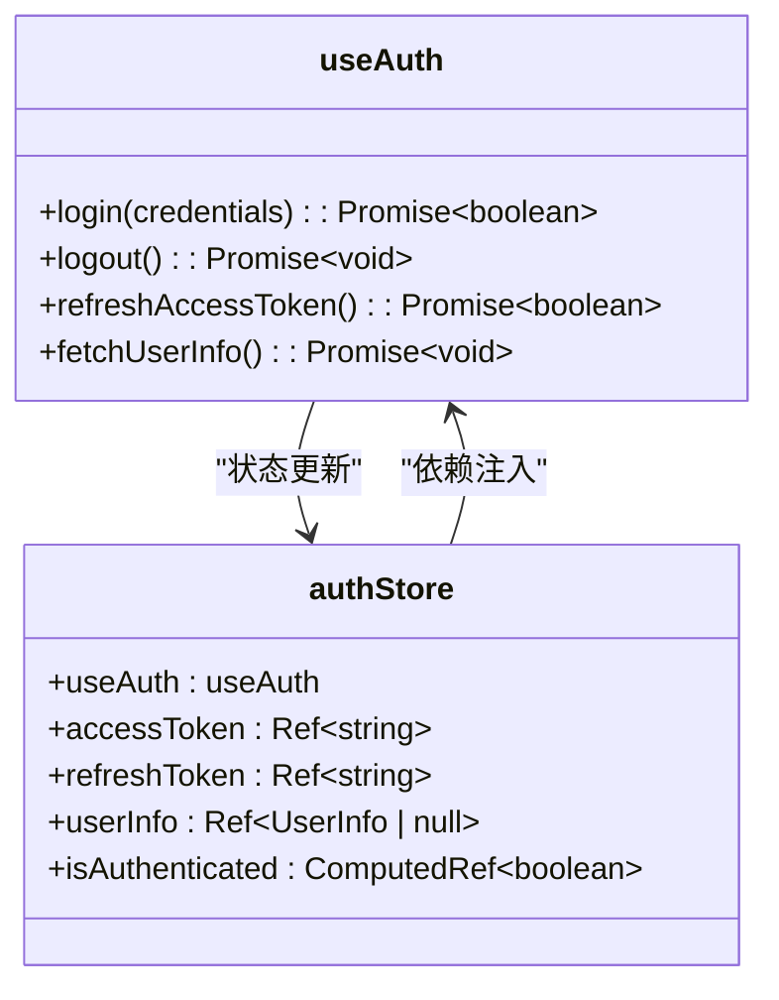

# 状态逻辑复用

<cite>
**Referenced Files in This Document**  
- [useCache.ts](file://src/SmartAbp.Vue/src/composables/useCache.ts)
- [usePerformance.ts](file://src/SmartAbp.Vue/src/composables/usePerformance.ts)
- [useAuth.ts](file://output/mes-uniapp/composables/useAuth.ts)
- [authStore.ts](file://output/mes-uniapp/stores/authStore.ts)
</cite>

## 目录
1. [引言](#引言)
2. [核心组合式函数设计模式](#核心组合式函数设计模式)
3. [状态逻辑跨组件复用机制](#状态逻辑跨组件复用机制)
4. [通用状态抽象方法](#通用状态抽象方法)
5. [Composables与Pinia Store协作关系](#composables与pinia-store协作关系)
6. [复用模式最佳实践](#复用模式最佳实践)
7. [性能考量](#性能考量)
8. [结论](#结论)

## 引言

在hxlot项目中，状态逻辑复用是提升开发效率和代码质量的核心策略。通过组合式函数（Composables）的设计模式，实现了性能监控、菜单管理等通用状态的抽象与复用。这些组合式函数不仅封装了复杂的状态管理逻辑，还通过与Pinia Store的协作，构建了高效的状态管理架构。本文将深入探讨`useCache`、`usePerformance`等组合式函数的设计原理，以及如何通过这些模式实现状态逻辑的跨组件复用。

## 核心组合式函数设计模式

### useCache设计模式

`useCache`组合式函数提供了多级缓存、智能过期和缓存预热等功能。其设计模式基于泛型和响应式状态管理，通过`ref`和`computed`实现缓存状态的响应式更新。该函数支持内存、localStorage和sessionStorage三种存储类型，并通过LRU（最近最少使用）策略进行缓存淘汰。

```mermaid
classDiagram
class CacheConfig {
+prefix : string
+ttl : number
+maxSize : number
+storage : 'memory' | 'localStorage' | 'sessionStorage'
}
class CacheEntry~T~ {
+value : T
+expiry : number
+createdAt : number
+lastAccessed : number
+hitCount : number
}
class CacheStats {
+hits : number
+misses : number
+hitRate : number
+size : number
+memoryUsage : number
}
class useCache~T~ {
+memoryCache : Map~string, CacheEntry~T~~
+stats : Ref~CacheStats~
+set(key : string, value : T, customTtl? : number) : void
+get(key : string) : T | null
+remove(key : string) : boolean
+has(key : string) : boolean
+clear() : void
+cleanup() : number
+keys() : string[]
+setMany(entries : Array<{ key : string; value : T; ttl? : number }>) : void
+getMany(keys : string[]) : Array<T | null>
+removeMany(keys : string[]) : void
}
useCache~T~ --> CacheConfig : "使用配置"
useCache~T~ --> CacheEntry~T~ : "管理条目"
useCache~T~ --> CacheStats : "提供统计"
```

**Diagram sources**
- [useCache.ts](file://src/SmartAbp.Vue/src/composables/useCache.ts#L1-L446)

**Section sources**
- [useCache.ts](file://src/SmartAbp.Vue/src/composables/useCache.ts#L1-L446)

### usePerformance设计模式

`usePerformance`组合式函数专注于性能监控与优化，提供了性能指标收集、组件懒加载和资源预加载等功能。该函数利用浏览器的Performance API收集关键性能指标，如首屏加载时间、首次内容绘制时间和最大内容绘制时间，并通过`PerformanceObserver`监听LCP（最大内容绘制）、FID（首次输入延迟）和CLS（累积布局偏移）等指标。



**Diagram sources**
- [usePerformance.ts](file://src/SmartAbp.Vue/src/composables/usePerformance.ts#L1-L308)

**Section sources**
- [usePerformance.ts](file://src/SmartAbp.Vue/src/composables/usePerformance.ts#L1-L308)

## 状态逻辑跨组件复用机制

### 组合式函数的复用实现

组合式函数通过封装可复用的逻辑，实现了状态逻辑的跨组件复用。以`useAuth`为例，该函数封装了JWT认证的完整流程，包括登录、登出、刷新Token和获取用户信息等操作。其他组件只需调用`useAuth`即可获得认证功能，无需重复实现。



**Diagram sources**
- [useAuth.ts](file://output/mes-uniapp/composables/useAuth.ts#L1-L130)

**Section sources**
- [useAuth.ts](file://output/mes-uniapp/composables/useAuth.ts#L1-L130)

### 通用状态的抽象方法

#### 性能监控状态抽象

性能监控状态通过`usePerformance`组合式函数进行抽象，将复杂的性能指标收集逻辑封装在函数内部。外部组件只需调用`startMonitoring`和`stopMonitoring`即可开始和停止性能监控，而无需关心底层实现细节。

#### 菜单状态抽象

菜单状态的抽象通常通过`useMenu`组合式函数实现，该函数管理菜单的展开/折叠状态、当前选中项和权限控制等。通过将菜单状态与组件解耦，实现了菜单逻辑的跨组件复用。

## Composables与Pinia Store协作关系

### 协作模式分析

组合式函数与Pinia Store的协作关系体现了"组合优于继承"的设计原则。组合式函数负责封装可复用的业务逻辑，而Pinia Store负责管理应用的全局状态。两者通过依赖注入的方式协作，组合式函数可以作为Store的依赖被注入，从而实现逻辑与状态的分离。



**Diagram sources**
- [useAuth.ts](file://output/mes-uniapp/composables/useAuth.ts#L1-L130)
- [authStore.ts](file://output/mes-uniapp/stores/authStore.ts#L1-L20)

**Section sources**
- [useAuth.ts](file://output/mes-uniapp/composables/useAuth.ts#L1-L130)
- [authStore.ts](file://output/mes-uniapp/stores/authStore.ts#L1-L20)

### 实际应用示例

在`authStore.ts`中，通过`useAuth`组合式函数创建认证状态管理Store。Store直接使用`useAuth`返回的所有状态和方法，实现了认证逻辑的复用。这种模式不仅减少了代码重复，还提高了代码的可维护性。

## 复用模式最佳实践

### 设计原则

1. **单一职责原则**：每个组合式函数应只负责一个特定的功能领域。
2. **可配置性**：提供合理的默认配置，同时允许用户通过参数进行定制。
3. **类型安全**：充分利用TypeScript的类型系统，确保API的类型安全。
4. **响应式集成**：与Vue的响应式系统无缝集成，确保状态变化能够自动更新UI。

### 使用建议

- 在创建新的组合式函数时，优先考虑是否可以复用现有的逻辑。
- 避免在组合式函数中引入不必要的依赖，保持函数的轻量级。
- 提供清晰的文档和使用示例，降低其他开发者的使用成本。

## 性能考量

### 缓存策略优化

`useCache`组合式函数通过多级缓存和LRU淘汰策略，有效提升了应用性能。内存缓存提供最快的访问速度，而localStorage和sessionStorage则提供持久化存储。通过合理的TTL（生存时间）设置，避免了缓存数据的过期问题。

### 性能监控开销

`usePerformance`组合式函数在收集性能指标时，需要注意避免对应用性能造成负面影响。通过延迟初始化和按需监控，减少了不必要的性能开销。同时，使用`PerformanceObserver`的异步回调机制，避免了阻塞主线程。

## 结论

hxlot项目通过`useCache`、`usePerformance`等组合式函数的设计模式，实现了状态逻辑的高效复用。这些模式不仅提升了开发效率，还通过与Pinia Store的协作，构建了健壮的状态管理架构。未来可以进一步探索更多通用状态的抽象方法，如网络状态管理、国际化状态管理等，持续优化项目的可维护性和可扩展性。