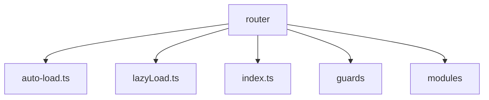
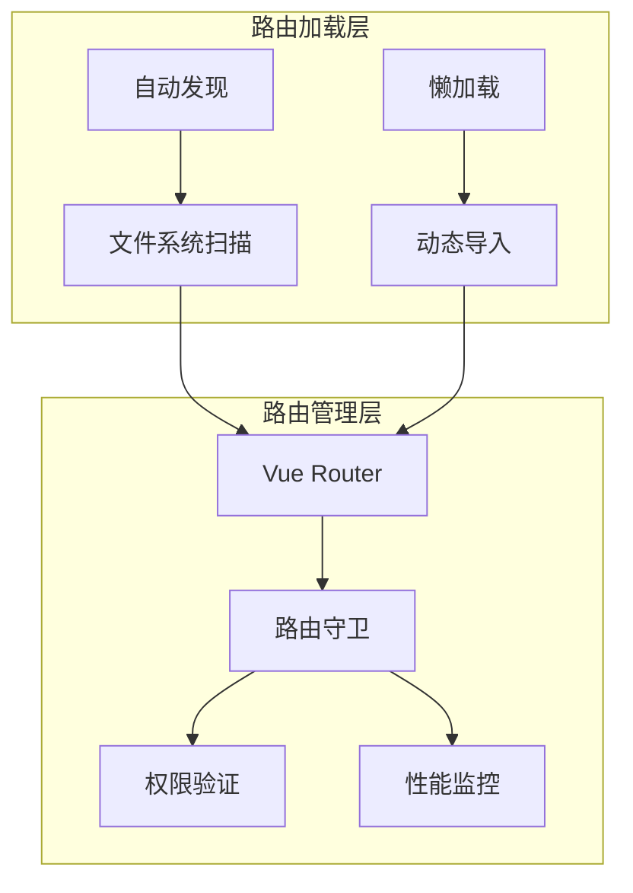
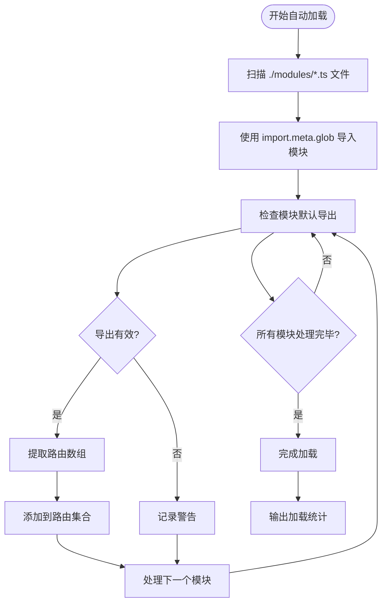
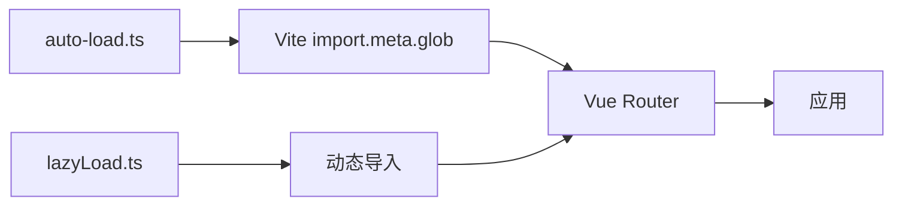

# 动态加载

<cite>
**本文档引用文件**  
- [auto-load.ts](file://src/SmartAbp.Vue/src/router/auto-load.ts)
- [lazyLoad.ts](file://src/SmartAbp.Vue/src/router/lazyLoad.ts)
- [index.ts](file://src/SmartAbp.Vue/src/router/index.ts)
</cite>

## 目录
1. [引言](#引言)
2. [项目结构](#项目结构)
3. [核心组件](#核心组件)
4. [架构概述](#架构概述)
5. [详细组件分析](#详细组件分析)
6. [依赖分析](#依赖分析)
7. [性能考虑](#性能考虑)
8. [故障排除指南](#故障排除指南)
9. [结论](#结论)

## 引言
本文档详细阐述了hxlot项目中基于文件系统约定的路由动态加载机制。重点分析`auto-load.ts`中的自动路由发现机制和`lazyLoad.ts`中的懒加载实现，解释动态导入在路由加载中的应用，并提供性能优化建议和错误处理策略。

## 项目结构
hxlot项目的路由相关文件位于`src/SmartAbp.Vue/src/router`目录下，主要包含自动加载、懒加载和路由守卫等核心功能模块。



**图表来源**  
- [auto-load.ts](file://src/SmartAbp.Vue/src/router/auto-load.ts)
- [lazyLoad.ts](file://src/SmartAbp.Vue/src/router/lazyLoad.ts)
- [index.ts](file://src/SmartAbp.Vue/src/router/index.ts)

**章节来源**
- [auto-load.ts](file://src/SmartAbp.Vue/src/router/auto-load.ts)
- [lazyLoad.ts](file://src/SmartAbp.Vue/src/router/lazyLoad.ts)

## 核心组件
本项目的核心路由动态加载机制由两个主要组件构成：`autoLoadModuleRoutes`函数实现的自动路由发现机制和`lazyLoadView`函数实现的组件懒加载功能。

**章节来源**
- [auto-load.ts](file://src/SmartAbp.Vue/src/router/auto-load.ts#L15-L85)
- [lazyLoad.ts](file://src/SmartAbp.Vue/src/router/lazyLoad.ts#L10-L25)

## 架构概述
hxlot项目的路由动态加载架构采用分层设计，结合了自动发现和按需加载两种策略，实现了高效的路由管理。



**图表来源**  
- [auto-load.ts](file://src/SmartAbp.Vue/src/router/auto-load.ts#L15-L85)
- [lazyLoad.ts](file://src/SmartAbp.Vue/src/router/lazyLoad.ts#L10-L25)
- [index.ts](file://src/SmartAbp.Vue/src/router/index.ts#L100-L150)

## 详细组件分析

### 自动路由发现机制分析
`auto-load.ts`文件实现了基于Vite的glob导入功能的自动路由发现机制，能够动态扫描并加载`router/modules`目录下的所有路由模块。



**图表来源**  
- [auto-load.ts](file://src/SmartAbp.Vue/src/router/auto-load.ts#L15-L85)

**章节来源**
- [auto-load.ts](file://src/SmartAbp.Vue/src/router/auto-load.ts#L15-L85)

### 懒加载实现分析
`lazyLoad.ts`文件提供了智能的组件懒加载和预加载功能，通过动态导入实现路由组件的按需加载。

```mermaid
classDiagram
class lazyLoadView {
+componentPath : string
+() : Promise~Component~
}
class lazyLoadViewWithChunk {
+componentPath : string
+_chunkName : string
+() : Promise~Component~
}
class SmartPreloader {
-preloadedRoutes : Set~string~
-hoverTimer : number | null
+preload(route : string) : void
+preloadOnHover(route : string, delay : number) : void
+cancelPreload() : void
+preloadBatch(routes : string[]) : void
+clear() : void
}
class RouteLoadMonitor {
-loadTimes : Map~string, number~
+record(route : string, duration : number) : void
+getLoadTime(route : string) : number | undefined
+getAverageLoadTime() : number
+getSlowestRoutes(count : number) : { route : string; duration : number }[]
+clear() : void
}
lazyLoadView <|-- lazyLoadViewWithChunk
SmartPreloader : 单例实例
RouteLoadMonitor : 单例实例
```

**图表来源**  
- [lazyLoad.ts](file://src/SmartAbp.Vue/src/router/lazyLoad.ts#L10-L209)

**章节来源**
- [lazyLoad.ts](file://src/SmartAbp.Vue/src/router/lazyLoad.ts#L10-L209)

## 依赖分析
路由动态加载机制依赖于Vite的模块解析能力和Vue Router的路由管理功能，形成了一个高效的加载体系。



**图表来源**  
- [auto-load.ts](file://src/SmartAbp.Vue/src/router/auto-load.ts)
- [lazyLoad.ts](file://src/SmartAbp.Vue/src/router/lazyLoad.ts)

**章节来源**
- [auto-load.ts](file://src/SmartAbp.Vue/src/router/auto-load.ts)
- [lazyLoad.ts](file://src/SmartAbp.Vue/src/router/lazyLoad.ts)

## 性能考虑
路由动态加载机制在设计时充分考虑了性能优化，通过预加载、智能缓存和性能监控等手段提升用户体验。

- **预加载策略**：支持高优先级路由的立即预加载和普通路由的空闲时预加载
- **性能监控**：内置路由加载时间监控，可识别慢速加载的路由
- **智能预加载**：基于用户行为预测可能访问的路由并提前加载
- **错误处理**：完善的错误捕获和日志记录机制

## 故障排除指南
当路由动态加载出现问题时，可参考以下排查步骤：

**章节来源**
- [auto-load.ts](file://src/SmartAbp.Vue/src/router/auto-load.ts#L50-L85)
- [lazyLoad.ts](file://src/SmartAbp.Vue/src/router/lazyLoad.ts#L100-L150)

1. **检查模块导出**：确保路由模块有正确的默认导出
2. **验证文件路径**：确认模块文件位于正确的目录下
3. **查看控制台日志**：检查是否有加载错误或警告信息
4. **调试模式**：使用`printRouteLoadInfo()`函数输出详细的路由加载信息
5. **网络检查**：确保动态导入的网络请求正常

## 结论
hxlot项目的路由动态加载机制通过`auto-load.ts`和`lazyLoad.ts`两个核心文件，实现了基于文件系统约定的自动路由发现和组件懒加载功能。该机制有效解决了代码生成后需要手动导入路由的问题，同时通过智能预加载和性能监控提升了应用的用户体验。建议在实际使用中结合具体的业务场景，合理配置预加载策略，以达到最佳的性能平衡。