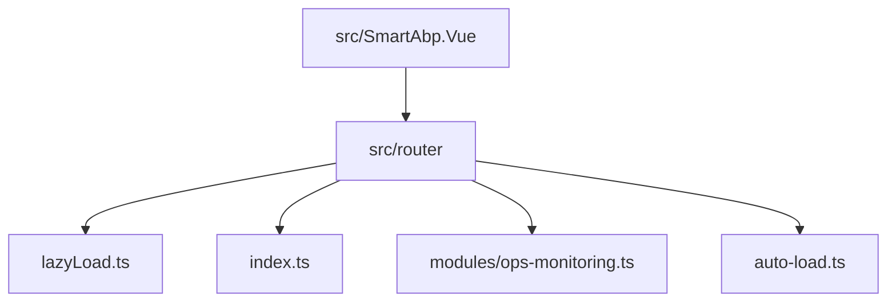
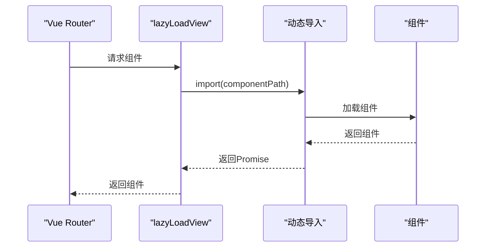
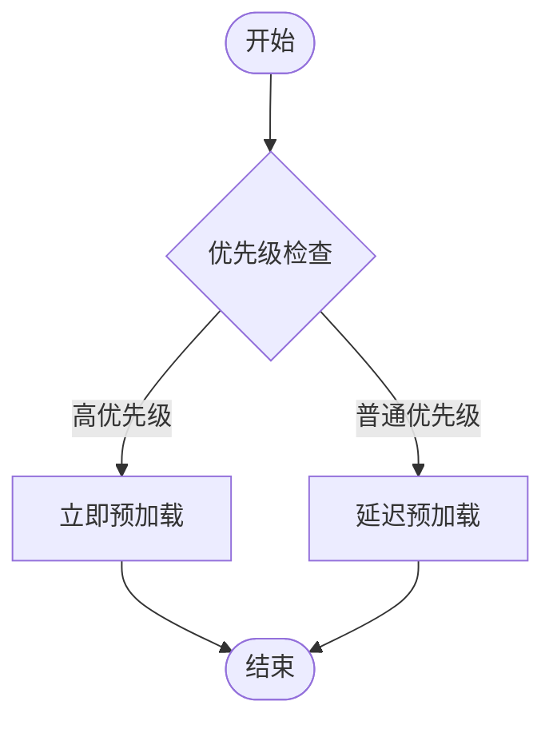
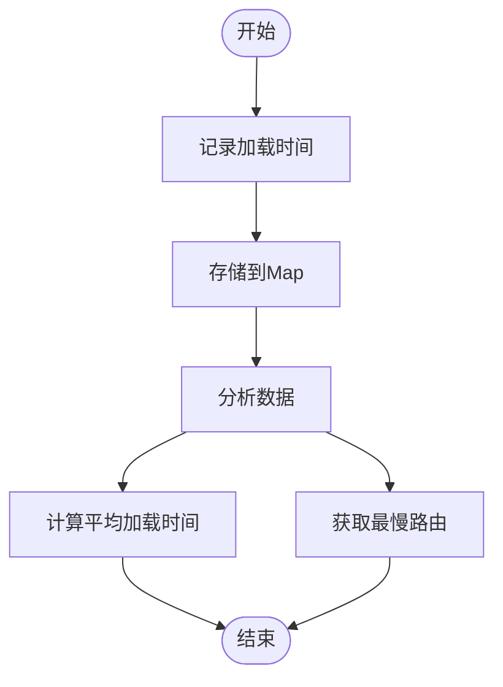
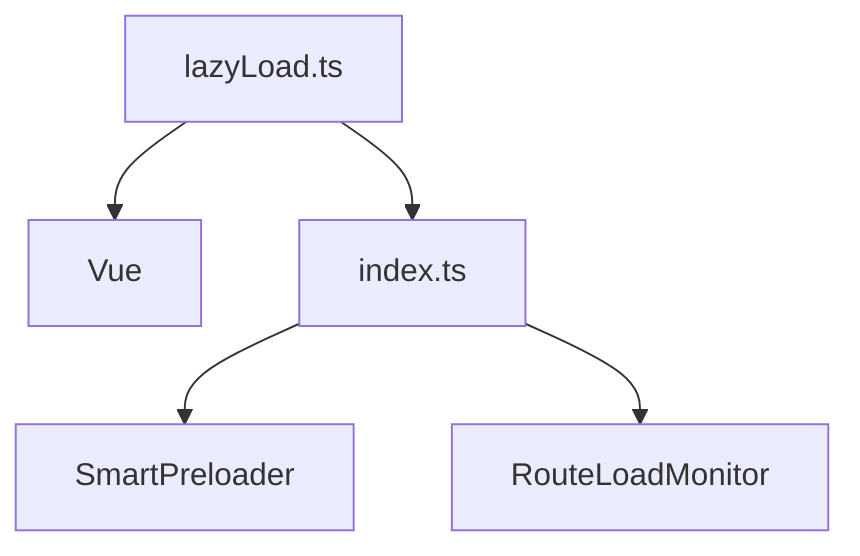

# 懒加载

<cite>
**Referenced Files in This Document**   
- [lazyLoad.ts](file://src/SmartAbp.Vue/src/router/lazyLoad.ts)
- [index.ts](file://src/SmartAbp.Vue/src/router/index.ts)
- [useCodeSplitting.ts](file://src/SmartAbp.Vue/src/composables/useCodeSplitting.ts)
- [ops-monitoring.ts](file://src/SmartAbp.Vue/src/router/modules/ops-monitoring.ts)
</cite>

## 目录
1. [简介](#简介)
2. [项目结构](#项目结构)
3. [核心组件](#核心组件)
4. [架构概述](#架构概述)
5. [详细组件分析](#详细组件分析)
6. [依赖分析](#依赖分析)
7. [性能考量](#性能考量)
8. [故障排除指南](#故障排除指南)
9. [结论](#结论)

## 简介
本文档深入分析了hxlot项目中实现的路由懒加载机制。该机制通过`lazyLoad.ts`文件中的动态导入封装，实现了组件的异步加载，从而优化了应用的启动性能。文档将详细阐述代码分割在前端性能优化中的作用，提供具体的使用示例，并讨论错误边界处理、加载状态管理以及与Vue Router的集成方式。

## 项目结构
hxlot项目的前端代码位于`src/SmartAbp.Vue`目录下，路由相关的代码主要集中在`src/SmartAbp.Vue/src/router`目录中。核心的懒加载逻辑实现在`lazyLoad.ts`文件中，而路由的主配置则在`index.ts`文件中。



**Diagram sources**
- [lazyLoad.ts](file://src/SmartAbp.Vue/src/router/lazyLoad.ts)
- [index.ts](file://src/SmartAbp.Vue/src/router/index.ts)

**Section sources**
- [lazyLoad.ts](file://src/SmartAbp.Vue/src/router/lazyLoad.ts)
- [index.ts](file://src/SmartAbp.Vue/src/router/index.ts)

## 核心组件
`lazyLoad.ts`文件是整个懒加载机制的核心，它提供了`lazyLoadView`函数来封装动态导入，以及`SmartPreloader`和`RouteLoadMonitor`类来实现智能预加载和性能监控。

**Section sources**
- [lazyLoad.ts](file://src/SmartAbp.Vue/src/router/lazyLoad.ts)

## 架构概述
hxlot项目的路由懒加载架构采用了分层设计，将基础的动态导入封装、智能预加载策略和性能监控分离到不同的模块中。这种设计使得代码更加模块化，易于维护和扩展。

```mermaid
graph TD
A[Vue Router] --> B[路由配置]
B --> C[lazyLoadView]
C --> D[动态导入 import()]
B --> E[SmartPreloader]
E --> F[link rel="prefetch"]
E --> G[link rel="preload"]
B --> H[RouteLoadMonitor]
H --> I[性能数据收集]
```

**Diagram sources**
- [lazyLoad.ts](file://src/SmartAbp.Vue/src/router/lazyLoad.ts)
- [index.ts](file://src/SmartAbp.Vue/src/router/index.ts)

## 详细组件分析

### 懒加载视图组件分析
`lazyLoadView`函数是实现路由懒加载的基础。它接收一个组件路径作为参数，并返回一个返回Promise的函数，该Promise解析为组件本身。

#### 对象导向组件
```mermaid
classDiagram
class lazyLoadView {
+componentPath : string
+() : Promise~Component~
}
class SmartPreloader {
-preloadedRoutes : Set~string~
-hoverTimer : number | null
+preload(route : string) : void
+preloadOnHover(route : string, delay : number) : void
+cancelPreload() : void
+preloadBatch(routes : string[]) : void
+clear() : void
}
class RouteLoadMonitor {
-loadTimes : Map~string, number~
+record(route : string, duration : number) : void
+getLoadTime(route : string) : number | undefined
+getAverageLoadTime() : number
+getSlowestRoutes(count : number) : { route : string; duration : number }[]
+clear() : void
}
lazyLoadView --> SmartPreloader : "使用"
lazyLoadView --> RouteLoadMonitor : "使用"
```

**Diagram sources**
- [lazyLoad.ts](file://src/SmartAbp.Vue/src/router/lazyLoad.ts#L10-L12)
- [lazyLoad.ts](file://src/SmartAbp.Vue/src/router/lazyLoad.ts#L76-L136)
- [lazyLoad.ts](file://src/SmartAbp.Vue/src/router/lazyLoad.ts#L162-L204)

#### API/服务组件


**Diagram sources**
- [lazyLoad.ts](file://src/SmartAbp.Vue/src/router/lazyLoad.ts#L10-L12)
- [index.ts](file://src/SmartAbp.Vue/src/router/index.ts)

**Section sources**
- [lazyLoad.ts](file://src/SmartAbp.Vue/src/router/lazyLoad.ts#L10-L12)
- [index.ts](file://src/SmartAbp.Vue/src/router/index.ts)

### 智能预加载分析
`SmartPreloader`类实现了多种预加载策略，包括立即预加载、延迟预加载和基于用户行为的预加载。



**Diagram sources**
- [lazyLoad.ts](file://src/SmartAbp.Vue/src/router/lazyLoad.ts#L76-L136)

**Section sources**
- [lazyLoad.ts](file://src/SmartAbp.Vue/src/router/lazyLoad.ts#L76-L136)

### 性能监控分析
`RouteLoadMonitor`类负责收集和分析路由加载的性能数据，为性能优化提供依据。



**Diagram sources**
- [lazyLoad.ts](file://src/SmartAbp.Vue/src/router/lazyLoad.ts#L162-L204)

**Section sources**
- [lazyLoad.ts](file://src/SmartAbp.Vue/src/router/lazyLoad.ts#L162-L204)

## 依赖分析
`lazyLoad.ts`文件依赖于Vue的`Component`类型，并被`index.ts`中的路由配置所使用。`SmartPreloader`和`RouteLoadMonitor`类作为单例被导出，供整个应用使用。



**Diagram sources**
- [lazyLoad.ts](file://src/SmartAbp.Vue/src/router/lazyLoad.ts)
- [index.ts](file://src/SmartAbp.Vue/src/router/index.ts)

**Section sources**
- [lazyLoad.ts](file://src/SmartAbp.Vue/src/router/lazyLoad.ts)
- [index.ts](file://src/SmartAbp.Vue/src/router/index.ts)

## 性能考量
通过代码分割和懒加载，应用的初始加载时间大大减少。智能预加载策略可以在用户可能访问某个页面之前预先加载其代码，从而提供无缝的用户体验。性能监控功能可以帮助开发者识别和优化加载缓慢的路由。

## 故障排除指南
如果遇到懒加载失败的问题，请检查组件路径是否正确，以及网络连接是否正常。如果预加载没有按预期工作，请检查浏览器的开发者工具中的网络面板，查看预加载请求是否被发送。

**Section sources**
- [lazyLoad.ts](file://src/SmartAbp.Vue/src/router/lazyLoad.ts)
- [useCodeSplitting.ts](file://src/SmartAbp.Vue/src/composables/useCodeSplitting.ts)

## 结论
hxlot项目的路由懒加载机制通过`lazyLoad.ts`文件中的封装，实现了高效、智能的组件加载。这种设计不仅优化了应用的启动性能，还提供了丰富的预加载和性能监控功能，为构建高性能的前端应用提供了坚实的基础。