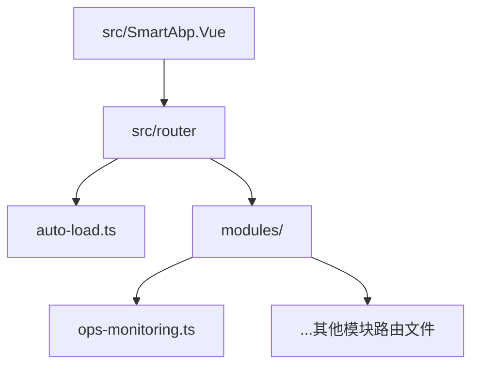
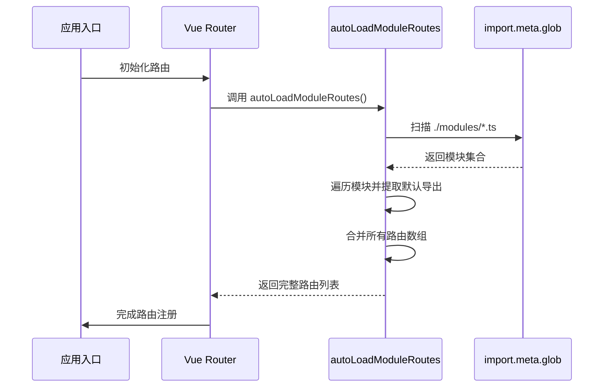
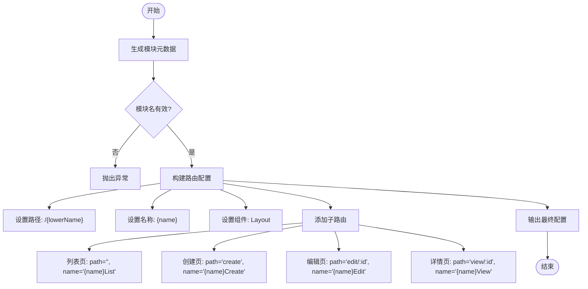
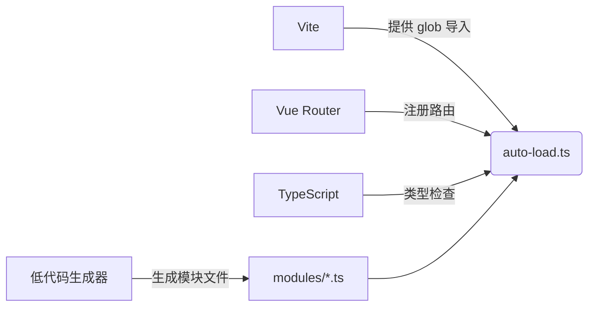

# 自动发现

<cite>
**本文档中引用的文件**  
- [auto-load.ts](file://src/SmartAbp.Vue/src/router/auto-load.ts)
- [ops-monitoring.ts](file://src/SmartAbp.Vue/src/router/modules/ops-monitoring.ts)
- [manifestWriter.ts](file://src/SmartAbp.Vue/packages/lowcode-core/src/utils/manifestWriter.ts)
- [FrontendIntegrationService.cs](file://src/SmartAbp.CodeGenerator/Services/FrontendIntegrationService.cs)
</cite>

## 目录
1. [简介](#简介)
2. [项目结构](#项目结构)
3. [核心组件](#核心组件)
4. [架构概述](#架构概述)
5. [详细组件分析](#详细组件分析)
6. [依赖分析](#依赖分析)
7. [性能考虑](#性能考虑)
8. [故障排除指南](#故障排除指南)
9. [结论](#结论)

## 简介
hxlot项目中的自动发现机制旨在通过文件系统路由自动加载功能，实现前端路由的模块化与自动化注册。该机制基于Vite的`import.meta.glob`特性，动态扫描并加载`router/modules`目录下的所有路由模块，避免了手动导入和维护路由配置的繁琐过程。此设计特别适用于低代码平台，能够显著提升开发效率和系统可维护性。

## 项目结构
项目的前端路由自动发现功能主要集中在`src/SmartAbp.Vue/src/router`目录下，其结构清晰地体现了模块化设计理念：



**图示来源**  
- [auto-load.ts](file://src/SmartAbp.Vue/src/router/auto-load.ts#L1-L100)
- [ops-monitoring.ts](file://src/SmartAbp.Vue/src/router/modules/ops-monitoring.ts#L1-L50)

**本节来源**  
- [auto-load.ts](file://src/SmartAbp.Vue/src/router/auto-load.ts#L1-L100)
- [modules](file://src/SmartAbp.Vue/src/router/modules)

## 核心组件
`auto-load.ts`是实现路由自动发现的核心文件，提供了`autoLoadModuleRoutes`函数用于动态加载所有路由模块。该机制利用Vite的静态分析能力，在构建时自动识别并导入`./modules/*.ts`路径下的所有TypeScript文件，并将它们合并为一个完整的路由数组。

此外，系统还包含辅助函数如`getLoadedModuleInfo`和`printRouteLoadInfo`，用于调试和验证路由加载状态，确保在开发环境中可以实时查看已加载的路由信息。

**本节来源**  
- [auto-load.ts](file://src/SmartAbp.Vue/src/router/auto-load.ts#L19-L56)

## 架构概述
整个自动发现机制依赖于Vite的模块解析能力和Vue Router的动态路由注册机制。当应用启动时，`autoLoadModuleRoutes`函数被调用，触发对`router/modules`目录下所有`.ts`文件的扫描。每个模块需默认导出一个`RouteRecordRaw[]`类型的数组，系统会将其合并到主路由配置中。

该架构支持热重载和按需加载（通过配置`eager: false`），但在当前实现中采用立即加载模式以确保所有路由在应用初始化阶段即可访问。



**图示来源**  
- [auto-load.ts](file://src/SmartAbp.Vue/src/router/auto-load.ts#L19-L56)
- [Vue Router Integration](file://src/SmartAbp.Vue/src/router/index.ts#L10-L30)

## 详细组件分析

### 自动加载逻辑分析
`autoLoadModuleRoutes`函数的核心逻辑如下：
1. 使用`import.meta.glob`动态导入`./modules/*.ts`路径下的所有模块。
2. 设置`eager: true`参数，确保所有模块在构建时立即加载。
3. 遍历导入的模块对象，提取每个模块的`default`导出。
4. 验证导出是否为数组类型，若符合则将其加入总路由列表。
5. 记录加载过程中的警告和错误信息，便于调试。

该机制具备良好的容错性：对于缺少默认导出或导出类型不正确的模块，系统仅发出警告而不中断整体流程。

#### 类图：路由模块结构
```mermaid
classDiagram
class RouteRecordRaw {
+path : string
+name : string
+component : Component
+meta : object
+children : RouteRecordRaw[]
}
class ModuleFile {
<<TypeScript File>>
+default : RouteRecordRaw[]
}
class AutoLoadUtil {
+autoLoadModuleRoutes() : RouteRecordRaw[]
+getLoadedModuleInfo() : {path, routeCount, routes}[]
+printRouteLoadInfo() : void
}
AutoLoadUtil --> ModuleFile : 动态导入
ModuleFile --> RouteRecordRaw : 包含多个
```

**图示来源**  
- [auto-load.ts](file://src/SmartAbp.Vue/src/router/auto-load.ts#L19-L56)
- [Vue Router Types](file://node_modules/vue-router/index.d.ts)

**本节来源**  
- [auto-load.ts](file://src/SmartAbp.Vue/src/router/auto-load.ts#L19-L56)

### 模块化路由注册与目录映射
系统通过命名约定将文件路径映射为路由结构。例如，`modules/ops-monitoring.ts`文件对应运维监控模块的路由配置。每个模块文件通常由低代码生成器自动生成，遵循统一的结构规范。

在代码生成阶段，`FrontendIntegrationService.cs`负责生成`routes.generated.ts`文件，而模块级路由则由`manifestWriter.ts`根据模块元数据动态生成路由配置对象，包括路径、名称、组件引用及菜单元信息。



**图示来源**  
- [manifestWriter.ts](file://src/SmartAbp.Vue/packages/lowcode-core/src/utils/manifestWriter.ts#L470-L518)
- [FrontendIntegrationService.cs](file://src/SmartAbp.CodeGenerator/Services/FrontendIntegrationService.cs#L34-L57)

**本节来源**  
- [manifestWriter.ts](file://src/SmartAbp.Vue/packages/lowcode-core/src/utils/manifestWriter.ts#L470-L518)
- [FrontendIntegrationService.cs](file://src/SmartAbp.CodeGenerator/Services/FrontendIntegrationService.cs#L34-L57)

## 依赖分析
自动发现机制依赖于以下关键技术栈：
- **Vite**：提供`import.meta.glob`功能，实现静态资源的动态导入。
- **Vue Router**：接收由`autoLoadModuleRoutes`返回的路由数组并完成注册。
- **TypeScript**：确保类型安全，`RouteRecordRaw`接口定义了路由记录的标准结构。
- **低代码生成器**：自动生成符合规范的模块路由文件，保证命名和结构一致性。



**图示来源**  
- [auto-load.ts](file://src/SmartAbp.Vue/src/router/auto-load.ts#L1-L100)
- [vite.config.ts](file://vite.config.ts#L10-L20)

**本节来源**  
- [auto-load.ts](file://src/SmartAbp.Vue/src/router/auto-load.ts#L1-L100)
- [vite.config.ts](file://vite.config.ts#L10-L20)

## 性能考虑
尽管`eager: true`确保了路由的即时可用性，但也可能导致打包体积增大。建议在大型项目中评估是否切换为懒加载模式（`eager: false`），通过动态导入实现按需加载，从而优化首屏加载性能。

此外，由于所有模块在构建时被静态分析，因此不会产生运行时性能开销。日志输出仅在开发环境启用，生产环境中已被移除，不影响最终性能。

## 故障排除指南
常见问题及解决方案：
- **模块未被加载**：检查文件是否位于`router/modules`目录下且扩展名为`.ts`。
- **无默认导出**：确保每个模块文件使用`export default []`语法导出路由数组。
- **导出非数组类型**：确认导出内容为`RouteRecordRaw[]`类型，避免误导出对象或其他类型。
- **路径冲突**：不同模块间应避免定义相同路径，否则会导致路由覆盖。

调试时可调用`printRouteLoadInfo()`函数查看详细加载信息，帮助定位问题。

**本节来源**  
- [auto-load.ts](file://src/SmartAbp.Vue/src/router/auto-load.ts#L77-L98)

## 结论
hxlot项目的基于文件系统的路由自动发现机制，结合Vite的模块扫描能力和低代码生成技术，实现了高效、灵活的前端路由管理方案。该机制不仅减少了手动配置的工作量，还提升了系统的可扩展性和可维护性，特别适合模块化程度高、频繁迭代的低代码应用场景。未来可通过引入懒加载策略进一步优化性能表现。