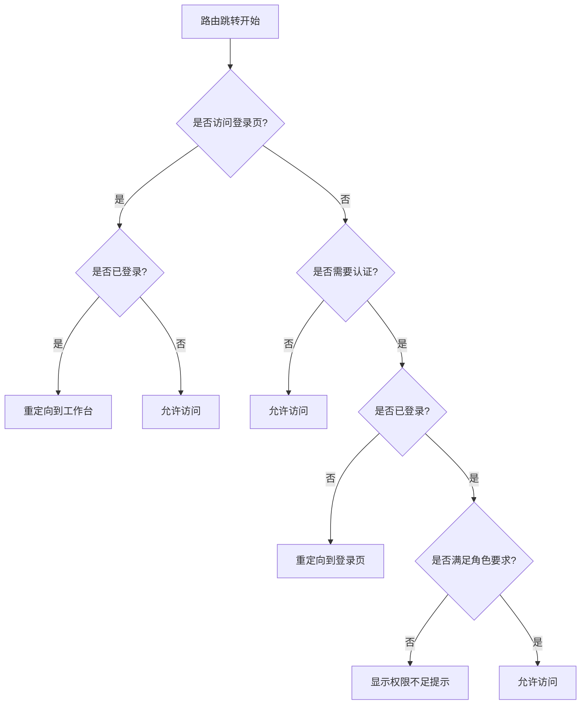
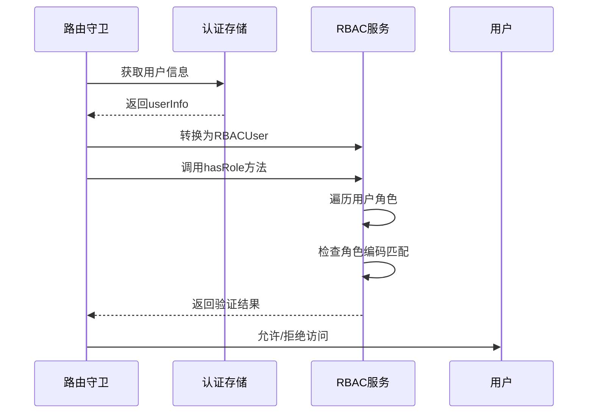
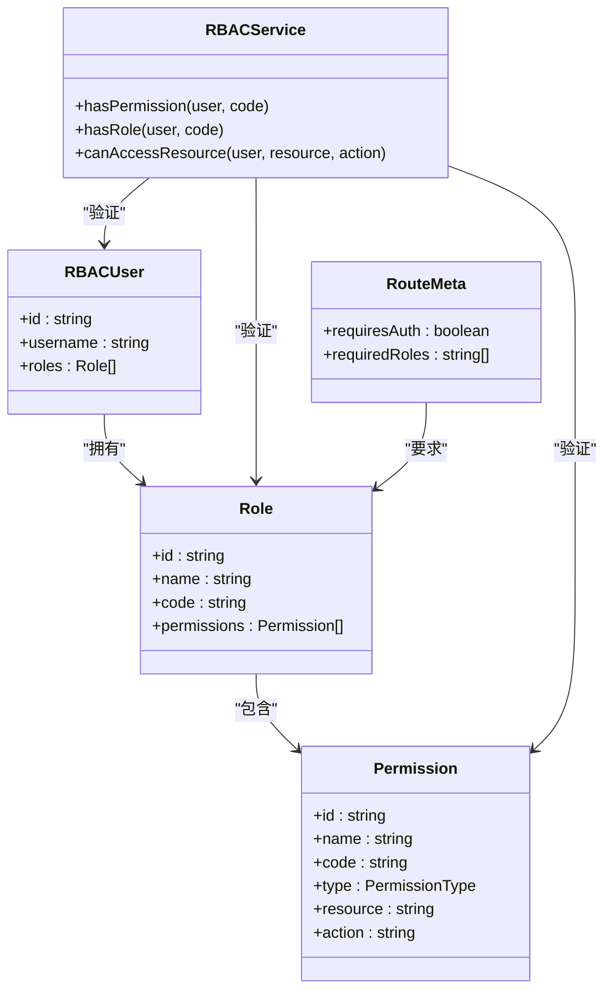

# 权限控制

<cite>
**本文档引用的文件**  
- [useRBAC.ts](file://src/SmartAbp.Vue/src/composables/useRBAC.ts)
- [rbac.ts](file://src/SmartAbp.Vue/src/auth/rbac.ts)
- [index.ts](file://src/SmartAbp.Vue/src/router/index.ts)
- [authStore.ts](file://output/mes-uniapp/stores/authStore.ts)
- [router-guard.ts](file://templates/vue/patterns/router-guard.ts)
</cite>

## 目录
1. [引言](#引言)
2. [路由守卫实现机制](#路由守卫实现机制)
3. [权限验证流程](#权限验证流程)
4. [RBAC权限模型在路由层面的应用](#rbac权限模型在路由层面的应用)
5. [权限元数据定义与解析](#权限元数据定义与解析)
6. [权限配置示例](#权限配置示例)
7. [常见问题排查指南](#常见问题排查指南)

## 引言
hxlot项目采用基于角色的访问控制（RBAC）模型实现精细化的权限管理。本系统通过路由守卫、权限服务和元数据配置三者协同工作，确保用户只能访问其被授权的资源。前端通过Vue Router的导航守卫拦截路由跳转请求，并结合RBAC服务进行权限验证，从而实现安全可靠的访问控制机制。

**Section sources**
- [index.ts](file://src/SmartAbp.Vue/src/router/index.ts#L1-L50)
- [rbac.ts](file://src/SmartAbp.Vue/src/auth/rbac.ts#L1-L50)

## 路由守卫实现机制
路由守卫是权限控制的核心组件，位于`src/SmartAbp.Vue/src/router/index.ts`文件中。系统使用Vue Router提供的`beforeEach`全局前置守卫，在每次路由跳转前执行权限检查逻辑。

守卫按照以下顺序执行验证：
1. 登录状态检查：已登录用户访问登录页时重定向至工作台
2. 认证检查：需要认证但未登录的用户重定向至登录页
3. 角色权限检查：验证用户是否具备目标路由所需的角色
4. 根路径处理：根据登录状态决定重定向目标



**Diagram sources**
- [index.ts](file://src/SmartAbp.Vue/src/router/index.ts#L300-L400)

**Section sources**
- [index.ts](file://src/SmartAbp.Vue/src/router/index.ts#L300-L450)
- [router-guard.ts](file://templates/vue/patterns/router-guard.ts#L1-L17)

## 权限验证流程
权限验证流程始于路由守卫调用`useAuthStore`获取用户认证状态，随后通过`rbacService`执行具体的权限判断。整个流程包含三个主要环节：

1. **用户信息转换**：将AuthStore中的用户信息转换为RBACUser格式
2. **权限检查**：调用RBACService的方法验证具体权限
3. **结果反馈**：根据验证结果决定是否允许路由跳转

该流程确保了权限验证的统一性和可维护性，所有权限相关的业务逻辑都集中在RBACService类中处理。



**Diagram sources**
- [useRBAC.ts](file://src/SmartAbp.Vue/src/composables/useRBAC.ts#L9-L178)
- [rbac.ts](file://src/SmartAbp.Vue/src/auth/rbac.ts#L108-L241)

**Section sources**
- [useRBAC.ts](file://src/SmartAbp.Vue/src/composables/useRBAC.ts#L9-L178)
- [rbac.ts](file://src/SmartAbp.Vue/src/auth/rbac.ts#L108-L241)

## RBAC权限模型在路由层面的应用
RBAC权限模型通过路由元信息（meta字段）与具体路由绑定，实现了基于角色的访问控制。每个需要权限控制的路由都配置了`requiredRoles`属性，定义了访问该路由所需的最小角色集合。

系统支持多种权限检查模式：
- 单角色检查：用户只需具备任一指定角色即可访问
- 多角色检查：用户必须具备所有指定角色才能访问
- 角色层级继承：支持角色间的继承关系，如管理员自动拥有普通用户权限

这种设计使得权限控制既灵活又易于管理，能够满足复杂的业务场景需求。



**Diagram sources**
- [rbac.ts](file://src/SmartAbp.Vue/src/auth/rbac.ts#L1-L100)
- [index.ts](file://src/SmartAbp.Vue/src/router/index.ts#L100-L200)

**Section sources**
- [rbac.ts](file://src/SmartAbp.Vue/src/auth/rbac.ts#L1-L292)
- [index.ts](file://src/SmartAbp.Vue/src/router/index.ts#L1-L687)

## 权限元数据定义与解析
权限元数据通过路由的meta字段进行定义，主要包括两个关键属性：`requiresAuth`和`requiredRoles`。这些元数据在应用启动时被加载，并在路由跳转时由守卫进行解析和验证。

元数据解析过程如下：
1. 从路由记录中提取meta信息
2. 判断是否需要认证（requiresAuth）
3. 获取所需角色列表（requiredRoles）
4. 调用RBACService进行权限验证
5. 根据验证结果决定路由行为

这种基于元数据的权限控制方式具有良好的扩展性，可以在不修改核心逻辑的情况下添加新的权限规则。

**Section sources**
- [index.ts](file://src/SmartAbp.Vue/src/router/index.ts#L50-L100)
- [rbac.ts](file://src/SmartAbp.Vue/src/auth/rbac.ts#L244-L244)

## 权限配置示例
以下是一个典型的路由权限配置示例：

```typescript
{
  path: "/Admin",
  component: SmartAbpLayout,
  meta: {
    title: "系统管理",
    icon: "⚙️",
    requiresAuth: true,
    requiredRoles: ["admin"]
  },
  children: [
    {
      path: "settings",
      name: "AdminSettings",
      component: SettingsView,
      meta: { 
        title: "系统设置", 
        menuKey: "admin-settings" 
      }
    }
  ]
}
```

此配置表示"系统管理"模块需要用户登录（requiresAuth: true）且必须具有"admin"角色才能访问。子路由继承父路由的权限要求，因此"系统设置"页面同样需要管理员权限。

**Section sources**
- [index.ts](file://src/SmartAbp.Vue/src/router/index.ts#L200-L250)

## 常见问题排查指南
### 问题1：已登录但无法访问页面
**可能原因**：
- 用户角色不符合路由要求
- 角色信息未正确加载到AuthStore
- 缓存中的用户信息过期

**解决方案**：
1. 检查用户实际拥有的角色
2. 确认AuthStore中的userInfo是否包含正确的roles字段
3. 清除本地存储并重新登录

### 问题2：权限检查始终失败
**可能原因**：
- RBACService的hasRole方法逻辑错误
- 角色编码大小写不匹配
- requiredRoles配置错误

**解决方案**：
1. 检查RBACService的实现代码
2. 确保角色编码的大小写一致性
3. 验证路由meta中的requiredRoles配置

### 问题3：路由重定向循环
**可能原因**：
- 路由守卫中next()调用不当
- 403页面也需要认证导致循环

**解决方案**：
1. 确保在拒绝访问时重定向到不需要认证的页面（如403）
2. 检查所有路由的requiresAuth配置

**Section sources**
- [index.ts](file://src/SmartAbp.Vue/src/router/index.ts#L400-L450)
- [useRBAC.ts](file://src/SmartAbp.Vue/src/composables/useRBAC.ts#L37-L40)
- [rbac.ts](file://src/SmartAbp.Vue/src/auth/rbac.ts#L108-L115)