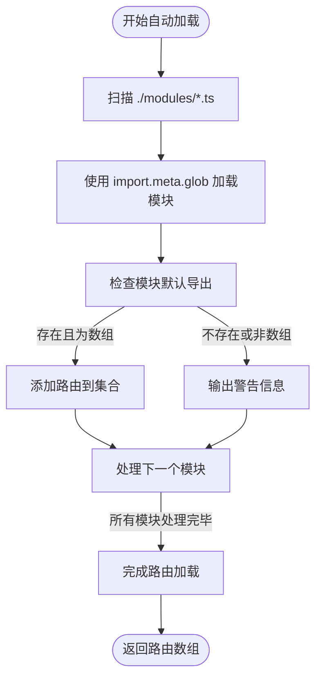
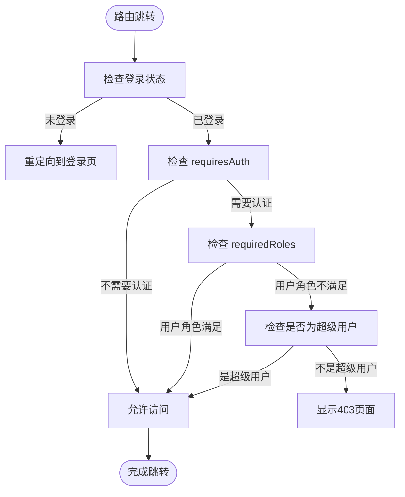
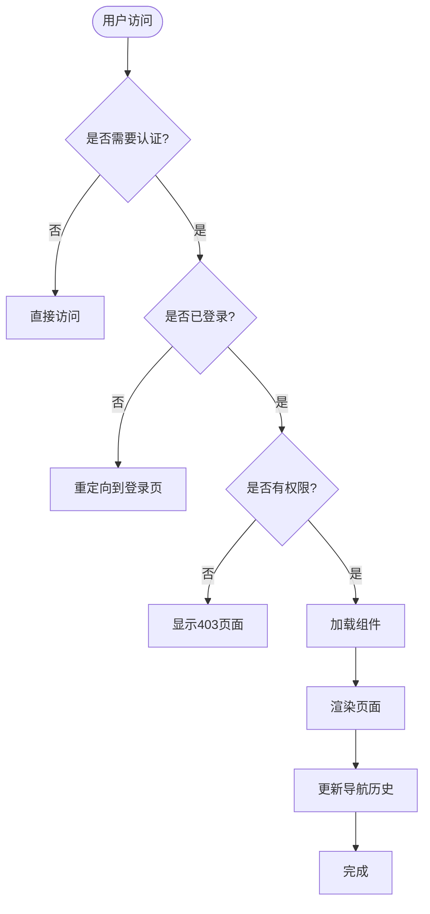
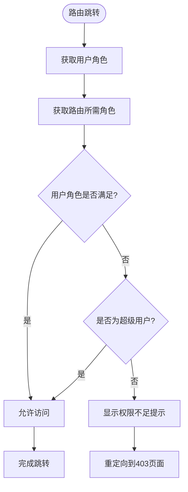

# 路由系统

<cite>
**本文档引用的文件**  
- [auto-load.ts](file://src/SmartAbp.Vue/src/router/auto-load.ts)
- [lazyLoad.ts](file://src/SmartAbp.Vue/src/router/lazyLoad.ts)
- [index.ts](file://src/SmartAbp.Vue/src/router/index.ts)
- [ops-monitoring.ts](file://src/SmartAbp.Vue/src/router/modules/ops-monitoring.ts)
- [rbac.ts](file://src/SmartAbp.Vue/src/auth/rbac.ts)
- [useMenuPermission.ts](file://src/SmartAbp.Vue/src/composables/useMenuPermission.ts)
- [router.ts](file://src/SmartAbp.Vue/src/types/router.ts)
</cite>

## 目录
1. [简介](#简介)
2. [路由模块组织结构](#路由模块组织结构)
3. [动态路由加载机制](#动态路由加载机制)
4. [权限路由控制](#权限路由控制)
5. [路由守卫实现](#路由守卫实现)
6. [路由状态与导航历史](#路由状态与导航历史)
7. [路由流程图](#路由流程图)
8. [权限控制流程图](#权限控制流程图)

## 简介
hxlot项目的路由系统基于Vue Router构建，采用模块化设计，支持动态路由加载和细粒度权限控制。系统通过`auto-load.ts`实现路由的自动发现，结合`lazyLoad.ts`优化组件加载性能，并通过路由守卫进行权限验证。路由配置遵循统一的命名规范，支持角色和权限双重控制机制，确保系统的安全性和可维护性。

## 路由模块组织结构
路由模块采用分层组织结构，主要分为以下几个部分：
- **核心路由**：定义在`index.ts`中的基础路由，包括登录、403页面、工作台等核心功能。
- **模块路由**：存放在`router/modules`目录下的独立路由模块，如`ops-monitoring.ts`，每个模块负责特定功能域的路由配置。
- **自动生成路由**：通过代码生成器动态生成的路由，由自动加载机制统一管理。

路由模块遵循以下命名规范：
- 文件名采用小写字母和连字符（kebab-case）命名，如`ops-monitoring.ts`。
- 模块导出的路由变量名统一为`{ModuleName}Routes`，如`opsMonitoringRoutes`。
- 路由名称采用PascalCase命名，如`Login`、`DashboardHome`。

**Section sources**
- [index.ts](file://src/SmartAbp.Vue/src/router/index.ts#L1-L100)
- [ops-monitoring.ts](file://src/SmartAbp.Vue/src/router/modules/ops-monitoring.ts#L1-L20)

## 动态路由加载机制
### 自动发现机制
系统通过`auto-load.ts`文件实现路由的自动发现和加载。该机制利用Vite的`import.meta.glob`功能，动态扫描`router/modules`目录下的所有`.ts`文件，并立即加载（eager loading）这些模块。

**Diagram sources**
- [auto-load.ts](file://src/SmartAbp.Vue/src/router/auto-load.ts#L19-L56)

### 懒加载优化
`lazyLoad.ts`文件提供了组件懒加载和预加载的优化工具，包括：
- `lazyLoadView`：基础懒加载函数，用于按需加载视图组件。
- `preloadRoutes`：预加载关键路由组件，提升用户体验。
- `SmartPreloader`：智能预加载器，根据用户行为预测并预加载可能访问的路由。

**Section sources**
- [auto-load.ts](file://src/SmartAbp.Vue/src/router/auto-load.ts#L19-L56)
- [lazyLoad.ts](file://src/SmartAbp.Vue/src/router/lazyLoad.ts#L10-L12)

## 权限路由控制
### 权限模型
系统采用基于角色的访问控制（RBAC）模型，权限控制主要通过路由元信息（meta）实现：
- `requiresAuth`：布尔值，标识是否需要认证。
- `requiredRoles`：字符串数组，定义访问该路由所需的角色。
- `requiredPermissions`：字符串数组，定义访问该路由所需的权限。

### 权限验证流程
权限验证在路由守卫中执行，主要流程包括：
1. 检查用户登录状态。
2. 验证路由是否需要认证。
3. 检查用户角色是否满足`requiredRoles`要求。
4. 特殊处理超级用户白名单。

**Diagram sources**
- [index.ts](file://src/SmartAbp.Vue/src/router/index.ts#L584-L587)
- [rbac.ts](file://src/SmartAbp.Vue/src/auth/rbac.ts#L108-L241)

## 路由守卫实现
路由守卫在`index.ts`中通过`router.beforeEach`和`router.afterEach`实现，主要功能包括：
- **认证检查**：拦截未登录用户的访问请求，重定向到登录页。
- **权限验证**：检查用户角色是否满足路由要求，对权限不足的请求返回403页面。
- **重定向处理**：处理根路径和登录页的特殊跳转逻辑。
- **性能监控**：在`afterEach`钩子中记录路由切换性能。

路由守卫还实现了多标签页状态同步，通过监听`storage`事件处理token变化。

**Section sources**
- [index.ts](file://src/SmartAbp.Vue/src/router/index.ts#L584-L587)
- [useMenuPermission.ts](file://src/SmartAbp.Vue/src/composables/useMenuPermission.ts#L16-L16)

## 路由状态与导航历史
系统通过Vue Router内置的导航历史管理用户的路由状态。主要特性包括：
- **浏览器历史集成**：使用`createWebHistory`模式，与浏览器前进后退按钮无缝集成。
- **编程式导航**：通过`router.push`和`router.replace`实现页面跳转。
- **导航守卫**：在导航过程中执行权限检查和状态验证。
- **滚动行为**：支持自定义滚动行为，保持用户体验一致性。

**Section sources**
- [index.ts](file://src/SmartAbp.Vue/src/router/index.ts#L584-L587)

## 路由流程图

**Diagram sources**
- [index.ts](file://src/SmartAbp.Vue/src/router/index.ts#L584-L587)

## 权限控制流程图

**Diagram sources**
- [rbac.ts](file://src/SmartAbp.Vue/src/auth/rbac.ts#L108-L241)
- [useMenuPermission.ts](file://src/SmartAbp.Vue/src/composables/useMenuPermission.ts#L16-L16)