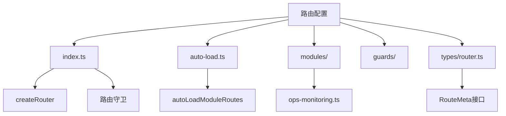
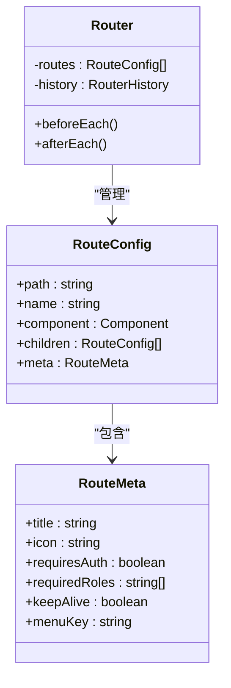
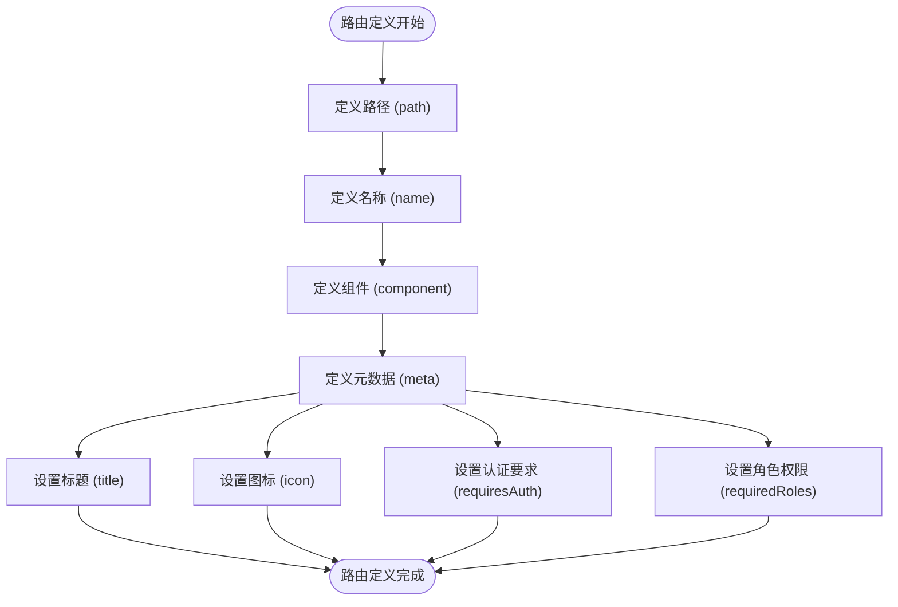
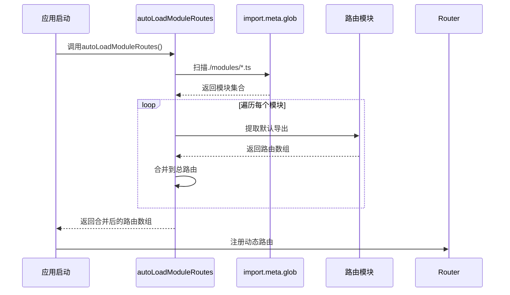
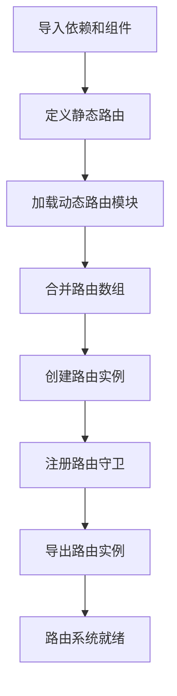
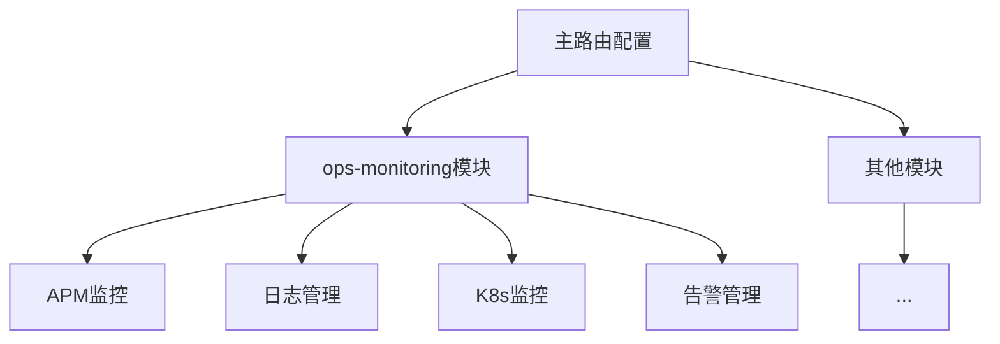

# 路由配置

<cite>
**Referenced Files in This Document**  
- [index.ts](file://src/SmartAbp.Vue/src/router/index.ts)
- [auto-load.ts](file://src/SmartAbp.Vue/src/router/auto-load.ts)
- [router.ts](file://src/SmartAbp.Vue/src/types/router.ts)
- [ops-monitoring.ts](file://src/SmartAbp.Vue/src/router/modules/ops-monitoring.ts)
</cite>

## Table of Contents
1. [项目结构](#项目结构)
2. [路由配置结构](#路由配置结构)
3. [静态路由定义](#静态路由定义)
4. [动态路由定义](#动态路由定义)
5. [路由初始化流程](#路由初始化流程)
6. [模块化路由组织](#模块化路由组织)
7. [路由模块划分原则](#路由模块划分原则)
8. [命名规范](#命名规范)
9. [最佳实践](#最佳实践)
10. [常见问题解决方案](#常见问题解决方案)

## 项目结构

hxlot项目的路由配置位于`src/SmartAbp.Vue/src/router`目录下，该目录包含核心路由配置文件、路由守卫、模块化路由以及辅助工具。路由系统基于Vue Router 4构建，采用模块化设计，支持静态路由和动态路由的混合配置。

**Diagram sources**  
- [index.ts](file://src/SmartAbp.Vue/src/router/index.ts)
- [auto-load.ts](file://src/SmartAbp.Vue/src/router/auto-load.ts)
- [ops-monitoring.ts](file://src/SmartAbp.Vue/src/router/modules/ops-monitoring.ts)
- [router.ts](file://src/SmartAbp.Vue/src/types/router.ts)

**Section sources**
- [index.ts](file://src/SmartAbp.Vue/src/router/index.ts)

## 路由配置结构

hxlot项目的路由配置采用分层结构，主要由以下几个部分组成：核心路由配置、路由元数据定义、模块化路由和自动加载机制。这种结构设计使得路由配置既保持了清晰的组织，又具备良好的扩展性。

核心路由配置文件`index.ts`负责创建Vue Router实例，定义静态路由，并集成动态路由加载机制。路由元数据在`types/router.ts`中通过扩展Vue Router的`RouteMeta`接口来定义，包含了页面标题、图标、权限要求等丰富的元信息。

**Diagram sources**  
- [index.ts](file://src/SmartAbp.Vue/src/router/index.ts)
- [router.ts](file://src/SmartAbp.Vue/src/types/router.ts)

**Section sources**
- [index.ts](file://src/SmartAbp.Vue/src/router/index.ts)
- [router.ts](file://src/SmartAbp.Vue/src/types/router.ts)

## 静态路由定义

静态路由在`index.ts`文件中直接定义，采用Vue Router的`RouteRecordRaw`类型。每个路由对象包含路径、名称、组件和元数据等基本属性。静态路由主要用于定义应用的核心页面和固定功能模块。

路由配置中的元数据（meta）字段包含了丰富的页面信息，如标题、图标、认证要求和角色权限等。这些元数据不仅用于路由守卫的权限检查，还被菜单系统、面包屑导航等UI组件所使用。

**Diagram sources**  
- [index.ts](file://src/SmartAbp.Vue/src/router/index.ts)

**Section sources**
- [index.ts](file://src/SmartAbp.Vue/src/router/index.ts)

## 动态路由定义

动态路由通过`auto-load.ts`文件中的`autoLoadModuleRoutes`函数实现。该函数利用Vite的`import.meta.glob`特性，自动扫描并加载`router/modules`目录下的所有路由模块，实现了路由的动态发现和注册。

这种设计模式解决了代码生成后需要手动导入路由的问题，使得新生成的模块能够自动集成到应用中，无需修改核心路由配置文件。在开发模式下，系统还会打印路由加载的详细信息，便于调试和验证。

**Diagram sources**  
- [auto-load.ts](file://src/SmartAbp.Vue/src/router/auto-load.ts)

**Section sources**
- [auto-load.ts](file://src/SmartAbp.Vue/src/router/auto-load.ts)

## 路由初始化流程

路由初始化流程始于`index.ts`文件，首先导入必要的依赖和页面组件，然后定义静态路由数组。接着，通过扩展操作符`...`将动态加载的路由模块合并到主路由数组中。

在路由数组构建完成后，使用`createRouter`函数创建路由实例，并配置为`createWebHistory`模式。最后，注册全局路由守卫，包括前置守卫`beforeEach`和后置守卫`afterEach`，以实现认证、权限检查和性能监控等功能。

**Diagram sources**  
- [index.ts](file://src/SmartAbp.Vue/src/router/index.ts)

**Section sources**
- [index.ts](file://src/SmartAbp.Vue/src/router/index.ts)

## 模块化路由组织

模块化路由组织是hxlot项目路由系统的重要特性，通过将特定功能的路由定义在独立的模块文件中，实现了路由配置的解耦和可维护性。例如，`ops-monitoring.ts`文件专门负责运维监控相关的路由配置。

每个路由模块文件导出一个`RouteRecordRaw`数组，该数组可以包含嵌套路由结构。主路由配置通过扩展操作符将这些模块路由合并到主路由数组中，保持了配置的简洁性和可读性。

**Diagram sources**  
- [index.ts](file://src/SmartAbp.Vue/src/router/index.ts)
- [ops-monitoring.ts](file://src/SmartAbp.Vue/src/router/modules/ops-monitoring.ts)

**Section sources**
- [index.ts](file://src/SmartAbp.Vue/src/router/index.ts)
- [ops-monitoring.ts](file://src/SmartAbp.Vue/src/router/modules/ops-monitoring.ts)

## 路由模块划分原则

路由模块的划分遵循功能聚合原则，将相关功能的路由组织在同一模块中。例如，所有运维监控相关的路由都被归入`ops-monitoring`模块，所有低代码相关路由都被组织在`lowcode`路由的子路由中。

模块划分还考虑了权限边界，将需要特定角色权限的功能模块化，便于权限系统的集成和管理。同时，模块划分也遵循了单一职责原则，每个模块只负责一个明确的功能领域，避免了模块间的职责重叠。

## 命名规范

路由命名遵循清晰、一致的规范。路由名称采用PascalCase格式，如`LoginView`、`DashboardHome`等，确保名称的可读性和一致性。路径命名采用kebab-case格式，使用连字符分隔单词，如`/lowcode/welcome`、`/ops-monitoring/apm`等。

元数据中的`menuKey`字段用于标识菜单项，采用小写字母和连字符的组合，如`ultra-simple-mode`、`smart-config-mode`等，便于在菜单系统中进行引用和管理。

## 最佳实践

1. **模块化设计**：将相关功能的路由组织在独立模块中，提高可维护性
2. **元数据丰富化**：充分利用`meta`字段存储页面相关信息，支持多种UI组件
3. **权限集成**：在路由元数据中定义`requiredRoles`，与认证系统紧密集成
4. **动态加载**：利用自动加载机制，支持代码生成后的自动集成
5. **开发调试**：在开发模式下启用路由加载信息打印，便于问题排查

## 常见问题解决方案

1. **路由未生效**：检查路由模块是否正确导出默认数组，确认文件路径是否符合`./modules/*.ts`模式
2. **权限问题**：验证用户角色是否满足`requiredRoles`要求，检查认证状态
3. **组件加载失败**：确认组件路径是否正确，检查动态导入语法
4. **路由冲突**：确保路由路径的唯一性，避免重复定义
5. **性能问题**：合理使用`keepAlive`元数据，避免不必要的组件重建