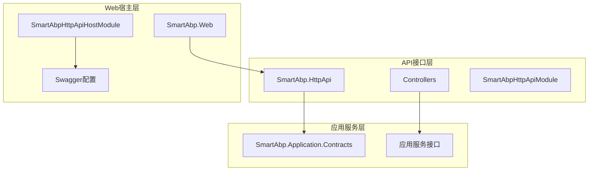
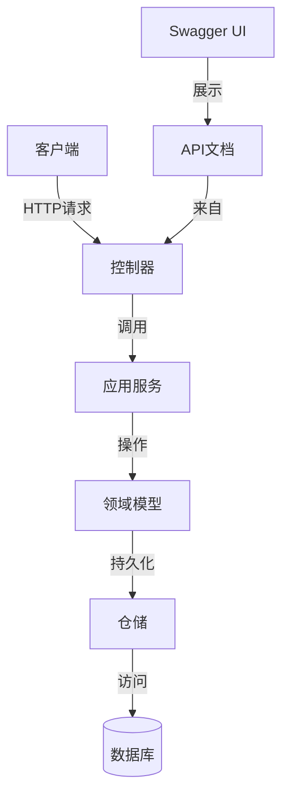
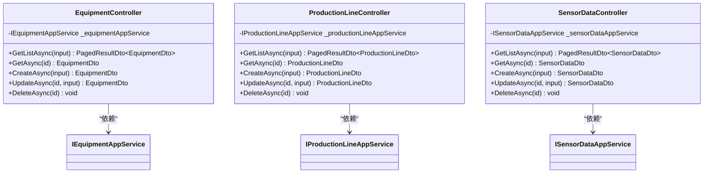
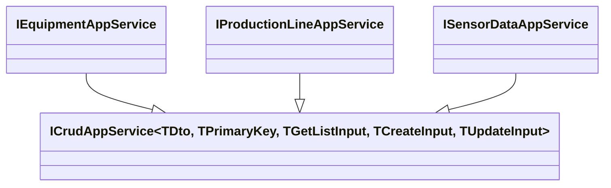
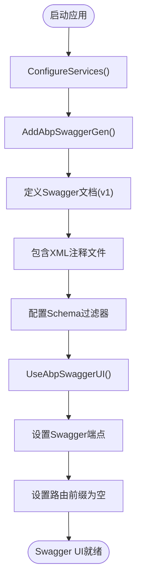
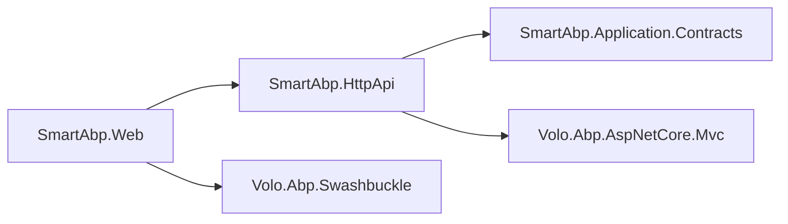

# API接口层

<cite>
**本文档引用的文件**  
- [SmartAbpHttpApiModule.cs](file://src/SmartAbp.HttpApi/SmartAbpHttpApiModule.cs)
- [EquipmentController.cs](file://src/SmartAbp.HttpApi/Controllers/EquipmentController.cs)
- [ProductionLineController.cs](file://src/SmartAbp.HttpApi/Controllers/ProductionLineController.cs)
- [SensorDataController.cs](file://src/SmartAbp.HttpApi/Controllers/SensorDataController.cs)
- [SmartAbpHttpApiHostModule.cs](file://src/SmartAbp.Web/SmartAbpHttpApiHostModule.cs)
- [IEquipmentAppService.cs](file://src/SmartAbp.Application.Contracts/Equipment/IEquipmentAppService.cs)
- [IProductionLineAppService.cs](file://src/SmartAbp.Application.Contracts/ProductionLine/IProductionLineAppService.cs)
- [ISensorDataAppService.cs](file://src/SmartAbp.Application.Contracts/SensorData/ISensorDataAppService.cs)
- [nswag.json](file://src/SmartAbp.Vue/nswag.json)
</cite>

## 目录
1. [简介](#简介)
2. [项目结构](#项目结构)
3. [核心组件](#核心组件)
4. [架构概述](#架构概述)
5. [详细组件分析](#详细组件分析)
6. [依赖分析](#依赖分析)
7. [性能考虑](#性能考虑)
8. [故障排除指南](#故障排除指南)
9. [结论](#结论)

## 简介
hxlot项目是一个基于ABP框架的低代码平台，其API接口层（HttpApi模块）负责暴露应用服务功能，实现前后端解耦。本文档全面阐述HttpApi模块的设计与实现，重点解析控制器如何暴露应用服务的功能、API版本控制、路由配置、异常处理机制、Swagger/OpenAPI集成方式、DTO数据隔离、安全配置及调用示例。

## 项目结构
API接口层主要位于`src/SmartAbp.HttpApi`目录下，包含Controllers子目录中的多个控制器类。每个控制器对应一个业务领域（如设备、生产线、传感器数据），通过依赖注入方式调用对应的应用服务接口。Swagger文档集成在`SmartAbp.Web`模块中，由`SmartAbpHttpApiHostModule`配置。

**图表来源**  
- [SmartAbpHttpApiModule.cs](file://src/SmartAbp.HttpApi/SmartAbpHttpApiModule.cs)
- [SmartAbpHttpApiHostModule.cs](file://src/SmartAbp.Web/SmartAbpHttpApiHostModule.cs)

**章节来源**  
- [SmartAbpHttpApiModule.cs](file://src/SmartAbp.HttpApi/SmartAbpHttpApiModule.cs)
- [SmartAbpHttpApiHostModule.cs](file://src/SmartAbp.Web/SmartAbpHttpApiHostModule.cs)

## 核心组件
API接口层的核心组件包括控制器类、应用服务接口和Swagger集成配置。控制器类继承自`AbpController`，通过`[RemoteService]`和`[Route]`属性暴露HTTP端点。应用服务接口定义在`SmartAbp.Application.Contracts`命名空间下，遵循ABP的CRUD应用服务模式。Swagger文档通过`AddAbpSwaggerGen`和`UseAbpSwaggerUI`方法集成。

**章节来源**  
- [EquipmentController.cs](file://src/SmartAbp.HttpApi/Controllers/EquipmentController.cs)
- [IEquipmentAppService.cs](file://src/SmartAbp.Application.Contracts/Equipment/IEquipmentAppService.cs)
- [SmartAbpHttpApiHostModule.cs](file://src/SmartAbp.Web/SmartAbpHttpApiHostModule.cs)

## 架构概述
API接口层采用典型的分层架构，控制器位于最上层，负责处理HTTP请求和响应；中间层为应用服务接口，定义业务操作契约；底层为领域层和数据访问层。所有控制器通过依赖注入获取应用服务实例，实现松耦合。Swagger文档自动生成并提供交互式API测试界面。

**图表来源**  
- [EquipmentController.cs](file://src/SmartAbp.HttpApi/Controllers/EquipmentController.cs)
- [IEquipmentAppService.cs](file://src/SmartAbp.Application.Contracts/Equipment/IEquipmentAppService.cs)

## 详细组件分析

### 控制器分析
控制器类如`EquipmentController`、`ProductionLineController`和`SensorDataController`均遵循相同的模式：定义路由前缀、注入应用服务、实现CRUD操作。每个操作方法使用相应的HTTP动词属性（`[HttpGet]`、`[HttpPost]`等）标记，并异步调用应用服务方法。

#### 控制器类图

**图表来源**  
- [EquipmentController.cs](file://src/SmartAbp.HttpApi/Controllers/EquipmentController.cs)
- [ProductionLineController.cs](file://src/SmartAbp.HttpApi/Controllers/ProductionLineController.cs)
- [SensorDataController.cs](file://src/SmartAbp.HttpApi/Controllers/SensorDataController.cs)

### 应用服务接口分析
应用服务接口如`IEquipmentAppService`继承自ABP框架的`ICrudAppService`泛型接口，定义了标准的CRUD操作契约。这种设计确保了API的一致性和可预测性，同时通过泛型参数明确了DTO类型、主键类型和输入输出模型。

#### 接口继承关系

**图表来源**  
- [IEquipmentAppService.cs](file://src/SmartAbp.Application.Contracts/Equipment/IEquipmentAppService.cs)
- [IProductionLineAppService.cs](file://src/SmartAbp.Application.Contracts/ProductionLine/IProductionLineAppService.cs)
- [ISensorDataAppService.cs](file://src/SmartAbp.Application.Contracts/SensorData/ISensorDataAppService.cs)

### Swagger集成分析
Swagger文档集成在`SmartAbpHttpApiHostModule`中配置，使用`AddAbpSwaggerGen`方法生成OpenAPI文档，并通过`UseAbpSwaggerUI`启用交互式UI。配置中包含API标题、版本、描述等元信息，并支持XML注释的包含，以丰富文档内容。

#### Swagger配置流程

**图表来源**  
- [SmartAbpHttpApiHostModule.cs](file://src/SmartAbp.Web/SmartAbpHttpApiHostModule.cs)

**章节来源**  
- [SmartAbpHttpApiHostModule.cs](file://src/SmartAbp.Web/SmartAbpHttpApiHostModule.cs)

## 依赖分析
API接口层依赖于`SmartAbp.Application.Contracts`模块提供的应用服务接口，以及ABP框架的`Volo.Abp.AspNetCore.Mvc`等核心包。`SmartAbp.Web`模块依赖于`SmartAbp.HttpApi`模块以暴露API端点，并集成Swagger功能。这种依赖关系确保了接口定义与实现的分离，同时支持模块化开发。

**图表来源**  
- [SmartAbpHttpApiModule.cs](file://src/SmartAbp.HttpApi/SmartAbpHttpApiModule.cs)
- [SmartAbpHttpApiHostModule.cs](file://src/SmartAbp.Web/SmartAbpHttpApiHostModule.cs)

**章节来源**  
- [SmartAbpHttpApiModule.cs](file://src/SmartAbp.HttpApi/SmartAbpHttpApiModule.cs)
- [SmartAbpHttpApiHostModule.cs](file://src/SmartAbp.Web/SmartAbpHttpApiHostModule.cs)

## 性能考虑
API接口层通过异步编程模型（async/await）提高并发处理能力。Swagger文档生成时包含XML注释以增强可读性，但需注意文件路径的正确性。CORS配置区分开发和生产环境，生产环境采用严格的来源策略以保障安全。SignalR配置中设置了合理的超时和心跳间隔，确保实时数据推送的稳定性。

## 故障排除指南
常见问题包括Swagger文档无法访问、CORS错误、SignalR连接失败等。检查`SmartAbpHttpApiHostModule`中的配置是否正确，特别是Swagger端点路由和CORS策略。确保XML注释文件存在且路径正确。对于SignalR问题，验证客户端是否正确配置了withCredentials选项以支持凭证传递。

**章节来源**  
- [SmartAbpHttpApiHostModule.cs](file://src/SmartAbp.Web/SmartAbpHttpApiHostModule.cs)

## 结论
hxlot项目的API接口层设计遵循ABP框架的最佳实践，通过控制器暴露应用服务功能，实现清晰的分层架构。Swagger集成提供了完善的API文档和测试工具，DTO模式确保了前后端数据隔离。安全配置和CORS策略保障了API的生产就绪性。整体设计支持可扩展性和维护性，为低代码平台提供了坚实的API基础。