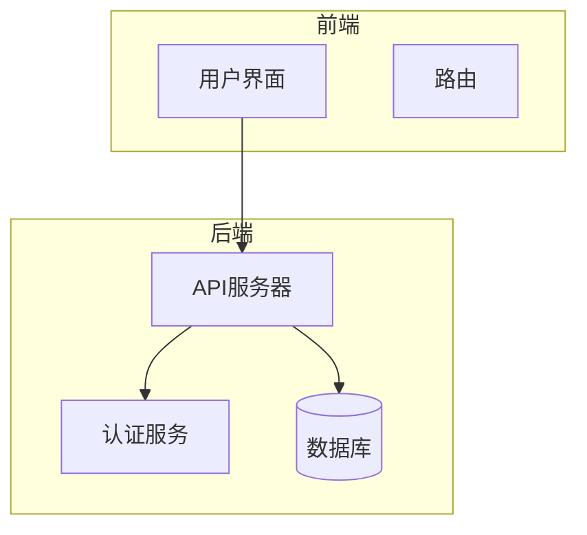
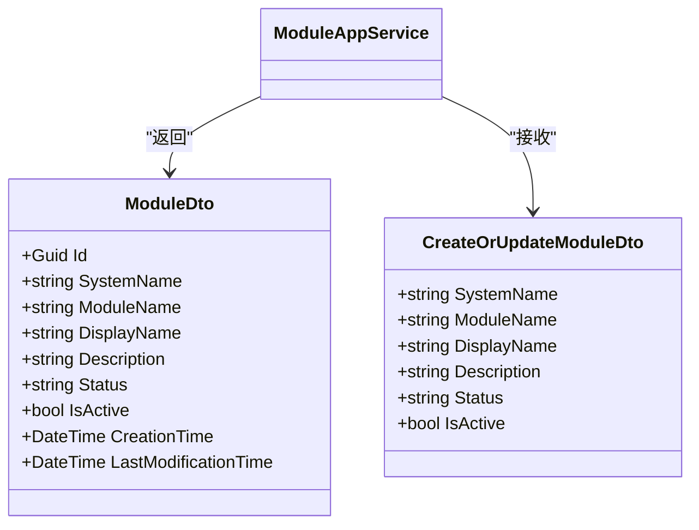
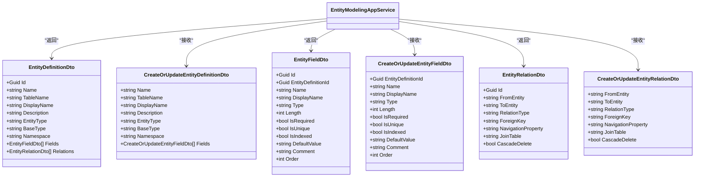
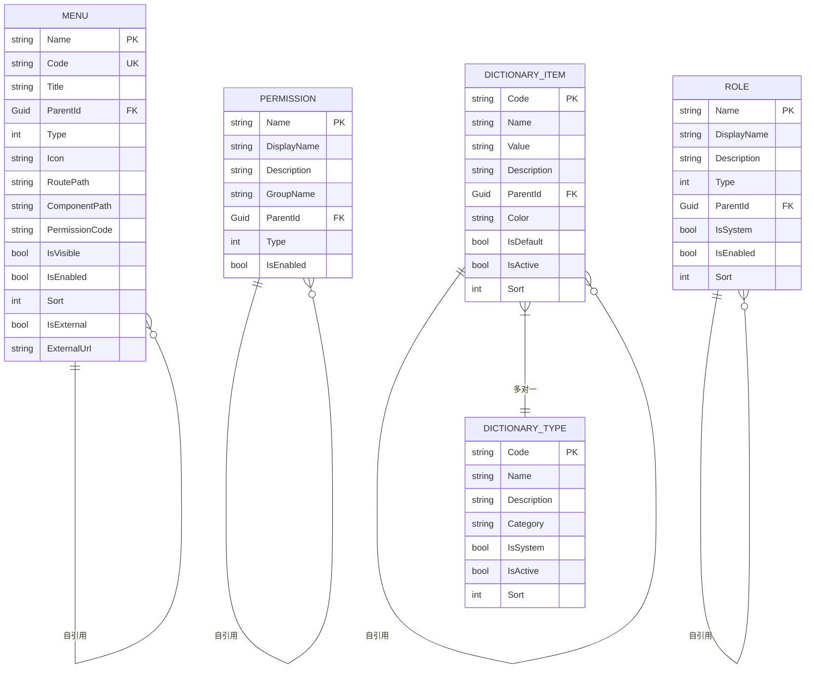
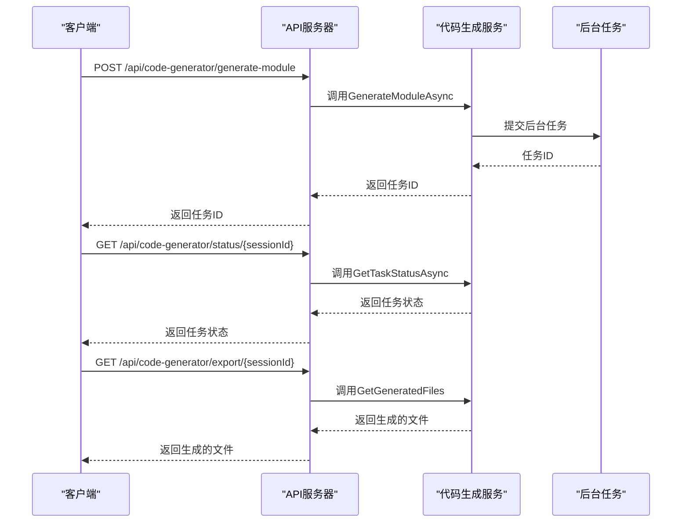
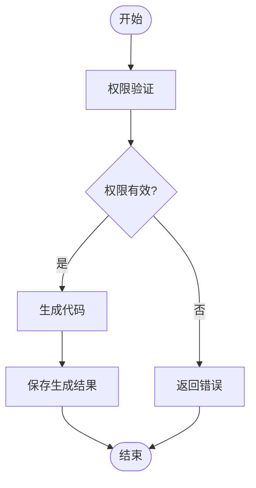

# 低代码API

<cite>
**本文档引用的文件**
- [ModuleAppService.cs](file://src/SmartAbp.Application/LowCode/ModuleAppService.cs)
- [EntityModelingAppService.cs](file://src/SmartAbp.Application/LowCode/EntityModelingAppService.cs)
- [IModuleAppService.cs](file://src/SmartAbp.Application.Contracts/LowCode/IModuleAppService.cs)
- [IEntityModelingAppService.cs](file://src/SmartAbp.Application.Contracts/LowCode/IEntityModelingAppService.cs)
- [权限管理系统低代码配置.json](file://config/权限管理系统低代码配置.json)
- [权限管理系统ModuleMetadata.json](file://output/权限管理系统ModuleMetadata.json)
- [CodeGenerationAppService.cs](file://src/SmartAbp.CodeGenerator/Services/CodeGenerationAppService.cs)
- [AsyncCodeGenerationService.cs](file://src/SmartAbp.Application/LowCode/AsyncCodeGenerationService.cs)
- [CodeGenerationBackgroundJob.cs](file://src/SmartAbp.Application/LowCode/CodeGenerationBackgroundJob.cs)
</cite>

## 目录
1. [引言](#引言)
2. [项目结构](#项目结构)
3. [核心组件](#核心组件)
4. [架构概述](#架构概述)
5. [详细组件分析](#详细组件分析)
6. [依赖分析](#依赖分析)
7. [性能考虑](#性能考虑)
8. [故障排除指南](#故障排除指南)
9. [结论](#结论)
10. [附录](#附录)（如有必要）

## 引言
本文档全面阐述了hxlot项目中低代码API的设计原则与实现机制。重点解析了ModuleController和EntityModelingController的功能，说明其如何支持动态模块和实体的创建、读取、更新和删除操作。文档详细描述了低代码API特有的请求/响应数据结构，特别是模块配置和实体定义的JSON Schema设计，并解释了API如何处理动态元数据和可配置的业务规则。此外，文档还涵盖了代码生成相关的API端点，包括生成任务的提交、状态查询和结果获取，并提供了低代码API的安全控制机制，包括对模块操作的权限验证。

## 项目结构
hxlot项目采用分层架构设计，主要分为以下几个部分：
- **src**: 包含所有源代码，包括应用服务、领域模型、HTTP API等。
- **config**: 存放各种配置文件，如业务场景配置、MES实体配置等。
- **output**: 输出生成的代码和配置文件。
- **scripts**: 包含数据库、部署、开发、文档、Git、包管理、性能测试、质量检查、模板、测试、工具等脚本。
- **templates**: 存放各种模板文件，如AI集成、后端、业务工作流、通信、配置、仪表板、数据处理、文档、领域特定、表单、前端、集成、低代码、项目、报告、安全、系统、UI组件、Vue等。
- **tests**: 包含单元测试和集成测试代码。
- **tools**: 包含架构分析、ABP Studio、AI能力测试、AI守护、开发、增量生成、质量保证等工具。

**Diagram sources**
- [src](file://src)
- [config](file://config)
- [output](file://output)
- [scripts](file://scripts)
- [templates](file://templates)
- [tests](file://tests)
- [tools](file://tools)

**Section sources**
- [src](file://src)
- [config](file://config)
- [output](file://output)
- [scripts](file://scripts)
- [templates](file://templates)
- [tests](file://tests)
- [tools](file://tools)

## 核心组件

### ModuleAppService
`ModuleAppService` 是低代码模块的应用服务，实现了 `IModuleAppService` 接口。它提供了模块的CRUD操作，支持完整的元数据管理。该服务通过继承 `CrudAppService` 基类，自动获得了创建、读取、更新和删除模块的基本功能。此外，`ModuleAppService` 还提供了扩展方法，如根据系统名称获取模块、获取最近访问的模块、记录用户入口选择和获取用户选择统计。

**Section sources**
- [ModuleAppService.cs](file://src/SmartAbp.Application/LowCode/ModuleAppService.cs)
- [IModuleAppService.cs](file://src/SmartAbp.Application.Contracts/LowCode/IModuleAppService.cs)

### EntityModelingAppService
`EntityModelingAppService` 是实体建模的应用服务，实现了 `IEntityModelingAppService` 接口。它提供了实体定义的管理功能，包括获取所有实体定义、根据ID或名称获取实体定义、创建和更新实体定义、删除实体定义、批量删除实体定义等。此外，该服务还支持字段管理和关系管理，以及架构验证功能。

**Section sources**
- [EntityModelingAppService.cs](file://src/SmartAbp.Application/LowCode/EntityModelingAppService.cs)
- [IEntityModelingAppService.cs](file://src/SmartAbp.Application.Contracts/LowCode/IEntityModelingAppService.cs)

## 架构概述

**Diagram sources**
- [ModuleAppService.cs](file://src/SmartAbp.Application/LowCode/ModuleAppService.cs)
- [EntityModelingAppService.cs](file://src/SmartAbp.Application/LowCode/EntityModelingAppService.cs)
- [IModuleAppService.cs](file://src/SmartAbp.Application.Contracts/LowCode/IModuleAppService.cs)
- [IEntityModelingAppService.cs](file://src/SmartAbp.Application.Contracts/LowCode/IEntityModelingAppService.cs)

## 详细组件分析

### ModuleController 功能解析
`ModuleController` 通过 `ModuleAppService` 提供了对低代码模块的全面管理。其主要功能包括：
- **创建模块**：通过 `CreateAsync` 方法创建新的模块。
- **读取模块**：通过 `GetAsync` 和 `GetListAsync` 方法获取模块信息。
- **更新模块**：通过 `UpdateAsync` 方法更新模块信息。
- **删除模块**：通过 `DeleteAsync` 方法删除模块。
- **扩展功能**：提供根据系统名称获取模块、获取最近访问的模块、记录用户入口选择和获取用户选择统计等扩展功能。

#### 请求/响应数据结构
- **请求**：`CreateOrUpdateModuleDto` 包含模块的基本信息，如系统名称、显示名称、描述、状态等。
- **响应**：`ModuleDto` 包含模块的详细信息，包括模块ID、系统名称、显示名称、描述、状态、创建时间和最后修改时间等。

**Diagram sources**
- [ModuleAppService.cs](file://src/SmartAbp.Application/LowCode/ModuleAppService.cs)
- [IModuleAppService.cs](file://src/SmartAbp.Application.Contracts/LowCode/IModuleAppService.cs)

### EntityModelingController 功能解析
`EntityModelingController` 通过 `EntityModelingAppService` 提供了对实体建模的全面管理。其主要功能包括：
- **实体定义管理**：提供获取所有实体定义、根据ID或名称获取实体定义、创建和更新实体定义、删除实体定义、批量删除实体定义等。
- **字段管理**：支持为实体添加字段、更新字段和删除字段。
- **关系管理**：支持创建、更新和删除实体之间的关系。
- **架构验证**：提供验证实体架构的功能，确保实体名称唯一性和关系的实体存在性。

#### 请求/响应数据结构
- **请求**：`CreateOrUpdateEntityDefinitionDto` 包含实体定义的基本信息，如名称、表名、显示名称、描述、实体类型、基类型、命名空间等。
- **响应**：`EntityDefinitionDto` 包含实体定义的详细信息，包括实体ID、名称、表名、显示名称、描述、实体类型、基类型、命名空间、字段列表和关系列表等。

**Diagram sources**
- [EntityModelingAppService.cs](file://src/SmartAbp.Application/LowCode/EntityModelingAppService.cs)
- [IEntityModelingAppService.cs](file://src/SmartAbp.Application.Contracts/LowCode/IEntityModelingAppService.cs)

### 低代码API特有的请求/响应数据结构
低代码API使用JSON Schema来定义模块配置和实体定义。这些Schema设计允许动态元数据和可配置的业务规则。例如，`权限管理系统低代码配置.json` 文件定义了一个权限管理系统的模块，包含多个实体，如菜单、权限、角色、字典类型和字典项。每个实体都有详细的字段定义，包括字段名称、显示名称、类型、长度、是否必需、是否唯一、是否索引、默认值、注释和顺序等。

**Diagram sources**
- [权限管理系统低代码配置.json](file://config/权限管理系统低代码配置.json)

### 代码生成相关的API端点
低代码API提供了多个代码生成相关的API端点，包括生成任务的提交、状态查询和结果获取。这些端点通过 `CodeGenerationAppService` 和 `AsyncCodeGenerationService` 实现。

#### 生成任务的提交
- **POST /api/code-generator/generate-module**: 提交模块生成任务。
- **POST /api/code-generator/unified/generate-module**: 提交统一模块生成任务。

#### 状态查询
- **GET /api/code-generator/status/{sessionId}**: 查询生成任务的状态。

#### 结果获取
- **GET /api/code-generator/export/{sessionId}**: 获取生成的代码。

**Diagram sources**
- [CodeGenerationAppService.cs](file://src/SmartAbp.CodeGenerator/Services/CodeGenerationAppService.cs)
- [AsyncCodeGenerationService.cs](file://src/SmartAbp.Application/LowCode/AsyncCodeGenerationService.cs)
- [CodeGenerationBackgroundJob.cs](file://src/SmartAbp.Application/LowCode/CodeGenerationBackgroundJob.cs)

### 低代码API的安全控制机制
低代码API通过权限验证机制确保模块操作的安全性。`CodeGenerationAppService` 使用 `Authorize` 属性来限制对代码生成方法的访问。只有具有相应权限的用户才能执行代码生成操作。此外，`AsyncCodeGenerationService` 和 `CodeGenerationBackgroundJob` 也通过任务状态管理和进度追踪来确保生成任务的安全性和可靠性。

**Diagram sources**
- [CodeGenerationAppService.cs](file://src/SmartAbp.CodeGenerator/Services/CodeGenerationAppService.cs)
- [AsyncCodeGenerationService.cs](file://src/SmartAbp.Application/LowCode/AsyncCodeGenerationService.cs)
- [CodeGenerationBackgroundJob.cs](file://src/SmartAbp.Application/LowCode/CodeGenerationBackgroundJob.cs)

## 依赖分析

**Diagram sources**
- [ModuleAppService.cs](file://src/SmartAbp.Application/LowCode/ModuleAppService.cs)
- [EntityModelingAppService.cs](file://src/SmartAbp.Application/LowCode/EntityModelingAppService.cs)
- [IModuleAppService.cs](file://src/SmartAbp.Application.Contracts/LowCode/IModuleAppService.cs)
- [IEntityModelingAppService.cs](file://src/SmartAbp.Application.Contracts/LowCode/IEntityModelingAppService.cs)

## 性能考虑
低代码API在设计时考虑了性能优化。例如，`ModuleAppService` 和 `EntityModelingAppService` 使用了异步方法来提高响应速度。此外，`AsyncCodeGenerationService` 和 `CodeGenerationBackgroundJob` 通过后台任务和进度追踪来避免长时间阻塞客户端。代码生成任务的状态和进度信息被存储在内存中，以便快速查询。

## 故障排除指南
- **模块创建失败**：检查请求数据是否符合 `CreateOrUpdateModuleDto` 的定义，确保必填字段不为空。
- **实体定义创建失败**：检查请求数据是否符合 `CreateOrUpdateEntityDefinitionDto` 的定义，确保实体名称唯一。
- **代码生成任务失败**：检查任务状态和错误信息，确保生成任务的输入数据正确无误。
- **权限验证失败**：确保用户具有执行相应操作的权限。

**Section sources**
- [ModuleAppService.cs](file://src/SmartAbp.Application/LowCode/ModuleAppService.cs)
- [EntityModelingAppService.cs](file://src/SmartAbp.Application/LowCode/EntityModelingAppService.cs)
- [CodeGenerationAppService.cs](file://src/SmartAbp.CodeGenerator/Services/CodeGenerationAppService.cs)
- [AsyncCodeGenerationService.cs](file://src/SmartAbp.Application/LowCode/AsyncCodeGenerationService.cs)
- [CodeGenerationBackgroundJob.cs](file://src/SmartAbp.Application/LowCode/CodeGenerationBackgroundJob.cs)

## 结论
hxlot项目的低代码API通过 `ModuleAppService` 和 `EntityModelingAppService` 提供了强大的模块和实体管理功能。API设计遵循了RESTful原则，使用JSON Schema来定义动态元数据和可配置的业务规则。代码生成相关的API端点通过异步任务和进度追踪确保了生成任务的安全性和可靠性。权限验证机制确保了模块操作的安全性。整体架构设计合理，性能优化得当，能够满足低代码平台的需求。

## 附录
- [权限管理系统低代码配置.json](file://config/权限管理系统低代码配置.json)
- [权限管理系统ModuleMetadata.json](file://output/权限管理系统ModuleMetadata.json)
- [CodeGenerationAppService.cs](file://src/SmartAbp.CodeGenerator/Services/CodeGenerationAppService.cs)
- [AsyncCodeGenerationService.cs](file://src/SmartAbp.Application/LowCode/AsyncCodeGenerationService.cs)
- [CodeGenerationBackgroundJob.cs](file://src/SmartAbp.Application/LowCode/CodeGenerationBackgroundJob.cs)