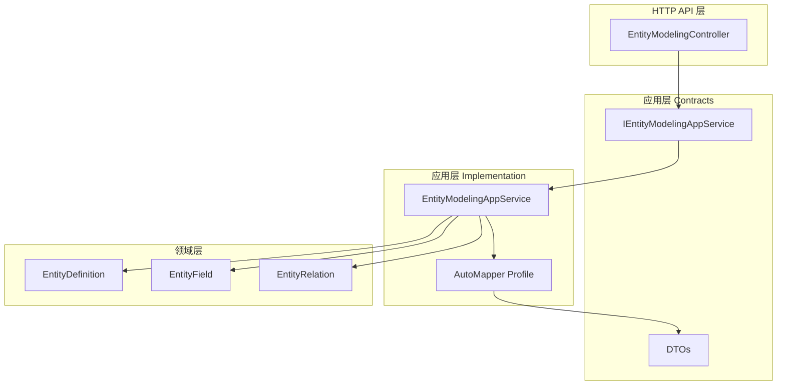
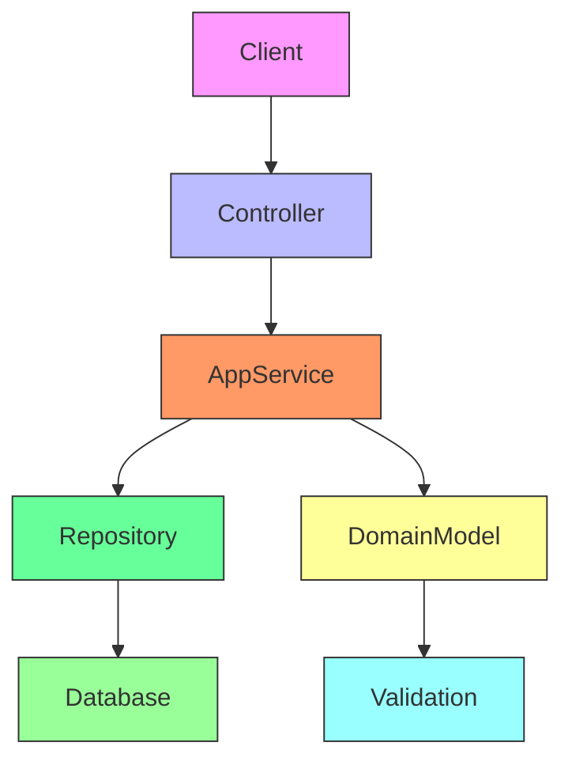
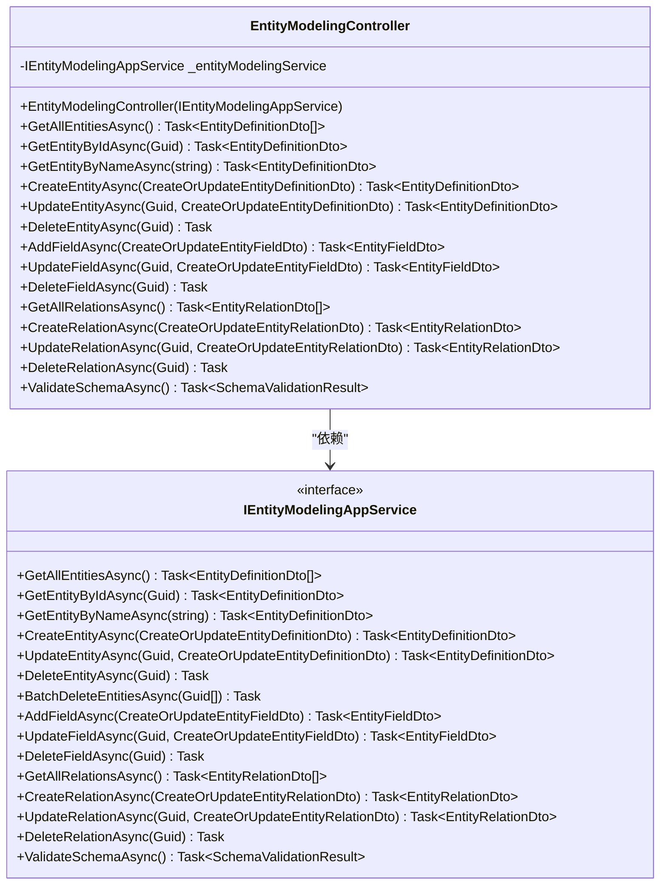
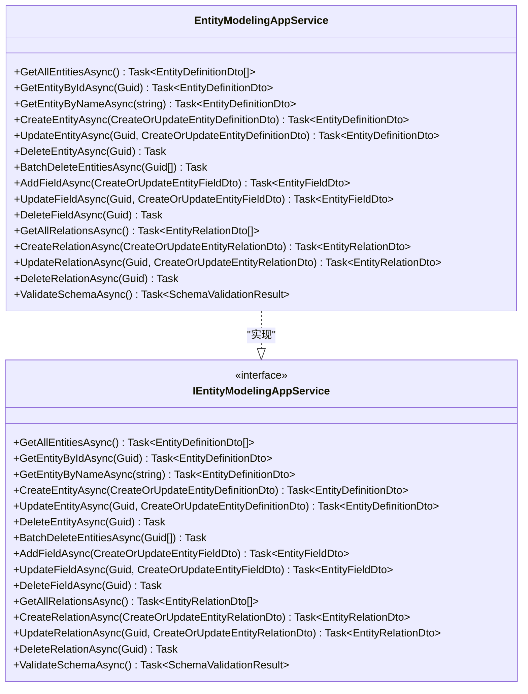
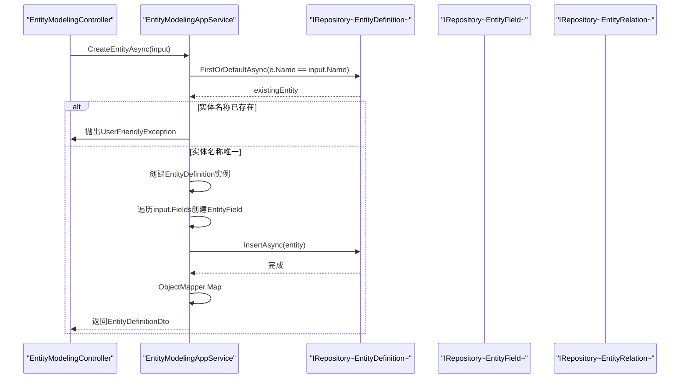
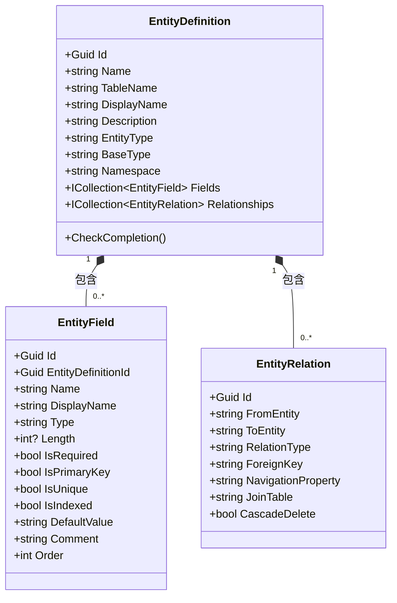
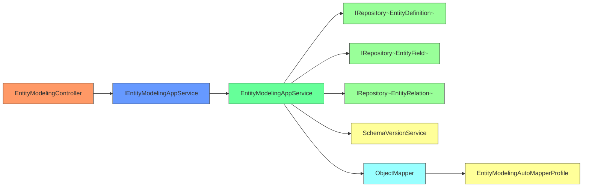

# 实体建模API

<cite>
**本文档引用文件**  
- [EntityModelingController.cs](file://src/SmartAbp.HttpApi/LowCode/EntityModelingController.cs)
- [IEntityModelingAppService.cs](file://src/SmartAbp.Application.Contracts/LowCode/IEntityModelingAppService.cs)
- [EntityModelingAppService.cs](file://src/SmartAbp.Application/LowCode/EntityModelingAppService.cs)
- [EntityDefinitionDto.cs](file://src/SmartAbp.Application.Contracts/LowCode/Dtos/EntityDefinitionDto.cs)
- [EntityFieldDto.cs](file://src/SmartAbp.Application.Contracts/LowCode/Dtos/EntityFieldDto.cs)
- [EntityRelationDto.cs](file://src/SmartAbp.Application.Contracts/LowCode/Dtos/EntityRelationDto.cs)
- [EntityDefinition.cs](file://src/SmartAbp.Domain/Entities/LowCode/EntityDefinition.cs)
- [EntityField.cs](file://src/SmartAbp.Domain/Entities/LowCode/EntityField.cs)
- [EntityRelation.cs](file://src/SmartAbp.Domain/Entities/LowCode/EntityRelation.cs)
- [EntityModelingAutoMapperProfile.cs](file://src/SmartAbp.Application/LowCode/EntityModelingAutoMapperProfile.cs)
</cite>

## 目录
1. [简介](#简介)
2. [项目结构](#项目结构)
3. [核心组件](#核心组件)
4. [架构概述](#架构概述)
5. [详细组件分析](#详细组件分析)
6. [依赖分析](#依赖分析)
7. [性能考虑](#性能考虑)
8. [故障排除指南](#故障排除指南)
9. [结论](#结论)

## 简介
实体建模API是hxlot项目中低代码平台的核心功能模块，提供动态数据模型的创建与管理能力。该API支持实体的CRUD操作、字段配置、关系建模和验证规则设置，允许用户在运行时定义和修改数据结构。系统通过元数据驱动的方式实现动态模型管理，并将变更实时反映到数据库模式中。API设计遵循ABP框架规范，采用分层架构确保可维护性和扩展性。

## 项目结构
实体建模功能分布在多个项目模块中，形成清晰的分层结构：

**图示来源**  
- [IEntityModelingAppService.cs](file://src/SmartAbp.Application.Contracts/LowCode/IEntityModelingAppService.cs)
- [EntityModelingAppService.cs](file://src/SmartAbp.Application/LowCode/EntityModelingAppService.cs)
- [EntityDefinition.cs](file://src/SmartAbp.Domain/Entities/LowCode/EntityDefinition.cs)
- [EntityField.cs](file://src/SmartAbp.Domain/Entities/LowCode/EntityField.cs)
- [EntityRelation.cs](file://src/SmartAbp.Domain/Entities/LowCode/EntityRelation.cs)

**本节来源**  
- [src/SmartAbp.HttpApi](file://src/SmartAbp.HttpApi)
- [src/SmartAbp.Application.Contracts](file://src/SmartAbp.Application.Contracts)
- [src/SmartAbp.Application](file://src/SmartAbp.Application)
- [src/SmartAbp.Domain](file://src/SmartAbp.Domain)

## 核心组件
实体建模API的核心由控制器、应用服务接口、实现类和领域实体组成。`EntityModelingController`暴露RESTful端点，`IEntityModelingAppService`定义服务契约，`EntityModelingAppService`实现业务逻辑，而`EntityDefinition`、`EntityField`和`EntityRelation`构成领域模型。DTO与领域实体通过AutoMapper进行映射，确保数据传输的安全性和一致性。

**本节来源**  
- [EntityModelingController.cs](file://src/SmartAbp.HttpApi/LowCode/EntityModelingController.cs#L16-L169)
- [IEntityModelingAppService.cs](file://src/SmartAbp.Application.Contracts/LowCode/IEntityModelingAppService.cs#L13-L105)
- [EntityModelingAppService.cs](file://src/SmartAbp.Application/LowCode/EntityModelingAppService.cs#L18-L351)

## 架构概述
系统采用典型的分层架构，各层职责分明：

**图示来源**  
- [EntityModelingController.cs](file://src/SmartAbp.HttpApi/LowCode/EntityModelingController.cs)
- [EntityModelingAppService.cs](file://src/SmartAbp.Application/LowCode/EntityModelingAppService.cs)
- [EntityDefinition.cs](file://src/SmartAbp.Domain/Entities/LowCode/EntityDefinition.cs)

## 详细组件分析
### 实体建模控制器分析
`EntityModelingController`是实体建模功能的HTTP接口入口，提供RESTful风格的API端点。控制器通过依赖注入获取`IEntityModelingAppService`实例，将HTTP请求委托给应用服务处理。控制器按功能分组，包括实体管理、字段管理、关系管理和架构验证四个主要部分。

#### 控制器类图

**图示来源**  
- [EntityModelingController.cs](file://src/SmartAbp.HttpApi/LowCode/EntityModelingController.cs#L16-L169)
- [IEntityModelingAppService.cs](file://src/SmartAbp.Application.Contracts/LowCode/IEntityModelingAppService.cs#L13-L105)

**本节来源**  
- [EntityModelingController.cs](file://src/SmartAbp.HttpApi/LowCode/EntityModelingController.cs#L16-L169)

### 应用服务接口分析
`IEntityModelingAppService`定义了实体建模功能的服务契约，继承自ABP框架的`IApplicationService`。接口按功能划分为实体管理、字段管理、关系管理和架构验证四个部分，每个操作均采用异步模式以提高系统响应能力。

#### 服务接口类图

**图示来源**  
- [IEntityModelingAppService.cs](file://src/SmartAbp.Application.Contracts/LowCode/IEntityModelingAppService.cs#L13-L105)
- [EntityModelingAppService.cs](file://src/SmartAbp.Application/LowCode/EntityModelingAppService.cs#L18-L351)

**本节来源**  
- [IEntityModelingAppService.cs](file://src/SmartAbp.Application.Contracts/LowCode/IEntityModelingAppService.cs#L13-L105)

### 应用服务实现分析
`EntityModelingAppService`实现了`IEntityModelingAppService`接口，包含完整的业务逻辑。服务通过依赖注入获取实体、字段和关系的仓储实例，以及模式版本服务。实现类遵循CQRS模式，对读取和写入操作进行区分处理。

#### 服务实现序列图

**图示来源**  
- [EntityModelingAppService.cs](file://src/SmartAbp.Application/LowCode/EntityModelingAppService.cs#L18-L351)
- [EntityDefinition.cs](file://src/SmartAbp.Domain/Entities/LowCode/EntityDefinition.cs)

**本节来源**  
- [EntityModelingAppService.cs](file://src/SmartAbp.Application/LowCode/EntityModelingAppService.cs#L18-L351)

### 领域模型分析
实体建模的领域模型由`EntityDefinition`、`EntityField`和`EntityRelation`三个核心实体构成。`EntityDefinition`作为聚合根，管理`EntityField`和`EntityRelation`的生命周期。所有实体均继承自ABP框架的审计聚合根，支持软删除和多租户功能。

#### 领域模型类图

**图示来源**  
- [EntityDefinition.cs](file://src/SmartAbp.Domain/Entities/LowCode/EntityDefinition.cs#L1-L202)
- [EntityField.cs](file://src/SmartAbp.Domain/Entities/LowCode/EntityField.cs#L1-L147)
- [EntityRelation.cs](file://src/SmartAbp.Domain/Entities/LowCode/EntityRelation.cs#L1-L90)

**本节来源**  
- [EntityDefinition.cs](file://src/SmartAbp.Domain/Entities/LowCode/EntityDefinition.cs#L1-L202)
- [EntityField.cs](file://src/SmartAbp.Domain/Entities/LowCode/EntityField.cs#L1-L147)
- [EntityRelation.cs](file://src/SmartAbp.Domain/Entities/LowCode/EntityRelation.cs#L1-L90)

## 依赖分析
实体建模模块依赖于ABP框架的核心组件，包括仓储模式、对象映射和异常处理机制。模块内部各组件之间通过接口进行松耦合连接，便于单元测试和替换实现。

**图示来源**  
- [EntityModelingController.cs](file://src/SmartAbp.HttpApi/LowCode/EntityModelingController.cs)
- [EntityModelingAppService.cs](file://src/SmartAbp.Application/LowCode/EntityModelingAppService.cs)
- [EntityModelingAutoMapperProfile.cs](file://src/SmartAbp.Application/LowCode/EntityModelingAutoMapperProfile.cs)

**本节来源**  
- [EntityModelingController.cs](file://src/SmartAbp.HttpApi/LowCode/EntityModelingController.cs#L16-L169)
- [EntityModelingAppService.cs](file://src/SmartAbp.Application/LowCode/EntityModelingAppService.cs#L18-L351)
- [EntityModelingAutoMapperProfile.cs](file://src/SmartAbp.Application/LowCode/EntityModelingAutoMapperProfile.cs#L1-L33)

## 性能考虑
实体建模API在性能方面进行了多项优化。对于实体查询操作，服务层手动加载导航属性以避免N+1查询问题。所有数据库操作均使用异步方法，确保I/O操作不会阻塞线程。批量删除操作采用循环调用单个删除方法的方式实现，虽然简单但可能影响性能，建议在大数据量场景下优化为批量删除。

## 故障排除指南
常见问题包括实体名称重复、关系实体不存在和循环依赖等。系统在创建和更新实体时会验证名称唯一性，在架构验证时检查关系实体的存在性。错误信息通过`UserFriendlyException`返回给客户端，确保用户能够理解问题原因。对于复杂的架构验证如循环依赖检测，当前实现标记为TODO，需要进一步完善。

**本节来源**  
- [EntityModelingAppService.cs](file://src/SmartAbp.Application/LowCode/EntityModelingAppService.cs#L18-L351)
- [EntityModelingController.cs](file://src/SmartAbp.HttpApi/LowCode/EntityModelingController.cs#L16-L169)

## 结论
实体建模API提供了一套完整的动态数据模型管理解决方案，支持实体的全生命周期管理。系统设计遵循ABP框架最佳实践，采用清晰的分层架构和领域驱动设计原则。通过RESTful API暴露功能，便于前端集成和第三方系统调用。未来可优化方向包括实现循环依赖检测算法、优化批量操作性能和增强架构验证功能。