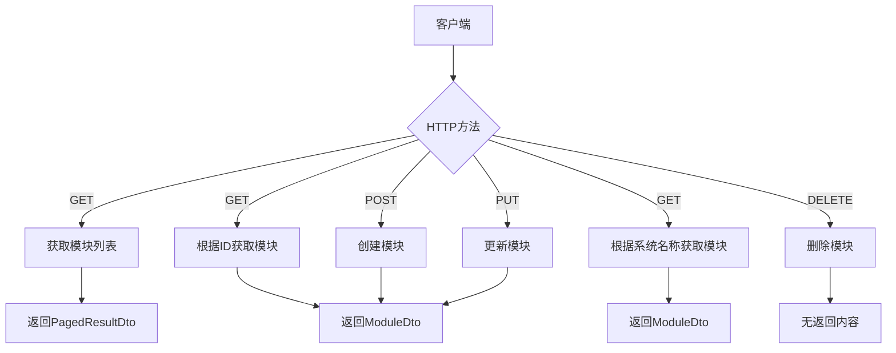
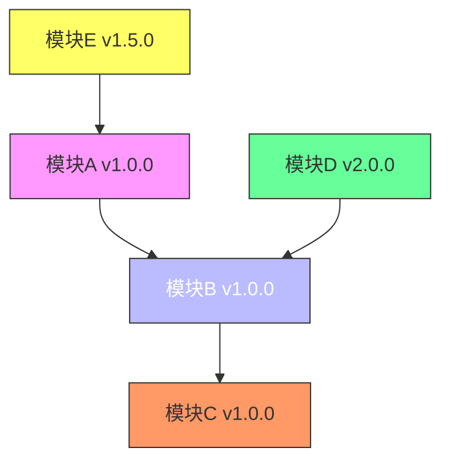
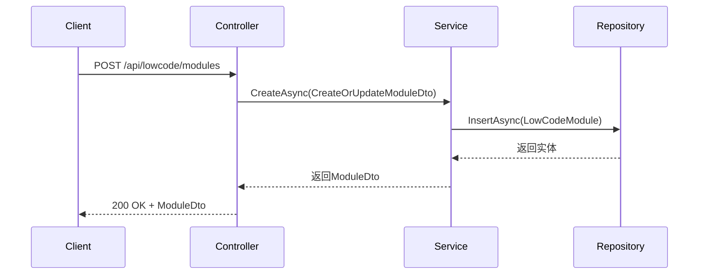
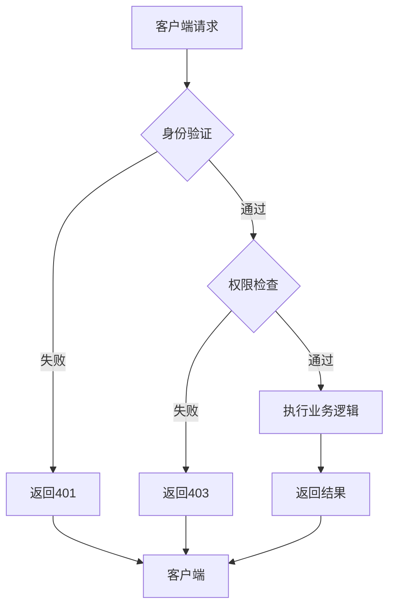
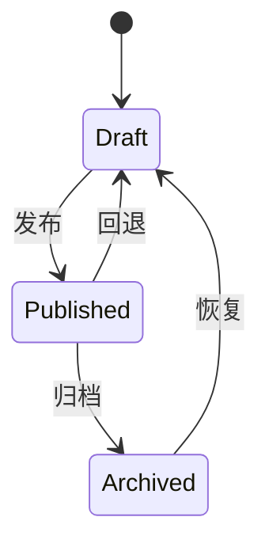
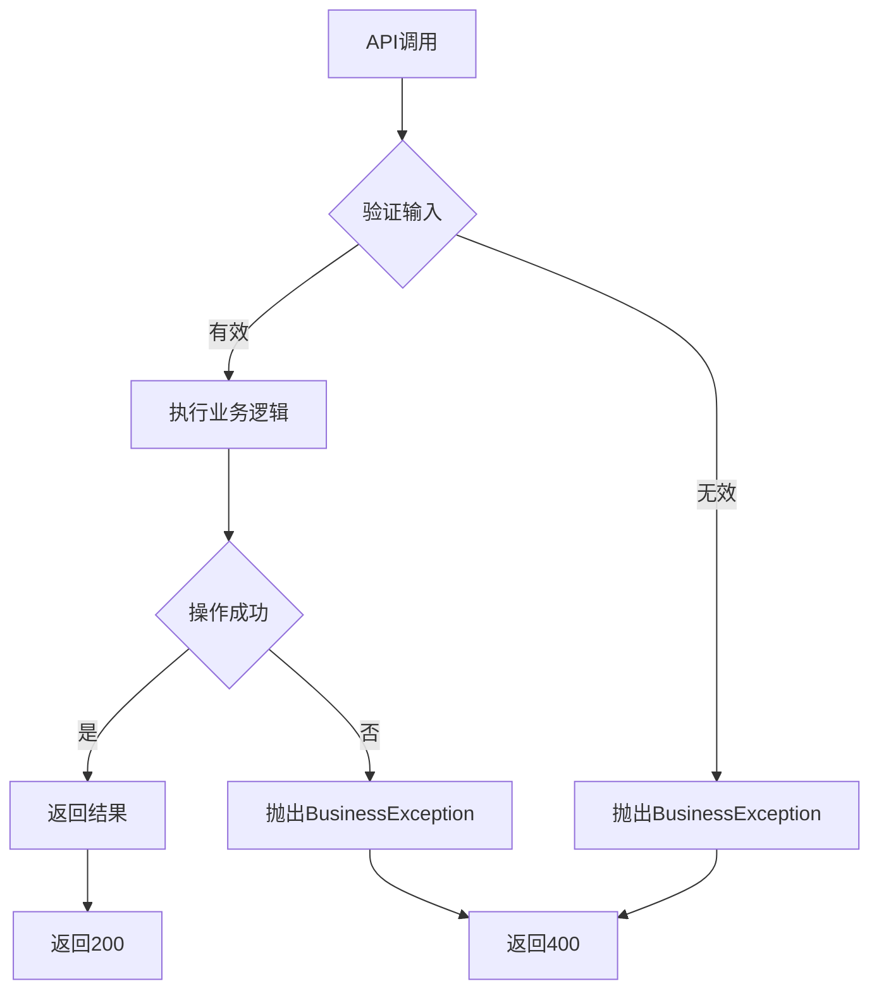

# 模块管理API

<cite>
**本文档引用的文件**
- [ModuleController.cs](file://src/SmartAbp.HttpApi/Controllers/LowCode/ModuleController.cs)
- [IModuleAppService.cs](file://src/SmartAbp.Application.Contracts/LowCode/IModuleAppService.cs)
- [ModuleAppService.cs](file://src/SmartAbp.Application/LowCode/ModuleAppService.cs)
- [权限管理系统低代码配置.json](file://config/权限管理系统低代码配置.json)
- [smartabp.config.json](file://smartabp.config.json)
</cite>

## 目录
1. [简介](#简介)
2. [RESTful端点设计](#restful端点设计)
3. [接口契约与实现](#接口契约与实现)
4. [模块配置JSON Schema](#模块配置json-schema)
5. [依赖关系与版本控制](#依赖关系与版本控制)
6. [请求/响应示例](#请求响应示例)
7. [安全机制](#安全机制)
8. [状态管理与缓存策略](#状态管理与缓存策略)
9. [错误处理机制](#错误处理机制)

## 简介
模块管理API是hxlot项目中低代码平台的核心组件，提供对低代码模块的全生命周期管理功能。该API支持模块的创建、查询、更新和删除操作，通过标准化的RESTful接口实现模块的动态注册与配置。API设计遵循ABP框架规范，结合Swagger实现前后端类型自动生成，确保前后端契约一致性。系统通过`ModuleController`暴露HTTP端点，由`ModuleAppService`实现业务逻辑，接口定义在`IModuleAppService`中，形成清晰的分层架构。

**Section sources**
- [ModuleController.cs](file://src/SmartAbp.HttpApi/Controllers/LowCode/ModuleController.cs#L1-L92)
- [IModuleAppService.cs](file://src/SmartAbp.Application.Contracts/LowCode/IModuleAppService.cs#L1-L55)
- [ModuleAppService.cs](file://src/SmartAbp.Application/LowCode/ModuleAppService.cs#L1-L216)

## RESTful端点设计
模块管理API提供了一套完整的RESTful端点，支持对低代码模块的CRUD操作。所有端点位于`/api/lowcode/modules`路由下，通过标准的HTTP方法实现不同操作。



**Diagram sources**
- [ModuleController.cs](file://src/SmartAbp.HttpApi/Controllers/LowCode/ModuleController.cs#L16-L89)

**Section sources**
- [ModuleController.cs](file://src/SmartAbp.HttpApi/Controllers/LowCode/ModuleController.cs#L16-L89)

## 接口契约与实现
模块管理API的接口契约由`IModuleAppService`定义，实现由`ModuleAppService`提供。接口继承自ABP框架的`ICrudAppService`，提供标准的CRUD操作，并扩展了特定业务方法。

```mermaid
classDiagram
class IModuleAppService {
+Task<ModuleDto> GetBySystemNameAsync(string systemName)
+Task<List<ModuleDto>> GetRecentModulesAsync(int count = 5)
+Task RecordUserChoiceAsync(string choice)
+Task<UserChoiceStatsDto> GetUserChoiceStatisticsAsync()
}
class ModuleAppService {
-IRepository<LowCodeEntity, Guid> _entityRepository
+ModuleAppService(IRepository<LowCodeModule, Guid>, IRepository<LowCodeEntity, Guid>)
+Task<PagedResultDto<ModuleDto>> GetListAsync(GetModulesInput input)
+Task<ModuleDto> GetAsync(Guid id)
+Task<ModuleDto> GetBySystemNameAsync(string systemName)
+Task<List<ModuleDto>> GetRecentModulesAsync(int count = 5)
+Task RecordUserChoiceAsync(string choice)
+Task<UserChoiceStatsDto> GetUserChoiceStatisticsAsync()
}
IModuleAppService <|-- ModuleAppService : "实现"
ModuleAppService --> "1" IRepository<LowCodeModule, Guid> : "依赖"
ModuleAppService --> "1" IRepository<LowCodeEntity, Guid> : "依赖"
```

**Diagram sources**
- [IModuleAppService.cs](file://src/SmartAbp.Application.Contracts/LowCode/IModuleAppService.cs#L13-L52)
- [ModuleAppService.cs](file://src/SmartAbp.Application/LowCode/ModuleAppService.cs#L21-L213)

**Section sources**
- [IModuleAppService.cs](file://src/SmartAbp.Application.Contracts/LowCode/IModuleAppService.cs#L13-L52)
- [ModuleAppService.cs](file://src/SmartAbp.Application/LowCode/ModuleAppService.cs#L21-L213)

## 模块配置JSON Schema
模块配置采用标准化的JSON Schema结构，包含模块元数据、导航配置和权限设置等核心信息。以下为权限管理系统的配置示例：

```json
{
    "systemName": "SmartAbp",
    "moduleName": "PermissionManagement",
    "displayName": "权限管理系统",
    "description": "企业级权限管理系统 - 通过低代码引擎生成（吃自己的狗粮）",
    "databaseProvider": "SqlServer",
    "entities": [
        {
            "name": "Menu",
            "displayName": "菜单管理",
            "description": "系统菜单和路由管理",
            "tableName": "AppMenus",
            "primaryKey": "Id",
            "hasAuditFields": true,
            "hasMultiTenant": true,
            "hasSoftDelete": false,
            "fields": [
                {
                    "name": "Name",
                    "displayName": "菜单名称",
                    "type": "String",
                    "maxLength": 100,
                    "required": true,
                    "description": "菜单名称（英文，如：user-management）",
                    "uiComponent": "Input",
                    "validationRules": [
                        "Required",
                        "MaxLength:100"
                    ]
                }
            ]
        }
    ]
}
```

**Section sources**
- [权限管理系统低代码配置.json](file://config/权限管理系统低代码配置.json#L1-L799)

## 依赖关系与版本控制
API通过模块DTO中的`Dependencies`字段管理模块间的依赖关系，支持模块间的依赖声明和解析。版本控制通过`Version`字段实现，确保模块的向后兼容性。



**Diagram sources**
- [ModuleDto.cs](file://src/SmartAbp.Application.Contracts/LowCode/Dtos/ModuleDto.cs#L14-L161)

**Section sources**
- [ModuleDto.cs](file://src/SmartAbp.Application.Contracts/LowCode/Dtos/ModuleDto.cs#L14-L161)

## 请求/响应示例
以下是创建模块的请求/响应示例：



**Diagram sources**
- [ModuleController.cs](file://src/SmartAbp.HttpApi/Controllers/LowCode/ModuleController.cs#L70-L75)
- [ModuleAppService.cs](file://src/SmartAbp.Application/LowCode/ModuleAppService.cs#L21-L213)

**Section sources**
- [ModuleController.cs](file://src/SmartAbp.HttpApi/Controllers/LowCode/ModuleController.cs#L70-L75)
- [ModuleAppService.cs](file://src/SmartAbp.Application/LowCode/ModuleAppService.cs#L21-L213)

## 安全机制
API采用ABP权限系统进行访问控制，通过`[RemoteService]`和`[Area]`属性配置服务发现和区域路由。所有操作都需要经过身份验证和权限检查。



**Diagram sources**
- [ModuleController.cs](file://src/SmartAbp.HttpApi/Controllers/LowCode/ModuleController.cs#L16-L19)

**Section sources**
- [ModuleController.cs](file://src/SmartAbp.HttpApi/Controllers/LowCode/ModuleController.cs#L16-L19)

## 状态管理与缓存策略
模块状态通过`Status`字段管理，支持`Draft`、`Published`和`Archived`三种状态。API采用ABP框架的默认缓存策略，对频繁查询的数据进行缓存优化。



**Diagram sources**
- [ModuleDto.cs](file://src/SmartAbp.Application.Contracts/LowCode/Dtos/ModuleDto.cs#L14-L161)

**Section sources**
- [ModuleDto.cs](file://src/SmartAbp.Application.Contracts/LowCode/Dtos/ModuleDto.cs#L14-L161)

## 错误处理机制
API采用统一的错误处理机制，通过`Volo.Abp.BusinessException`抛出业务异常，确保错误信息的一致性和可读性。



**Diagram sources**
- [ModuleAppService.cs](file://src/SmartAbp.Application/LowCode/ModuleAppService.cs#L150-L160)

**Section sources**
- [ModuleAppService.cs](file://src/SmartAbp.Application/LowCode/ModuleAppService.cs#L150-L160)