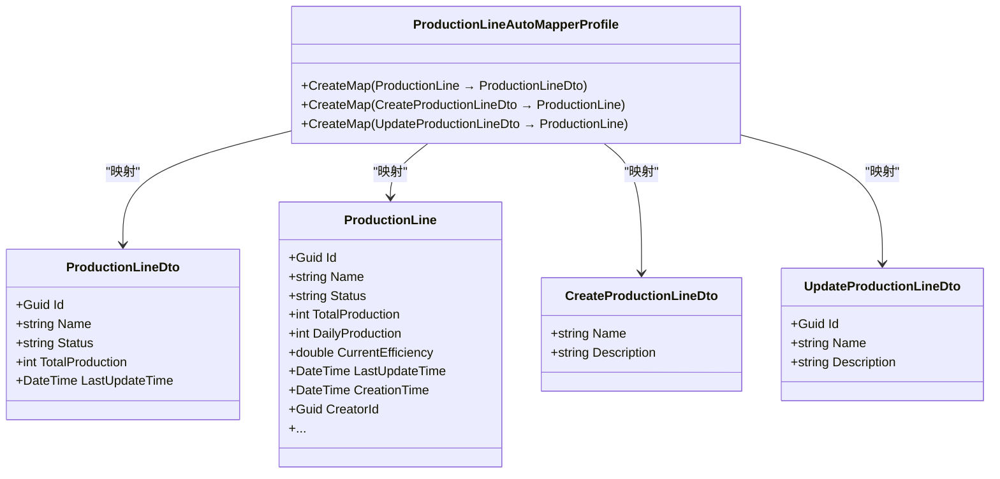
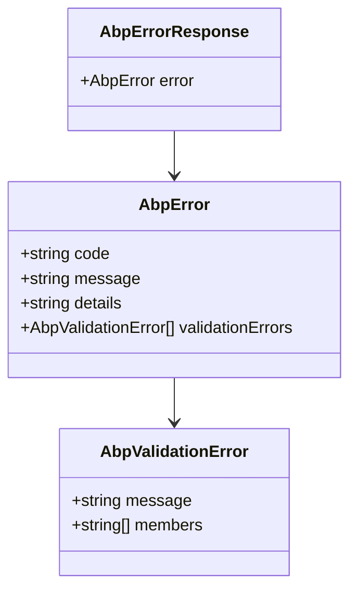

# 核心API

<cite>
**本文档引用的文件**  
- [EquipmentController.cs](file://src/SmartAbp.HttpApi/Controllers/EquipmentController.cs)
- [ProductionLineController.cs](file://src/SmartAbp.HttpApi/Controllers/ProductionLineController.cs)
- [SensorDataController.cs](file://src/SmartAbp.HttpApi/Controllers/SensorDataController.cs)
- [IEquipmentAppService.cs](file://src/SmartAbp.Application.Contracts/Equipment/IEquipmentAppService.cs)
- [IProductionLineAppService.cs](file://src/SmartAbp.Application.Contracts/ProductionLine/IProductionLineAppService.cs)
- [ISensorDataAppService.cs](file://src/SmartAbp.Application.Contracts/SensorData/ISensorDataAppService.cs)
- [EquipmentAutoMapperProfile.cs](file://src/SmartAbp.Application/Equipment/EquipmentAutoMapperProfile.cs)
- [ProductionLineAutoMapperProfile.cs](file://src/SmartAbp.Application/ProductionLine/ProductionLineAutoMapperProfile.cs)
- [SensorDataAutoMapperProfile.cs](file://src/SmartAbp.Application/SensorData/SensorDataAutoMapperProfile.cs)
- [AbpErrorResponse.ts](file://src/SmartAbp.Vue/packages/lowcode-api/src/types/error.ts)
</cite>

## 目录
1. [引言](#引言)
2. [控制器实现与服务调用关系](#控制器实现与服务调用关系)
3. [CRUD操作的HTTP端点设计](#crud操作的http端点设计)
4. [API使用示例](#api使用示例)
5. [API版本控制与路由配置](#api版本控制与路由配置)
6. [DTO与AutoMapper映射机制](#dto与automapper映射机制)
7. [异常处理模式与错误响应格式](#异常处理模式与错误响应格式)
8. [结论](#结论)

## 引言
本文档详细描述了hxlot项目中`EquipmentController`、`ProductionLineController`和`SensorDataController`三个核心API控制器的实现机制。文档涵盖其与后端应用服务的调用关系、HTTP端点设计、使用示例、版本控制策略、DTO映射机制以及异常处理模式，旨在为开发者提供全面的API使用与维护指南。

## 控制器实现与服务调用关系

`EquipmentController`、`ProductionLineController`和`SensorDataController`均继承自`AbpController`，并遵循依赖注入原则，通过构造函数注入各自对应的应用服务接口。控制器本身不包含业务逻辑，仅作为HTTP请求的入口，将请求委托给对应的应用服务进行处理。

- `EquipmentController` 依赖 `IEquipmentAppService`
- `ProductionLineController` 依赖 `IProductionLineAppService`
- `SensorDataController` 依赖 `ISensorDataAppService`

这些应用服务接口均继承自ABP框架的`ICrudAppService`泛型接口，该接口定义了标准的CRUD（创建、读取、更新、删除）操作契约，确保了API设计的一致性。

**本节来源**
- [EquipmentController.cs](file://src/SmartAbp.HttpApi/Controllers/EquipmentController.cs#L10-L51)
- [ProductionLineController.cs](file://src/SmartAbp.HttpApi/Controllers/ProductionLineController.cs#L16-L90)
- [SensorDataController.cs](file://src/SmartAbp.HttpApi/Controllers/SensorDataController.cs#L10-L51)
- [IEquipmentAppService.cs](file://src/SmartAbp.Application.Contracts/Equipment/IEquipmentAppService.cs#L7-L16)
- [IProductionLineAppService.cs](file://src/SmartAbp.Application.Contracts/ProductionLine/IProductionLineAppService.cs#L9-L21)
- [ISensorDataAppService.cs](file://src/SmartAbp.Application.Contracts/SensorData/ISensorDataAppService.cs#L7-L16)

## CRUD操作的HTTP端点设计

三个控制器均提供了标准的RESTful风格CRUD端点，设计高度一致。

### 共同设计原则
- **命名空间**：所有控制器均使用`[Area("app")]`，表明属于应用模块。
- **远程服务标识**：使用`[RemoteService(Name = "Default")]`标记，便于ABP框架进行服务发现。
- **基路径**：通过`[Route]`属性定义，分别为`/api/app/equipment`、`/api/app/production-line`和`/api/app/sensor-data`。

### 端点详情

#### 查询操作 (GET)
| 方法 | URL路径 | 请求参数 | 响应格式 |
| :--- | :--- | :--- | :--- |
| GET | `/` | `GetEquipmentListInput` (查询参数) | `PagedResultDto<EquipmentDto>` |
| GET | `/` | `GetProductionLineListInput` (查询参数) | `PagedResultDto<ProductionLineDto>` |
| GET | `/` | `GetSensorDataListInput` (查询参数) | `PagedResultDto<SensorDataDto>` |
| GET | `/{id}` | `id` (路径参数) | `EquipmentDto` |
| GET | `/{id}` | `id` (路径参数) | `ProductionLineDto` |
| GET | `/{id}` | `id` (路径参数) | `SensorDataDto` |

#### 增删改操作 (POST, PUT, DELETE)
| 方法 | URL路径 | 请求体 | 响应格式 |
| :--- | :--- | :--- | :--- |
| POST | `/` | `CreateEquipmentDto` | `EquipmentDto` |
| POST | `/` | `CreateProductionLineDto` | `ProductionLineDto` |
| POST | `/` | `CreateSensorDataDto` | `SensorDataDto` |
| PUT | `/{id}` | `UpdateEquipmentDto` | `EquipmentDto` |
| PUT | `/{id}` | `UpdateProductionLineDto` | `ProductionLineDto` |
| PUT | `/{id}` | `UpdateSensorDataDto` | `SensorDataDto` |
| DELETE | `/{id}` | 无 | 204 No Content |

**本节来源**
- [EquipmentController.cs](file://src/SmartAbp.HttpApi/Controllers/EquipmentController.cs#L23-L51)
- [ProductionLineController.cs](file://src/SmartAbp.HttpApi/Controllers/ProductionLineController.cs#L30-L89)
- [SensorDataController.cs](file://src/SmartAbp.HttpApi/Controllers/SensorDataController.cs#L23-L51)

## API使用示例

### 获取生产线列表
**请求**
```http
GET /api/app/production-line?page=1&pageSize=10&search=装配线 HTTP/1.1
```

**响应**
```json
{
  "items": [
    {
      "id": "a1b2c3d4-e5f6-7890-1234-567890abcdef",
      "name": "装配线A",
      "status": "running",
      "totalProduction": 1500,
      "lastUpdateTime": "2023-10-27T10:00:00Z"
    }
  ],
  "totalCount": 1,
  "success": true,
  "timestamp": "2023-10-27T10:01:00Z",
  "traceId": "trace-12345"
}
```

### 创建新设备
**请求**
```http
POST /api/app/equipment HTTP/1.1
Content-Type: application/json

{
  "name": "数控机床001",
  "type": "CNC",
  "model": "XYZ-2000",
  "productionLineId": "a1b2c3d4-e5f6-7890-1234-567890abcdef"
}
```

**响应**
```json
{
  "id": "b2c3d4e5-f6a7-8901-2345-67890abcdef1",
  "name": "数控机床001",
  "type": "CNC",
  "status": "stopped",
  "healthStatus": "healthy",
  "isOnline": false,
  "creationTime": "2023-10-27T10:02:00Z"
}
```

## API版本控制与路由配置

本项目目前采用**基于URL路径的版本控制**策略。所有API端点均位于`/api/app/`路径下，这可以视为v1版本的API。通过`[Route]`属性在控制器级别统一配置基路径，确保了路由的清晰和一致性。

路由配置由`[Area]`和`[Route]`属性共同完成：
- `[Area("app")]` 将控制器归类到`app`区域。
- `[Route("api/app/equipment")]` 明确指定了该控制器所有端点的根路径。

这种设计使得API路径语义清晰，易于理解和维护。

**本节来源**
- [EquipmentController.cs](file://src/SmartAbp.HttpApi/Controllers/EquipmentController.cs#L12-L13)
- [ProductionLineController.cs](file://src/SmartAbp.HttpApi/Controllers/ProductionLineController.cs#L18-L19)
- [SensorDataController.cs](file://src/SmartAbp.HttpApi/Controllers/SensorDataController.cs#L12-L13)

## DTO与AutoMapper映射机制

### DTO的作用
DTO（Data Transfer Object）在API层与领域模型之间充当数据传输的媒介，其主要作用包括：
1.  **解耦**：隔离领域模型的内部结构，防止其直接暴露给外部。
2.  **安全**：避免传输敏感或不必要的字段（如密码、审计字段）。
3.  **灵活性**：可以根据前端需求定制DTO结构，无需修改领域模型。

### AutoMapper映射实现
项目使用AutoMapper库实现领域模型（Entity）与DTO之间的自动映射。每个实体模块都包含一个`AutoMapperProfile`类，用于配置映射规则。

#### 核心映射配置示例 (ProductionLine)



**图示来源**
- [ProductionLineAutoMapperProfile.cs](file://src/SmartAbp.Application/ProductionLine/ProductionLineAutoMapperProfile.cs#L15-L74)

#### 映射规则说明
1.  **Entity → DTO**：通常为直接映射，将领域模型的属性复制到DTO。
2.  **CreateDto → Entity**：
    -   使用`.ForMember(dest => dest.Property, opt => opt.Ignore())`忽略由框架自动管理的审计字段（如`CreationTime`, `CreatorId`）。
    -   使用`.ForMember(dest => dest.Property, opt => opt.MapFrom(src => value))`设置默认值（如`Status`默认为"stopped"）。
    -   忽略导航属性（如`Equipments`）。
3.  **UpdateDto → Entity**：与CreateDto类似，但通常不设置初始值，只更新指定字段。

**本节来源**
- [EquipmentAutoMapperProfile.cs](file://src/SmartAbp.Application/Equipment/EquipmentAutoMapperProfile.cs#L15-L44)
- [ProductionLineAutoMapperProfile.cs](file://src/SmartAbp.Application/ProductionLine/ProductionLineAutoMapperProfile.cs#L15-L74)
- [SensorDataAutoMapperProfile.cs](file://src/SmartAbp.Application/SensorData/SensorDataAutoMapperProfile.cs#L15-L35)

## 异常处理模式与错误响应格式

项目采用ABP框架的全局异常处理机制，确保所有API返回统一的错误响应格式。

### 错误响应格式
当API调用发生错误时，服务器返回一个结构化的JSON对象，其核心结构如下：

```json
{
  "error": {
    "code": "BUSINESS_ERROR_001",
    "message": "请求的资源不存在。",
    "details": "未找到ID为 '123' 的设备。",
    "validationErrors": [
      {
        "message": "名称不能为空。",
        "members": ["name"]
      }
    ]
  }
}
```

- **`error.code`**: 机器可读的错误码，用于前端进行精确的错误处理。
- **`error.message`**: 用户可读的错误消息。
- **`error.details`**: 错误的详细描述，通常用于调试。
- **`validationErrors`**: 当发生数据验证错误时，包含具体的验证失败信息。

### 前端类型定义
前端代码中定义了`AbpErrorResponse`接口来描述这种响应格式，确保了类型安全。



**图示来源**
- [AbpErrorResponse.ts](file://src/SmartAbp.Vue/packages/lowcode-api/src/types/error.ts#L10-L72)

### 处理流程
1.  后端服务抛出异常（业务异常或系统异常）。
2.  ABP框架的全局异常处理器捕获异常。
3.  异常被转换为上述标准的`error`对象。
4.  以`4xx`或`5xx`状态码返回给客户端。
5.  前端通过`isAbpErrorResponse`类型守卫函数识别错误响应，并根据`code`和`message`进行相应的用户提示或重试逻辑。

**本节来源**
- [AbpErrorResponse.ts](file://src/SmartAbp.Vue/packages/lowcode-api/src/types/error.ts#L10-L72)
- [request.ts](file://src/SmartAbp.Vue/src/core/api/core/request.ts#L251-L283)

## 结论
hxlot项目的核心API设计遵循了ABP框架的最佳实践，实现了清晰的分层架构。通过`Controller`、`AppService`、`Entity`和`DTO`的分离，以及`AutoMapper`的使用，保证了代码的可维护性和可扩展性。统一的CRUD端点设计、标准化的错误响应格式和明确的路由配置，为前后端协作提供了坚实的基础。开发者在遵循此模式进行新功能开发时，可以确保API的一致性和高质量。