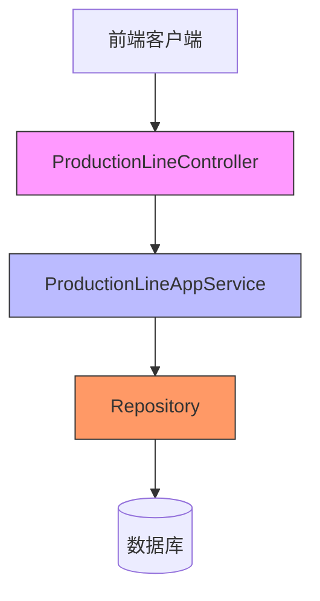
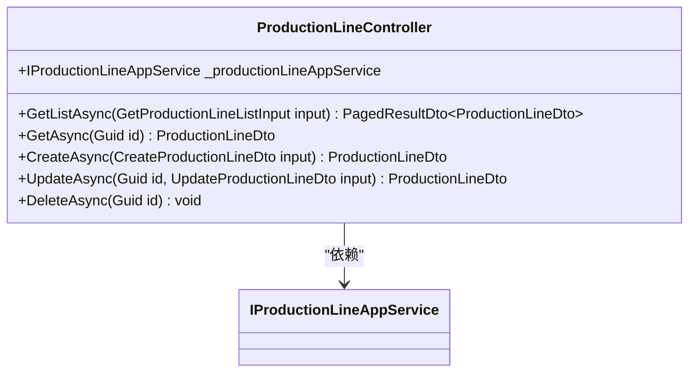
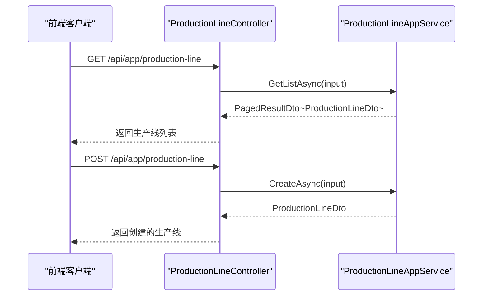
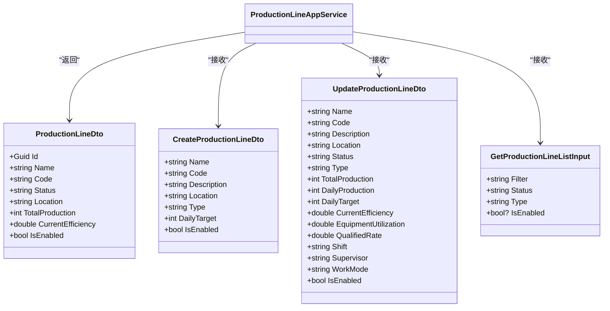
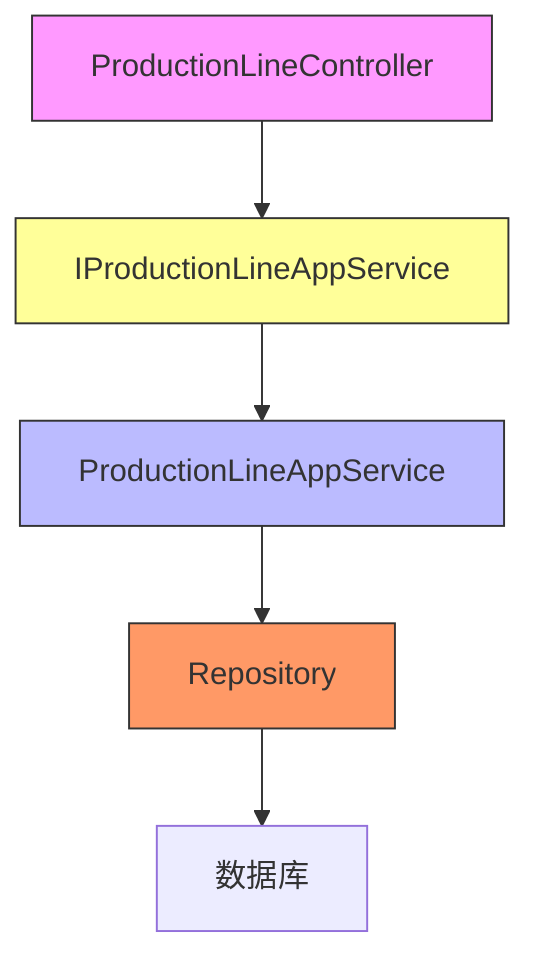

# 生产线管理API

<cite>
**Referenced Files in This Document**  
- [ProductionLineController.cs](file://src/SmartAbp.HttpApi/Controllers/ProductionLineController.cs)
- [ProductionLineAppService.cs](file://src/SmartAbp.Application/ProductionLine/ProductionLineAppService.cs)
- [IProductionLineAppService.cs](file://src/SmartAbp.Application.Contracts/ProductionLine/IProductionLineAppService.cs)
- [ProductionLineDto.cs](file://src/SmartAbp.Application.Contracts/ProductionLine/ProductionLineDto.cs)
- [GetProductionLineListInput.cs](file://src/SmartAbp.Application.Contracts/ProductionLine/GetProductionLineListInput.cs)
- [CreateProductionLineDto.cs](file://src/SmartAbp.Application.Contracts/ProductionLine/CreateProductionLineDto.cs)
- [UpdateProductionLineDto.cs](file://src/SmartAbp.Application.Contracts/ProductionLine/UpdateProductionLineDto.cs)
</cite>

## 目录
1. [简介](#简介)
2. [核心组件](#核心组件)
3. [架构概览](#架构概览)
4. [详细组件分析](#详细组件分析)
5. [依赖分析](#依赖分析)
6. [异常处理与状态码](#异常处理与状态码)
7. [结论](#结论)

## 简介
本文档详细描述了生产线管理系统的RESTful API设计。该系统基于ABP框架构建，实现了完整的CRUD操作，支持分页、筛选和排序功能。API设计遵循了后端持久化和DTO一致性的铁律，确保了前后端数据的一致性和系统的可维护性。

## 核心组件
生产线管理API的核心组件包括控制器、应用服务、数据传输对象（DTO）和输入参数对象。这些组件协同工作，提供了完整的生产线管理功能。

**Section sources**
- [ProductionLineController.cs](file://src/SmartAbp.HttpApi/Controllers/ProductionLineController.cs)
- [ProductionLineAppService.cs](file://src/SmartAbp.Application/ProductionLine/ProductionLineAppService.cs)

## 架构概览
生产线管理API采用典型的分层架构，包括控制器层、应用服务层和领域层。控制器层负责处理HTTP请求，应用服务层实现业务逻辑，领域层负责数据持久化。

**Diagram sources**
- [ProductionLineController.cs](file://src/SmartAbp.HttpApi/Controllers/ProductionLineController.cs)
- [ProductionLineAppService.cs](file://src/SmartAbp.Application/ProductionLine/ProductionLineAppService.cs)

## 详细组件分析

### 控制器分析
`ProductionLineController`是生产线管理API的入口点，负责处理所有与生产线相关的HTTP请求。

#### RESTful端点设计
控制器提供了标准的RESTful端点，支持CRUD操作：

**Diagram sources**
- [ProductionLineController.cs](file://src/SmartAbp.HttpApi/Controllers/ProductionLineController.cs)

**Section sources**
- [ProductionLineController.cs](file://src/SmartAbp.HttpApi/Controllers/ProductionLineController.cs)

#### 端点详细说明
以下是各个API端点的详细说明：

| 端点 | HTTP方法 | URL路径 | 描述 |
|------|---------|--------|------|
| 获取生产线列表 | GET | /api/app/production-line | 获取分页的生产线列表，支持筛选和排序 |
| 获取生产线详情 | GET | /api/app/production-line/{id} | 根据ID获取单个生产线的详细信息 |
| 创建生产线 | POST | /api/app/production-line | 创建新的生产线 |
| 更新生产线 | PUT | /api/app/production-line/{id} | 更新指定ID的生产线信息 |
| 删除生产线 | DELETE | /api/app/production-line/{id} | 删除指定ID的生产线 |

### 应用服务分析
`ProductionLineAppService`实现了生产线管理的核心业务逻辑，继承自ABP框架的`CrudAppService`，自动提供了CRUD操作的实现。

#### 调用关系
控制器通过依赖注入获取应用服务实例，并调用其方法处理业务逻辑。

**Diagram sources**
- [ProductionLineController.cs](file://src/SmartAbp.HttpApi/Controllers/ProductionLineController.cs)
- [ProductionLineAppService.cs](file://src/SmartAbp.Application/ProductionLine/ProductionLineAppService.cs)

**Section sources**
- [ProductionLineAppService.cs](file://src/SmartAbp.Application/ProductionLine/ProductionLineAppService.cs)

### DTO与领域模型分析
数据传输对象（DTO）用于在不同层之间传递数据，确保了前后端数据的一致性。

#### DTO映射关系

**Diagram sources**
- [ProductionLineDto.cs](file://src/SmartAbp.Application.Contracts/ProductionLine/ProductionLineDto.cs)
- [CreateProductionLineDto.cs](file://src/SmartAbp.Application.Contracts/ProductionLine/CreateProductionLineDto.cs)
- [UpdateProductionLineDto.cs](file://src/SmartAbp.Application.Contracts/ProductionLine/UpdateProductionLineDto.cs)
- [GetProductionLineListInput.cs](file://src/SmartAbp.Application.Contracts/ProductionLine/GetProductionLineListInput.cs)

**Section sources**
- [ProductionLineDto.cs](file://src/SmartAbp.Application.Contracts/ProductionLine/ProductionLineDto.cs)
- [CreateProductionLineDto.cs](file://src/SmartAbp.Application.Contracts/ProductionLine/CreateProductionLineDto.cs)
- [UpdateProductionLineDto.cs](file://src/SmartAbp.Application.Contracts/ProductionLine/UpdateProductionLineDto.cs)
- [GetProductionLineListInput.cs](file://src/SmartAbp.Application.Contracts/ProductionLine/GetProductionLineListInput.cs)

#### 数据验证规则
DTO类中定义了详细的数据验证规则，确保输入数据的合法性：

- **CreateProductionLineDto**:
  - `Name`: 必填，最多200个字符
  - `Code`: 必填，最多50个字符，只能包含大写字母、数字和连字符
  - `Location`: 必填，最多500个字符
  - `DailyTarget`: 非负整数

- **UpdateProductionLineDto**:
  - 所有数值字段都有范围限制（如效率在0-100之间）
  - 字符串字段有最大长度限制

**Section sources**
- [CreateProductionLineDto.cs](file://src/SmartAbp.Application.Contracts/ProductionLine/CreateProductionLineDto.cs)
- [UpdateProductionLineDto.cs](file://src/SmartAbp.Application.Contracts/ProductionLine/UpdateProductionLineDto.cs)

## 依赖分析
生产线管理API的组件之间存在明确的依赖关系，遵循了依赖倒置原则。

**Diagram sources**
- [ProductionLineController.cs](file://src/SmartAbp.HttpApi/Controllers/ProductionLineController.cs)
- [IProductionLineAppService.cs](file://src/SmartAbp.Application.Contracts/ProductionLine/IProductionLineAppService.cs)
- [ProductionLineAppService.cs](file://src/SmartAbp.Application/ProductionLine/ProductionLineAppService.cs)

**Section sources**
- [IProductionLineAppService.cs](file://src/SmartAbp.Application.Contracts/ProductionLine/IProductionLineAppService.cs)

## 异常处理与状态码
API遵循标准的HTTP状态码规范，提供了清晰的错误响应：

- **200 OK**: 请求成功，返回预期数据
- **201 Created**: 资源创建成功
- **400 Bad Request**: 请求参数无效
- **404 Not Found**: 请求的资源不存在
- **500 Internal Server Error**: 服务器内部错误

应用服务中集成了日志记录，便于问题排查和系统监控。

**Section sources**
- [ProductionLineAppService.cs](file://src/SmartAbp.Application/ProductionLine/ProductionLineAppService.cs)

## 结论
生产线管理API设计合理，实现了完整的CRUD操作，支持分页、筛选和排序功能。通过DTO和输入参数对象的定义，确保了前后端数据的一致性。应用服务继承自ABP框架的CrudAppService，减少了重复代码，提高了开发效率。整个系统遵循了良好的架构设计原则，具有良好的可维护性和扩展性。