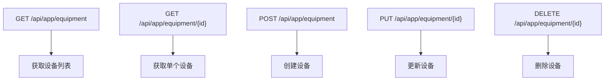
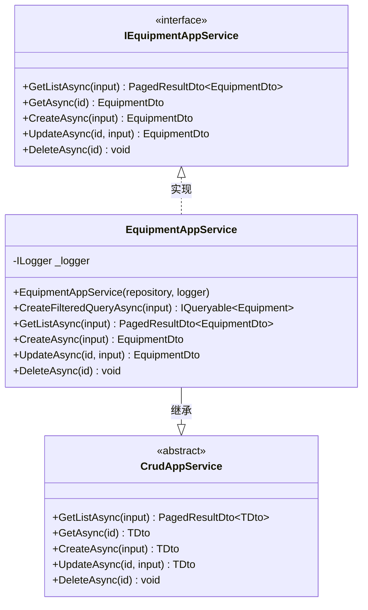
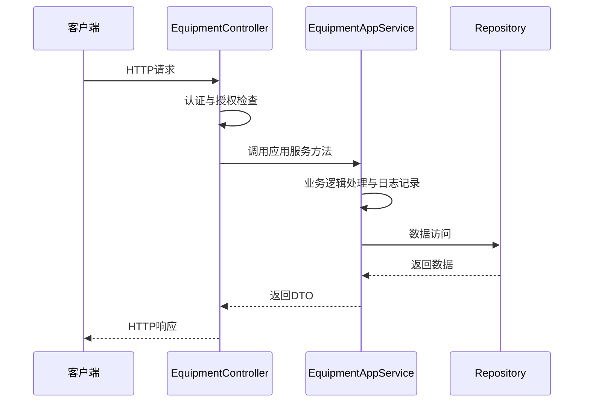

# 设备管理API

<cite>
**Referenced Files in This Document**   
- [EquipmentController.cs](file://src/SmartAbp.HttpApi/Controllers/EquipmentController.cs)
- [EquipmentAppService.cs](file://src/SmartAbp.Application/Equipment/EquipmentAppService.cs)
- [CreateEquipmentDto.cs](file://src/SmartAbp.Application.Contracts/Equipment/CreateEquipmentDto.cs)
- [UpdateEquipmentDto.cs](file://src/SmartAbp.Application.Contracts/Equipment/UpdateEquipmentDto.cs)
- [EquipmentDto.cs](file://src/SmartAbp.Application.Contracts/Equipment/EquipmentDto.cs)
- [GetEquipmentListInput.cs](file://src/SmartAbp.Application.Contracts/Equipment/GetEquipmentListInput.cs)
- [IEquipmentAppService.cs](file://src/SmartAbp.Application.Contracts/Equipment/IEquipmentAppService.cs)
</cite>

## 目录
1. [简介](#简介)
2. [HTTP端点](#http端点)
3. [数据传输对象](#数据传输对象)
4. [应用服务](#应用服务)
5. [权限控制](#权限控制)
6. [请求与响应示例](#请求与响应示例)

## 简介
设备管理API提供了一套完整的设备生命周期管理功能，包括设备的创建、查询、更新和删除操作。该API遵循ABP框架的CRUD模式，通过分层架构实现了业务逻辑与接口的分离。系统通过`EquipmentController`暴露RESTful端点，由`EquipmentAppService`处理核心业务逻辑，并使用一系列数据传输对象（DTO）确保前后端数据的一致性。

**Section sources**
- [EquipmentController.cs](file://src/SmartAbp.HttpApi/Controllers/EquipmentController.cs#L1-L54)
- [EquipmentAppService.cs](file://src/SmartAbp.Application/Equipment/EquipmentAppService.cs#L1-L98)

## HTTP端点

设备管理API提供了标准的CRUD操作端点，所有端点均位于`/api/app/equipment`基础路径下。



**Diagram sources**
- [EquipmentController.cs](file://src/SmartAbp.HttpApi/Controllers/EquipmentController.cs#L1-L54)

### GET /api/app/equipment
获取分页的设备列表。支持多种筛选条件，包括关键字搜索、状态、类型、生产线ID、启用状态和在线状态。

**Section sources**
- [EquipmentController.cs](file://src/SmartAbp.HttpApi/Controllers/EquipmentController.cs#L25-L30)
- [EquipmentAppService.cs](file://src/SmartAbp.Application/Equipment/EquipmentAppService.cs#L55-L58)

### GET /api/app/equipment/{id}
根据设备ID获取单个设备的详细信息。

**Section sources**
- [EquipmentController.cs](file://src/SmartAbp.HttpApi/Controllers/EquipmentController.cs#L32-L36)

### POST /api/app/equipment
创建新设备。请求体必须包含`CreateEquipmentDto`定义的所有必填字段。

**Section sources**
- [EquipmentController.cs](file://src/SmartAbp.HttpApi/Controllers/EquipmentController.cs#L38-L42)

### PUT /api/app/equipment/{id}
根据设备ID更新现有设备信息。请求体包含`UpdateEquipmentDto`定义的更新字段。

**Section sources**
- [EquipmentController.cs](file://src/SmartAbp.HttpApi/Controllers/EquipmentController.cs#L44-L48)

### DELETE /api/app/equipment/{id}
根据设备ID删除设备。

**Section sources**
- [EquipmentController.cs](file://src/SmartAbp.HttpApi/Controllers/EquipmentController.cs#L50-L54)

## 数据传输对象

### CreateEquipmentDto
用于创建新设备的数据传输对象，包含设备的基本信息和配置。

| 字段 | 类型 | 必填 | 约束 | 描述 |
|------|------|------|------|------|
| Name | string | 是 | 最大长度200 | 设备名称 |
| Code | string | 是 | 最大长度50, 正则`^[A-Z0-9-]+$` | 设备编号 |
| Description | string | 否 | 最大长度1000 | 描述 |
| Type | string | 是 | 最大长度100 | 设备类型 |
| Manufacturer | string | 否 | 最大长度200 | 制造商 |
| Model | string | 否 | 最大长度100 | 型号 |
| SerialNumber | string | 否 | 最大长度100 | 序列号 |
| Location | string | 是 | 最大长度500 | 位置 |
| ProductionLineId | Guid | 是 | - | 所属生产线ID |
| MaintenanceCycle | int | 否 | 范围1-365, 默认30 | 维护周期(天) |
| MaintenanceResponsible | string | 否 | 最大长度100 | 维护负责人 |
| PLCAddress | string | 否 | 最大长度100 | PLC地址 |
| PLCPort | int? | 否 | - | PLC端口 |
| IsEnabled | bool | 否 | - | 是否启用, 默认true |

**Section sources**
- [CreateEquipmentDto.cs](file://src/SmartAbp.Application.Contracts/Equipment/CreateEquipmentDto.cs#L1-L54)

### UpdateEquipmentDto
用于更新设备信息的数据传输对象。

| 字段 | 类型 | 必填 | 约束 | 描述 |
|------|------|------|------|------|
| Name | string | 是 | 最大长度200 | 设备名称 |
| Code | string | 是 | 最大长度50 | 设备编号 |
| Description | string | 否 | 最大长度1000 | 描述 |
| Type | string | 是 | 最大长度100 | 设备类型 |
| Manufacturer | string | 否 | 最大长度200 | 制造商 |
| Model | string | 否 | 最大长度100 | 型号 |
| SerialNumber | string | 否 | 最大长度100 | 序列号 |
| Location | string | 是 | 最大长度500 | 位置 |
| Status | string | 否 | 最大长度50 | 状态 |
| HealthStatus | string | 否 | 最大长度50 | 健康状态 |
| ProductionLineId | Guid | 否 | - | 所属生产线ID |
| MaintenanceCycle | int | 否 | 范围1-365 | 维护周期(天) |
| MaintenanceResponsible | string | 否 | 最大长度100 | 维护负责人 |
| PLCAddress | string | 否 | 最大长度100 | PLC地址 |
| PLCPort | int? | 否 | - | PLC端口 |
| IsEnabled | bool | 否 | - | 是否启用 |
| IsOnline | bool | 否 | - | 是否在线 |

**Section sources**
- [UpdateEquipmentDto.cs](file://src/SmartAbp.Application.Contracts/Equipment/UpdateEquipmentDto.cs#L1-L59)

### EquipmentDto
设备数据传输对象，用于在API中传输设备信息。

| 字段 | 类型 | 描述 |
|------|------|------|
| Name | string | 设备名称 |
| Code | string | 设备编号 |
| Description | string | 描述 |
| Type | string | 设备类型 |
| Manufacturer | string | 制造商 |
| Model | string | 型号 |
| SerialNumber | string | 序列号 |
| Location | string | 位置 |
| Status | string | 状态 |
| HealthStatus | string | 健康状态 |
| Temperature | double | 温度 |
| Pressure | double | 压力 |
| Vibration | double | 振动 |
| Speed | double | 速度 |
| Power | double | 功率 |
| Current | double | 电流 |
| Voltage | double | 电压 |
| LastUpdateTime | DateTime | 最后更新时间 |
| TotalRunningHours | double | 总运行时长 |
| DailyRunningHours | double | 日运行时长 |
| TotalProduction | int | 总产量 |
| DailyProduction | int | 日产量 |
| FaultCount | int | 故障次数 |
| UtilizationRate | double | 利用率 |
| OEE | double | 综合效率 |
| LastMaintenanceDate | DateTime? | 上次维护日期 |
| NextMaintenanceDate | DateTime? | 下次维护日期 |
| MaintenanceCycle | int | 维护周期 |
| MaintenanceResponsible | string | 维护负责人 |
| ProductionLineId | Guid | 所属生产线ID |
| TenantId | Guid? | 租户ID |
| IsEnabled | bool | 是否启用 |
| IsOnline | bool | 是否在线 |
| PLCAddress | string | PLC地址 |
| PLCPort | int? | PLC端口 |

**Section sources**
- [EquipmentDto.cs](file://src/SmartAbp.Application.Contracts/Equipment/EquipmentDto.cs#L1-L61)

### GetEquipmentListInput
设备列表查询输入参数，继承自`PagedAndSortedResultRequestDto`，支持分页和排序。

| 字段 | 类型 | 描述 |
|------|------|------|
| Filter | string | 关键字过滤，匹配名称或编号 |
| Status | string | 状态过滤 |
| Type | string | 类型过滤 |
| ProductionLineId | Guid? | 生产线ID过滤 |
| IsEnabled | bool? | 启用状态过滤 |
| IsOnline | bool? | 在线状态过滤 |
| Sorting | string | 排序字段 |
| SkipCount | int | 跳过记录数 |
| MaxResultCount | int | 最大返回结果数 |

**Section sources**
- [GetEquipmentListInput.cs](file://src/SmartAbp.Application.Contracts/Equipment/GetEquipmentListInput.cs#L1-L16)

## 应用服务

`EquipmentAppService`是设备管理的核心应用服务，继承自ABP框架的`CrudAppService`，实现了`IEquipmentAppService`接口。



**Diagram sources**
- [EquipmentAppService.cs](file://src/SmartAbp.Application/Equipment/EquipmentAppService.cs#L1-L98)
- [IEquipmentAppService.cs](file://src/SmartAbp.Application.Contracts/Equipment/IEquipmentAppService.cs#L1-L16)

### 业务逻辑处理
`EquipmentAppService`通过重写`CreateFilteredQueryAsync`方法实现自定义查询逻辑，支持多条件组合筛选。服务还通过日志记录关键操作，便于系统监控和问题排查。

**Section sources**
- [EquipmentAppService.cs](file://src/SmartAbp.Application/Equipment/EquipmentAppService.cs#L32-L53)

### 与领域层交互
应用服务通过`IRepository<Domain.Entities.MES.Equipment, Guid>`与领域层的设备实体进行交互，遵循仓储模式，实现了数据访问的抽象。

**Section sources**
- [EquipmentAppService.cs](file://src/SmartAbp.Application/Equipment/EquipmentAppService.cs#L24-L30)

## 权限控制

设备管理API的权限控制机制基于ABP框架的权限系统实现。虽然当前代码中未显式定义权限检查，但系统预留了权限管理扩展点，可通过`SmartAbpPermissions`类定义的权限常量进行细粒度的权限控制。



**Diagram sources**
- [EquipmentController.cs](file://src/SmartAbp.HttpApi/Controllers/EquipmentController.cs#L1-L54)
- [EquipmentAppService.cs](file://src/SmartAbp.Application/Equipment/EquipmentAppService.cs#L1-L98)

## 请求与响应示例

### 获取设备列表
**请求**
```
GET /api/app/equipment?Filter=PLC&Status=Running&MaxResultCount=10
```

**成功响应**
```json
{
  "items": [
    {
      "id": "a1b2c3d4-e5f6-7890-1234-567890abcdef",
      "name": "PLC-001",
      "code": "PLC-001",
      "type": "PLC控制器",
      "status": "Running",
      "isOnline": true,
      "productionLineId": "p1q2r3s4-t5u6-7890-1234-567890abcdef"
    }
  ],
  "totalCount": 1
}
```

**Section sources**
- [EquipmentController.cs](file://src/SmartAbp.HttpApi/Controllers/EquipmentController.cs#L25-L30)
- [GetEquipmentListInput.cs](file://src/SmartAbp.Application.Contracts/Equipment/GetEquipmentListInput.cs#L1-L16)

### 创建设备
**请求**
```json
{
  "name": "新设备001",
  "code": "EQP-001",
  "type": "加工设备",
  "location": "车间A-01",
  "productionLineId": "p1q2r3s4-t5u6-7890-1234-567890abcdef"
}
```

**成功响应**
```json
{
  "id": "a1b2c3d4-e5f6-7890-1234-567890abcdef",
  "name": "新设备001",
  "code": "EQP-001",
  "type": "加工设备",
  "location": "车间A-01",
  "productionLineId": "p1q2r3s4-t5u6-7890-1234-567890abcdef",
  "isOnline": false,
  "isEnabled": true
}
```

**Section sources**
- [EquipmentController.cs](file://src/SmartAbp.HttpApi/Controllers/EquipmentController.cs#L38-L42)
- [CreateEquipmentDto.cs](file://src/SmartAbp.Application.Contracts/Equipment/CreateEquipmentDto.cs#L1-L54)

### 错误场景
**请求（缺少必填字段）**
```json
{
  "name": "测试设备"
  // 缺少必填的code字段
}
```

**错误响应**
```json
{
  "error": {
    "code": "ValidationError",
    "message": "设备编号不能为空",
    "details": "The Code field is required.",
    "validationErrors": [
      {
        "message": "设备编号不能为空",
        "members": ["code"]
      }
    ]
  }
}
```

**Section sources**
- [CreateEquipmentDto.cs](file://src/SmartAbp.Application.Contracts/Equipment/CreateEquipmentDto.cs#L1-L54)