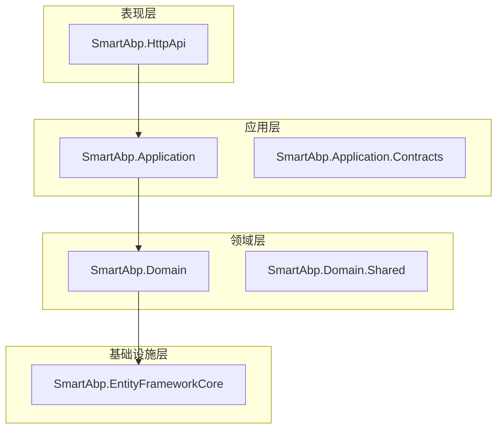
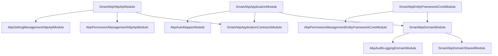
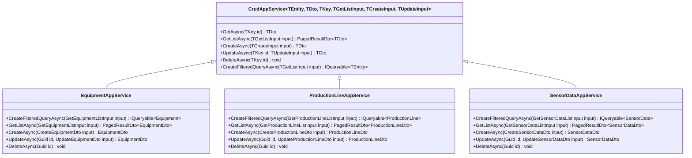
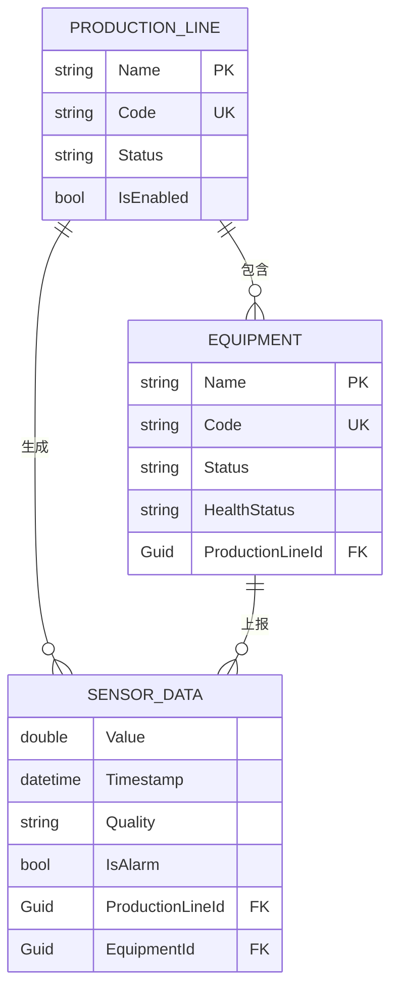
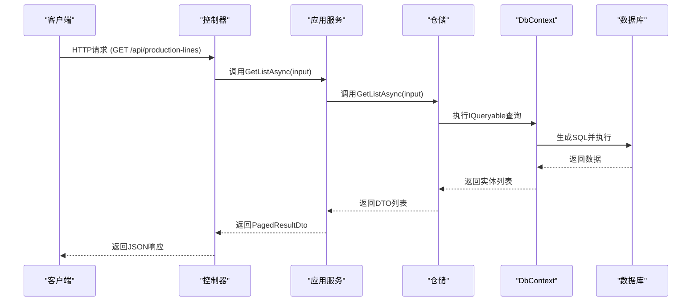

# 后端架构

<cite>
**本文档中引用的文件**  
- [SmartAbpHttpApiModule.cs](file://src/SmartAbp.HttpApi/SmartAbpHttpApiModule.cs)
- [SmartAbpApplicationModule.cs](file://src/SmartAbp.Application/SmartAbpApplicationModule.cs)
- [SmartAbpDomainModule.cs](file://src/SmartAbp.Domain/SmartAbpDomainModule.cs)
- [SmartAbpEntityFrameworkCoreModule.cs](file://src/SmartAbp.EntityFrameworkCore/EntityFrameworkCore/SmartAbpEntityFrameworkCoreModule.cs)
- [SmartAbpDbContext.cs](file://src/SmartAbp.EntityFrameworkCore/EntityFrameworkCore/SmartAbpDbContext.cs)
- [SmartAbpDbContextFactory.cs](file://src/SmartAbp.EntityFrameworkCore/EntityFrameworkCore/SmartAbpDbContextFactory.cs)
- [SmartAbpConsts.cs](file://src/SmartAbp.Domain/SmartAbpConsts.cs)
- [EquipmentAppService.cs](file://src/SmartAbp.Application/Equipment/EquipmentAppService.cs)
- [ProductionLineAppService.cs](file://src/SmartAbp.Application/ProductionLine/ProductionLineAppService.cs)
- [SensorDataAppService.cs](file://src/SmartAbp.Application/SensorData/SensorDataAppService.cs)
</cite>

## 目录
1. [引言](#引言)
2. [项目结构](#项目结构)
3. [分层架构设计](#分层架构设计)
4. [模块化系统与依赖注入](#模块化系统与依赖注入)
5. [应用服务设计模式](#应用服务设计模式)
6. [领域驱动设计（DDD）实现](#领域驱动设计ddd实现)
7. [数据访问层与Entity Framework Core](#数据访问层与entity-framework-core)
8. [ABP框架核心功能支持](#abp框架核心功能支持)
9. [后端调用关系与数据流图](#后端调用关系与数据流图)
10. [结论](#结论)

## 引言
hxlot项目采用ABP vNext框架构建，遵循清晰的分层架构设计原则，确保系统的可维护性、可扩展性和高内聚低耦合。本项目通过模块化组织代码，结合依赖注入机制，实现了业务逻辑的灵活解耦。应用服务层基于ABP的CrudAppService基类，统一处理CRUD操作，提升开发效率。领域层通过聚合根、实体和值对象建模业务概念，强化领域逻辑。数据访问层使用Entity Framework Core，支持多数据库适配，并通过性能优化确保数据操作的高效性。ABP框架提供的权限管理、审计日志和多租户功能，为系统提供了企业级的基础能力。

## 项目结构
项目采用标准的ABP分层结构，各层职责明确，代码组织清晰。

**图示来源**  
- [SmartAbp.HttpApi](file://src/SmartAbp.HttpApi/SmartAbpHttpApiModule.cs)
- [SmartAbp.Application](file://src/SmartAbp.Application/SmartAbpApplicationModule.cs)
- [SmartAbp.Domain](file://src/SmartAbp.Domain/SmartAbpDomainModule.cs)
- [SmartAbp.EntityFrameworkCore](file://src/SmartAbp.EntityFrameworkCore/EntityFrameworkCore/SmartAbpEntityFrameworkCoreModule.cs)

## 分层架构设计
hxlot项目严格遵循ABP vNext的分层架构，分为表现层、应用层、领域层和基础设施层。

### 表现层（HttpApi）
表现层位于`SmartAbp.HttpApi`项目，负责接收HTTP请求并返回响应。该层通过控制器（Controller）暴露API端点，将请求委派给应用服务处理。它不包含业务逻辑，仅负责协议转换和输入验证。

**本节来源**  
- [SmartAbpHttpApiModule.cs](file://src/SmartAbp.HttpApi/SmartAbpHttpApiModule.cs)

### 应用层（Application）
应用层位于`SmartAbp.Application`项目，是协调领域层和基础设施层的“编排者”。它定义了应用服务（AppService），封装了用例逻辑，处理DTO与领域实体之间的映射，并调用领域服务或仓储。应用层通过`SmartAbpApplicationModule`模块进行配置。

**本节来源**  
- [SmartAbpApplicationModule.cs](file://src/SmartAbp.Application/SmartAbpApplicationModule.cs)

### 领域层（Domain）
领域层位于`SmartAbp.Domain`项目，是业务逻辑的核心。它包含聚合根、实体、值对象、领域服务和仓储接口。领域层通过`SmartAbpDomainModule`模块配置，依赖于ABP的审计日志、权限管理、多租户等核心模块，并实现了多语言支持。

**本节来源**  
- [SmartAbpDomainModule.cs](file://src/SmartAbp.Domain/SmartAbpDomainModule.cs)

### 基础设施层（EntityFrameworkCore）
基础设施层位于`SmartAbp.EntityFrameworkCore`项目，负责数据持久化。它实现了领域层定义的仓储接口，使用Entity Framework Core与数据库交互。该层通过`SmartAbpEntityFrameworkCoreModule`模块配置，支持多数据库（SQLite、SQL Server、PostgreSQL）。

**本节来源**  
- [SmartAbpEntityFrameworkCoreModule.cs](file://src/SmartAbp.EntityFrameworkCore/EntityFrameworkCore/SmartAbpEntityFrameworkCoreModule.cs)

## 模块化系统与依赖注入
ABP框架的模块化系统通过`[DependsOn]`特性声明模块间的依赖关系，确保模块按正确顺序初始化。

### 模块依赖关系

**图示来源**  
- [SmartAbpHttpApiModule.cs](file://src/SmartAbp.HttpApi/SmartAbpHttpApiModule.cs)
- [SmartAbpApplicationModule.cs](file://src/SmartAbp.Application/SmartAbpApplicationModule.cs)
- [SmartAbpDomainModule.cs](file://src/SmartAbp.Domain/SmartAbpDomainModule.cs)
- [SmartAbpEntityFrameworkCoreModule.cs](file://src/SmartAbp.EntityFrameworkCore/EntityFrameworkCore/SmartAbpEntityFrameworkCoreModule.cs)

### 依赖注入配置
各模块在`ConfigureServices`方法中注册服务。例如，`SmartAbpApplicationModule`注册AutoMapper配置，`SmartAbpEntityFrameworkCoreModule`注册`SmartAbpDbContext`。ABP的依赖注入容器自动解析服务依赖，实现松耦合。

**本节来源**  
- [SmartAbpApplicationModule.cs](file://src/SmartAbp.Application/SmartAbpApplicationModule.cs#L25-L35)
- [SmartAbpEntityFrameworkCoreModule.cs](file://src/SmartAbp.EntityFrameworkCore/EntityFrameworkCore/SmartAbpEntityFrameworkCoreModule.cs#L50-L135)

## 应用服务设计模式
应用服务继承自ABP的`CrudAppService`基类，实现标准化的CRUD操作。

### 设计模式分析

**图示来源**  
- [EquipmentAppService.cs](file://src/SmartAbp.Application/Equipment/EquipmentAppService.cs)
- [ProductionLineAppService.cs](file://src/SmartAbp.Application/ProductionLine/ProductionAppService.cs)
- [SensorDataAppService.cs](file://src/SmartAbp.Application/SensorData/SensorDataAppService.cs)

### 最佳实践
- **日志记录**：每个CRUD方法均记录操作日志，便于追踪和审计。
- **筛选查询**：重写`CreateFilteredQueryAsync`方法，实现自定义筛选逻辑。
- **依赖注入**：通过构造函数注入仓储和日志服务，符合依赖注入原则。
- **异常处理**：ABP框架自动处理常见异常，如记录不存在、权限不足等。

**本节来源**  
- [EquipmentAppService.cs](file://src/SmartAbp.Application/Equipment/EquipmentAppService.cs#L12-L95)
- [ProductionLineAppService.cs](file://src/SmartAbp.Application/ProductionLine/ProductionLineAppService.cs#L17-L213)
- [SensorDataAppService.cs](file://src/SmartAbp.Application/SensorData/SensorDataAppService.cs#L12-L100)

## 领域驱动设计（DDD）实现
项目在领域层实现了DDD的核心概念。

### 聚合根、实体与值对象
- **聚合根**：`ProductionLine`、`Equipment`、`SensorData`是聚合根，拥有独立的生命周期和仓储。
- **实体**：聚合根内的子实体，如`ProductionLine`中的`Equipments`集合。
- **值对象**：未显式定义，但可通过`SmartAbpConsts`中的常量体现，如`DbTablePrefix`。

**本节来源**  
- [SmartAbpDbContext.cs](file://src/SmartAbp.EntityFrameworkCore/EntityFrameworkCore/SmartAbpDbContext.cs#L24-L460)
- [SmartAbpConsts.cs](file://src/SmartAbp.Domain/SmartAbpConsts.cs#L4-L10)

### 领域服务
领域服务封装跨聚合或复杂业务逻辑。本项目中，领域服务主要由ABP框架提供，如`IdentityUserManager`、`PermissionManager`等。

## 数据访问层与Entity Framework Core
数据访问层通过Entity Framework Core实现，具有高性能和高可配置性。

### DbContext配置
`SmartAbpDbContext`继承自`AbpDbContext`，配置了所有实体的DbSet。通过`OnModelCreating`方法使用Fluent API配置实体映射和关系。

**图示来源**  
- [SmartAbpDbContext.cs](file://src/SmartAbp.EntityFrameworkCore/EntityFrameworkCore/SmartAbpDbContext.cs#L24-L460)

### 多数据库支持
通过`MultiDatabaseMigrationManager`根据`appsettings.json`中的配置动态选择数据库类型（SQLite、SQL Server、PostgreSQL），并为每种数据库类型使用独立的迁移历史表和程序集。

**本节来源**  
- [SmartAbpEntityFrameworkCoreModule.cs](file://src/SmartAbp.EntityFrameworkCore/EntityFrameworkCore/SmartAbpEntityFrameworkCoreModule.cs#L75-L135)
- [SmartAbpDbContextFactory.cs](file://src/SmartAbp.EntityFrameworkCore/EntityFrameworkCore/SmartAbpDbContextFactory.cs#L12-L44)

### 性能优化
- **索引优化**：为常用查询字段（如`Code`、`Status`、`Timestamp`）创建数据库索引。
- **连接重试**：对SQL Server启用瞬态错误重试机制。
- **UTC时间**：全局配置使用UTC时间，避免时区问题。

**本节来源**  
- [SmartAbpEntityFrameworkCoreModule.cs](file://src/SmartAbp.EntityFrameworkCore/EntityFrameworkCore/SmartAbpEntityFrameworkCoreModule.cs#L55-L58)
- [SmartAbpDbContext.cs](file://src/SmartAbp.EntityFrameworkCore/EntityFrameworkCore/SmartAbpDbContext.cs#L24-L460)

## ABP框架核心功能支持
项目充分利用了ABP框架的企业级功能。

### 权限管理
通过`AbpPermissionManagement`模块实现，支持细粒度的权限控制。权限定义在`SmartAbpPermissions.cs`中。

### 审计日志
通过`AbpAuditLogging`模块自动记录实体的创建、修改和删除操作，包括操作者、时间戳和变更详情。

### 多租户
通过`AbpTenantManagement`模块实现，`SmartAbpDbContext`中的所有实体均包含`TenantId`字段，实现数据隔离。

**本节来源**  
- [SmartAbpDomainModule.cs](file://src/SmartAbp.Domain/SmartAbpDomainModule.cs#L27-L129)
- [SmartAbpDbContext.cs](file://src/SmartAbp.EntityFrameworkCore/EntityFrameworkCore/SmartAbpDbContext.cs#L24-L460)

## 后端调用关系与数据流图
展示了从HTTP请求到数据持久化的完整调用链。

**图示来源**  
- [SmartAbp.HttpApi](file://src/SmartAbp.HttpApi/SmartAbpHttpApiModule.cs)
- [SmartAbp.Application](file://src/SmartAbp.Application/ProductionLine/ProductionLineAppService.cs)
- [SmartAbp.EntityFrameworkCore](file://src/SmartAbp.EntityFrameworkCore/EntityFrameworkCore/SmartAbpDbContext.cs)

## 结论
hxlot项目基于ABP vNext框架构建了一个结构清晰、可扩展性强的后端系统。通过分层架构、模块化设计和DDD实践，确保了代码的高内聚和低耦合。应用服务的标准化设计提升了开发效率，Entity Framework Core的多数据库支持和性能优化保障了系统的稳定运行。ABP框架提供的权限、审计和多租户功能，为系统提供了坚实的企业级基础。整体架构设计合理，具备良好的可维护性和扩展性。