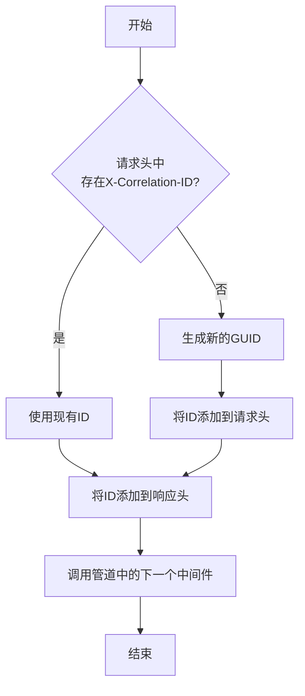
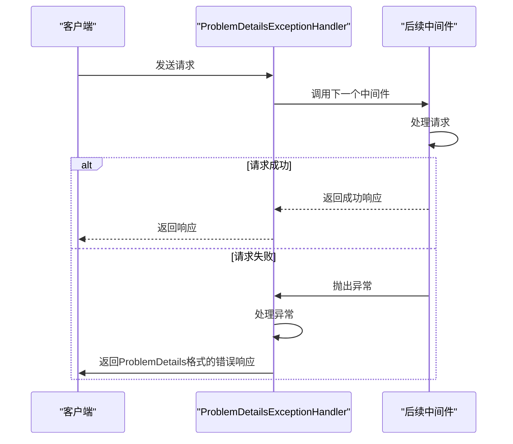
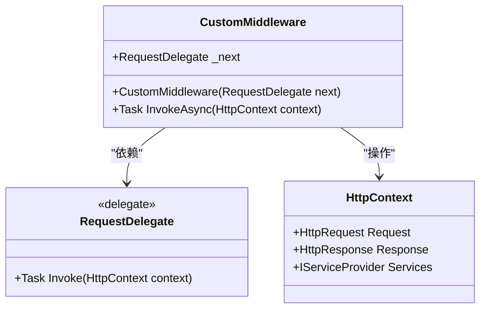

# 中间件

<cite>
**Referenced Files in This Document**   
- [CorrelationIdMiddleware.cs](file://src/SmartAbp.Web/Middleware/CorrelationIdMiddleware.cs)
- [ProblemDetailsExceptionHandler.cs](file://src/SmartAbp.Web/Middleware/ProblemDetailsExceptionHandler.cs)
- [HealthChecksBuilderExtensions.cs](file://src/SmartAbp.Web/HealthChecks/HealthChecksBuilderExtensions.cs)
- [Program.cs](file://src/SmartAbp.Web/Program.cs)
- [SmartAbpHttpApiHostModule.cs](file://src/SmartAbp.Web/SmartAbpHttpApiHostModule.cs)
</cite>

## 目录
1. [引言](#引言)
2. [核心中间件实现](#核心中间件实现)
3. [健康检查中间件](#健康检查中间件)
4. [中间件执行顺序](#中间件执行顺序)
5. [自定义中间件开发模式](#自定义中间件开发模式)
6. [性能监控与错误处理](#性能监控与错误处理)
7. [调试方法](#调试方法)
8. [结论](#结论)

## 引言
hxlot项目中的中间件系统是其后端架构的核心组成部分，负责处理请求链路追踪、异常响应统一、健康检查等关键功能。本文档将深入解析`CorrelationIdMiddleware`如何实现请求链路追踪，`ProblemDetailsExceptionHandler`如何统一异常响应格式，以及健康检查中间件的实现原理和端点配置。同时，文档将详细描述中间件在请求管道中的执行顺序和相互影响，分析自定义中间件的开发模式和注册方式，并提供中间件性能监控和错误处理的最佳实践，以及中间件链路的调试方法。

## 核心中间件实现

### CorrelationIdMiddleware 请求链路追踪
`CorrelationIdMiddleware`中间件通过在HTTP请求和响应头中注入和传递相关性ID（Correlation ID），实现了完整的请求链路追踪功能。该中间件首先检查传入请求的`X-Correlation-ID`头，如果不存在，则生成一个新的GUID作为相关性ID。这个ID随后被添加到请求头中，并在响应头中返回，确保在整个请求-响应周期内保持一致。



**Diagram sources**
- [CorrelationIdMiddleware.cs](file://src/SmartAbp.Web/Middleware/CorrelationIdMiddleware.cs)

**Section sources**
- [CorrelationIdMiddleware.cs](file://src/SmartAbp.Web/Middleware/CorrelationIdMiddleware.cs)

### ProblemDetailsExceptionHandler 统一异常响应
`ProblemDetailsExceptionHandler`中间件通过捕获管道中后续中间件抛出的异常，实现了统一的异常响应格式。该中间件使用`ProblemDetails`标准模型来格式化错误响应，确保所有错误都以一致的JSON格式返回。对于业务异常（`BusinessException`），它会将其转换为400状态码的响应，并将异常代码和消息作为响应体的一部分。



**Diagram sources**
- [ProblemDetailsExceptionHandler.cs](file://src/SmartAbp.Web/Middleware/ProblemDetailsExceptionHandler.cs)

**Section sources**
- [ProblemDetailsExceptionHandler.cs](file://src/SmartAbp.Web/Middleware/ProblemDetailsExceptionHandler.cs)

## 健康检查中间件

### 实现原理与端点配置
健康检查中间件通过`HealthChecksBuilderExtensions`类进行配置和注册。系统使用`AddSmartAbpHealthChecks`扩展方法来添加自定义的健康检查，包括数据库连接检查等。健康检查结果通过`/health-status`端点暴露，并通过`/health-ui`提供用户界面。配置中还集成了内存存储，用于保存健康检查的历史数据。

```mermaid
graph TD
A[服务启动] --> B[调用AddSmartAbpHealthChecks]
B --> C[添加数据库健康检查]
C --> D[配置健康检查端点]
D --> E[/health-status]
D --> F[/health-ui]
F --> G[健康检查UI]
E --> H[返回JSON格式的健康状态]
```

**Diagram sources**
- [HealthChecksBuilderExtensions.cs](file://src/SmartAbp.Web/HealthChecks/HealthChecksBuilderExtensions.cs)

**Section sources**
- [HealthChecksBuilderExtensions.cs](file://src/SmartAbp.Web/HealthChecks/HealthChecksBuilderExtensions.cs)

## 中间件执行顺序

### 请求管道中的执行流程
中间件在请求管道中的执行顺序至关重要，它决定了请求处理的逻辑流程。在`Program.cs`文件中，通过`UseMiddleware`方法按特定顺序注册中间件。正确的顺序确保了相关性ID在日志记录和异常处理之前被设置，从而在所有日志和错误报告中都能包含链路追踪信息。


**Diagram sources**
- [Program.cs](file://src/SmartAbp.Web/Program.cs)

**Section sources**
- [Program.cs](file://src/SmartAbp.Web/Program.cs)

## 自定义中间件开发模式

### 开发与注册方式
自定义中间件的开发遵循标准的ASP.NET Core中间件模式，即实现一个接受`RequestDelegate`的构造函数，并提供一个`InvokeAsync`方法。中间件通过依赖注入系统注册，并使用`UseMiddleware<T>`扩展方法添加到请求管道中。这种模式确保了中间件的可重用性和可测试性。



**Section sources**
- [Program.cs](file://src/SmartAbp.Web/Program.cs)
- [SmartAbpHttpApiHostModule.cs](file://src/SmartAbp.Web/SmartAbpHttpApiHostModule.cs)

## 性能监控与错误处理

### 最佳实践
性能监控和错误处理的最佳实践包括使用Serilog进行结构化日志记录，将相关性ID作为日志上下文属性，以及使用`ProblemDetails`标准来统一错误响应。此外，通过合理配置健康检查，可以实时监控服务的运行状态，及时发现和解决问题。

**Section sources**
- [Program.cs](file://src/SmartAbp.Web/Program.cs)
- [CorrelationIdMiddleware.cs](file://src/SmartAbp.Web/Middleware/CorrelationIdMiddleware.cs)
- [ProblemDetailsExceptionHandler.cs](file://src/SmartAbp.Web/Middleware/ProblemDetailsExceptionHandler.cs)

## 调试方法

### 中间件链路调试
调试中间件链路的方法包括在开发环境中启用详细的日志记录，使用Swagger UI测试API端点，以及通过健康检查UI监控服务状态。此外，可以通过在中间件中添加断点来逐步调试请求处理流程，确保每个中间件按预期工作。

**Section sources**
- [Program.cs](file://src/SmartAbp.Web/Program.cs)
- [SmartAbpHttpApiHostModule.cs](file://src/SmartAbp.Web/SmartAbpHttpApiHostModule.cs)

## 结论
hxlot项目的中间件系统设计精良，通过`CorrelationIdMiddleware`、`ProblemDetailsExceptionHandler`和健康检查中间件等组件，实现了高效的请求链路追踪、统一的异常处理和全面的健康监控。中间件的执行顺序经过精心设计，确保了功能的正确性和性能的最优化。自定义中间件的开发模式遵循ASP.NET Core的最佳实践，具有良好的可维护性和可扩展性。通过采用这些中间件，项目能够提供稳定、可靠和易于调试的服务。