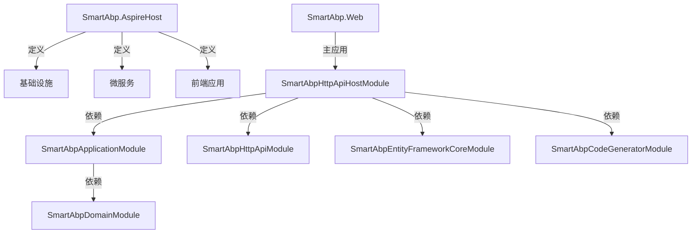
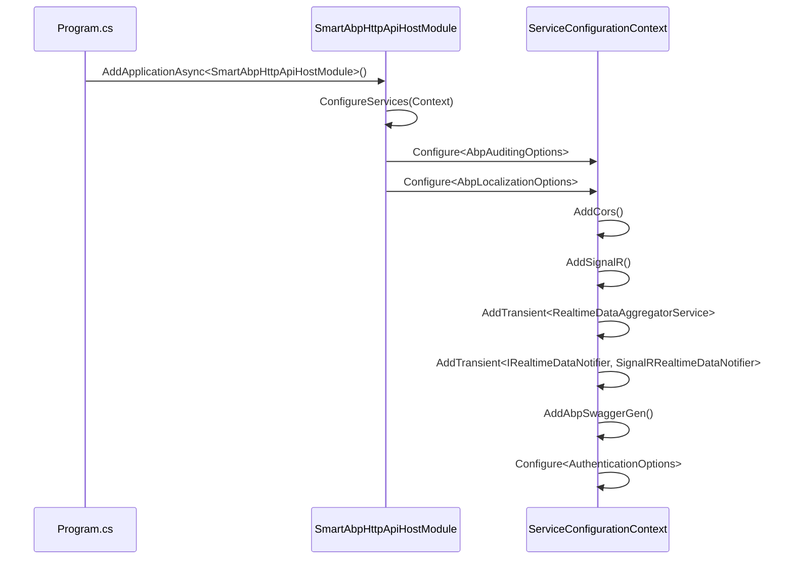

# 启动流程

<cite>
**本文档引用的文件**  
- [Program.cs](file://src/SmartAbp.AspireHost/Program.cs)
- [Program.cs](file://src/SmartAbp.Web/Program.cs)
- [SmartAbpHttpApiHostModule.cs](file://src/SmartAbp.Web/SmartAbpHttpApiHostModule.cs)
- [SmartAbpApplicationModule.cs](file://src/SmartAbp.Application/SmartAbpApplicationModule.cs)
- [SmartAbpHttpApiModule.cs](file://src/SmartAbp.HttpApi/SmartAbpHttpApiModule.cs)
- [SmartAbpDomainModule.cs](file://src/SmartAbp.Domain/SmartAbpDomainModule.cs)
- [SmartAbpCodeGeneratorModule.cs](file://src/SmartAbp.CodeGenerator/SmartAbpCodeGeneratorModule.cs)
- [appsettings.json](file://src/SmartAbp.AspireHost/appsettings.json)
- [appsettings.Development.json](file://src/SmartAbp.AspireHost/appsettings.Development.json)
</cite>

## 目录
1. [项目结构](#项目结构)
2. [核心启动流程](#核心启动流程)
3. [SmartAbpHttpApiHostModule模块详解](#smartabphttpapihostmodule模块详解)
4. [ABP模块化加载机制](#abp模块化加载机制)
5. [依赖注入与中间件管道](#依赖注入与中间件管道)
6. [主机环境与配置加载](#主机环境与配置加载)
7. [启动性能优化建议](#启动性能优化建议)
8. [常见启动错误排查](#常见启动错误排查)

## 项目结构

hxlot项目采用微服务架构，核心启动入口位于`SmartAbp.AspireHost`和`SmartAbp.Web`项目中。`SmartAbp.AspireHost`负责定义分布式应用的基础设施资源和服务拓扑，而`SmartAbp.Web`是主Web应用的启动宿主。

**Diagram sources**
- [Program.cs](file://src/SmartAbp.AspireHost/Program.cs)
- [SmartAbpHttpApiHostModule.cs](file://src/SmartAbp.Web/SmartAbpHttpApiHostModule.cs)

**Section sources**
- [Program.cs](file://src/SmartAbp.AspireHost/Program.cs)
- [SmartAbpHttpApiHostModule.cs](file://src/SmartAbp.Web/SmartAbpHttpApiHostModule.cs)

## 核心启动流程

hxlot项目的启动流程分为两个层面：分布式应用构建器（Aspire）和ABP应用模块初始化。

在`SmartAbp.AspireHost`项目中，`Program.cs`文件通过`DistributedApplication.CreateBuilder(args)`创建应用构建器，定义了PostgreSQL、Redis、RabbitMQ、Elasticsearch等基础设施资源，以及`ops-monitoring`、`web-app`、`code-generator`等微服务。Aspire构建器还为开发环境配置了Dapr Sidecar，实现服务间通信。

主Web应用`SmartAbp.Web`的`Program.cs`是ABP框架的启动入口。其核心流程如下：
1.  **日志初始化**：使用Serilog配置启动日志记录器，将日志输出到文件和控制台。
2.  **应用构建器创建**：调用`WebApplication.CreateBuilder(args)`创建ABP应用构建器。
3.  **配置绑定与验证**：将`appsettings.json`中的`Application`节绑定到强类型选项`ApplicationOptions`，并启用数据注解验证。
4.  **主机配置**：集成Autofac依赖注入容器和Serilog日志框架。
5.  **应用添加**：通过`builder.AddApplicationAsync<SmartAbpHttpApiHostModule>()`将`SmartAbpHttpApiHostModule`模块添加到应用中，触发ABP的模块化初始化流程。
6.  **数据库初始化**：在应用构建后，调用`DatabaseInitializer.InitializeDatabaseAsync`执行数据库迁移。
7.  **中间件管道构建**：注册`CorrelationIdMiddleware`、`SerilogRequestLogging`和`ProblemDetailsExceptionHandler`等中间件。
8.  **应用运行**：最后调用`app.RunAsync()`启动应用。

**Section sources**
- [Program.cs](file://src/SmartAbp.AspireHost/Program.cs#L1-L186)
- [Program.cs](file://src/SmartAbp.Web/Program.cs#L1-L141)

## SmartAbpHttpApiHostModule模块详解

`SmartAbpHttpApiHostModule`是主Web应用的核心模块，继承自ABP的`AbpModule`。它通过`[DependsOn]`特性声明了对多个模块的依赖，这些依赖决定了模块的加载顺序和功能集成。

### PreConfigureServices (预配置服务)

在本项目中，`SmartAbpHttpApiHostModule`未重写`PreConfigureServices`方法。该方法的职责是在`ConfigureServices`之前进行服务配置，通常用于配置框架级别的选项。例如，在`SmartAbpDomainModule`中，`PreConfigureServices`用于预配置OpenIddict服务器的端点和授权流。

### ConfigureServices (配置服务)

`ConfigureServices`方法在`SmartAbpHttpApiHostModule`中执行了关键的服务注册和配置：

1.  **审计与本地化配置**：启用对GET请求的审计，并配置支持英文和简体中文两种语言。
2.  **CORS配置**：根据主机环境（开发/生产）应用不同的CORS策略。开发环境允许任何来源，生产环境则从配置中读取指定的来源列表。
3.  **SignalR配置**：为数字大屏实时数据推送功能配置SignalR，设置客户端超时、心跳间隔和最大消息大小。
4.  **应用服务注册**：将`RealtimeDataAggregatorService`和`SignalRRealtimeDataNotifier`注册为瞬态服务。
5.  **Swagger生成器配置**：配置`AbpSwaggerGen`以生成API文档。特别之处在于，它扫描了`SmartAbp.Domain.xml`和`SmartAbp.Application.Contracts.xml`两个XML注释文件，确保NSwag工具能生成包含完整文档的前端类型定义。
6.  **JWT认证配置**：设置默认的认证和挑战方案为`JwtBearerDefaults.AuthenticationScheme`。

**Diagram sources**
- [SmartAbpHttpApiHostModule.cs](file://src/SmartAbp.Web/SmartAbpHttpApiHostModule.cs#L31-L219)

**Section sources**
- [SmartAbpHttpApiHostModule.cs](file://src/SmartAbp.Web/SmartAbpHttpApiHostModule.cs#L31-L219)

### OnApplicationInitialization (应用初始化)

`OnApplicationInitialization`方法在应用构建完成后执行，负责构建中间件管道：

1.  **开发异常页**：在开发环境中启用`UseDeveloperExceptionPage`。
2.  **静态文件与路由**：启用静态文件服务和路由。
3.  **CORS、认证与授权**：依次调用`UseCors`、`UseAuthentication`和`UseAuthorization`。
4.  **Swagger UI**：配置Swagger UI，并将其路由前缀设置为空字符串，使得访问根路径`/`即可打开API文档。
5.  **审计与日志**：启用审计和Serilog请求日志记录。
6.  **端点映射**：通过`UseConfiguredEndpoints`映射所有配置的端点，并显式地映射`ProductionLineHub`以支持SignalR。

**Section sources**
- [SmartAbpHttpApiHostModule.cs](file://src/SmartAbp.Web/SmartAbpHttpApiHostModule.cs#L150-L219)

## ABP模块化加载机制

ABP框架采用模块化设计，通过`[DependsOn]`特性建立模块间的依赖关系图。启动时，框架会根据依赖关系对模块进行拓扑排序，确保被依赖的模块先于依赖它的模块被初始化。

1.  **加载顺序**：模块的加载遵循深度优先的依赖顺序。例如，`SmartAbpHttpApiHostModule`依赖`SmartAbpApplicationModule`，而`SmartAbpApplicationModule`又依赖`SmartAbpDomainModule`。因此，加载顺序为：`SmartAbpDomainModule` → `SmartAbpApplicationModule` → `SmartAbpHttpApiHostModule`。
2.  **生命周期方法**：
    *   **PreConfigureServices**：在`ConfigureServices`之前执行，用于框架级配置。
    *   **ConfigureServices**：注册服务、配置选项。
    *   **OnApplicationInitialization**：构建中间件管道，处理请求。
    *   **OnApplicationShutdown**：应用关闭时执行清理工作，如`SmartAbpCodeGeneratorModule`中释放`AdvancedMemoryManager`和`RoslynCodeEngine`资源。

**Section sources**
- [SmartAbpHttpApiHostModule.cs](file://src/SmartAbp.Web/SmartAbpHttpApiHostModule.cs#L31-L219)
- [SmartAbpApplicationModule.cs](file://src/SmartAbp.Application/SmartAbpApplicationModule.cs#L1-L36)
- [SmartAbpHttpApiModule.cs](file://src/SmartAbp.HttpApi/SmartAbpHttpApiModule.cs#L1-L41)
- [SmartAbpDomainModule.cs](file://src/SmartAbp.Domain/SmartAbpDomainModule.cs#L1-L130)
- [SmartAbpCodeGeneratorModule.cs](file://src/SmartAbp.CodeGenerator/SmartAbpCodeGeneratorModule.cs#L1-L180)

## 依赖注入与中间件管道

### 依赖注入容器配置

项目使用Autofac作为默认的依赖注入容器。在`Program.cs`中，通过`builder.Host.UseAutofac()`启用Autofac。服务的注册主要在各个模块的`ConfigureServices`方法中完成，遵循ABP的约定。

### 中间件管道构建顺序

中间件的执行顺序至关重要，`SmartAbp.Web`的中间件管道构建顺序如下：
1.  `UseDeveloperExceptionPage` (仅开发环境)
2.  `UseAbpRequestLocalization`
3.  `UseStaticFiles`
4.  `UseRouting`
5.  `UseCors`
6.  `UseAuthentication`
7.  `UseAuthorization`
8.  `UseSwagger`
9.  `UseAbpSwaggerUI`
10. `UseAuditing`
11. `UseAbpSerilogEnrichers`
12. `UseConfiguredEndpoints`

此顺序确保了路由、CORS和身份验证在端点执行前已正确处理。

**Section sources**
- [Program.cs](file://src/SmartAbp.Web/Program.cs#L70-L141)
- [SmartAbpHttpApiHostModule.cs](file://src/SmartAbp.Web/SmartAbpHttpApiHostModule.cs#L150-L219)

## 主机环境与配置加载

### 主机环境影响

主机环境（由`ASPNETCORE_ENVIRONMENT`环境变量控制）对启动流程有显著影响：
*   **开发环境**：启用开发者异常页、详细的SignalR错误、宽松的CORS策略和调试级别的日志记录。
*   **生产环境**：使用严格的CORS策略，禁用详细错误，日志级别通常为Information或更高。

### 配置文件加载优先级

ABP应用的配置加载遵循以下优先级（从低到高）：
1.  `appsettings.json` (基础配置)
2.  `appsettings.{Environment}.json` (环境特定配置，如`appsettings.Development.json`)
3.  环境变量
4.  命令行参数

例如，`SmartAbp.AspireHost`项目中，`appsettings.Development.json`会覆盖`appsettings.json`中的日志级别设置。

**Section sources**
- [appsettings.json](file://src/SmartAbp.AspireHost/appsettings.json#L1-L20)
- [appsettings.Development.json](file://src/SmartAbp.AspireHost/appsettings.Development.json#L1-L16)
- [Program.cs](file://src/SmartAbp.Web/Program.cs#L20-L60)

## 启动性能优化建议

1.  **延迟初始化**：对于非关键服务，考虑使用`Lazy<T>`或后台任务进行延迟初始化，减少启动时间。
2.  **服务注册优化**：避免在`ConfigureServices`中执行耗时操作。`SmartAbpCodeGeneratorModule`中对`RoslynCodeEngine`的预热（Warmup）是一个很好的实践。
3.  **异步初始化**：对于必须在启动时完成的耗时任务（如大型数据加载），在`OnApplicationInitialization`中启动后台任务，避免阻塞主线程。
4.  **减少模块依赖**：审查`[DependsOn]`列表，移除不必要的模块依赖，缩短模块加载链。
5.  **配置缓存**：对于频繁读取的配置项，考虑在启动时加载到内存缓存中。

## 常见启动错误排查

1.  **依赖注入错误**：最常见的错误是服务无法解析。检查服务是否已正确注册，生命周期是否匹配，以及构造函数参数是否都能被解析。
2.  **配置绑定失败**：如果`ValidateDataAnnotations()`失败，检查`appsettings.json`中的配置项是否符合数据注解的要求。
3.  **数据库连接失败**：确保数据库服务已启动，连接字符串正确。检查`DatabaseInitializer`的日志。
4.  **模块加载顺序错误**：如果模块A需要在模块B之前初始化，但`[DependsOn]`没有正确声明，可能会导致`NullReferenceException`。仔细检查模块间的依赖关系。
5.  **端口冲突**：检查`ASPNETCORE_URLS`环境变量或Kestrel配置，确保应用监听的端口未被占用。