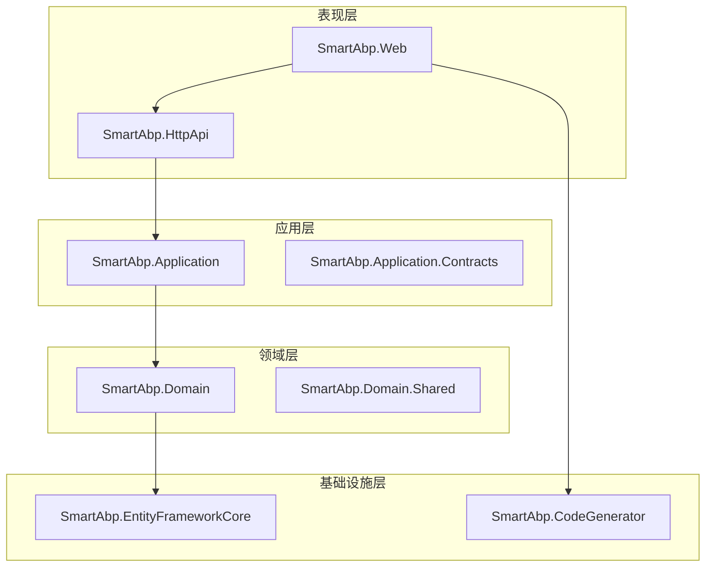
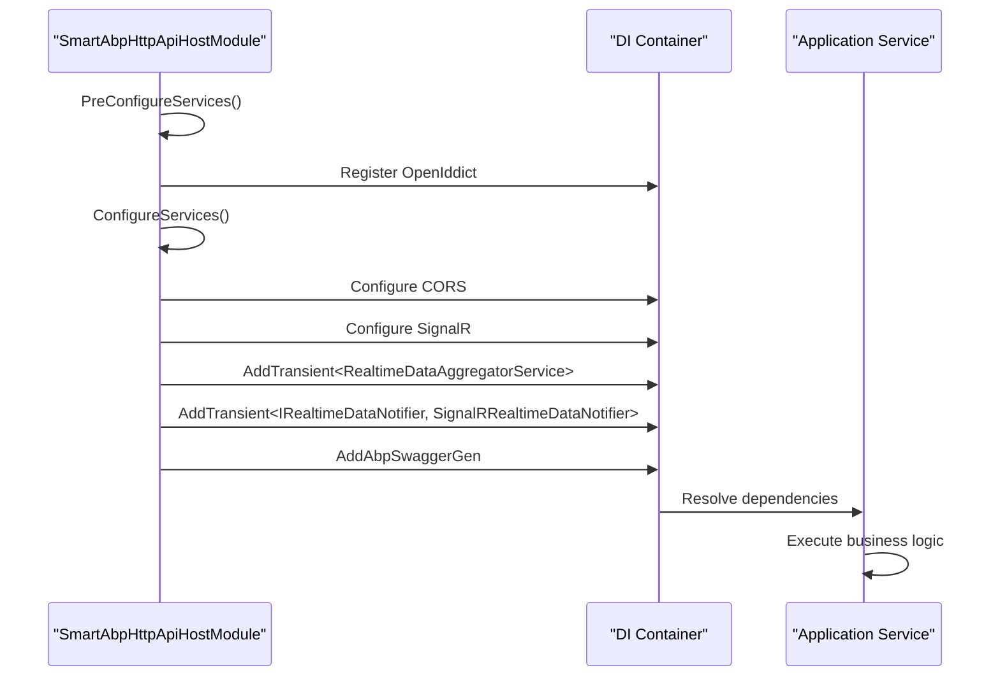
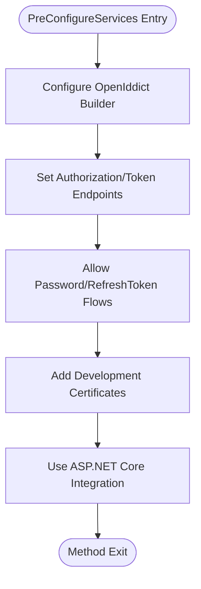
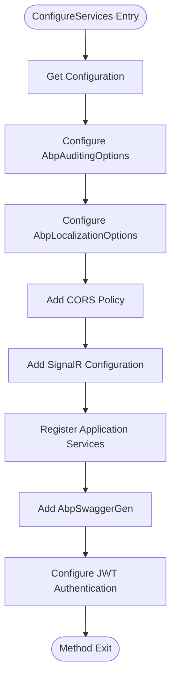
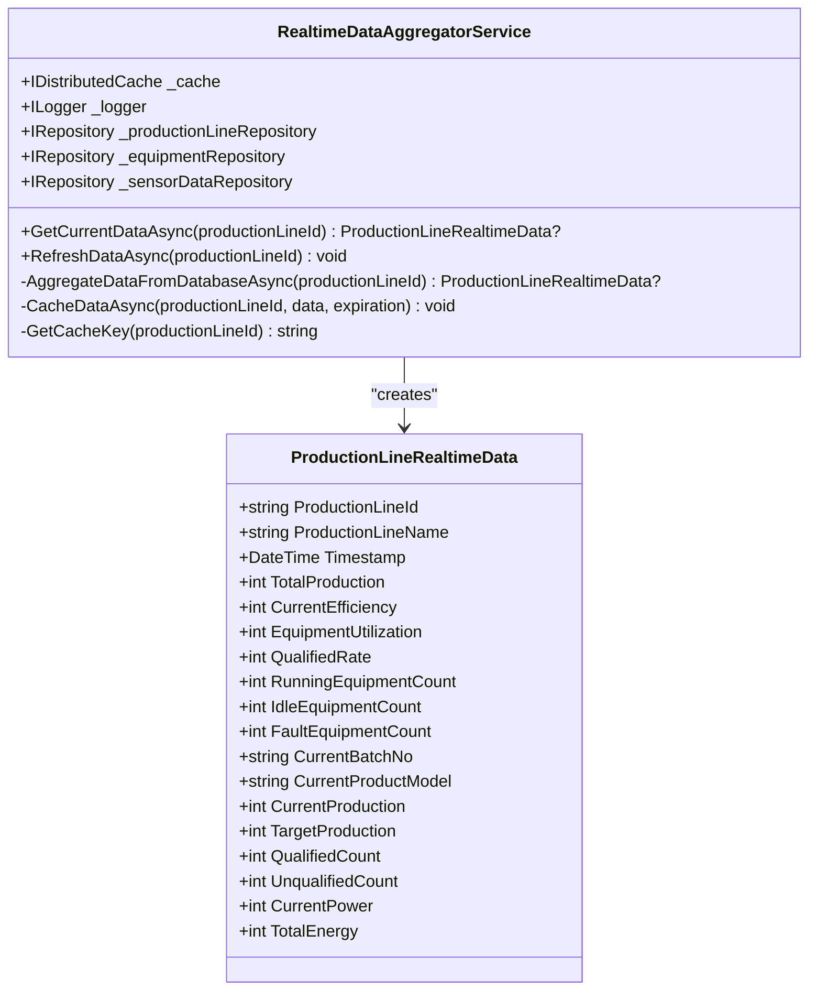
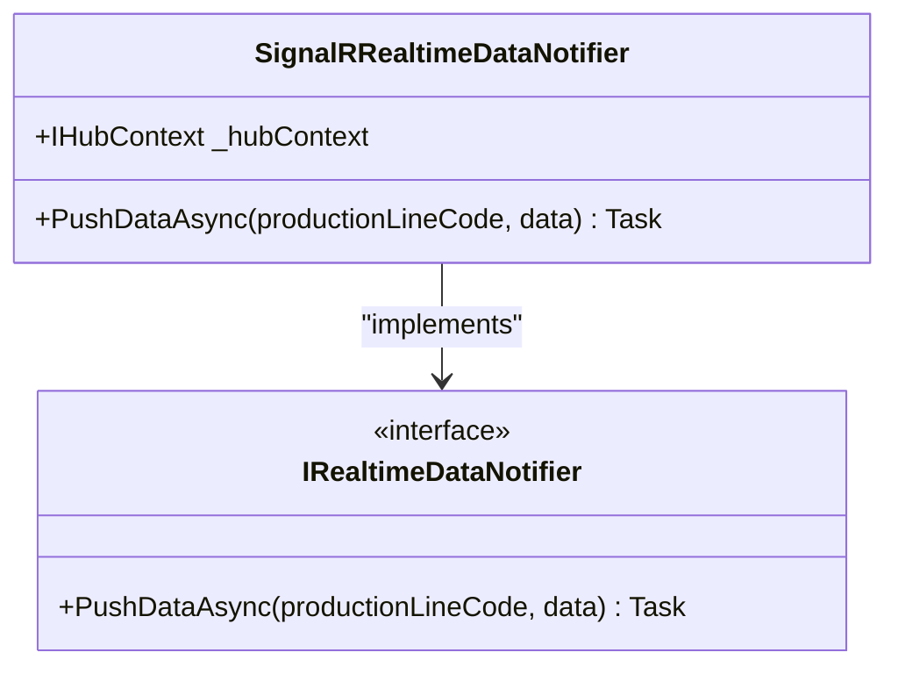
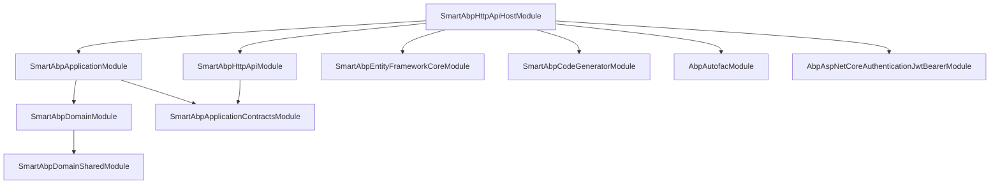

# 服务注册与依赖注入

<cite>
**本文档引用的文件**   
- [SmartAbpHttpApiHostModule.cs](file://src/SmartAbp.Web/SmartAbpHttpApiHostModule.cs)
- [RealtimeDataAggregatorService.cs](file://src/SmartAbp.Application/RealtimeData/RealtimeDataAggregatorService.cs)
- [SignalRRealtimeDataNotifier.cs](file://src/SmartAbp.Web/src/Realtime/SignalRRealtimeDataNotifier.cs)
- [ProductionLineHub.cs](file://src/SmartAbp.Web/Hubs/ProductionLineHub.cs)
- [SmartAbpDomainModule.cs](file://src/SmartAbp.Domain/SmartAbpDomainModule.cs)
- [SmartAbpHttpApiModule.cs](file://src/SmartAbp.HttpApi/SmartAbpHttpApiModule.cs)
- [SmartAbpApplicationModule.cs](file://src/SmartAbp.Application/SmartAbpApplicationModule.cs)
</cite>

## 目录
1. [引言](#引言)
2. [项目结构](#项目结构)
3. [核心组件](#核心组件)
4. [架构概述](#架构概述)
5. [详细组件分析](#详细组件分析)
6. [依赖分析](#依赖分析)
7. [性能考虑](#性能考虑)
8. [故障排除指南](#故障排除指南)
9. [结论](#结论)

## 引言
本文档深入解析hxlot项目中基于ABP框架的服务注册与依赖注入机制，重点分析`SmartAbpHttpApiHostModule`模块的`PreConfigureServices`和`ConfigureServices`方法执行流程。文档详细阐述了ABP模块化框架如何通过依赖注入容器管理服务生命周期，包括服务注册顺序、配置覆盖机制、服务作用域选择依据、冲突解决策略及调试技巧。

## 项目结构
hxlot项目采用分层架构设计，主要包含应用层、领域层、基础设施层和表现层。服务注册与依赖注入的核心逻辑集中在`src`目录下的多个模块中，特别是`SmartAbp.Web`、`SmartAbp.Application`和`SmartAbp.Domain`等模块。



**Diagram sources**
- [SmartAbpHttpApiHostModule.cs](file://src/SmartAbp.Web/SmartAbpHttpApiHostModule.cs#L31-L219)
- [SmartAbpHttpApiModule.cs](file://src/SmartAbp.HttpApi/SmartAbpHttpApiModule.cs#L24-L27)
- [SmartAbpApplicationModule.cs](file://src/SmartAbp.Application/SmartAbpApplicationModule.cs#L28-L34)

**Section sources**
- [SmartAbpHttpApiHostModule.cs](file://src/SmartAbp.Web/SmartAbpHttpApiHostModule.cs#L31-L219)
- [SmartAbpHttpApiModule.cs](file://src/SmartAbp.HttpApi/SmartAbpHttpApiModule.cs#L24-L27)

## 核心组件
本项目的核心组件包括实时数据聚合服务、SignalR实时通知服务和ABP模块化框架的依赖注入容器。这些组件通过`SmartAbpHttpApiHostModule`的`ConfigureServices`方法进行注册和配置，实现了从数据聚合到前端推送的完整链路。

**Section sources**
- [SmartAbpHttpApiHostModule.cs](file://src/SmartAbp.Web/SmartAbpHttpApiHostModule.cs#L47-L172)
- [RealtimeDataAggregatorService.cs](file://src/SmartAbp.Application/RealtimeData/RealtimeDataAggregatorService.cs#L29-L262)
- [SignalRRealtimeDataNotifier.cs](file://src/SmartAbp.Web/src/Realtime/SignalRRealtimeDataNotifier.cs#L12-L26)

## 架构概述
hxlot项目采用ABP模块化架构，通过依赖注入实现松耦合设计。服务注册遵循从`PreConfigureServices`到`ConfigureServices`的执行顺序，确保配置的正确覆盖和初始化。



**Diagram sources**
- [SmartAbpHttpApiHostModule.cs](file://src/SmartAbp.Web/SmartAbpHttpApiHostModule.cs#L47-L172)
- [SmartAbpDomainModule.cs](file://src/SmartAbp.Domain/SmartAbpDomainModule.cs#L44-L75)

## 详细组件分析

### SmartAbpHttpApiHostModule分析
`SmartAbpHttpApiHostModule`是应用的主模块，负责注册所有必要的服务和配置。

#### PreConfigureServices方法
该方法在`ConfigureServices`之前执行，主要用于预配置一些框架级别的服务，如OpenIddict认证服务。



**Diagram sources**
- [SmartAbpDomainModule.cs](file://src/SmartAbp.Domain/SmartAbpDomainModule.cs#L44-L75)

#### ConfigureServices方法
该方法负责注册应用级别的服务和配置。



**Diagram sources**
- [SmartAbpHttpApiHostModule.cs](file://src/SmartAbp.Web/SmartAbpHttpApiHostModule.cs#L47-L172)

**Section sources**
- [SmartAbpHttpApiHostModule.cs](file://src/SmartAbp.Web/SmartAbpHttpApiHostModule.cs#L47-L172)
- [SmartAbpDomainModule.cs](file://src/SmartAbp.Domain/SmartAbpDomainModule.cs#L77-L128)

### 实时数据服务分析
实时数据服务是本项目的核心业务组件，包括数据聚合和通知两个部分。

#### RealtimeDataAggregatorService
该服务负责从多个数据源聚合实时数据并缓存。



**Diagram sources**
- [RealtimeDataAggregatorService.cs](file://src/SmartAbp.Application/RealtimeData/RealtimeDataAggregatorService.cs#L29-L262)

#### SignalRRealtimeDataNotifier
该服务负责通过SignalR将实时数据推送到前端客户端。



**Diagram sources**
- [SignalRRealtimeDataNotifier.cs](file://src/SmartAbp.Web/src/Realtime/SignalRRealtimeDataNotifier.cs#L12-L26)

**Section sources**
- [RealtimeDataAggregatorService.cs](file://src/SmartAbp.Application/RealtimeData/RealtimeDataAggregatorService.cs#L29-L262)
- [SignalRRealtimeDataNotifier.cs](file://src/SmartAbp.Web/src/Realtime/SignalRRealtimeDataNotifier.cs#L12-L26)

## 依赖分析
项目中的模块依赖关系清晰，遵循ABP框架的模块化设计原则。



**Diagram sources**
- [SmartAbpHttpApiHostModule.cs](file://src/SmartAbp.Web/SmartAbpHttpApiHostModule.cs#L31-L219)
- [SmartAbpApplicationModule.cs](file://src/SmartAbp.Application/SmartAbpApplicationModule.cs#L28-L34)
- [SmartAbpHttpApiModule.cs](file://src/SmartAbp.HttpApi/SmartAbpHttpApiModule.cs#L24-L27)

**Section sources**
- [SmartAbpHttpApiHostModule.cs](file://src/SmartAbp.Web/SmartAbpHttpApiHostModule.cs#L31-L219)
- [SmartAbpApplicationModule.cs](file://src/SmartAbp.Application/SmartAbpApplicationModule.cs#L28-L34)

## 性能考虑
在服务注册和依赖注入过程中，需要考虑以下性能因素：
- 使用`AddTransient`注册服务时，每次请求都会创建新实例，可能影响性能
- `IDistributedCache`的使用可以显著提高实时数据查询性能
- SignalR配置中的`ClientTimeoutInterval`和`KeepAliveInterval`需要根据实际网络状况调整
- Swagger文档生成时扫描XML注释可能影响启动性能

## 故障排除指南
### 服务注册冲突解决
当出现服务注册冲突时，可以使用`Replace`方法替换已注册的服务：
```csharp
context.Services.Replace(ServiceDescriptor.Singleton<IEmailSender, NullEmailSender>());
```

### 依赖注入调试技巧
1. 在开发环境中启用详细日志记录
2. 使用`TryAddSingleton`等方法避免重复注册
3. 通过`GetRequiredService`获取服务实例进行验证
4. 利用ABP框架的模块依赖关系进行问题定位

**Section sources**
- [SmartAbpDomainModule.cs](file://src/SmartAbp.Domain/SmartAbpDomainModule.cs#L77-L128)
- [SmartAbpDevKitCoreModule.cs](file://src/SmartAbp.DevKit.Core/SmartAbpDevKitCoreModule.cs#L47-L208)

## 结论
hxlot项目通过ABP框架的模块化设计和依赖注入机制，实现了高度可维护和可扩展的架构。`SmartAbpHttpApiHostModule`作为主模块，通过`PreConfigureServices`和`ConfigureServices`方法有序地注册和配置了所有必要的服务。实时数据服务的设计体现了良好的分层架构和依赖注入实践，为数字大屏等实时应用场景提供了可靠的技术支持。