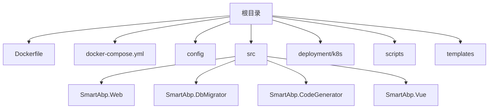
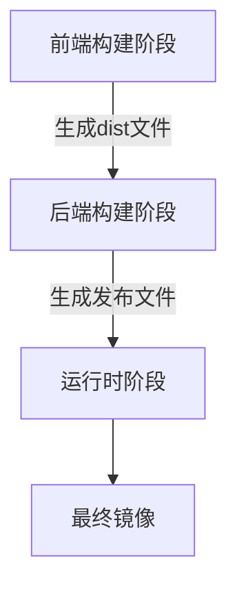
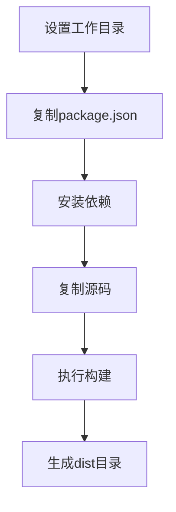
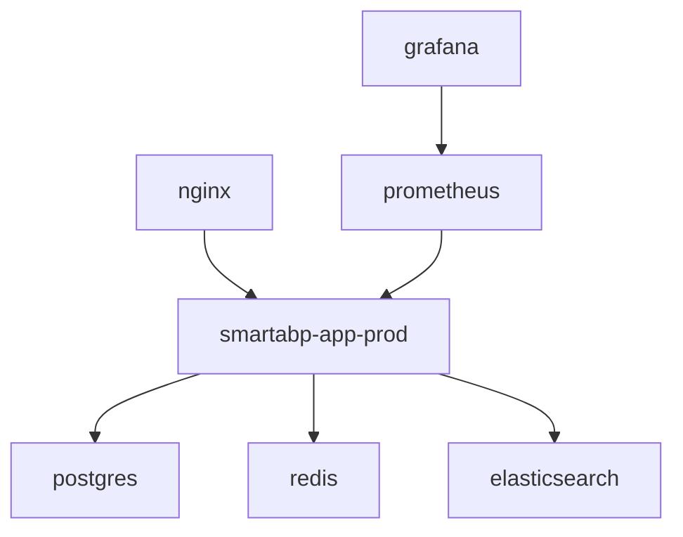

# 容器化构建

<cite>
**本文档引用的文件**
- [Dockerfile](file://Dockerfile)
- [docker-compose.yml](file://docker-compose.yml)
- [docker-compose.production.yml](file://docker-compose.production.yml)
- [docker-compose.dev.yml](file://docker-compose.dev.yml)
- [Dockerfile.production](file://Dockerfile.production)
- [src/SmartAbp.Web/Dockerfile](file://src/SmartAbp.Web/Dockerfile)
- [src/SmartAbp.DbMigrator/Dockerfile](file://src/SmartAbp.DbMigrator/Dockerfile)
- [src/SmartAbp.Vue/package.json](file://src/SmartAbp.Vue/package.json)
- [src/SmartAbp.Web/SmartAbp.Web.csproj](file://src/SmartAbp.Web/SmartAbp.Web.csproj)
- [src/SmartAbp.DbMigrator/SmartAbp.DbMigrator.csproj](file://src/SmartAbp.DbMigrator/SmartAbp.DbMigrator.csproj)
- [src/SmartAbp.CodeGenerator/SmartAbp.CodeGenerator.csproj](file://src/SmartAbp.CodeGenerator/SmartAbp.CodeGenerator.csproj)
</cite>

## 目录
1. [项目结构](#项目结构)
2. [多阶段构建策略](#多阶段构建策略)
3. [.NET应用发布优化](#net应用发布优化)
4. [前端静态资源构建](#前端静态资源构建)
5. [镜像分层与缓存机制](#镜像分层与缓存机制)
6. [Docker Compose配置](#docker-compose配置)
7. [安全构建指南](#安全构建指南)

## 项目结构

本项目采用微服务架构，包含多个核心组件，通过Docker和Kubernetes进行容器化部署。项目结构清晰地分离了前端、后端、数据库和监控组件，支持开发、测试和生产环境的独立配置。



**图示来源**
- [Dockerfile](file://Dockerfile)
- [docker-compose.yml](file://docker-compose.yml)
- [src/SmartAbp.Web/SmartAbp.Web.csproj](file://src/SmartAbp.Web/SmartAbp.Web.csproj)

**本节来源**
- [Dockerfile](file://Dockerfile)
- [docker-compose.yml](file://docker-compose.yml)
- [src/SmartAbp.Web/SmartAbp.Web.csproj](file://src/SmartAbp.Web/SmartAbp.Web.csproj)

## 多阶段构建策略

项目采用多阶段Docker构建策略，将构建过程分为前端构建、后端构建和运行时三个阶段，有效减小最终镜像体积并提高构建效率。

### 构建阶段分离

构建过程分为三个独立阶段：

1. **前端构建阶段**：使用Node.js环境构建Vue前端应用
2. **后端构建阶段**：使用.NET SDK环境编译和发布后端应用
3. **运行时阶段**：使用轻量级ASP.NET运行时镜像部署应用



**图示来源**
- [Dockerfile](file://Dockerfile)

**本节来源**
- [Dockerfile](file://Dockerfile)

## .NET应用发布优化

### 发布命令优化

项目采用优化的.NET发布命令，确保生成高效、精简的发布包：

```bash
dotnet publish src/SmartAbp.Web/SmartAbp.Web.csproj \
    -c Release \
    --no-build \
    -o /app/publish
```

该命令具有以下优势：
- `-c Release`：使用发布配置，启用优化编译
- `--no-build`：跳过构建步骤，因为已预先构建
- 指定输出目录，便于后续COPY操作

### 运行时镜像选择

项目采用`mcr.microsoft.com/dotnet/aspnet:8.0`作为基础运行时镜像，相比SDK镜像具有以下优势：
- 更小的镜像体积（约200MB vs 700MB）
- 减少攻击面，不包含编译工具
- 专为生产环境优化

对于特定服务，项目还使用.NET 9.0运行时镜像，确保使用最新版本的性能和安全特性。

**本节来源**
- [Dockerfile](file://Dockerfile)
- [src/SmartAbp.Web/Dockerfile](file://src/SmartAbp.Web/Dockerfile)
- [src/SmartAbp.DbMigrator/Dockerfile](file://src/SmartAbp.DbMigrator/Dockerfile)

## 前端静态资源构建

### 构建流程

前端构建流程经过精心设计，确保高效和可靠性：

1. 使用Alpine Linux基础镜像，减小镜像体积
2. 先复制依赖文件并安装，利用Docker缓存机制
3. 复制源码并执行构建命令



**图示来源**
- [Dockerfile](file://Dockerfile)

### COPY指令最佳实践

在COPY指令使用上遵循以下最佳实践：

- **分层COPY**：先复制依赖文件，再复制源码，最大化利用缓存
- **精确路径**：只复制必要的文件，避免不必要的文件进入镜像
- **权限管理**：设置适当的文件权限和所有者

```dockerfile
# 复制前端依赖文件
COPY src/SmartAbp.Vue/package*.json ./
COPY src/SmartAbp.Vue/pnpm-lock.yaml ./

# 安装依赖
RUN npm install -g pnpm && \
    pnpm install --frozen-lockfile --production=false

# 复制前端源码
COPY src/SmartAbp.Vue/ ./
```

**本节来源**
- [Dockerfile](file://Dockerfile)
- [src/SmartAbp.Vue/package.json](file://src/SmartAbp.Vue/package.json)

## 镜像分层与缓存机制

### 分层策略

项目采用精细化的镜像分层策略，优化构建速度和镜像大小：

1. **基础层**：Node.js和.NET SDK镜像
2. **依赖层**：应用依赖（npm包、NuGet包）
3. **代码层**：应用源码
4. **配置层**：环境配置文件
5. **运行时层**：最终运行时镜像

这种分层策略确保：
- 依赖变更时只需重建依赖层和上层
- 代码变更时只需重建代码层和上层
- 配置变更时只需重建配置层和上层

### 缓存优化

通过以下方式优化构建缓存：

- **依赖前置**：将依赖安装步骤放在代码复制之前
- **精确COPY**：只复制必要的文件，避免缓存失效
- **多阶段构建**：分离构建环境和运行环境，减少最终镜像大小


**图示来源**
- [Dockerfile](file://Dockerfile)

**本节来源**
- [Dockerfile](file://Dockerfile)

## Docker Compose配置

### 环境配置

项目提供多个Docker Compose配置文件，支持不同环境：

- `docker-compose.yml`：通用配置
- `docker-compose.dev.yml`：开发环境配置
- `docker-compose.production.yml`：生产环境配置

### 服务编排

生产环境配置包含完整的微服务架构：



**图示来源**
- [docker-compose.production.yml](file://docker-compose.production.yml)

### 资源限制

生产环境配置中设置了详细的资源限制：

- **CPU限制**：设置硬限制和保留值
- **内存限制**：防止内存溢出
- **副本数**：设置服务副本数提高可用性

这些配置确保服务在生产环境中稳定运行，避免资源争用。

**本节来源**
- [docker-compose.yml](file://docker-compose.yml)
- [docker-compose.dev.yml](file://docker-compose.dev.yml)
- [docker-compose.production.yml](file://docker-compose.production.yml)

## 安全构建指南

### 用户权限

遵循最小权限原则，创建专用应用用户：

```dockerfile
# 创建应用用户
RUN useradd -m -s /bin/bash smartabp

# 设置文件权限
RUN chown -R smartabp:smartabp /app

# 切换到应用用户
USER smartabp
```

### 环境变量

敏感信息通过环境变量注入，避免硬编码：

- 数据库密码
- Redis密码
- JWT密钥
- Elasticsearch密码

### 健康检查

配置完善的健康检查机制：

```dockerfile
HEALTHCHECK --interval=30s --timeout=3s --start-period=5s --retries=3 \
    CMD curl -f http://localhost/health || exit 1
```

健康检查确保：
- 服务启动后才接收流量
- 故障时能及时发现并重启
- 提高系统整体可靠性

### 网络安全

通过网络配置实现服务隔离：

- 使用自定义bridge网络
- 设置专用子网
- 仅暴露必要端口

**本节来源**
- [Dockerfile](file://Dockerfile)
- [docker-compose.production.yml](file://docker-compose.production.yml)