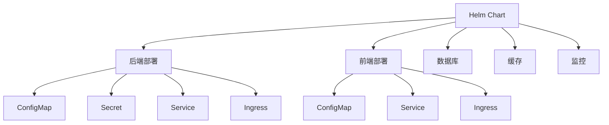
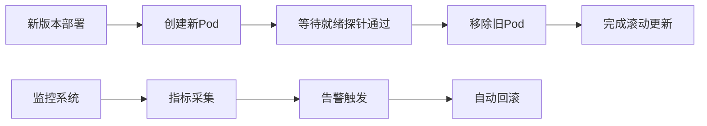
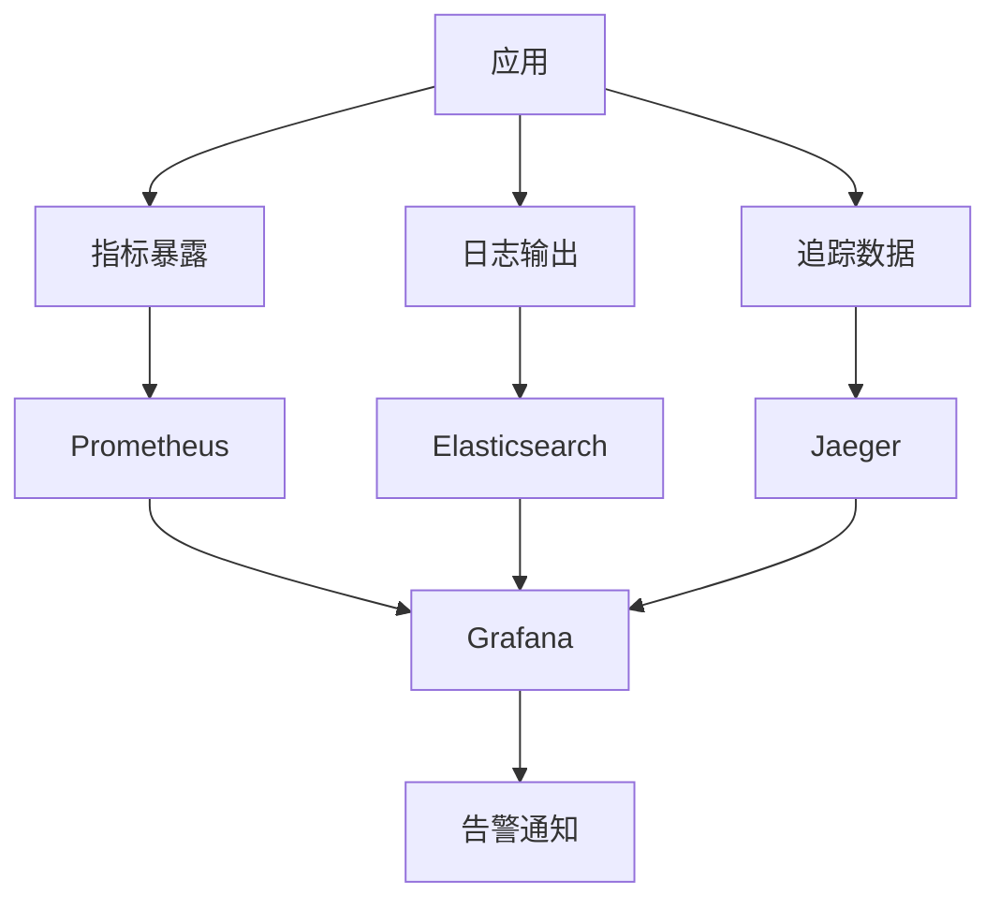

# 容器化部署

<cite>
**本文档引用的文件**  
- [Dockerfile](file://Dockerfile)
- [docker-compose.yml](file://docker-compose.yml)
- [docker-compose.production.yml](file://docker-compose.production.yml)
- [deployment/k8s/helm/smartabp/Chart.yaml](file://deployment/k8s/helm/smartabp/Chart.yaml)
- [deployment/k8s/helm/smartabp/values.yaml](file://deployment/k8s/helm/smartabp/values.yaml)
- [deployment/k8s/helm/smartabp/templates/backend/deployment.yaml](file://deployment/k8s/helm/smartabp/templates/backend/deployment.yaml)
- [deployment/k8s/helm/smartabp/templates/frontend/deployment.yaml](file://deployment/k8s/helm/smartabp/templates/frontend/deployment.yaml)
- [deployment/k8s/helm/smartabp/templates/backend/configmap.yaml](file://deployment/k8s/helm/smartabp/templates/backend/configmap.yaml)
- [deployment/k8s/helm/smartabp/templates/backend/secret.yaml](file://deployment/k8s/helm/smartabp/templates/backend/secret.yaml)
- [deployment/k8s/helm/smartabp/templates/networkpolicy.yaml](file://deployment/k8s/helm/smartabp/templates/networkpolicy.yaml)
- [deployment/k8s/production/deployment.yaml](file://deployment/k8s/production/deployment.yaml)
</cite>

## 目录
1. [Docker多阶段构建与镜像优化](#docker多阶段构建与镜像优化)
2. [Docker Compose服务编排](#docker-compose服务编排)
3. [Kubernetes Helm Chart详解](#kubernetes-helm-chart详解)
4. [生产环境部署策略](#生产环境部署策略)
5. [容器安全与监控](#容器安全与监控)

## Docker多阶段构建与镜像优化

hxlot项目采用多阶段Docker构建策略，通过三个构建阶段实现镜像优化。第一阶段使用`node:18-alpine`镜像构建前端Vue应用，通过pnpm安装依赖并执行构建。第二阶段使用`.NET SDK 8.0`镜像编译后端应用，执行依赖还原、构建和发布操作。最终阶段使用轻量级的`mcr.microsoft.com/dotnet/aspnet:8.0`运行时镜像，仅包含发布后的应用文件和前端静态资源，显著减小镜像体积。

构建过程中实施了多项优化措施：使用Alpine Linux基础镜像减少体积，通过`--from`参数精确复制所需文件，创建专用的`smartabp`用户增强安全性，设置适当的文件权限。镜像通过`HEALTHCHECK`指令配置健康检查，每30秒检查一次应用健康状态，确保容器运行正常。

**本节来源**
- [Dockerfile](file://Dockerfile#L1-L80)

## Docker Compose服务编排

项目提供多个Docker Compose配置文件，包括通用配置`docker-compose.yml`和生产专用配置`docker-compose.production.yml`。服务编排包含SmartAbp应用、SQL Server/PostgreSQL数据库、Redis缓存、Elasticsearch搜索引擎、Nginx反向代理以及Prometheus/Grafana监控套件。

在生产配置中，使用环境变量实现配置外部化，通过`${VAR_NAME:?错误信息}`语法确保关键配置不为空。各服务配置了健康检查，确保依赖服务就绪后再启动应用。资源限制通过`deploy.resources`设置，为不同服务分配适当的CPU和内存资源。网络配置使用自定义的`smartabp-network`桥接网络，确保服务间安全通信。

数据持久化通过命名卷实现，包括数据库、日志、上传文件等重要数据。Nginx配置了SSL终止和HTTP到HTTPS重定向，增强安全性。监控系统集成Prometheus指标采集和Grafana可视化，提供全面的系统监控能力。

**本节来源**
- [docker-compose.yml](file://docker-compose.yml#L1-L176)
- [docker-compose.production.yml](file://docker-compose.production.yml#L1-L306)

## Kubernetes Helm Chart详解

Helm Chart提供企业级Kubernetes部署能力，位于`deployment/k8s/helm/smartabp`目录。Chart结构包含模板文件、值配置和元数据，支持前端、后端、数据库、缓存等组件的完整部署。

### 模板结构

Helm模板采用组件化设计，包含后端、前端、监控、网络策略等独立模板。后端部署模板配置了init容器用于数据库迁移，确保应用启动前完成数据库初始化。前端部署模板通过ConfigMap注入环境变量，实现配置管理。

**图表来源**
- [deployment/k8s/helm/smartabp/Chart.yaml](file://deployment/k8s/helm/smartabp/Chart.yaml#L1-L48)
- [deployment/k8s/helm/smartabp/templates/backend/deployment.yaml](file://deployment/k8s/helm/smartabp/templates/backend/deployment.yaml#L1-L182)

### values.yaml配置

`values.yaml`文件提供全面的配置选项，分为全局设置、前端、后端、数据库、缓存、监控等多个部分。资源配置为前端设置500m CPU和512Mi内存限制，后端设置1000m CPU和2Gi内存限制。自动伸缩配置根据CPU和内存使用率动态调整副本数量。

安全配置遵循最小权限原则，设置`runAsNonRoot: true`和非特权用户运行。网络策略限制服务间通信，仅允许必要的流量。健康检查配置了不同的初始延迟和检查周期，适应不同组件的启动特性。Ingress配置支持TLS终止和自动证书管理，确保安全访问。

**本节来源**
- [deployment/k8s/helm/smartabp/values.yaml](file://deployment/k8s/helm/smartabp/values.yaml#L1-L473)

## 生产环境部署策略

生产环境部署采用多层次策略确保系统稳定性和可用性。资源限制根据组件需求精确配置，避免资源争用。健康检查分为存活探针和就绪探针，存活探针检测应用是否运行，就绪探针检测应用是否准备好接收流量。

滚动更新策略通过`maxSurge: 1`和`maxUnavailable: 0`配置实现零停机更新，确保更新过程中始终有足够的副本处理请求。Pod反亲和性配置确保同一应用的Pod分布在不同节点，提高可用性。优雅终止设置60秒的终止宽限期，允许应用完成正在进行的请求。

**图表来源**
- [deployment/k8s/production/deployment.yaml](file://deployment/k8s/production/deployment.yaml#L1-L240)

**本节来源**
- [deployment/k8s/production/deployment.yaml](file://deployment/k8s/production/deployment.yaml#L1-L240)

## 容器安全与监控

### 安全加固

容器安全采用纵深防御策略。镜像构建阶段创建专用用户，避免以root权限运行。Helm Chart配置安全上下文，禁止特权升级和只读根文件系统。网络策略限制服务间通信，仅允许必要的端口和协议。敏感配置通过Secret管理，避免明文存储。

Pod安全标准遵循restricted策略，限制容器能力。RBAC配置最小权限角色，仅授予必要的Kubernetes API访问权限。定期备份策略确保数据安全，数据库每日备份保留7天，应用每周备份保留4周。

### 监控集成

监控系统集成Prometheus、Grafana和OpenTelemetry。ServiceMonitor资源自动发现应用指标端点，采集性能数据。Grafana仪表板提供可视化监控，支持自定义告警规则。应用内嵌健康检查端点，支持UI展示和外部监控集成。

日志系统采用结构化日志，支持Elasticsearch聚合和分析。告警系统支持Slack和邮件通知，及时发现和响应问题。性能监控配置了详细的指标采集，包括请求延迟、错误率、资源使用率等关键指标。

**图表来源**
- [deployment/k8s/helm/smartabp/templates/monitoring/servicemonitor.yaml](file://deployment/k8s/helm/smartabp/templates/monitoring/servicemonitor.yaml#L1-L66)
- [deployment/k8s/helm/smartabp/templates/backend/configmap.yaml](file://deployment/k8s/helm/smartabp/templates/backend/configmap.yaml#L1-L173)

**本节来源**
- [deployment/k8s/helm/smartabp/templates/backend/configmap.yaml](file://deployment/k8s/helm/smartabp/templates/backend/configmap.yaml#L1-L173)
- [deployment/k8s/helm/smartabp/templates/backend/secret.yaml](file://deployment/k8s/helm/smartabp/templates/backend/secret.yaml#L1-L50)
- [deployment/k8s/helm/smartabp/templates/networkpolicy.yaml](file://deployment/k8s/helm/smartabp/templates/networkpolicy.yaml#L1-L215)