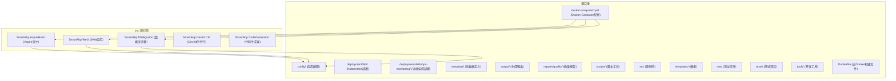
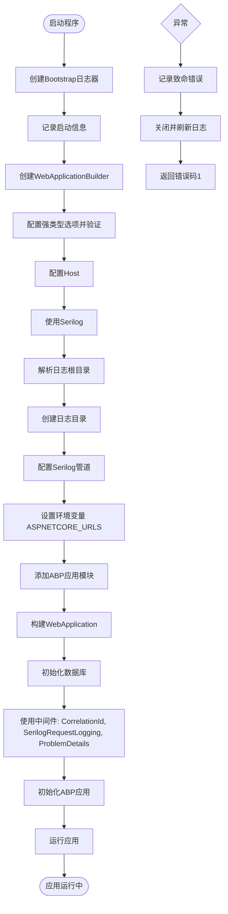
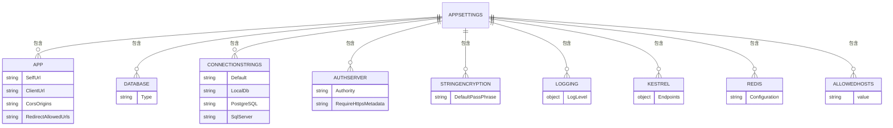
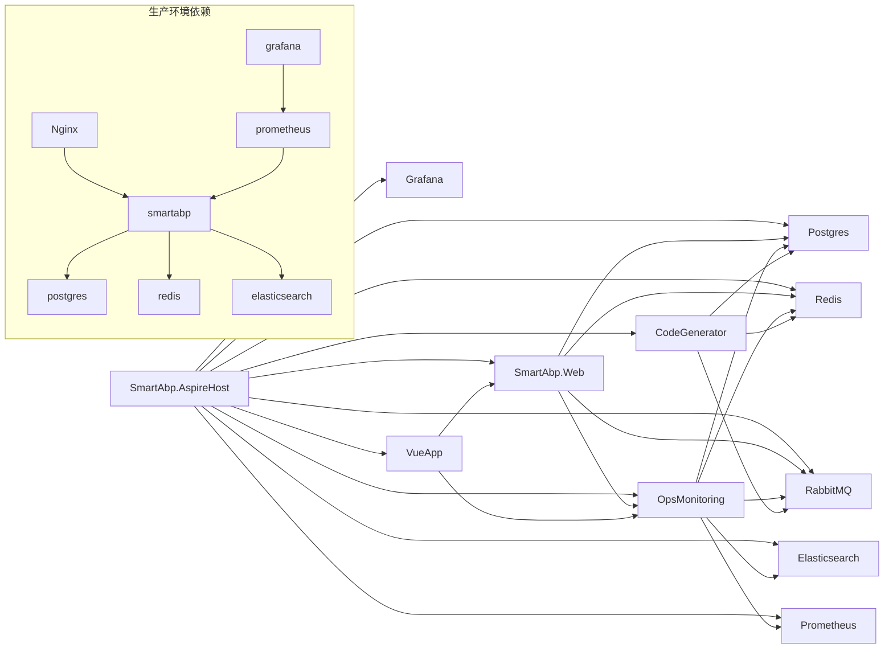

# 宿主环境

<cite>
**本文档中引用的文件**  
- [Program.cs](file://src/SmartAbp.AspireHost/Program.cs)
- [appsettings.json](file://src/SmartAbp.AspireHost/appsettings.json)
- [appsettings.Development.json](file://src/SmartAbp.AspireHost/appsettings.Development.json)
- [Program.cs](file://src/SmartAbp.Web/Program.cs)
- [appsettings.json](file://src/SmartAbp.Web/appsettings.json)
- [Dockerfile](file://Dockerfile)
- [docker-compose.yml](file://docker-compose.yml)
- [docker-compose.production.yml](file://docker-compose.production.yml)
</cite>

## 目录
1. [引言](#引言)
2. [项目结构](#项目结构)
3. [核心组件](#核心组件)
4. [架构概述](#架构概述)
5. [详细组件分析](#详细组件分析)
6. [依赖分析](#依赖分析)
7. [性能考虑](#性能考虑)
8. [故障排除指南](#故障排除指南)
9. [结论](#结论)

## 引言
hxlot项目是一个基于Aspire架构的企业级低代码平台，采用微服务架构和容器化部署。本文档深入解析其宿主环境的配置、启动流程、模块集成、应用配置及容器化部署方案，重点阐述Web宿主应用的启动流程、服务注册、中间件配置以及生产环境下的性能监控与日志记录策略。

## 项目结构
hxlot项目采用分层和模块化的目录结构，清晰地分离了前端、后端、配置、部署和测试等不同职责的组件。



**Diagram sources**
- [src/SmartAbp.AspireHost](file://src/SmartAbp.AspireHost)
- [src/SmartAbp.Web](file://src/SmartAbp.Web)
- [src/SmartAbp.DbMigrator](file://src/SmartAbp.DbMigrator)
- [docker-compose.yml](file://docker-compose.yml)

**Section sources**
- [src](file://src)
- [config](file://config)
- [docker-compose.yml](file://docker-compose.yml)

## 核心组件
hxlot项目的核心宿主组件包括`SmartAbp.AspireHost`和`SmartAbp.Web`。`SmartAbp.AspireHost`作为Aspire分布式应用的入口，负责协调和启动所有微服务及基础设施。`SmartAbp.Web`是主Web应用，承载核心业务逻辑和API。

**Section sources**
- [src/SmartAbp.AspireHost](file://src/SmartAbp.AspireHost)
- [src/SmartAbp.Web](file://src/SmartAbp.Web)

## 架构概述
hxlot项目采用现代化的微服务架构，结合Aspire、Docker和Kubernetes技术，实现了开发、测试和生产环境的一致性。

```mermaid
graph TD
subgraph "本地开发 (Aspire)"
AspireHost["SmartAbp.AspireHost"]
subgraph "基础设施"
Postgres["PostgreSQL"]
Redis["Redis"]
RabbitMQ["RabbitMQ"]
Elasticsearch["Elasticsearch"]
Prometheus["Prometheus"]
Grafana["Grafana"]
end
subgraph "微服务"
WebApp["SmartAbp.Web"]
OpsMonitoring["OpsMonitoring"]
CodeGenerator["CodeGenerator"]
end
subgraph "前端"
VueApp["Vue前端 (9001)"]
end
AspireHost --> Postgres
AspireHost --> Redis
AspireHost --> RabbitMQ
AspireHost --> Elasticsearch
AspireHost --> Prometheus
AspireHost --> Grafana
AspireHost --> WebApp
AspireHost --> OpsMonitoring
AspireHost --> CodeGenerator
AspireHost --> VueApp
WebApp --> Postgres
WebApp --> Redis
WebApp --> RabbitMQ
WebApp --> OpsMonitoring
CodeGenerator --> Postgres
CodeGenerator --> Redis
CodeGenerator --> RabbitMQ
VueApp --> WebApp
VueApp --> OpsMonitoring
end
subgraph "生产环境 (Docker Compose)"
Nginx["Nginx (80/443)"]
SmartAbp["SmartAbp App (5000)"]
PostgresProd["PostgreSQL"]
RedisProd["Redis"]
ElasticsearchProd["Elasticsearch"]
PrometheusProd["Prometheus"]
GrafanaProd["Grafana"]
Nginx --> SmartAbp
SmartAbp --> PostgresProd
SmartAbp --> RedisProd
SmartAbp --> ElasticsearchProd
PrometheusProd --> SmartAbp
GrafanaProd --> PrometheusProd
end
```



**Diagram sources**
- [src/SmartAbp.AspireHost/Program.cs](file://src/SmartAbp.AspireHost/Program.cs)
- [docker-compose.production.yml](file://docker-compose.production.yml)

## 详细组件分析

### Web宿主应用启动流程分析
`SmartAbp.Web`项目的`Program.cs`文件定义了应用的启动流程，遵循了典型的ASP.NET Core应用模式，并集成了Serilog日志、Autofac依赖注入和ABP框架。



**Diagram sources**
- [src/SmartAbp.Web/Program.cs](file://src/SmartAbp.Web/Program.cs#L1-L142)

**Section sources**
- [src/SmartAbp.Web/Program.cs](file://src/SmartAbp.Web/Program.cs#L1-L142)

### Aspire宿主应用配置分析
`SmartAbp.AspireHost`项目的`Program.cs`文件是整个分布式应用的蓝图，它使用Aspire的API来声明式地定义和配置所有服务和基础设施。

```mermaid
classDiagram
class DistributedApplicationBuilder
class IResourceBuilder~T~
class DaprSidecarOptions
class DaprExtensions
class DaprSidecarAnnotation
DistributedApplicationBuilder --> IResourceBuilder~T~ : "创建"
IResourceBuilder~T~ --> DaprExtensions : "调用扩展方法"
DaprExtensions --> DaprSidecarOptions : "使用配置"
DaprExtensions --> DaprSidecarAnnotation : "创建注解"
DaprSidecarAnnotation --> DaprSidecarOptions : "持有"
class "Postgres" <<Resource>>
class "Redis" <<Resource>>
class "RabbitMQ" <<Resource>>
class "Elasticsearch" <<Resource>>
class "Prometheus" <<Resource>>
class "Grafana" <<Resource>>
class "SmartAbp_Web" <<Project>>
class "SmartAbp_OpsManagement_Host" <<Project>>
class "SmartAbp_CodeGenerator" <<Project>>
class "VueApp" <<NpmApp>>
DistributedApplicationBuilder --> Postgres : "AddPostgres"
DistributedApplicationBuilder --> Redis : "AddRedis"
DistributedApplicationBuilder --> RabbitMQ : "AddRabbitMQ"
DistributedApplicationBuilder --> Elasticsearch : "AddElasticsearch"
DistributedApplicationBuilder --> Prometheus : "AddContainer"
DistributedApplicationBuilder --> Grafana : "AddContainer"
DistributedApplicationBuilder --> SmartAbp_Web : "AddProject"
DistributedApplicationBuilder --> SmartAbp_OpsManagement_Host : "AddProject"
DistributedApplicationBuilder --> SmartAbp_CodeGenerator : "AddProject"
DistributedApplicationBuilder --> VueApp : "AddNpmApp"
SmartAbp_Web --> Postgres : "WithReference"
SmartAbp_Web --> Redis : "WithReference"
SmartAbp_Web --> RabbitMQ : "WithReference"
SmartAbp_Web --> SmartAbp_OpsManagement_Host : "WithReference"
SmartAbp_OpsManagement_Host --> Postgres : "WithReference"
SmartAbp_OpsManagement_Host --> Redis : "WithReference"
SmartAbp_OpsManagement_Host --> RabbitMQ : "WithReference"
SmartAbp_OpsManagement_Host --> Elasticsearch : "WithReference"
SmartAbp_OpsManagement_Host --> Prometheus : "WithReference"
SmartAbp_CodeGenerator --> Postgres : "WithReference"
SmartAbp_CodeGenerator --> Redis : "WithReference"
SmartAbp_CodeGenerator --> RabbitMQ : "WithReference"
VueApp --> SmartAbp_Web : "WithReference"
VueApp --> SmartAbp_OpsManagement_Host : "WithReference"
SmartAbp_Web --> DaprSidecarAnnotation : "WithDaprSidecar"
SmartAbp_OpsManagement_Host --> DaprSidecarAnnotation : "WithDaprSidecar"
SmartAbp_CodeGenerator --> DaprSidecarAnnotation : "WithDaprSidecar"
```

**Diagram sources**
- [src/SmartAbp.AspireHost/Program.cs](file://src/SmartAbp.AspireHost/Program.cs#L1-L187)

**Section sources**
- [src/SmartAbp.AspireHost/Program.cs](file://src/SmartAbp.AspireHost/Program.cs#L1-L187)

### 应用配置结构分析
应用配置通过`appsettings.json`文件进行管理，支持环境特定的配置覆盖。



**Diagram sources**
- [src/SmartAbp.Web/appsettings.json](file://src/SmartAbp.Web/appsettings.json#L1-L43)

**Section sources**
- [src/SmartAbp.Web/appsettings.json](file://src/SmartAbp.Web/appsettings.json#L1-L43)

## 依赖分析
项目通过Aspire和Docker Compose管理复杂的依赖关系，确保服务间的正确启动顺序和网络通信。



**Diagram sources**
- [src/SmartAbp.AspireHost/Program.cs](file://src/SmartAbp.AspireHost/Program.cs)
- [docker-compose.production.yml](file://docker-compose.production.yml)

**Section sources**
- [src/SmartAbp.AspireHost/Program.cs](file://src/SmartAbp.AspireHost/Program.cs)
- [docker-compose.production.yml](file://docker-compose.production.yml)

## 性能考虑
宿主环境在性能方面进行了多方面的优化和配置。

### 容器化部署配置要点
生产环境的`docker-compose.production.yml`文件定义了关键的容器化配置。

- **端口映射**:
  - `smartabp` 服务将内部端口 `5000` 映射到主机端口 `${APP_PORT:-5000}`。
  - `nginx` 服务将标准HTTP/HTTPS端口 `80` 和 `443` 暴露给外部。
  - `postgres`、`redis`、`elasticsearch` 等基础设施服务也映射了各自的默认端口。

- **环境变量**:
  - 使用 `${VAR_NAME:-default}` 语法提供默认值，并通过 `:?` 语法强制要求某些关键变量（如 `DB_PASSWORD`, `REDIS_PASSWORD`）必须提供。
  - 数据库连接字符串、Redis配置、JWT密钥等敏感信息通过环境变量注入，避免硬编码。

- **依赖服务**:
  - `smartabp` 服务通过 `depends_on` 明确依赖 `postgres` 和 `redis`，并使用 `condition: service_healthy` 确保在依赖服务健康后才启动。
  - `nginx` 依赖 `smartabp` 服务。
  - `grafana` 依赖 `prometheus` 服务。

- **资源限制**:
  - 为每个服务配置了CPU和内存的 `limits` 和 `reservations`，防止资源耗尽。
  - 例如，`smartabp` 服务限制最多使用2个CPU核心和2GB内存。

- **健康检查**:
  - 为 `postgres`, `redis`, `smartabp`, `nginx` 等关键服务配置了 `healthcheck`，Docker会根据健康状态自动重启不健康的容器。

- **数据持久化**:
  - 使用命名数据卷（如 `postgres_data`, `redis_data`, `smartabp_logs`）来持久化数据库、缓存和日志数据，确保容器重启后数据不丢失。

**Section sources**
- [docker-compose.production.yml](file://docker-compose.production.yml#L1-L306)

### 性能监控和日志记录配置指南
宿主环境集成了全面的监控和日志解决方案。

- **日志记录 (Serilog)**:
  - 在 `SmartAbp.Web` 的 `Program.cs` 中配置了Serilog。
  - 日志分为多个文件：`app.log.json` (信息及以上), `warn.log.json` (警告), `error.log.json` (错误), `requests.log.json` (请求日志)。
  - 日志文件按天滚动，限制保留天数和单个文件大小，防止磁盘空间被占满。
  - 使用 `Async` 包装器进行异步写入，减少对应用性能的影响。
  - 集成 `AbpStudio` sink，可能用于与ABP Studio工具集成。

- **性能监控**:
  - **Prometheus**: 通过 `docker-compose.production.yml` 部署，用于收集应用的指标（如CPU、内存、HTTP请求延迟）。
  - **Grafana**: 用于可视化Prometheus收集的指标，提供实时监控仪表板。
  - **Elasticsearch + Kibana**: 用于集中存储和分析日志数据，便于故障排查和审计。
  - **Aspire Dashboard**: 在开发环境中提供一个集成的仪表板，用于查看服务拓扑、日志和跟踪。

**Section sources**
- [src/SmartAbp.Web/Program.cs](file://src/SmartAbp.Web/Program.cs#L1-L142)
- [docker-compose.production.yml](file://docker-compose.production.yml#L1-L306)

## 故障排除指南
- **应用无法启动**: 检查 `logs.json` 引导日志文件，确认是否在Serilog配置阶段就发生错误。
- **数据库连接失败**: 确认 `ConnectionStrings__Default` 环境变量是否正确，并检查数据库服务是否健康。
- **Docker容器反复重启**: 检查容器日志 (`docker logs <container_name>`)，确认健康检查失败的原因。
- **前端无法访问后端**: 检查 `App__CorsOrigins` 配置是否包含了前端应用的URL。
- **性能下降**: 通过Grafana仪表板检查CPU、内存、数据库查询等指标，定位瓶颈。

**Section sources**
- [src/SmartAbp.Web/Program.cs](file://src/SmartAbp.Web/Program.cs#L1-L142)
- [docker-compose.production.yml](file://docker-compose.production.yml#L1-L306)

## 结论
hxlot项目的宿主环境设计精良，通过Aspire实现了开发环境的快速搭建和配置，通过Docker Compose实现了生产环境的可靠部署。其模块化设计、清晰的配置管理和强大的监控日志体系，为一个复杂的企业级低代码平台提供了坚实的基础。`Program.cs` 文件中的服务注册和中间件配置体现了现代ASP.NET Core应用的最佳实践，而 `docker-compose.production.yml` 则展示了生产级容器化部署的完整考量。